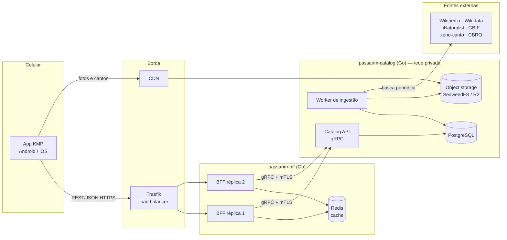
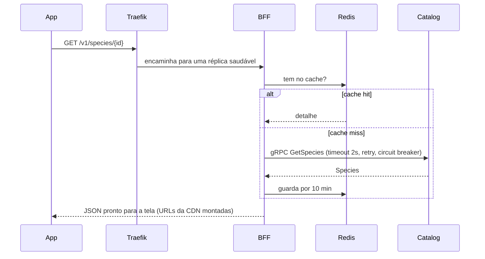

# 🐦 Passarim

App gratuito para conhecer as aves do Brasil — foto, descrição, curiosidades,
onde encontrar e o canto de cada espécie. Projeto de **estudo e portfólio**:
back-end em **Go** com arquitetura limpa e app em **Kotlin Multiplatform**.

> Todo o código é comentado para que um estudante consiga ler e entender.

## System design



### Como uma tela é carregada



## Repositórios

| Repositório | Papel |
|---|---|
| [passarim-docs](https://github.com/velosobr/passarim-docs) | Este: arquitetura, ADRs, segurança, `docker-compose` |
| [passarim-proto](https://github.com/velosobr/passarim-proto) | Contratos gRPC |
| [passarim-catalog](https://github.com/velosobr/passarim-catalog) | Catalog API (gRPC) + banco + aves curadas |
| passarim-bff | BFF REST + cache *(etapa 3)* |
| passarim-app | App KMP *(etapa 6)* |

## Rodando a infraestrutura local

Pré-requisito: Docker, e os repositórios `passarim-docs` e `passarim-catalog` clonados lado a lado na mesma pasta.

```bash
cp .env.example .env
docker compose up -d --wait
```

| Serviço | Endereço |
|---|---|
| Traefik (dashboard) | <http://localhost:8081> |
| Grafana | <http://localhost:3000> (admin / ver `.env`) |
| Prometheus | <http://localhost:9090> |
| Jaeger | <http://localhost:16686> |
| Object storage (arquivos) | <http://localhost:8888> |

## Documentação

- [Decisões de arquitetura (ADRs)](docs/adr/)
- [Modelo de ameaças](docs/security/threat-model.md)
- [Spec de design](docs/superpowers/specs/2026-10-01-passarim-design.md)
- [Revisão do protótipo](docs/design/revisao-design-v1.md)
