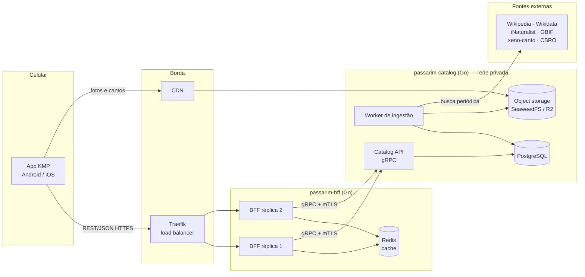
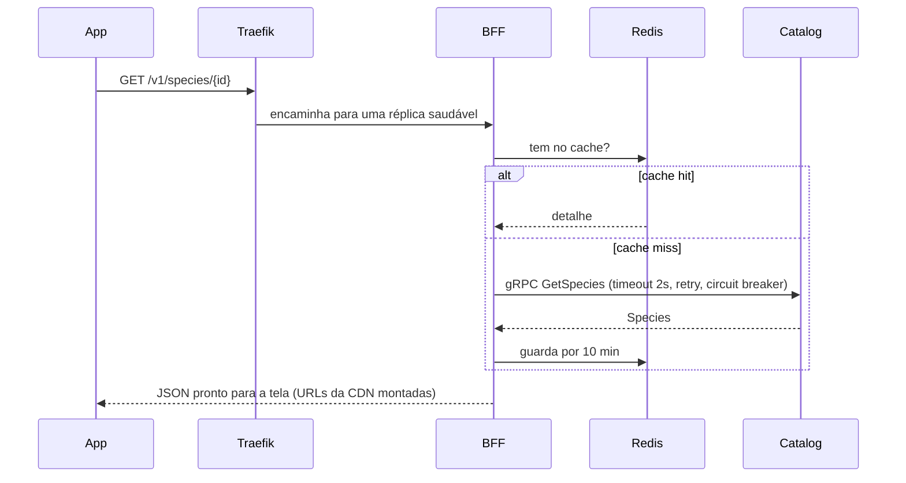

# 🐦 Passarim

App gratuito para conhecer as aves do Brasil — foto, descrição, curiosidades,
onde encontrar e o canto de cada espécie. Projeto de **estudo e portfólio**:
back-end em **Go** com arquitetura limpa e app em **Kotlin Multiplatform**.

> Todo o código é comentado para que um estudante consiga ler e entender.

## System design



### Como uma tela é carregada



## Repositórios

| Repositório | Papel |
|---|---|
| [passarim-docs](https://github.com/velosobr/passarim-docs) | Este: arquitetura, ADRs, segurança, `docker-compose` |
| [passarim-proto](https://github.com/velosobr/passarim-proto) | Contratos gRPC |
| [passarim-catalog](https://github.com/velosobr/passarim-catalog) | Catalog API (gRPC) + banco + aves curadas |
| [passarim-bff](https://github.com/velosobr/passarim-bff) | BFF REST/JSON + cache Redis + resiliência |
| passarim-app | App KMP *(etapa 5)* |

## Rodando a infraestrutura local

Pré-requisito: Docker, e os repositórios `passarim-docs` e `passarim-catalog` clonados lado a lado na mesma pasta.

```bash
cp .env.example .env
# Edite o .env e preencha XENO_CANTO_API_KEY (necessária para o worker de ingestão).
docker compose up -d --wait
```

| Serviço | Endereço |
|---|---|
| API (BFF via Traefik) | <http://localhost:8080/v1/species> (porta `HOST_PORT_TRAEFIK_HTTP`) |
| Traefik (dashboard) | <http://localhost:8081> |
| Grafana | <http://localhost:3000> (admin / ver `.env`) |
| Prometheus | <http://localhost:9090> |
| Jaeger | <http://localhost:16686> |
| Object storage (arquivos) | <http://localhost:8888> — a mídia fica no bucket `passarim-media` |

### Testando o app num aparelho físico

O compose publica tudo só em `127.0.0.1`. O emulador Android (`10.0.2.2`) e o simulador iOS (`localhost`) alcançam o
computador sem mudar nada, mas um aparelho físico não. Para esse caso, suba com o override opcional, que republica
só o BFF (Traefik) e a mídia (porta `HOST_PORT_S3_UI`) em todas as interfaces:

```bash
docker compose -f docker-compose.yml -f docker-compose.device.yml up -d --wait
```

Use **apenas em rede confiável** e só para teste local. Depois configure o endereço do computador no app (veja o
README do `passarim-app`).

## Demonstração: derrubar uma réplica do BFF

O BFF roda em duas réplicas (`bff-1` e `bff-2`) atrás do Traefik. Para ver o balanceamento:

```bash
# Terminal 1: um laço de requisições (troque 8080 pelo HOST_PORT_TRAEFIK_HTTP do seu .env)
while true; do curl -s -o /dev/null -w "%{http_code} " localhost:8080/v1/filters; sleep 0.2; done

# Terminal 2: derrube uma réplica. As respostas continuam 200: o BFF marca /readyz como 503,
# espera o Traefik tirá-lo da rotação e só então termina.
docker compose stop bff-1
docker compose start bff-1
```

Para ver o stale-while-error (dado velho quando o catalog cai):

```bash
curl -si localhost:8080/v1/species/turdus-rufiventris | grep -i x-cache   # miss (ou hit)
docker compose stop catalog-api
# Depois de 10 min o dado deixa de ser "fresco", mas ainda é servido:
curl -si localhost:8080/v1/species/turdus-rufiventris | grep -i x-cache   # stale
curl -si localhost:8080/v1/species/uma-ave-nunca-consultada               # 503 problem+json
docker compose start catalog-api
```

## Documentação

- [Decisões de arquitetura (ADRs)](docs/adr/)
- [Modelo de ameaças](docs/security/threat-model.md)
- [Aula 1: como as peças conversam](docs/aulas/01-arquitetura-local.md)
- [Spec de design](docs/superpowers/specs/2026-10-01-passarim-design.md)
- [Revisão do protótipo](docs/design/revisao-design-v1.md)
