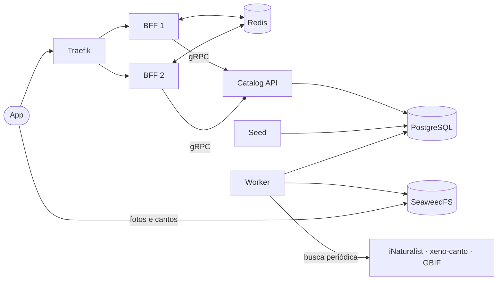

# Aula 1: como as peças do Passarim conversam (ambiente local)

Esta aula explica o que cada serviço do `docker compose` faz e como eles se comunicam. Ela responde às perguntas que surgiram ao fechar a Etapa 3 (BFF).

## Resumo em uma frase

O app fala só com o **BFF**; o BFF fala só com o **catalog** (e com o Redis); só o catalog e o worker tocam no banco e na mídia. Nada no caminho do app chama a internet.

## Visão geral



O ambiente usa duas redes Docker: `passarim-public` (Traefik e BFF) e `passarim-private` (BFF, catalog, banco, cache e storage). O Traefik não alcança o banco.

## O que cada peça faz

| Peça | Papel | Quem fala com ela |
|---|---|---|
| **Traefik** | Balanceador de carga. Recebe `/v1`, distribui entre as réplicas do BFF em round-robin e tira da rotação a réplica cujo `/readyz` falha | App (entrada), BFF |
| **BFF** (2 réplicas) | API REST/JSON do app: valida entrada, rate limit por IP, monta URLs de mídia, formata a resposta de cada tela. Sem estado próprio | Traefik, Redis, Catalog |
| **Redis** | Cache das respostas do catalog: 10 min "fresco", 24 h guardado. Com o catalog fora, o BFF serve o dado velho (`X-Cache: stale`) | Só o BFF |
| **Catalog API** | Dona dos dados (gRPC): `ListSpecies`, `GetSpecies`, `ListFilters`. Devolve chaves de mídia, nunca URLs | BFF, Postgres |
| **PostgreSQL** | Espécies, fotos, áudios, ocorrências e jobs de ingestão | Só o catalog (API, seed, worker) |
| **Seed** | Roda uma vez: carrega os YAMLs curados (texto, biomas, estados) no banco e termina | Postgres |
| **Worker** | Processo de fundo que busca mídia e ocorrências nas fontes externas, converte e grava | Internet, Postgres, SeaweedFS |
| **SeaweedFS** | Armazenamento de arquivos compatível com S3 (em produção: Cloudflare R2 com CDN) | Worker (grava), app (baixa direto) |
| **Prometheus / Grafana / Jaeger** | Métricas, dashboard e traces | Todos os serviços, via coleta |

## Fluxo de uma tela

```text
App → Traefik → BFF (1 de 2) → Redis (hit? responde)
                            └→ Catalog (gRPC) → Postgres
App ← URLs de mídia ← SeaweedFS (download direto, sem passar pelo BFF)

Worker → internet → Postgres + SeaweedFS   (ingestão, separada do fluxo da tela)
```

1. O app chama `GET /v1/species/{id}`; o Traefik escolhe uma réplica do BFF.
2. O BFF consulta o Redis. Se o dado está fresco, responde (`X-Cache: hit`).
3. Senão, chama o catalog por gRPC (com cache → circuit breaker → retry/timeout). O catalog lê o Postgres.
4. O BFF converte o resultado em JSON, troca as chaves de mídia por URLs públicas e responde.
5. O app baixa as fotos e o canto direto do storage.

Se o catalog cair, o passo 3 falha e o BFF devolve o dado velho do Redis; se não há dado velho, devolve `503` em `problem+json`.

## Por que existe um worker?

O texto de cada ave é curado à mão (YAML), mas fotos, cantos e ocorrências vêm de fontes externas:

- **Fotos:** iNaturalist, convertidas para WebP em 3 tamanhos.
- **Canto:** xeno-canto, convertido para AAC e recortado.
- **Ocorrências:** GBIF, que viram os pontos de "onde encontrar".

Pela decisão ADR-005 (pré-ingestão), o app e o BFF nunca chamam APIs externas: isso evita latência, limites de uso, vazamento de chave e dúvida de licença. O worker não é uma ferramenta de admin: é um processo com agendador (rodadas de 1 min, lote de 5, até 5 tentativas com backoff). Depois de ingerir as espécies ele fica quase ocioso, e volta a trabalhar quando entra uma ave nova no YAML, quando uma fonte corrige algo ou quando se decide atualizar as ocorrências.

## O que é o GBIF?

GBIF (Global Biodiversity Information Facility) é uma rede internacional de dados abertos de biodiversidade, alimentada por museus, universidades e ciência cidadã (inclui os registros do iNaturalist). Cada registro diz "a espécie X foi observada em Y, na data Z". Os dados refletem onde as pessoas observam, não onde a ave vive: regiões com mais observadores aparecem com mais pontos.

## Onde isso roda?

Hoje, tudo no `docker compose` do desktop. Na Etapa 4 (deploy) vai para: Fly.io (serviços), Neon (Postgres), Upstash (Redis) e Cloudflare R2 com CDN (mídia). O proxy do Fly.io substitui o Traefik.

## Para praticar

- Derrube uma réplica do BFF com um laço de requisições rodando e veja que continua tudo em 200 (roteiro no [README](../../README.md)).
- Pare o `catalog-api` e peça uma espécie já vista: o BFF responde `X-Cache: stale`.
- Acompanhe uma requisição no Jaeger (`http://localhost:16686`): o span HTTP do BFF tem o span gRPC do catalog como filho.
