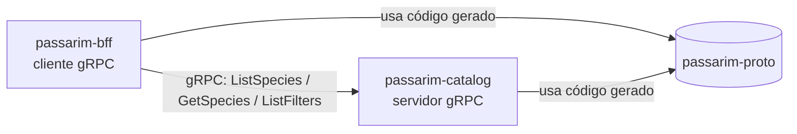
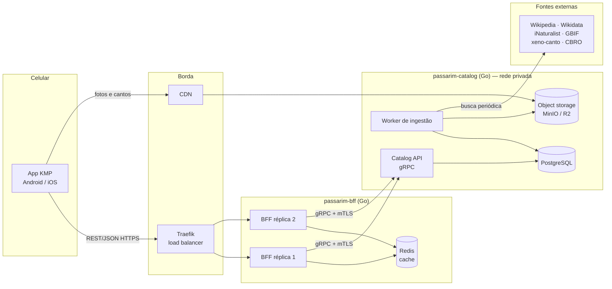
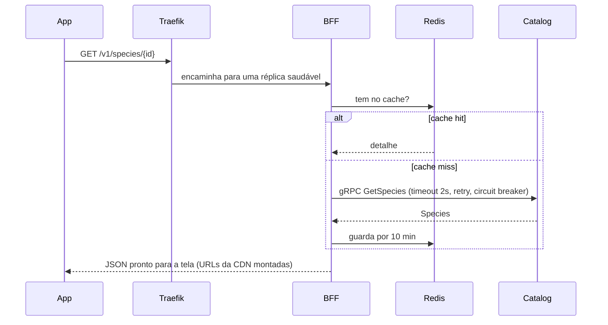

# Passarim — Etapa 1: `passarim-proto` + `passarim-docs` — Plano de Implementação

> **For agentic workers:** REQUIRED SUB-SKILL: Use superpowers:subagent-driven-development (recommended) or superpowers:executing-plans to implement this plan task-by-task. Steps use checkbox (`- [ ]`) syntax for tracking.

**Goal:** Criar os contratos gRPC do catálogo (`passarim-proto`) e o repositório de documentação/orquestração (`passarim-docs`) com README de system design, ADRs, modelo de ameaças e um `docker-compose` que já sobe toda a infraestrutura local (sem os serviços Go, que chegam nas etapas 2 e 3).

**Architecture:** `passarim-proto` é um módulo Go que contém os `.proto` (fonte da verdade) e o código Go gerado pelo Buf, versionado no git para que catalog e BFF façam `go get`. `passarim-docs` é o "repositório guarda-chuva": documentação de arquitetura e o `docker-compose.yml` com PostgreSQL, Redis, MinIO, Traefik, Prometheus, Grafana e Jaeger, cada um com healthcheck.

**Tech Stack:** Go (versão instalada via Homebrew), Buf CLI v2, protobuf-go, grpc-go, Docker Compose v2+, Mermaid (`@mermaid-js/mermaid-cli`), markdownlint-cli2, GitHub Actions.

**Spec:** `docs/superpowers/specs/2026-10-01-passarim-design.md`

## Global Constraints

- Linguagem do back-end: **Go**. Todo código e configuração **comentado para um estudante** (comentários em português explicando o *porquê*).
- Repositórios separados: `passarim-docs`, `passarim-proto`, `passarim-catalog`, `passarim-bff`, `passarim-app` — dono no GitHub: `velosobr`.
- Comunicação BFF → catalog: **gRPC**; app → BFF: REST/JSON.
- O BFF recebe do catalog **chaves de storage** (`storage_key`), nunca URLs prontas; quem monta a URL de CDN é o BFF.
- Biomas: `amazonia, mata_atlantica, cerrado, caatinga, pantanal, pampa`.
- Licenças aceitas: CC0, CC-BY, CC-BY-SA, CC-BY-NC, CC-BY-NC-SA. ND descartada.
- Custo de infraestrutura **zero**. Nenhum segredo commitado.
- Cada README contém diagrama **Mermaid** de system design.
- Fora deste plano: código do catalog/BFF/app, deploy, manifestos Kubernetes (chegam em planos posteriores).

## Review Focus

1. **Campo opcional ausente** (ave sem canto, sem tamanho, sem dieta) — consumidor deve distinguir "ausente" de "zero/vazio" → teste em Task 2 (`TestSpeciesOptionalFieldsPresence`).
2. **Valor de enum desconhecido** vindo de uma versão futura do proto — não pode quebrar o unmarshal → teste em Task 2 (`TestUnknownEnumValueSurvivesRoundTrip`).
3. **Mudança incompatível no contrato** (renomear/remover campo) passando despercebida → `buf breaking` no CI + verificação manual em Task 3.
4. **Porta já ocupada no host** (ex.: PostgreSQL local na 5432) impedindo o compose de subir → portas do host configuráveis via `.env` e bind em `127.0.0.1`, verificado em Task 6.
5. **`.env` com segredo commitado por engano** → `.gitignore` + gitleaks no CI, verificado em Task 6 (`git check-ignore .env`).
6. **Diagrama Mermaid com erro de sintaxe** renderizando quebrado no GitHub → validação com `mmdc` no CI, Task 4.

---

## Estrutura de arquivos

Workspace: `~/dev/passarim/` (pasta comum, **não** é repositório) contendo os repositórios lado a lado.

```
~/dev/passarim/
├── passarim-docs/                      (← atual ~/dev/aves-do-brasil, movido com histórico)
│   ├── README.md                       system design geral (Mermaid) + como rodar
│   ├── docker-compose.yml              infraestrutura local
│   ├── .env.example                    variáveis (portas, senhas de DEV)
│   ├── .gitignore
│   ├── infra/
│   │   ├── traefik/traefik.yml         config estática do load balancer
│   │   ├── prometheus/prometheus.yml   alvos de scrape
│   │   └── grafana/provisioning/datasources/datasources.yml
│   ├── docs/
│   │   ├── adr/0001-…0011-*.md         decisões de arquitetura
│   │   ├── security/threat-model.md    STRIDE
│   │   ├── design/                     (já existe)
│   │   └── superpowers/                (já existe)
│   ├── .markdownlint-cli2.yaml
│   └── .github/workflows/ci.yml
└── passarim-proto/
    ├── README.md                       diagrama + como gerar
    ├── go.mod                          module github.com/velosobr/passarim-proto
    ├── buf.yaml                        lint + breaking
    ├── buf.gen.yaml                    plugins de geração
    ├── proto/passarim/catalog/v1/catalog.proto
    ├── gen/go/passarim/catalog/v1/     (gerado, commitado)
    ├── contract_test.go                testes do contrato
    ├── Makefile                        generate / lint / test / breaking
    └── .github/workflows/ci.yml
```

---

### Task 0: Preparar ambiente e workspace

**Files:**
- Move: `~/dev/aves-do-brasil` → `~/dev/passarim/passarim-docs`

**Interfaces:**
- Produces: workspace `~/dev/passarim/`, ferramentas `go`, `buf`, `npx` disponíveis.

- [ ] **Step 1: Instalar ferramentas (ação do usuário ou com aprovação dele)**

```bash
brew install go bufbuild/buf/buf
go version   # Expected: go version go1.2x.x darwin/arm64
buf --version # Expected: 1.x.x
```

- [ ] **Step 2: Criar workspace e mover o repositório de docs (preserva o histórico git)**

```bash
mkdir -p ~/dev/passarim
mv ~/dev/aves-do-brasil ~/dev/passarim/passarim-docs
cd ~/dev/passarim/passarim-docs && git log --oneline
```
Expected: o commit `docs: spec de design do Passarim e revisão do protótipo` aparece.

- [ ] **Step 3: Identidade git pessoal nos repositórios do projeto**

O git global usa o e-mail corporativo; este é um projeto pessoal de portfólio.

```bash
cd ~/dev/passarim/passarim-docs
git config user.name "Lino Veloso"
git config user.email "linoc.veloso@gmail.com"
git commit --amend --reset-author --no-edit
git log -1 --format='%an <%ae>'
```
Expected: `Lino Veloso <linoc.veloso@gmail.com>`

---

### Task 1: Esqueleto do `passarim-proto` com Buf

**Files:**
- Create: `passarim-proto/go.mod`, `buf.yaml`, `buf.gen.yaml`, `Makefile`, `.gitignore`

**Interfaces:**
- Produces: módulo Go `github.com/velosobr/passarim-proto`; comando `make generate` / `make lint`.

- [ ] **Step 1: Inicializar repositório e módulo**

```bash
mkdir -p ~/dev/passarim/passarim-proto && cd ~/dev/passarim/passarim-proto
git init -b main
git config user.name "Lino Veloso" && git config user.email "linoc.veloso@gmail.com"
go mod init github.com/velosobr/passarim-proto
```

- [ ] **Step 2: Criar `buf.yaml`**

```yaml
# buf.yaml — configuração do Buf, a ferramenta que organiza nossos .proto.
# O Buf faz três coisas por nós:
#   1. lint: garante que os .proto seguem boas práticas de nomes e estrutura;
#   2. breaking: impede mudanças que quebrariam quem já usa o contrato;
#   3. generate: gera o código Go a partir dos .proto (ver buf.gen.yaml).
version: v2
modules:
  # Todos os .proto ficam dentro de proto/. O caminho do pacote
  # (passarim/catalog/v1) precisa bater com a pasta.
  - path: proto
lint:
  use:
    # STANDARD é o conjunto de regras recomendado pelo Buf
    # (ex.: enums com valor zero *_UNSPECIFIED, pacotes versionados com v1).
    - STANDARD
breaking:
  use:
    # FILE é a regra mais rígida: protege até contra mover mensagens de arquivo.
    - FILE
```

- [ ] **Step 3: Criar `buf.gen.yaml`**

```yaml
# buf.gen.yaml — quais "plugins" transformam .proto em código.
version: v2
managed:
  enabled: true
  override:
    # Diz ao gerador qual é o caminho de import Go dos pacotes gerados,
    # assim não precisamos repetir "option go_package" em cada .proto.
    - file_option: go_package_prefix
      value: github.com/velosobr/passarim-proto/gen/go
plugins:
  # Gera as structs Go das mensagens (Species, ListSpeciesRequest, ...).
  - remote: buf.build/protocolbuffers/go
    out: gen/go
    opt: paths=source_relative
  # Gera o cliente e o servidor gRPC (CatalogServiceClient/Server).
  - remote: buf.build/grpc/go
    out: gen/go
    opt: paths=source_relative
```

- [ ] **Step 4: Criar `Makefile`**

```makefile
# Makefile — atalhos para os comandos do dia a dia.
# Uso: make generate | make lint | make breaking | make test

.PHONY: generate lint breaking test

# Gera o código Go a partir dos .proto.
generate:
	buf generate

# Verifica boas práticas nos .proto.
lint:
	buf lint

# Compara com a branch main e falha se houver mudança incompatível.
breaking:
	buf breaking --against '.git#branch=main'

# Roda os testes de contrato.
test:
	go test ./...
```

- [ ] **Step 5: Criar `.gitignore`**

```gitignore
# Arquivos do macOS e de editores
.DS_Store
.idea/
.vscode/
```

- [ ] **Step 6: Commit**

```bash
git add . && git commit -m "chore: configura Buf e módulo Go do passarim-proto"
```

---

### Task 2: Contrato `CatalogService` v1 (TDD)

**Files:**
- Create: `proto/passarim/catalog/v1/catalog.proto`
- Create: `contract_test.go`
- Generated: `gen/go/passarim/catalog/v1/catalog.pb.go`, `catalog_grpc.pb.go`

**Interfaces:**
- Produces (pacote Go `catalogv1`, import `github.com/velosobr/passarim-proto/gen/go/passarim/catalog/v1`):
  - `CatalogServiceClient` / `CatalogServiceServer` com
    `ListSpecies(ctx, *ListSpeciesRequest) (*ListSpeciesResponse, error)`,
    `GetSpecies(ctx, *GetSpeciesRequest) (*GetSpeciesResponse, error)`,
    `ListFilters(ctx, *ListFiltersRequest) (*ListFiltersResponse, error)`
  - Enums `Biome`, `ConservationStatus`; mensagens `SpeciesSummary`, `Species`, `Photo`, `Audio`, `Credit`, `Fact`, `OccurrenceCluster`, `BiomeCount`, `StateCount`.
  - `Species.Audio` é ponteiro (nil = sem canto); `Species.SizeCm *int32` e `Species.Diet *string` (campos `optional`).

- [ ] **Step 1: Escrever o teste que falha**

`contract_test.go`:

```go
// Testes de contrato: garantem que o código gerado a partir do .proto
// se comporta como os serviços (catalog e BFF) esperam.
// Se alguém mudar o .proto de um jeito que quebre essas garantias,
// o teste falha antes de o problema chegar em produção.
package passarimproto_test

import (
	"testing"

	"google.golang.org/protobuf/proto"
	"google.golang.org/protobuf/reflect/protoreflect"

	catalogv1 "github.com/velosobr/passarim-proto/gen/go/passarim/catalog/v1"
)

// Uma espécie completa deve sobreviver a ida e volta pelo formato binário
// (é exatamente o que acontece quando ela trafega via gRPC).
func TestSpeciesRoundTrip(t *testing.T) {
	size := int32(100)
	diet := "Sementes de palmeiras"
	original := &catalogv1.Species{
		Id:                 "anodorhynchus-hyacinthinus",
		ScientificName:     "Anodorhynchus hyacinthinus",
		CommonNamePt:       "Arara-azul",
		Family:             "Psittacidae",
		SizeCm:             &size,
		Diet:               &diet,
		ConservationStatus: catalogv1.ConservationStatus_CONSERVATION_STATUS_VU,
		Description:        "Maior psitacídeo do mundo.",
		DescriptionCredit: &catalogv1.Credit{
			Author: "Equipe Passarim", License: "CC-BY-SA", Source: "curated",
		},
		Facts:   []*catalogv1.Fact{{Text: "Quebra cocos com o bico.", Source: "curated"}},
		Biomes:  []catalogv1.Biome{catalogv1.Biome_BIOME_PANTANAL, catalogv1.Biome_BIOME_CERRADO},
		States:  []string{"MS", "MT"},
		Photos: []*catalogv1.Photo{{
			ThumbKey: "species/abc/p1-thumb.webp", MediumKey: "species/abc/p1-medium.webp",
			LargeKey: "species/abc/p1-large.webp", Width: 1600, Height: 1067,
			Credit: &catalogv1.Credit{Author: "Fulano", License: "CC-BY-NC", Source: "inaturalist", SourceUrl: "https://www.inaturalist.org/photos/1"},
		}},
		Audio: &catalogv1.Audio{
			Key: "species/abc/a1.m4a", DurationMs: 12000,
			Credit: &catalogv1.Credit{Author: "Beltrano", License: "CC-BY-NC-SA", Source: "xeno-canto", SourceUrl: "https://xeno-canto.org/1"},
		},
		Clusters: []*catalogv1.OccurrenceCluster{{Lat: -19.0, Lng: -57.6, Count: 42}},
	}

	bytes, err := proto.Marshal(original)
	if err != nil {
		t.Fatalf("marshal: %v", err)
	}
	decoded := &catalogv1.Species{}
	if err := proto.Unmarshal(bytes, decoded); err != nil {
		t.Fatalf("unmarshal: %v", err)
	}
	if !proto.Equal(original, decoded) {
		t.Fatalf("espécie mudou na ida e volta:\nantes:  %v\ndepois: %v", original, decoded)
	}
}

// Review Focus #1: "ausente" precisa ser diferente de "zero".
// Uma ave sem canto não pode virar um canto vazio de duração 0;
// uma ave de tamanho desconhecido não pode virar "0 cm".
func TestSpeciesOptionalFieldsPresence(t *testing.T) {
	s := &catalogv1.Species{Id: "x"}
	bytes, _ := proto.Marshal(s)
	decoded := &catalogv1.Species{}
	if err := proto.Unmarshal(bytes, decoded); err != nil {
		t.Fatalf("unmarshal: %v", err)
	}
	if decoded.Audio != nil {
		t.Error("Audio deveria ser nil quando a ave não tem canto")
	}
	if decoded.SizeCm != nil {
		t.Error("SizeCm deveria ser nil quando o tamanho é desconhecido")
	}
	if decoded.Diet != nil {
		t.Error("Diet deveria ser nil quando a dieta é desconhecida")
	}
}

// Review Focus #2: se uma versão futura do catalog mandar um bioma novo
// (ex.: valor 99), um BFF antigo não pode falhar ao ler a mensagem.
// Em proto3 os enums são "abertos": o número desconhecido é preservado.
func TestUnknownEnumValueSurvivesRoundTrip(t *testing.T) {
	s := &catalogv1.Species{Id: "x", Biomes: []catalogv1.Biome{catalogv1.Biome(99)}}
	bytes, _ := proto.Marshal(s)
	decoded := &catalogv1.Species{}
	if err := proto.Unmarshal(bytes, decoded); err != nil {
		t.Fatalf("enum desconhecido quebrou o unmarshal: %v", err)
	}
	if len(decoded.Biomes) != 1 || decoded.Biomes[0] != catalogv1.Biome(99) {
		t.Fatalf("valor desconhecido não foi preservado: %v", decoded.Biomes)
	}
}

// O serviço precisa expor exatamente os três métodos que o BFF usa.
func TestCatalogServiceMethods(t *testing.T) {
	sd := catalogv1.File_passarim_catalog_v1_catalog_proto.Services().ByName("CatalogService")
	if sd == nil {
		t.Fatal("CatalogService não encontrado no descriptor")
	}
	want := []string{"ListSpecies", "GetSpecies", "ListFilters"}
	if sd.Methods().Len() != len(want) {
		t.Fatalf("esperava %d métodos, veio %d", len(want), sd.Methods().Len())
	}
	for _, name := range want {
		if sd.Methods().ByName(protoreflect.Name(name)) == nil {
			t.Errorf("método %s ausente", name)
		}
	}
}
```

- [ ] **Step 2: Rodar o teste e ver falhar**

Run: `go mod tidy; go test ./...`
Expected: FAIL — `no required module provides package github.com/velosobr/passarim-proto/gen/go/passarim/catalog/v1` (o código ainda não foi gerado).

- [ ] **Step 3: Escrever o `.proto`**

`proto/passarim/catalog/v1/catalog.proto`:

```proto
// catalog.proto — o "contrato" entre o BFF e a Catalog API.
//
// Um contrato gRPC descreve, de forma independente de linguagem,
// quais funções um serviço oferece (rpc) e o formato exato dos dados
// (message). A partir deste arquivo o Buf gera o código Go do cliente
// (usado pelo BFF) e do servidor (implementado pelo catalog).
//
// Regras de ouro para evoluir este arquivo sem quebrar ninguém:
//   - nunca reutilize o NÚMERO de um campo removido (use "reserved");
//   - nunca mude o tipo de um campo existente;
//   - campos novos são sempre seguros.
// O CI roda "buf breaking" para garantir isso automaticamente.
syntax = "proto3";

// O ".v1" no pacote permite criar um v2 no futuro sem derrubar o v1.
package passarim.catalog.v1;

// CatalogService é servido pelo passarim-catalog e consumido pelo passarim-bff.
service CatalogService {
  // Lista resumida de espécies, com busca, filtros e paginação.
  rpc ListSpecies(ListSpeciesRequest) returns (ListSpeciesResponse);
  // Todos os dados de uma espécie, para a tela de detalhe.
  rpc GetSpecies(GetSpeciesRequest) returns (GetSpeciesResponse);
  // Biomas e estados disponíveis, com quantas espécies há em cada um.
  rpc ListFilters(ListFiltersRequest) returns (ListFiltersResponse);
}

// Os seis biomas brasileiros. O valor 0 (UNSPECIFIED) é obrigatório em
// proto3 e significa "não informado" — nunca é um bioma de verdade.
enum Biome {
  BIOME_UNSPECIFIED = 0;
  BIOME_AMAZONIA = 1;
  BIOME_MATA_ATLANTICA = 2;
  BIOME_CERRADO = 3;
  BIOME_CAATINGA = 4;
  BIOME_PANTANAL = 5;
  BIOME_PAMPA = 6;
}

// Categorias da Lista Vermelha da IUCN (União Internacional para a
// Conservação da Natureza), do menos ao mais ameaçado.
enum ConservationStatus {
  CONSERVATION_STATUS_UNSPECIFIED = 0;
  CONSERVATION_STATUS_LC = 1; // Pouco preocupante
  CONSERVATION_STATUS_NT = 2; // Quase ameaçada
  CONSERVATION_STATUS_VU = 3; // Vulnerável
  CONSERVATION_STATUS_EN = 4; // Em perigo
  CONSERVATION_STATUS_CR = 5; // Criticamente em perigo
  CONSERVATION_STATUS_EW = 6; // Extinta na natureza
  CONSERVATION_STATUS_EX = 7; // Extinta
  CONSERVATION_STATUS_DD = 8; // Dados insuficientes
}

// Crédito de autoria. As licenças Creative Commons exigem mostrar
// quem fez a foto/gravação/texto e sob qual licença.
message Credit {
  string author = 1;     // nome do autor
  string license = 2;    // código da licença, ex.: "CC-BY-NC"
  string source = 3;     // de onde veio: "inaturalist", "xeno-canto", "wikipedia", "curated"
  string source_url = 4; // link para o original
}

// Uma foto em três tamanhos. Guardamos CHAVES do object storage
// (ex.: "species/abc/p1-thumb.webp"), não URLs: quem monta a URL
// final da CDN é o BFF. Assim trocar de CDN não exige mudar o banco.
message Photo {
  string thumb_key = 1;  // miniatura para os cards
  string medium_key = 2; // galeria
  string large_key = 3;  // foto principal (hero)
  int32 width = 4;       // dimensões do tamanho "large", em pixels
  int32 height = 5;
  Credit credit = 6;
}

// Gravação do canto, já convertida para AAC.
message Audio {
  string key = 1;
  int32 duration_ms = 2;
  Credit credit = 3;
}

// Uma curiosidade sobre a espécie.
message Fact {
  string text = 1;
  string source = 2;
}

// Pontos de avistamento já agrupados ("clusters") para o mapa ficar leve:
// em vez de milhares de pontos, mandamos poucos pontos com uma contagem.
message OccurrenceCluster {
  double lat = 1;
  double lng = 2;
  int32 count = 3;
}

// Versão resumida, usada nos cards da lista.
message SpeciesSummary {
  string id = 1;
  string scientific_name = 2;
  string common_name_pt = 3;
  string thumbnail_key = 4;
  ConservationStatus conservation_status = 5;
}

// Versão completa, usada na tela de detalhe.
message Species {
  string id = 1;
  string scientific_name = 2;
  string common_name_pt = 3;
  string family = 4;
  // "optional" permite distinguir "não sabemos" de "zero".
  optional int32 size_cm = 5;
  optional string diet = 6;
  ConservationStatus conservation_status = 7;
  string description = 8;
  Credit description_credit = 9;
  repeated Fact facts = 10;
  repeated Biome biomes = 11;
  repeated string states = 12; // siglas das UFs, ex.: "MS"
  repeated Photo photos = 13;  // a primeira é a principal
  // Mensagens já podem ser nulas: ave sem canto => audio ausente.
  Audio audio = 14;
  repeated OccurrenceCluster clusters = 15;
}

message ListSpeciesRequest {
  string query = 1;     // busca por nome popular ou científico (vazio = todas)
  Biome biome = 2;      // UNSPECIFIED = sem filtro
  string state = 3;     // UF; vazio = sem filtro
  int32 page_size = 4;  // o servidor limita a 50
  string page_token = 5; // cursor opaco devolvido na página anterior
}

message ListSpeciesResponse {
  repeated SpeciesSummary species = 1;
  string next_page_token = 2; // vazio = não há mais páginas
}

message GetSpeciesRequest {
  string id = 1;
}

message GetSpeciesResponse {
  Species species = 1;
}

message ListFiltersRequest {}

message BiomeCount {
  Biome biome = 1;
  int32 species_count = 2;
}

message StateCount {
  string state = 1;
  int32 species_count = 2;
}

message ListFiltersResponse {
  repeated BiomeCount biomes = 1;
  repeated StateCount states = 2;
}
```

- [ ] **Step 4: Lint e geração**

```bash
make lint      # Expected: sem saída (sucesso)
make generate  # Expected: cria gen/go/passarim/catalog/v1/catalog.pb.go e catalog_grpc.pb.go
go get google.golang.org/protobuf google.golang.org/grpc && go mod tidy
```

- [ ] **Step 5: Rodar os testes e ver passar**

Run: `make test`
Expected: `ok  github.com/velosobr/passarim-proto` com os 4 testes passando.

- [ ] **Step 6: Commit**

```bash
git add . && git commit -m "feat: contrato CatalogService v1 com testes de contrato"
```

---

### Task 3: README e CI do `passarim-proto`

**Files:**
- Create: `passarim-proto/README.md`, `passarim-proto/.github/workflows/ci.yml`

**Interfaces:**
- Consumes: `make lint`, `make test`, `make breaking` (Task 1).

- [ ] **Step 1: Criar `README.md`**

````markdown
# passarim-proto

Contratos gRPC do **Passarim** — o app das aves do Brasil.
Este repositório é a **fonte da verdade** de como o BFF conversa com a Catalog API.

## Onde ele se encaixa



## Por que um repositório só para contratos?
Se o contrato vivesse dentro do catalog, o BFF dependeria do código do catalog.
Separando, os dois dependem apenas de um acordo comum e versionado.
Ver [ADR-003](https://github.com/velosobr/passarim-docs/blob/main/docs/adr/0003-grpc-interno-rest-externo.md).

## Comandos
| Comando | O que faz |
|---|---|
| `make lint` | Verifica boas práticas nos `.proto` |
| `make generate` | Gera o código Go em `gen/go` |
| `make breaking` | Falha se houver mudança incompatível com a `main` |
| `make test` | Testes de contrato |

## Como usar em outro serviço
```bash
go get github.com/velosobr/passarim-proto@latest
```
```go
import catalogv1 "github.com/velosobr/passarim-proto/gen/go/passarim/catalog/v1"
```
````

- [ ] **Step 2: Criar `.github/workflows/ci.yml`**

```yaml
# CI do passarim-proto: roda em todo push e pull request.
name: ci
on:
  push:
    branches: [main]
  pull_request:

jobs:
  proto:
    runs-on: ubuntu-latest
    steps:
      - uses: actions/checkout@v4
        with:
          fetch-depth: 0 # histórico completo para o buf breaking comparar com a main
      - uses: bufbuild/buf-action@v1
        with:
          # lint sempre; breaking só em PR (compara com a main).
          lint: true
          format: true
          breaking: ${{ github.event_name == 'pull_request' }}
          breaking_against: ${{ github.event.repository.clone_url }}#branch=main
          push: false
      - uses: actions/setup-go@v5
        with:
          go-version-file: go.mod
      # Garante que o código gerado commitado está atualizado com os .proto.
      - name: generated code is up to date
        run: |
          go install github.com/bufbuild/buf/cmd/buf@latest
          buf generate
          git diff --exit-code gen/
      - run: go test ./...
      - name: govulncheck
        run: go run golang.org/x/vuln/cmd/govulncheck@latest ./...
```

- [ ] **Step 3: Verificar o `buf breaking` localmente (Review Focus #3)**

```bash
# Simula uma mudança incompatível: renomear um campo.
sed -i '' 's/string common_name_pt = 3;/string common_name = 3;/' proto/passarim/catalog/v1/catalog.proto
make breaking   # Expected: FAIL citando o campo 3 de SpeciesSummary
git checkout proto/  # desfaz a simulação
make breaking   # Expected: sucesso (sem saída)
```

- [ ] **Step 4: Formatar e commitar**

```bash
buf format -w && git diff --stat   # Expected: nenhuma ou só espaçamento
git add . && git commit -m "docs: README com diagrama e CI do passarim-proto"
```

---

### Task 4: README de system design do `passarim-docs`

**Files:**
- Create: `passarim-docs/README.md`, `passarim-docs/.markdownlint-cli2.yaml`

- [ ] **Step 1: Criar `README.md`**

````markdown
# 🐦 Passarim

App gratuito para conhecer as aves do Brasil — foto, descrição, curiosidades,
onde encontrar e o canto de cada espécie. Projeto de **estudo e portfólio**:
back-end em **Go** com arquitetura limpa e app em **Kotlin Multiplatform**.

> Todo o código é comentado para que um estudante consiga ler e entender.

## System design



### Como uma tela é carregada


## Repositórios
| Repositório | Papel |
|---|---|
| [passarim-docs](https://github.com/velosobr/passarim-docs) | Este: arquitetura, ADRs, segurança, `docker-compose` |
| [passarim-proto](https://github.com/velosobr/passarim-proto) | Contratos gRPC |
| passarim-catalog | Catalog API + worker + banco *(etapa 2)* |
| passarim-bff | BFF REST + cache *(etapa 3)* |
| passarim-app | App KMP *(etapa 6)* |

## Rodando a infraestrutura local
Pré-requisito: Docker.
```bash
cp .env.example .env
docker compose up -d --wait
```
| Serviço | Endereço |
|---|---|
| Traefik (dashboard) | http://localhost:8081 |
| Grafana | http://localhost:3000 (admin / ver `.env`) |
| Prometheus | http://localhost:9090 |
| Jaeger | http://localhost:16686 |
| MinIO (console) | http://localhost:9001 |

## Documentação
- [Decisões de arquitetura (ADRs)](docs/adr/)
- [Modelo de ameaças](docs/security/threat-model.md)
- [Spec de design](docs/superpowers/specs/2026-10-01-passarim-design.md)
- [Revisão do protótipo](docs/design/revisao-design-v1.md)
````

- [ ] **Step 2: Criar `.markdownlint-cli2.yaml`**

```yaml
# Regras de estilo para os arquivos Markdown.
config:
  default: true
  MD013: false   # linhas longas são aceitas (tabelas, links)
  MD033: false   # permite <br/> dentro dos diagramas
  MD041: false   # ADRs começam com título no próprio corpo
ignores:
  - "docs/superpowers/**"   # documentos de trabalho, não são publicados
```

- [ ] **Step 3: Validar os diagramas Mermaid e o Markdown (Review Focus #6)**

```bash
cd ~/dev/passarim/passarim-docs
npx -y @mermaid-js/mermaid-cli -i README.md -o /tmp/passarim-readme.md
# Expected: gera arquivos SVG sem erro ("Generating single mermaid chart" para cada diagrama)
npx -y markdownlint-cli2 "**/*.md"
# Expected: "Summary: 0 error(s)"
```

- [ ] **Step 4: Commit**

```bash
git add README.md .markdownlint-cli2.yaml && git commit -m "docs: README com system design do Passarim"
```

---

### Task 5: ADRs e modelo de ameaças

**Files:**
- Create: `docs/adr/0000-template.md` e `0001` a `0011`
- Create: `docs/security/threat-model.md`

Formato de cada ADR: **Contexto → Decisão → Consequências**, status `Aceita`, data 2026-10-01.

- [ ] **Step 1: Criar `docs/adr/0000-template.md`**

```markdown
# ADR-NNNN: Título curto

- **Status:** Proposta | Aceita | Substituída por ADR-XXXX
- **Data:** AAAA-MM-DD

## Contexto
Qual problema ou força nos obrigou a decidir algo?

## Decisão
O que decidimos, em uma ou duas frases afirmativas.

## Consequências
O que fica melhor, o que fica pior, e o que passamos a ter que cuidar.
```

- [ ] **Step 2: Criar os 11 ADRs com o conteúdo abaixo** (cada bloco é um arquivo; cabeçalho de status/data igual ao template com `Aceita` e `2026-10-01`)

`0001-go-no-backend.md` — **Go no back-end**
- Contexto: o projeto é de estudo; o autor quer aprender a linguagem que o mercado usa para serviços de rede.
- Decisão: catalog, worker e BFF em Go, usando a biblioteca padrão sempre que possível (`net/http`, `log/slog`).
- Consequências: binários pequenos e rápidos, imagens Docker mínimas, concorrência simples com goroutines; menos "mágica" de framework, então escrevemos mais código explícito (bom para aprender).

`0002-bff-e-catalog-separados.md` — **BFF separado do catálogo**
- Contexto: o app precisa de respostas no formato de cada tela; os dados de aves precisam de um dono estável.
- Decisão: `passarim-catalog` é dono dos dados (genérico); `passarim-bff` adapta para o app (uma chamada por tela).
- Consequências: o app fica simples e rápido; mudanças de tela não mexem no catálogo; ganhamos um salto de rede a mais (mitigado por cache).

`0003-grpc-interno-rest-externo.md` — **gRPC entre serviços, REST para o app**
- Contexto: serviços internos se beneficiam de contrato tipado; o app precisa de algo fácil de depurar e cachear.
- Decisão: BFF → catalog via gRPC (contratos em `passarim-proto`); app → BFF via REST/JSON documentado em OpenAPI.
- Consequências: erros de contrato aparecem em tempo de compilação; `buf breaking` protege a evolução; dois estilos de API para manter.

`0004-banco-pertence-ao-catalog.md` — **Banco de dados pertence ao catalog**
- Contexto: compartilhar banco entre serviços cria acoplamento invisível.
- Decisão: o PostgreSQL e suas migrations vivem no `passarim-catalog`; ninguém mais acessa o banco diretamente.
- Consequências: o schema pode mudar sem afetar o BFF; não há repositório próprio para o banco.

`0005-pre-ingestao.md` — **Pré-ingestão em vez de chamadas em tempo real**
- Contexto: APIs externas são lentas, têm limite de uso e podem cair.
- Decisão: um worker importa periodicamente os dados para o nosso banco/storage; nenhuma requisição do app chama API externa.
- Consequências: respostas rápidas e resilientes; dados podem ficar algumas horas desatualizados; precisamos de fila de jobs com retry.

`0006-midia-em-object-storage.md` — **Fotos e áudios em object storage**
- Contexto: guardar binários no banco pesa backups e impede CDN; usar o link original quebra e sobrecarrega as fontes.
- Decisão: o worker processa e salva em MinIO (local) / Cloudflare R2 (produção); o banco guarda só a chave e os créditos.
- Consequências: CDN, tamanhos otimizados (WebP/AAC), custo zero no plano gratuito; o worker passa a processar mídia.

`0007-licencas-aceitas.md` — **Licenças de conteúdo aceitas**
- Contexto: o app é gratuito e sem anúncios; conteúdo Creative Commons exige crédito e algumas licenças proíbem modificação.
- Decisão: aceitar CC0, CC-BY, CC-BY-SA, CC-BY-NC, CC-BY-NC-SA; descartar ND; filtro configurável; crédito sempre exibido.
- Consequências: catálogo rico; se o app for monetizado, basta remover NC do filtro (menos mídia disponível).

`0008-sem-certificate-pinning.md` — **Sem certificate pinning no MVP**
- Contexto: pinning dificulta interceptação, mas uma troca de certificado sem atualizar o app o deixa inutilizável.
- Decisão: não usar pinning no MVP; HTTPS obrigatório com validação padrão do sistema.
- Consequências: menor risco operacional; proteção contra MITM depende da cadeia de certificados do sistema. Reavaliar na v2 com login.

`0009-room-kmp.md` — **Room KMP para persistência local**
- Contexto: favoritos precisam funcionar offline no Android e no iOS.
- Decisão: Room 2.8.x (estável, suporta KMP desde 2.7.0) com `BundledSQLiteDriver`; Room 3.x alpha descartado.
- Consequências: mesma API que o time já usa; SQLite com versão idêntica nas duas plataformas.

`0010-paparazzi-snapshots.md` — **Paparazzi para testes de snapshot**
- Contexto: queremos detectar regressões visuais em temas claro/escuro e fonte ampliada sem emulador.
- Decisão: Paparazzi no alvo Android (`androidUnitTest`), verificado no CI; Roborazzi como alternativa se houver incompatibilidade com o plugin KMP do AGP.
- Consequências: snapshots rápidos na JVM; o render iOS não é coberto por snapshot.

`0011-ia-adiada-v2.md` — **Identificação por IA adiada para a v2**
- Contexto: reconhecimento on-device (AIY Birds) em KMP é o item de maior risco e não é essencial ao catálogo.
- Decisão: fora do MVP; nenhuma UI de "em breve" (evita rejeição na App Store); arquitetura mantém espaço para endpoint de lookup.
- Consequências: MVP menor e entregável; a v2 começa com um spike de viabilidade.

- [ ] **Step 3: Criar `docs/security/threat-model.md`**

```markdown
# Modelo de ameaças — Passarim (MVP)

Método: **STRIDE** — para cada parte do sistema perguntamos se alguém pode
**S**e passar por outro (Spoofing), **A**dulterar dados (Tampering),
**N**egar o que fez (Repudiation), **V**azar informação (Information disclosure),
**D**errubar o serviço (Denial of service) ou **G**anhar privilégio (Elevation).

## O que protegemos
1. Disponibilidade do BFF (plano gratuito tem pouca capacidade).
2. Integridade do catálogo (ninguém de fora altera aves, fotos ou créditos).
3. Segredos (chave do xeno-canto, credenciais do banco e do storage).
4. Privacidade do usuário (o MVP não coleta dados pessoais; IP aparece só em logs).

## Fronteiras de confiança
Internet → Traefik → BFF → (rede privada) → Catalog → PostgreSQL / Storage.
Worker → Internet (APIs externas): **tudo que volta é não confiável**.

## Ameaças e mitigações

| Componente | STRIDE | Ameaça | Mitigação | OWASP |
|---|---|---|---|---|
| BFF | D | Inundação de requisições | Rate limit por IP, limites de página/busca, timeouts HTTP | API4 |
| BFF | I | Vazar stack trace ou campos internos | problem+json sem detalhes; DTOs explícitos | API3, API8 |
| BFF | T | Injeção via parâmetros de busca | Validação de entrada; queries parametrizadas no catalog | Injeção |
| Catalog | S | Alguém além do BFF chamar o gRPC | Rede privada + mTLS | API2, API5 |
| Catalog | E | Acesso a operações administrativas | Admin não exposto publicamente; chave de admin | API5 |
| Worker | T/E | SSRF: URL externa apontando para rede interna | Allowlist de hosts, bloqueio de IP privado/link-local | API7 |
| Worker | D | Imagem "bomba de descompressão" | Limite de pixels e de bytes por download | API10 |
| Worker | T | HTML malicioso vindo da Wikipedia | Sanitização para texto puro | API10 |
| Worker | D | Ser bloqueado pelas fontes | Rate limit por fonte, backoff | API10 |
| Repositórios | I | Segredo commitado | `.gitignore`, gitleaks no CI | Falhas de segredo |
| Dependências | T | Biblioteca vulnerável | govulncheck, Trivy, Dependabot; build falha em alta/crítica | Componentes vulneráveis |
| App | I | Tráfego interceptado | HTTPS obrigatório, cleartext bloqueado | MASVS-NETWORK |
| App | I | Segredo extraído do APK | Nenhum segredo no app | MASVS-STORAGE |

## Repúdio (R)
Sem contas de usuário no MVP, não há ação a repudiar. Logs estruturados com
`request_id` permitem rastrear qualquer requisição de ponta a ponta.

## Riscos aceitos
- Sem certificate pinning ([ADR-0008](../adr/0008-sem-certificate-pinning.md)).
- Sem atestação de app: qualquer cliente HTTP pode chamar o BFF (mitigado por rate limit). Revisar na v2.

## Métricas de segurança
429 por minuto · taxa de 4xx/5xx · rejeições mTLS · downloads bloqueados pela allowlist · vulnerabilidades por severidade por build.
```

- [ ] **Step 4: Validar e commitar**

```bash
npx -y markdownlint-cli2 "**/*.md"   # Expected: 0 error(s)
git add docs/adr docs/security && git commit -m "docs: ADRs 0001-0011 e modelo de ameaças STRIDE"
```

---

### Task 6: `docker-compose` da infraestrutura local

**Files:**
- Create: `docker-compose.yml`, `.env.example`, `.gitignore`, `infra/traefik/traefik.yml`, `infra/prometheus/prometheus.yml`, `infra/grafana/provisioning/datasources/datasources.yml`

**Interfaces:**
- Produces (para as etapas 2 e 3): rede Docker `passarim-public` (Traefik ↔ BFF) e `passarim-private` (BFF ↔ catalog ↔ banco/storage); serviços `postgres:5432`, `redis:6379`, `minio:9000`, `jaeger:4317` (OTLP gRPC); variáveis `POSTGRES_USER`, `POSTGRES_PASSWORD`, `POSTGRES_DB`, `MINIO_ROOT_USER`, `MINIO_ROOT_PASSWORD`.

- [ ] **Step 1: Escrever a verificação que falha**

```bash
cd ~/dev/passarim/passarim-docs
docker compose config --quiet
```
Expected: FAIL — `no configuration file provided: not found`.

- [ ] **Step 2: Criar `.gitignore` e `.env.example`**

`.gitignore`:
```gitignore
# Segredos locais: NUNCA commitar o .env (só o .env.example).
.env
.DS_Store
```

`.env.example`:
```dotenv
# Copie para .env (cp .env.example .env). Valores abaixo servem SÓ para
# desenvolvimento local — em produção os segredos ficam no Fly.io/GitHub.

# Portas expostas no SEU computador. Mude se alguma já estiver em uso
# (ex.: se você já tem um PostgreSQL rodando na 5432).
HOST_PORT_POSTGRES=5432
HOST_PORT_REDIS=6379
HOST_PORT_MINIO_API=9000
HOST_PORT_MINIO_CONSOLE=9001
HOST_PORT_TRAEFIK_HTTP=8080
HOST_PORT_TRAEFIK_DASHBOARD=8081
HOST_PORT_PROMETHEUS=9090
HOST_PORT_GRAFANA=3000
HOST_PORT_JAEGER_UI=16686

POSTGRES_USER=passarim
POSTGRES_PASSWORD=passarim-dev
POSTGRES_DB=passarim

MINIO_ROOT_USER=passarim
MINIO_ROOT_PASSWORD=passarim-dev-secret

GRAFANA_ADMIN_PASSWORD=passarim-dev
```

- [ ] **Step 3: Criar `infra/traefik/traefik.yml`**

```yaml
# Configuração estática do Traefik, nosso load balancer.
# Um load balancer recebe todas as requisições e as distribui entre
# várias cópias (réplicas) do mesmo serviço. Se uma cópia cair,
# ele para de mandar tráfego para ela.
entryPoints:
  web:
    address: ":80"         # por onde o app entra
  dashboard:
    address: ":8081"       # painel visual do Traefik
api:
  dashboard: true
  insecure: true           # dashboard sem senha: aceitável SÓ em ambiente local
providers:
  docker:
    # O Traefik descobre os serviços lendo "labels" no docker-compose.
    # exposedByDefault: false => só entra no load balancer quem pedir
    # explicitamente (traefik.enable=true). Mais seguro.
    exposedByDefault: false
    network: passarim-public
metrics:
  prometheus: {}           # expõe métricas em /metrics para o Prometheus
ping: {}                   # /ping usado no healthcheck
```

- [ ] **Step 4: Criar `infra/prometheus/prometheus.yml`**

```yaml
# Prometheus "raspa" (scrape) métricas dos serviços de tempos em tempos.
global:
  scrape_interval: 15s
scrape_configs:
  - job_name: traefik
    static_configs:
      - targets: ["traefik:8081"]
  # Os jobs do BFF e do catalog serão adicionados nas etapas 2 e 3.
```

- [ ] **Step 5: Criar `infra/grafana/provisioning/datasources/datasources.yml`**

```yaml
# Conecta o Grafana automaticamente ao Prometheus e ao Jaeger,
# para não precisar configurar nada à mão na primeira vez.
apiVersion: 1
datasources:
  - name: Prometheus
    type: prometheus
    url: http://prometheus:9090
    isDefault: true
  - name: Jaeger
    type: jaeger
    url: http://jaeger:16686
```

- [ ] **Step 6: Criar `docker-compose.yml`**

```yaml
# docker-compose.yml — sobe toda a infraestrutura local do Passarim.
# Uso: cp .env.example .env && docker compose up -d --wait
#
# Duas redes separam quem pode falar com quem (defesa em profundidade):
#   - passarim-public:  Traefik <-> BFF
#   - passarim-private: BFF <-> catalog <-> banco/cache/storage
# O Traefik NÃO está na rede privada: mesmo comprometido, não alcança o banco.
#
# Todas as portas são publicadas apenas em 127.0.0.1 (só o seu computador
# acessa; ninguém na sua rede Wi-Fi).

name: passarim

networks:
  passarim-public:
    name: passarim-public
  passarim-private:
    name: passarim-private

volumes:
  postgres-data:
  minio-data:
  grafana-data:

services:
  # Banco relacional — dono: passarim-catalog (ADR-0004).
  postgres:
    image: postgres:18-alpine
    environment:
      POSTGRES_USER: ${POSTGRES_USER}
      POSTGRES_PASSWORD: ${POSTGRES_PASSWORD}
      POSTGRES_DB: ${POSTGRES_DB}
    ports: ["127.0.0.1:${HOST_PORT_POSTGRES}:5432"]
    volumes: [postgres-data:/var/lib/postgresql]
    networks: [passarim-private]
    healthcheck:
      # pg_isready responde OK quando o banco aceita conexões.
      test: ["CMD-SHELL", "pg_isready -U $${POSTGRES_USER} -d $${POSTGRES_DB}"]
      interval: 5s
      timeout: 3s
      retries: 10

  # Cache do BFF (etapa 3).
  redis:
    image: redis:8-alpine
    ports: ["127.0.0.1:${HOST_PORT_REDIS}:6379"]
    networks: [passarim-private]
    healthcheck:
      test: ["CMD", "redis-cli", "ping"]
      interval: 5s
      timeout: 3s
      retries: 10

  # Object storage compatível com S3 para fotos e áudios (ADR-0006).
  # Em produção, o equivalente é o Cloudflare R2.
  minio:
    image: minio/minio:RELEASE.2025-04-22T22-12-26Z
    command: server /data --console-address ":9001"
    environment:
      MINIO_ROOT_USER: ${MINIO_ROOT_USER}
      MINIO_ROOT_PASSWORD: ${MINIO_ROOT_PASSWORD}
    ports:
      - "127.0.0.1:${HOST_PORT_MINIO_API}:9000"
      - "127.0.0.1:${HOST_PORT_MINIO_CONSOLE}:9001"
    volumes: [minio-data:/data]
    networks: [passarim-private]
    healthcheck:
      test: ["CMD", "curl", "-fsS", "http://localhost:9000/minio/health/live"]
      interval: 5s
      timeout: 3s
      retries: 10

  # Load balancer na frente das réplicas do BFF (etapa 3 adiciona as réplicas).
  traefik:
    image: traefik:v3.5
    command: ["--configFile=/etc/traefik/traefik.yml"]
    ports:
      - "127.0.0.1:${HOST_PORT_TRAEFIK_HTTP}:80"
      - "127.0.0.1:${HOST_PORT_TRAEFIK_DASHBOARD}:8081"
    volumes:
      - ./infra/traefik/traefik.yml:/etc/traefik/traefik.yml:ro
      # Somente leitura: o Traefik só precisa LER quais containers existem.
      - /var/run/docker.sock:/var/run/docker.sock:ro
    networks: [passarim-public]
    healthcheck:
      test: ["CMD", "traefik", "healthcheck", "--ping"]
      interval: 5s
      timeout: 3s
      retries: 10

  # Coleta de métricas.
  prometheus:
    image: prom/prometheus:v3.5.0
    volumes:
      - ./infra/prometheus/prometheus.yml:/etc/prometheus/prometheus.yml:ro
    ports: ["127.0.0.1:${HOST_PORT_PROMETHEUS}:9090"]
    # Precisa das duas redes: raspa o Traefik (pública) e, depois, o catalog (privada).
    networks: [passarim-public, passarim-private]
    healthcheck:
      test: ["CMD", "wget", "-qO-", "http://localhost:9090/-/ready"]
      interval: 5s
      timeout: 3s
      retries: 10

  # Painéis de observabilidade.
  grafana:
    image: grafana/grafana:12.1.0
    environment:
      GF_SECURITY_ADMIN_PASSWORD: ${GRAFANA_ADMIN_PASSWORD}
    volumes:
      - grafana-data:/var/lib/grafana
      - ./infra/grafana/provisioning:/etc/grafana/provisioning:ro
    ports: ["127.0.0.1:${HOST_PORT_GRAFANA}:3000"]
    networks: [passarim-private]
    healthcheck:
      test: ["CMD", "wget", "-qO-", "http://localhost:3000/api/health"]
      interval: 5s
      timeout: 3s
      retries: 10

  # Tracing distribuído: recebe spans via OpenTelemetry (OTLP) na porta 4317.
  jaeger:
    image: jaegertracing/jaeger:2.9.0
    ports: ["127.0.0.1:${HOST_PORT_JAEGER_UI}:16686"]
    networks: [passarim-public, passarim-private]
    healthcheck:
      test: ["CMD", "wget", "-qO-", "http://localhost:16686/"]
      interval: 5s
      timeout: 3s
      retries: 10
```

> **Nota de versões:** as tags acima eram válidas na escrita do plano. Se `docker compose pull` falhar para alguma imagem, use a tag estável mais recente da mesma linha (ex.: `traefik:v3.x`) e registre a troca no commit. **MinIO:** o projeto deixou de publicar imagens da edição comunitária em 2025; a tag fixada acima é a última conhecida. Se ela não baixar, troque por `chrislusf/seaweedfs` em modo S3 e registre um ADR-0012.
> **Jaeger:** se a imagem não tiver `wget`, remova o bloco `healthcheck` do Jaeger e registre no commit; `--wait` então considera o container pronto quando ele estiver "running".

- [ ] **Step 7: Verificar config e subir**

```bash
cp .env.example .env
docker compose config --quiet          # Expected: sem saída (config válida)
docker compose pull                    # Expected: todas as imagens baixadas
docker compose up -d --wait            # Expected: todos "Healthy"
docker compose ps --format '{{.Service}} {{.Health}}'
```
Expected: 7 linhas, todas `healthy`.

- [ ] **Step 8: Verificar Review Focus #4 e #5**

```bash
# #5: .env é ignorado pelo git
git check-ignore .env   # Expected: imprime ".env"

# #4: porta ocupada contornável pelo .env
HOST_PORT_POSTGRES=15432 docker compose config | grep -A2 'published' | grep 15432
# Expected: aparece "published: \"15432\""

# Portas só em localhost
docker compose ps --format '{{.Ports}}' | grep -v '127.0.0.1' | grep -c '0.0.0.0' || true
# Expected: 0
```

- [ ] **Step 9: Derrubar e commitar**

```bash
docker compose down
git add docker-compose.yml .env.example .gitignore infra && git commit -m "feat: docker-compose com infraestrutura local e healthchecks"
```

---

### Task 7: CI do `passarim-docs`

**Files:**
- Create: `.github/workflows/ci.yml`

- [ ] **Step 1: Criar o workflow**

```yaml
# CI do passarim-docs: valida documentação, compose e segredos.
name: ci
on:
  push:
    branches: [main]
  pull_request:

jobs:
  docs:
    runs-on: ubuntu-latest
    steps:
      - uses: actions/checkout@v4
        with:
          fetch-depth: 0 # gitleaks precisa do histórico completo
      - name: markdownlint
        run: npx -y markdownlint-cli2 "**/*.md"
      - name: mermaid diagrams compile
        run: npx -y @mermaid-js/mermaid-cli -i README.md -o /tmp/readme.md
      - name: docker compose config is valid
        run: |
          cp .env.example .env
          docker compose config --quiet
      - name: gitleaks (segredos commitados)
        uses: gitleaks/gitleaks-action@v2
        env:
          GITHUB_TOKEN: ${{ secrets.GITHUB_TOKEN }}
```

- [ ] **Step 2: Rodar localmente os mesmos passos**

```bash
npx -y markdownlint-cli2 "**/*.md" && npx -y @mermaid-js/mermaid-cli -i README.md -o /tmp/readme.md && docker compose config --quiet
```
Expected: sem erros.

- [ ] **Step 3: Commit**

```bash
git add .github && git commit -m "ci: valida markdown, diagramas, compose e segredos"
```

---

### Task 8: Publicar no GitHub (requer confirmação explícita do usuário)

Criar repositórios públicos é uma ação externa. **Pedir confirmação antes do Step 1.**

- [ ] **Step 1: Criar e enviar `passarim-proto`**

```bash
cd ~/dev/passarim/passarim-proto
gh repo create velosobr/passarim-proto --public --source . --push \
  --description "Contratos gRPC do Passarim — app das aves do Brasil"
git tag v0.1.0 && git push origin v0.1.0
```

- [ ] **Step 2: Criar e enviar `passarim-docs`**

```bash
cd ~/dev/passarim/passarim-docs
gh repo create velosobr/passarim-docs --public --source . --push \
  --description "Arquitetura, ADRs e docker-compose do Passarim"
```

- [ ] **Step 3: Verificar CI verde**

```bash
gh run list -R velosobr/passarim-proto -L 1
gh run list -R velosobr/passarim-docs -L 1
```
Expected: ambos `completed success`. Se falhar, usar superpowers:systematic-debugging.

- [ ] **Step 4: Verificar que o módulo é consumível**

```bash
cd "$(mktemp -d)" && go mod init tmp && go get github.com/velosobr/passarim-proto@v0.1.0
```
Expected: `go: added github.com/velosobr/passarim-proto v0.1.0`.
