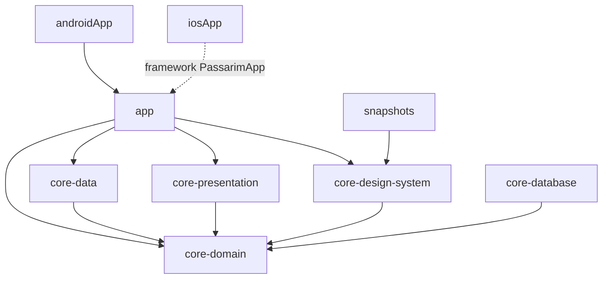

# Passarim — Etapa 5a: Fundação do app (KMP + Compose Multiplatform) — Plano de Implementação

> **For agentic workers:** REQUIRED SUB-SKILL: Use superpowers:subagent-driven-development (recommended) or superpowers:executing-plans to implement this plan task-by-task. Steps use checkbox (`- [ ]`) syntax for tracking.

**Goal:** Criar o repositório `passarim-app` com a base que as fatias 5b–5e só precisam preencher: o app abre (Android e iOS) com splash e as abas Explorar · Favoritos · Configurações, o tema vem dos tokens, a camada de dados fala com o BFF local e o pipeline de snapshots, o CI e a segurança das dependências estão provados.

**Architecture:** Módulos KMP por camada (`core:domain`, `core:data`, `core:presentation`, `core:design-system`, `core:database`), um módulo `app` com a UI raiz em Compose Multiplatform e duas cascas finas (`androidApp`, `iosApp`). Configuração de build por *convention plugins* (`build-logic`). Debug/release chega ao código compartilhado por uma `AppConfig` injetada pela plataforma. Os snapshots ficam num módulo Android puro (`snapshots`, Paparazzi).

**Tech Stack:** Gradle 9.8.1 · AGP 9.4.1 · Kotlin 2.4.21 · Compose Multiplatform 1.12.1 · Ktor 3.6.0 · Koin 4.2.2 · kotlinx.serialization/coroutines · Paparazzi 2.0.0-alpha05 · ktlint 14.2.0 (plugin) · detekt 2.0.0-alpha.6 · XcodeGen · osv-scanner. **JDK 21.**

**Spec:** `docs/superpowers/specs/2026-10-08-passarim-app-fundacao-design.md` (a fonte única; `§N` abaixo refere-se a ela). Antecedentes: `docs/superpowers/spikes/2026-10-09-passarim-app-versoes.md` e `.../2026-10-09-passarim-app-esqueleto.md`, ambos em `passarim-docs`.

## Estado atual e como executar este plano

Um esqueleto **já validado** existe no repositório local `~/dev/passarim/passarim-app` (sem remoto), construído antes deste plano: o código embutido abaixo é, arquivo por arquivo, o desse esqueleto. Duas formas de executar, a escolher pelo dono:

- **(a) Reconstruir** num diretório novo, tarefa por tarefa, e no fim comparar com o esqueleto (`diff -r`, ignorando `build/`, `.gradle/` e `iosApp/iosApp.xcodeproj`). Prova que o plano é reproduzível. É o caminho recomendado.
- **(b) Adotar** o esqueleto e executar só as verificações (cada tarefa termina com comandos e saídas esperadas) e a Task 16.

Todos os comandos rodam em `~/dev/passarim/passarim-app` (chamado `APP`), salvo indicação, com `export JAVA_HOME="$(/usr/libexec/java_home -v 21)"`.

## Global Constraints

- Repositório `passarim-app` (GitHub `velosobr/passarim-app`), `main` direto, commits `<tipo>: mensagem` em português, **um commit por tarefa**, `git add` com caminhos explícitos. Código comentado em português, para estudante; identificadores em inglês.
- Identificador `com.velosobr.passarim`; `minSdk` 26; `compileSdk` **37**; `targetSdk` 36; iOS deployment target 15.0.
- **JDK 21** em tudo (Gradle, testes, CI): o Paparazzi 2.x gera bytecode Java 21. Os módulos KMP usam `com.android.kotlin.multiplatform.library` (bloco `android { }`); `snapshots` usa `com.android.library` sem `kotlin-android`. Dependências do Compose com coordenadas explícitas (os atalhos `compose.*` estão obsoletos).
- Versões só no catálogo `gradle/libs.versions.toml`; plugins de terceiros só por *convention plugin* (não resolvem direto em módulo).
- Testes de lógica: `kotlin.test` + Turbine + AssertK em `commonTest`, rodando na JVM do host (`testAndroidHostTest`) **e** no simulador iOS (`iosSimulatorArm64Test`). JUnit4 só nos snapshots. **Nome de teste sem vírgula** (o Kotlin/Native rejeita `,` em nomes com crases).
- Dependências: `presentation → domain ← data`; `core:*` não depende de `app`; **componentes de feature (mapa, player, filtros) não entram no design system**; `core:data` fica só com rede.
- Debug/release vem de `AppConfig`, **nunca** de `BuildKonfig` no `commonMain`. Texto puro (HTTP) **só no debug** (Android: network security config no source set `debug`; iOS: exceção de ATS só no Info.plist de Debug). O release exige HTTPS e aponta para `https://api.passarim.invalid` até a etapa 6.
- Cores só dos tokens (`passarim-docs/docs/design/tokens/passarim-tokens.json`); fundo único (`background = surface`); Manrope em **todos** os 15 estilos; formas 12/16/28dp; alvo de toque ≥ 48dp.
- `safeCall`: resposta que **não** é `application/problem+json` (404 `text/plain` do Traefik, 502, 503, 504) classifica por status e **nunca** vira `NotFound` (§4).
- Sem segredos no app; sem certificate pinning (ADR-0008); R8 no release (regras de keep completas na 5e).
- Strings de interface em `composeResources`, não em literais no código (exceto a tela de depuração, que também usa recursos).

## Review Focus

Condições que o spec implica mas os testes de lógica não exercitam; cada linha tem a verificação na tarefa indicada:

1. **Porta 8080 ocupada por outro processo** (visto na máquina de desenvolvimento: um servidor Node escutando em IPv6 atende `localhost`, enquanto o Docker publica em `127.0.0.1`). O app iOS (`localhost`) fala com o processo errado e o emulador (`10.0.2.2`) não. Esperado: o README documenta o sintoma e a troca de porta. (Task 14 e 16.)
2. **Réplicas do BFF paradas → o Traefik devolve 404 `text/plain`** e o app deve mostrar "Serviço indisponível", não "não encontrado". (Teste do `safeCall` na Task 3 + verificação real na Task 16.)
3. **O release nunca fala com o ambiente local nem aceita HTTP.** Esperado: o manifest mesclado de release não tem `networkSecurityConfig` nem `usesCleartextTraffic`, e `BASE_URL` é o endereço inválido reservado. (Task 9.)
4. **Trava de dependências desatualizada** esconde uma vulnerabilidade nova. Esperado: o CI regenera as travas e falha se houver diferença. (Task 13 e 14.)
5. **A tela de depuração e o botão que a abre não existem fora do debug** (`DebugRoute` só é registrada com `isDebug`; o botão só aparece com `showDebug`). Esperado: verificado no APK de release (Task 9) e mantido pelo desenho da `App()` (Task 8).

---

### Task 0: Pré-requisitos da máquina

Nada vai para o repositório; só se confere o ambiente.

- [ ] **Step 1: Conferir as ferramentas**

```bash
export JAVA_HOME="$(/usr/libexec/java_home -v 21)" && java -version 2>&1 | head -1
echo "ANDROID_HOME=$ANDROID_HOME"; ls "$ANDROID_HOME/platforms" | grep -E "android-37"
xcodebuild -version | head -1
xcrun simctl list devices available | grep -E "iPhone" | head -3
adb devices | head -3
```

Expected: JDK `21.x`; `ANDROID_HOME` preenchido e `android-37.0` listado (instale com o SDK Manager se faltar); Xcode 16 ou superior; ao menos um iPhone no simulador; um emulador Android ligado (ou inicie um AVD).

- [ ] **Step 2: Instalar o que falta** (uma vez)

```bash
brew install gradle xcodegen osv-scanner actionlint
```

(`gradle` só serve para gerar o `gradlew` na Task 1. `actionlint` é opcional, valida o workflow da Task 14. O Google Chrome também é necessário, para os PNGs do iOS na Task 10.)

### Task 1: Repositório, Gradle e `build-logic`

**Files:**
- Create: `.gitignore`, `.editorconfig`, `gradle.properties`, `gradle/libs.versions.toml`, `settings.gradle.kts`, `build.gradle.kts`, `build-logic/**`, `gradlew`, `gradle/wrapper/**`

**Interfaces:**
- Produces: os convention plugins `passarim.kmp-library` (Android + iOS, `commonTest` na JVM do host e no simulador, ktlint), `passarim.kmp-compose` (+ Compose Multiplatform e recursos com `Res` em `com.velosobr.passarim<caminho do módulo>.resources`) e `passarim.serialization`. O catálogo `libs` com todas as versões. Os módulos são incluídos em `settings.gradle.kts`; o Gradle 9 exige que cada diretório de módulo exista.

- [ ] **Step 1: Criar o repositório e o wrapper**

```bash
mkdir -p ~/dev/passarim/passarim-app && cd ~/dev/passarim/passarim-app
git init -b main
export JAVA_HOME="$(/usr/libexec/java_home -v 21)"
gradle wrapper --gradle-version 9.8.1 --distribution-type bin
```

Expected: `gradlew`, `gradlew.bat` e `gradle/wrapper/` criados (use sempre `./gradlew` daqui para a frente).

- [ ] **Step 2: Arquivos de raiz**

`.gitignore`

```text
# Gradle / Kotlin
.gradle/
.kotlin/
build/
local.properties
# IDEs e sistema
.idea/
*.iml
.DS_Store
# Xcode (o projeto é gerado por XcodeGen)
iosApp/iosApp.xcodeproj/
iosApp/build/
iosApp/Config/Local.xcconfig
```

`.editorconfig`

```ini
root = true

[*]
charset = utf-8
end_of_line = lf
insert_final_newline = true

[*.{kt,kts}]
ktlint_code_style = ktlint_official
max_line_length = 140
# Funções @Composable usam PascalCase por convenção do Compose.
ktlint_function_naming_ignore_when_annotated_with = Composable
```

`gradle.properties`

```properties
org.gradle.jvmargs=-Xmx4g -Dfile.encoding=UTF-8
org.gradle.caching=true
android.useAndroidX=true
kotlin.code.style=official
```

`gradle/libs.versions.toml` — catálogo completo desde já (as versões do spike)

```toml
[versions]
agp = "9.4.1"
kotlin = "2.4.21"
compose = "1.12.1"
composeMaterial3 = "1.9.0"
ksp = "2.3.12"
room = "2.8.5"
sqlite = "2.6.2"
paparazzi = "2.0.0-alpha05"
ktor = "3.6.0"
koin = "4.2.2"
serialization = "1.11.0"
coroutines = "1.11.0"
turbine = "1.2.1"
assertk = "0.28.1"
lifecycle = "2.11.0"
navigation = "2.9.2"
splashscreen = "1.2.0"
activityCompose = "1.13.0"
ktlint = "14.2.0"
detekt = "2.0.0-alpha.6"
junit4 = "4.13.2"

[libraries]
# plugins usados pelo build-logic
android-gradlePlugin = { module = "com.android.tools.build:gradle", version.ref = "agp" }
kotlin-gradlePlugin = { module = "org.jetbrains.kotlin:kotlin-gradle-plugin", version.ref = "kotlin" }
kotlin-serialization-gradlePlugin = { module = "org.jetbrains.kotlin:kotlin-serialization", version.ref = "kotlin" }
compose-compiler-gradlePlugin = { module = "org.jetbrains.kotlin:compose-compiler-gradle-plugin", version.ref = "kotlin" }
compose-gradlePlugin = { module = "org.jetbrains.compose:compose-gradle-plugin", version.ref = "compose" }
ksp-gradlePlugin = { module = "com.google.devtools.ksp:symbol-processing-gradle-plugin", version.ref = "ksp" }
room-gradlePlugin = { module = "androidx.room:room-gradle-plugin", version.ref = "room" }
paparazzi-gradlePlugin = { module = "app.cash.paparazzi:paparazzi-gradle-plugin", version.ref = "paparazzi" }
ktlint-gradlePlugin = { module = "org.jlleitschuh.gradle:ktlint-gradle", version.ref = "ktlint" }
detekt-gradlePlugin = { module = "dev.detekt:detekt-gradle-plugin", version.ref = "detekt" }

# Compose Multiplatform
compose-runtime = { module = "org.jetbrains.compose.runtime:runtime", version.ref = "compose" }
compose-foundation = { module = "org.jetbrains.compose.foundation:foundation", version.ref = "compose" }
compose-material3 = { module = "org.jetbrains.compose.material3:material3", version.ref = "composeMaterial3" }
compose-ui = { module = "org.jetbrains.compose.ui:ui", version.ref = "compose" }
compose-resources = { module = "org.jetbrains.compose.components:components-resources", version.ref = "compose" }
compose-uiToolingPreview = { module = "org.jetbrains.compose.ui:ui-tooling-preview", version.ref = "compose" }
lifecycle-viewmodel-compose = { module = "org.jetbrains.androidx.lifecycle:lifecycle-viewmodel-compose", version.ref = "lifecycle" }
lifecycle-runtime-compose = { module = "org.jetbrains.androidx.lifecycle:lifecycle-runtime-compose", version.ref = "lifecycle" }
navigation-compose = { module = "org.jetbrains.androidx.navigation:navigation-compose", version.ref = "navigation" }
androidx-activity-compose = { module = "androidx.activity:activity-compose", version.ref = "activityCompose" }
androidx-core-splashscreen = { module = "androidx.core:core-splashscreen", version.ref = "splashscreen" }

# Rede e serialização
ktor-client-core = { module = "io.ktor:ktor-client-core", version.ref = "ktor" }
ktor-client-contentNegotiation = { module = "io.ktor:ktor-client-content-negotiation", version.ref = "ktor" }
ktor-client-logging = { module = "io.ktor:ktor-client-logging", version.ref = "ktor" }
ktor-client-okhttp = { module = "io.ktor:ktor-client-okhttp", version.ref = "ktor" }
ktor-client-darwin = { module = "io.ktor:ktor-client-darwin", version.ref = "ktor" }
ktor-client-mock = { module = "io.ktor:ktor-client-mock", version.ref = "ktor" }
ktor-serialization-kotlinxJson = { module = "io.ktor:ktor-serialization-kotlinx-json", version.ref = "ktor" }
kotlinx-serialization-json = { module = "org.jetbrains.kotlinx:kotlinx-serialization-json", version.ref = "serialization" }
kotlinx-coroutines-core = { module = "org.jetbrains.kotlinx:kotlinx-coroutines-core", version.ref = "coroutines" }
kotlinx-coroutines-test = { module = "org.jetbrains.kotlinx:kotlinx-coroutines-test", version.ref = "coroutines" }

# DI
koin-core = { module = "io.insert-koin:koin-core", version.ref = "koin" }
koin-compose = { module = "io.insert-koin:koin-compose", version.ref = "koin" }
koin-compose-viewmodel = { module = "io.insert-koin:koin-compose-viewmodel", version.ref = "koin" }
koin-android = { module = "io.insert-koin:koin-android", version.ref = "koin" }

# Testes
turbine = { module = "app.cash.turbine:turbine", version.ref = "turbine" }
assertk = { module = "com.willowtreeapps.assertk:assertk", version.ref = "assertk" }
junit4 = { module = "junit:junit", version.ref = "junit4" }
```

`settings.gradle.kts`

```kotlin
pluginManagement {
    includeBuild("build-logic")
    repositories {
        google()
        mavenCentral()
        gradlePluginPortal()
    }
}

dependencyResolutionManagement {
    repositories {
        google()
        mavenCentral()
    }
}

rootProject.name = "passarim-app"

enableFeaturePreview("TYPESAFE_PROJECT_ACCESSORS")

include(":androidApp")
include(":app")
include(":core:domain")
include(":core:data")
include(":core:presentation")
include(":core:design-system")
include(":core:database")
include(":snapshots")
```

`build.gradle.kts` — versão inicial; detekt e as travas entram nas Tasks 12 e 13

```kotlin
// A raiz não aplica plugins: cada módulo escolhe os seus por convention plugin (build-logic).
```

- [ ] **Step 3: `build-logic`**

`build-logic/settings.gradle.kts`

```kotlin
dependencyResolutionManagement {
    repositories {
        google()
        mavenCentral()
        gradlePluginPortal()
    }
    versionCatalogs {
        create("libs") { from(files("../gradle/libs.versions.toml")) }
    }
}

rootProject.name = "build-logic"
```

`build-logic/build.gradle.kts`

```kotlin
plugins {
    `kotlin-dsl`
}

kotlin { jvmToolchain(21) }

dependencies {
    implementation(libs.android.gradlePlugin)
    implementation(libs.kotlin.gradlePlugin)
    implementation(libs.kotlin.serialization.gradlePlugin)
    implementation(libs.compose.compiler.gradlePlugin)
    implementation(libs.compose.gradlePlugin)
    implementation(libs.ksp.gradlePlugin)
    implementation(libs.room.gradlePlugin)
    implementation(libs.paparazzi.gradlePlugin)
    implementation(libs.ktlint.gradlePlugin)
    implementation(libs.detekt.gradlePlugin)
}
```

`build-logic/src/main/kotlin/passarim.kmp-library.gradle.kts`

```kotlin
// Módulo KMP de biblioteca: Android (plugin novo do AGP 9) + iOS, com testes de commonTest
// rodando na JVM do host (testAndroidHostTest) e no simulador iOS.
plugins {
    id("org.jetbrains.kotlin.multiplatform")
    id("com.android.kotlin.multiplatform.library")
    id("org.jlleitschuh.gradle.ktlint")
}

kotlin {
    android {
        // ":core:design-system" -> "com.velosobr.passarim.core.designsystem"
        namespace = "com.velosobr.passarim" + project.path.replace(":", ".").replace("-", "")
        compileSdk = 37
        minSdk = 26
        withHostTest { }
    }
    iosArm64()
    iosSimulatorArm64()

    sourceSets {
        commonTest.dependencies {
            implementation(kotlin("test"))
        }
    }
}

ktlint {
    // Não valida o que o Gradle gera (acessores de recursos do Compose, por exemplo).
    filter { exclude { it.file.path.contains("/build/") } }
}
```

`build-logic/src/main/kotlin/passarim.kmp-compose.gradle.kts`

```kotlin
// Biblioteca KMP com Compose Multiplatform e recursos (strings, fontes, drawables).
plugins {
    id("passarim.kmp-library")
    id("org.jetbrains.compose")
    id("org.jetbrains.kotlin.plugin.compose")
}

kotlin {
    android {
        // O Paparazzi só enxerga os recursos do Compose se eles virarem assets Android.
        androidResources { enable = true }
    }
}

compose.resources {
    publicResClass = true
    // ":core:design-system" -> "com.velosobr.passarim.core.designsystem.resources"
    packageOfResClass = "com.velosobr.passarim" + project.path.replace(":", ".").replace("-", "") + ".resources"
}
```

`build-logic/src/main/kotlin/passarim.serialization.gradle.kts`

```kotlin
// kotlinx.serialization: o plugin do compilador que gera os serializers.
plugins {
    id("org.jetbrains.kotlin.plugin.serialization")
}
```

- [ ] **Step 4: Diretórios dos módulos** (o Gradle 9 exige que existam)

```bash
for m in androidApp app core/domain core/data core/presentation core/design-system core/database snapshots; do
  mkdir -p "$m"; echo "// stub" > "$m/build.gradle.kts"
done
```

- [ ] **Step 5: Verificar**

```bash
export JAVA_HOME="$(/usr/libexec/java_home -v 21)" && ./gradlew help --console=plain 2>&1 | tail -3
```

Expected: `BUILD SUCCESSFUL`. (O Gradle compila o `build-logic` e resolve o catálogo; se acusar plugin ou versão inexistente, reveja o catálogo antes de seguir.)

- [ ] **Commit**

```bash
git add .gitignore .editorconfig gradle.properties gradle gradlew gradlew.bat settings.gradle.kts build.gradle.kts build-logic androidApp app core snapshots
git commit -m "chore: esqueleto do repositório, catálogo de versões e convention plugins"
```

### Task 2: `core:domain` — `Result`, `DataError` e modelos

**Files:**
- Create: `core/domain/build.gradle.kts`, `core/domain/src/commonMain/kotlin/com/velosobr/passarim/core/domain/{Result,DataError,AppConfig,Filters,ConservationStatus}.kt`
- Test: `core/domain/src/commonTest/kotlin/com/velosobr/passarim/core/domain/ResultTest.kt`

**Interfaces:**
- Produces: `Result<D, E: Error>` (`Success`/`Failure`), `EmptyResult`, `map`, `asEmptyDataResult`, `onSuccess`, `onFailure`; `DataError.Network` selado (`NoConnection`, `Timeout`, `NotFound`, `InvalidParameter`, `RateLimited(retryAfterSeconds: Int?)`, `ServiceUnavailable`, `Internal`, `Unknown`); `AppConfig(isDebug, baseUrl, mediaHostOverride)`; `Filters`/`BiomeFilter`/`StateFilter`; `FiltersRepository.get()`; `ConservationStatus` (LC NT VU EN CR EW).

- [ ] **Step 1: Escrever o teste que falha**

`core/domain/build.gradle.kts`

```kotlin
plugins {
    id("passarim.kmp-library")
}

kotlin {
    sourceSets {
        commonMain.dependencies {
            api(libs.kotlinx.coroutines.core)
        }
        commonTest.dependencies {
            implementation(libs.assertk)
        }
    }
}
```

`core/domain/src/commonTest/kotlin/com/velosobr/passarim/core/domain/ResultTest.kt`

```kotlin
package com.velosobr.passarim.core.domain

import assertk.assertThat
import assertk.assertions.isEqualTo
import kotlin.test.Test

class ResultTest {
    private val ok: Result<Int, DataError.Network> = Result.Success(2)
    private val fail: Result<Int, DataError.Network> = Result.Failure(DataError.Network.Timeout)

    @Test
    fun `map transforma o sucesso`() {
        assertThat(ok.map { it * 10 }).isEqualTo(Result.Success(20))
    }

    @Test
    fun `map preserva a falha`() {
        assertThat(fail.map { it * 10 }).isEqualTo(Result.Failure(DataError.Network.Timeout))
    }

    @Test
    fun `asEmptyDataResult descarta o dado e mantem a falha`() {
        assertThat(ok.asEmptyDataResult()).isEqualTo(Result.Success(Unit))
        assertThat(fail.asEmptyDataResult()).isEqualTo(Result.Failure(DataError.Network.Timeout))
    }

    @Test
    fun `onSuccess e onFailure executam so o ramo correspondente`() {
        val seen = mutableListOf<String>()
        ok.onSuccess { seen += "ok:$it" }.onFailure { seen += "erro" }
        fail.onSuccess { seen += "ok:$it" }.onFailure { seen += "erro:${it::class.simpleName}" }
        assertThat(seen).isEqualTo(listOf("ok:2", "erro:Timeout"))
    }

    @Test
    fun `RateLimited carrega o Retry-After`() {
        assertThat(DataError.Network.RateLimited(30).retryAfterSeconds).isEqualTo(30)
    }
}
```

- [ ] **Step 2: Rodar e ver falhar**

```bash
export JAVA_HOME="$(/usr/libexec/java_home -v 21)" && ./gradlew :core:domain:testAndroidHostTest --console=plain 2>&1 | grep -E "^e: |BUILD" | head -4
```

Expected: `BUILD FAILED` com `e: ... Unresolved reference 'Result'` (o código de produção ainda não existe).

- [ ] **Step 3: Implementar**

`core/domain/src/commonMain/kotlin/com/velosobr/passarim/core/domain/Result.kt`

```kotlin
package com.velosobr.passarim.core.domain

/** Marca os tipos de erro que cabem num [Result]. */
interface Error

/** Resultado tipado: sucesso com dado ou falha com um erro conhecido (nunca uma exceção solta). */
sealed interface Result<out D, out E : Error> {
    data class Success<out D>(
        val data: D,
    ) : Result<D, Nothing>

    data class Failure<out E : Error>(
        val error: E,
    ) : Result<Nothing, E>
}

typealias EmptyResult<E> = Result<Unit, E>

inline fun <T, E : Error, R> Result<T, E>.map(transform: (T) -> R): Result<R, E> =
    when (this) {
        is Result.Failure -> Result.Failure(error)
        is Result.Success -> Result.Success(transform(data))
    }

fun <T, E : Error> Result<T, E>.asEmptyDataResult(): EmptyResult<E> = map { }

inline fun <T, E : Error> Result<T, E>.onSuccess(action: (T) -> Unit): Result<T, E> =
    when (this) {
        is Result.Failure -> this
        is Result.Success -> {
            action(data)
            this
        }
    }

inline fun <T, E : Error> Result<T, E>.onFailure(action: (E) -> Unit): Result<T, E> =
    when (this) {
        is Result.Failure -> {
            action(error)
            this
        }
        is Result.Success -> this
    }
```

`core/domain/src/commonMain/kotlin/com/velosobr/passarim/core/domain/DataError.kt`

```kotlin
package com.velosobr.passarim.core.domain

/** Erros de dados do app. Hoje só existe a rede (BFF); Room entra na 5d. */
sealed interface DataError : Error {
    sealed interface Network : DataError {
        data object NoConnection : Network

        data object Timeout : Network

        data object NotFound : Network

        data object InvalidParameter : Network

        /** [retryAfterSeconds] vem do cabeçalho `Retry-After`; nulo se o BFF não mandou. */
        data class RateLimited(
            val retryAfterSeconds: Int?,
        ) : Network

        data object ServiceUnavailable : Network

        data object Internal : Network

        data object Unknown : Network
    }
}
```

`core/domain/src/commonMain/kotlin/com/velosobr/passarim/core/domain/AppConfig.kt`

```kotlin
package com.velosobr.passarim.core.domain

/**
 * Configuração de execução, preenchida por cada plataforma (BuildConfig no Android, xcconfig no iOS).
 * Os módulos KMP são compilados uma vez só e não conhecem build types; por isso debug/release chega aqui.
 */
data class AppConfig(
    val isDebug: Boolean,
    val baseUrl: String,
    /** Só em debug: host alcançável pela plataforma para trocar o `localhost` das URLs de mídia. */
    val mediaHostOverride: String?,
)
```

`core/domain/src/commonMain/kotlin/com/velosobr/passarim/core/domain/Filters.kt`

```kotlin
package com.velosobr.passarim.core.domain

data class BiomeFilter(
    val code: String,
    val label: String,
    val speciesCount: Int,
)

data class StateFilter(
    val code: String,
    val speciesCount: Int,
)

data class Filters(
    val biomes: List<BiomeFilter>,
    val states: List<StateFilter>,
)

interface FiltersRepository {
    suspend fun get(): Result<Filters, DataError.Network>
}
```

`core/domain/src/commonMain/kotlin/com/velosobr/passarim/core/domain/ConservationStatus.kt`

```kotlin
package com.velosobr.passarim.core.domain

/** Status de conservação (IUCN). A 5c acrescenta EX e DD junto com as cores novas nos tokens. */
enum class ConservationStatus { LC, NT, VU, EN, CR, EW }
```

- [ ] **Step 4: Rodar nas duas plataformas e ver passar**

```bash
export JAVA_HOME="$(/usr/libexec/java_home -v 21)" && ./gradlew :core:domain:allTests --console=plain 2>&1 | grep BUILD && scripts/test-summary.sh core/domain
```

Expected: `BUILD SUCCESSFUL`; `ResultTest` com 5 testes e 0 falhas em `testAndroidHostTest` e em `iosSimulatorArm64Test`. (O `scripts/test-summary.sh` é criado na Task 14; até lá, confira os XMLs em `core/domain/build/test-results/`.)

- [ ] **Commit**

```bash
git add core/domain
git commit -m "feat: core:domain com Result, DataError, AppConfig e modelos de filtros"
```

### Task 3: `core:data` — `safeCall`, cliente HTTP e `GET /v1/filters`

**Files:**
- Create: `core/data/build.gradle.kts`, `core/data/src/commonMain/kotlin/com/velosobr/passarim/core/data/{HttpClientFactory,PlatformEngine,SafeCall,RemoteFiltersRepository,CoreDataModule}.kt`, `core/data/src/androidMain/.../PlatformEngine.android.kt`, `core/data/src/iosMain/.../PlatformEngine.ios.kt`
- Test: `core/data/src/commonTest/kotlin/com/velosobr/passarim/core/data/{SafeCallTest,RemoteFiltersRepositoryTest}.kt`

**Interfaces:**
- Consumes: `Result`, `DataError`, `AppConfig`, `Filters`, `FiltersRepository` (Task 2).
- Produces: `createHttpClient(engine: HttpClientEngine, config: AppConfig): HttpClient`; `suspend inline fun <reified T> safeCall(execute: () -> HttpResponse): Result<T, DataError.Network>`; `expect fun platformHttpEngine(): HttpClientEngine`; `RemoteFiltersRepository(client): FiltersRepository`; `coreDataModule` (Koin). `bffJson` é interno.

- [ ] **Step 1: Escrever os testes que falham**

`core/data/build.gradle.kts`

```kotlin
plugins {
    id("passarim.kmp-library")
    id("passarim.serialization")
}

kotlin {
    sourceSets {
        commonMain.dependencies {
            api(projects.core.domain)
            implementation(libs.ktor.client.core)
            implementation(libs.ktor.client.contentNegotiation)
            implementation(libs.ktor.client.logging)
            implementation(libs.ktor.serialization.kotlinxJson)
            implementation(libs.kotlinx.serialization.json)
            implementation(libs.koin.core)
        }
        androidMain.dependencies {
            implementation(libs.ktor.client.okhttp)
        }
        iosMain.dependencies {
            implementation(libs.ktor.client.darwin)
        }
        commonTest.dependencies {
            implementation(libs.ktor.client.mock)
            implementation(libs.kotlinx.coroutines.test)
            implementation(libs.assertk)
        }
    }
}
```

`core/data/src/commonTest/kotlin/com/velosobr/passarim/core/data/SafeCallTest.kt`

```kotlin
package com.velosobr.passarim.core.data

import assertk.assertThat
import assertk.assertions.isEqualTo
import com.velosobr.passarim.core.domain.DataError
import com.velosobr.passarim.core.domain.Result
import io.ktor.client.HttpClient
import io.ktor.client.call.body
import io.ktor.client.engine.mock.MockEngine
import io.ktor.client.engine.mock.MockRequestHandler
import io.ktor.client.engine.mock.respond
import io.ktor.client.plugins.HttpRequestTimeoutException
import io.ktor.client.plugins.contentnegotiation.ContentNegotiation
import io.ktor.client.request.get
import io.ktor.http.HttpHeaders
import io.ktor.http.HttpStatusCode
import io.ktor.http.headersOf
import io.ktor.serialization.kotlinx.json.json
import kotlinx.coroutines.test.runTest
import kotlinx.serialization.Serializable
import kotlin.test.Test

class SafeCallTest {
    @Serializable
    private data class Pong(
        val message: String,
    )

    private fun client(handler: MockRequestHandler) = HttpClient(MockEngine(handler)) { install(ContentNegotiation) { json(bffJson) } }

    private suspend fun call(handler: MockRequestHandler): Result<Pong, DataError.Network> =
        client(handler).let { c -> safeCall<Pong> { c.get("http://localhost/ping") } }

    private fun problem(
        code: String,
        status: HttpStatusCode,
        extra: Map<String, String> = emptyMap(),
    ): MockRequestHandler =
        {
            respond(
                content = """{"type":"urn:x","title":"t","status":${status.value},"code":"$code","requestId":"r"}""",
                status = status,
                headers =
                    headersOf(
                        HttpHeaders.ContentType to listOf("application/problem+json"),
                        *extra.map { it.key to listOf(it.value) }.toTypedArray(),
                    ),
            )
        }

    private fun plain(
        status: HttpStatusCode,
        body: String = "",
    ): MockRequestHandler =
        {
            respond(content = body, status = status, headers = headersOf(HttpHeaders.ContentType, "text/plain"))
        }

    @Test
    fun `sucesso devolve o corpo decodificado`() =
        runTest {
            val result =
                call {
                    respond("""{"message":"oi","extra":1}""", HttpStatusCode.OK, headersOf(HttpHeaders.ContentType, "application/json"))
                }
            assertThat(result).isEqualTo(Result.Success(Pong("oi")))
        }

    @Test
    fun `cada code do problem+json vira o erro certo`() =
        runTest {
            val table =
                mapOf(
                    "SPECIES_NOT_FOUND" to DataError.Network.NotFound,
                    "NOT_FOUND" to DataError.Network.NotFound,
                    "INVALID_PARAMETER" to DataError.Network.InvalidParameter,
                    "METHOD_NOT_ALLOWED" to DataError.Network.InvalidParameter,
                    "SERVICE_UNAVAILABLE" to DataError.Network.ServiceUnavailable,
                    "INTERNAL" to DataError.Network.Internal,
                    "ALGO_NOVO" to DataError.Network.Unknown,
                )
            for ((code, expected) in table) {
                assertThat(call(problem(code, HttpStatusCode.BadRequest))).isEqualTo(Result.Failure(expected))
            }
        }

    @Test
    fun `RATE_LIMITED le o Retry-After`() =
        runTest {
            val r = call(problem("RATE_LIMITED", HttpStatusCode.TooManyRequests, mapOf("Retry-After" to "30")))
            assertThat(r).isEqualTo(Result.Failure(DataError.Network.RateLimited(30)))
        }

    @Test
    fun `RATE_LIMITED sem Retry-After valido fica nulo`() =
        runTest {
            val r = call(problem("RATE_LIMITED", HttpStatusCode.TooManyRequests, mapOf("Retry-After" to "amanha")))
            assertThat(r).isEqualTo(Result.Failure(DataError.Network.RateLimited(null)))
        }

    @Test
    fun `404 em texto puro do proxy nunca vira NotFound`() =
        runTest {
            val r = call(plain(HttpStatusCode.NotFound, "404 page not found"))
            assertThat(r).isEqualTo(Result.Failure(DataError.Network.ServiceUnavailable))
        }

    @Test
    fun `status de proxy sem problem+json`() =
        runTest {
            val table =
                mapOf(
                    HttpStatusCode.BadGateway to DataError.Network.ServiceUnavailable,
                    HttpStatusCode.ServiceUnavailable to DataError.Network.ServiceUnavailable,
                    HttpStatusCode.GatewayTimeout to DataError.Network.ServiceUnavailable,
                    HttpStatusCode.InternalServerError to DataError.Network.Internal,
                    HttpStatusCode.BadRequest to DataError.Network.Unknown,
                )
            for ((status, expected) in table) {
                assertThat(call(plain(status))).isEqualTo(Result.Failure(expected))
            }
        }

    @Test
    fun `problem+json com corpo invalido cai na classificacao por status`() =
        runTest {
            val r =
                call {
                    respond("nao e json", HttpStatusCode.ServiceUnavailable, headersOf(HttpHeaders.ContentType, "application/problem+json"))
                }
            assertThat(r).isEqualTo(Result.Failure(DataError.Network.ServiceUnavailable))
        }

    @Test
    fun `timeout do Ktor vira Timeout`() =
        runTest {
            val r = call { throw HttpRequestTimeoutException("http://localhost/ping", 1_000) }
            assertThat(r).isEqualTo(Result.Failure(DataError.Network.Timeout))
        }

    @Test
    fun `falha de transporte vira NoConnection`() =
        runTest {
            val r = call { throw IllegalStateException("sem rede") }
            assertThat(r).isEqualTo(Result.Failure(DataError.Network.NoConnection))
        }

    @Test
    fun `200 com corpo invalido vira Unknown`() =
        runTest {
            val r =
                call {
                    respond("""{"outra":"coisa"}""", HttpStatusCode.OK, headersOf(HttpHeaders.ContentType, "application/json"))
                }
            assertThat(r).isEqualTo(Result.Failure(DataError.Network.Unknown))
        }

    @Test
    fun `corpo de sucesso pode ser lido com body direto`() =
        runTest {
            val c = client { respond("""{"message":"x"}""", HttpStatusCode.OK, headersOf(HttpHeaders.ContentType, "application/json")) }
            assertThat(c.get("http://localhost/ping").body<Pong>()).isEqualTo(Pong("x"))
        }
}
```

`core/data/src/commonTest/kotlin/com/velosobr/passarim/core/data/RemoteFiltersRepositoryTest.kt`

```kotlin
package com.velosobr.passarim.core.data

import assertk.assertThat
import assertk.assertions.isEqualTo
import com.velosobr.passarim.core.domain.AppConfig
import com.velosobr.passarim.core.domain.BiomeFilter
import com.velosobr.passarim.core.domain.DataError
import com.velosobr.passarim.core.domain.Filters
import com.velosobr.passarim.core.domain.Result
import com.velosobr.passarim.core.domain.StateFilter
import io.ktor.client.engine.mock.MockEngine
import io.ktor.client.engine.mock.respond
import io.ktor.http.HttpHeaders
import io.ktor.http.HttpMethod
import io.ktor.http.HttpStatusCode
import io.ktor.http.headersOf
import kotlinx.coroutines.test.runTest
import kotlin.test.Test

class RemoteFiltersRepositoryTest {
    private val config = AppConfig(isDebug = false, baseUrl = "http://localhost:8080", mediaHostOverride = null)

    @Test
    fun `busca GET v1 filters na base configurada e mapeia para o dominio`() =
        runTest {
            var seenUrl = ""
            var seenMethod: HttpMethod? = null
            val engine =
                MockEngine { request ->
                    seenUrl = request.url.toString()
                    seenMethod = request.method
                    respond(
                        """
                        {"biomes":[{"code":"cerrado","label":"Cerrado","speciesCount":26}],
                         "states":[{"code":"SP","speciesCount":29}]}
                        """.trimIndent(),
                        HttpStatusCode.OK,
                        headersOf(HttpHeaders.ContentType, "application/json"),
                    )
                }
            val repo = RemoteFiltersRepository(createHttpClient(engine, config))

            val result = repo.get()

            assertThat(seenUrl).isEqualTo("http://localhost:8080/v1/filters")
            assertThat(seenMethod).isEqualTo(HttpMethod.Get)
            assertThat(result).isEqualTo(
                Result.Success(Filters(listOf(BiomeFilter("cerrado", "Cerrado", 26)), listOf(StateFilter("SP", 29)))),
            )
        }

    @Test
    fun `propaga o erro de servidor`() =
        runTest {
            val engine = MockEngine { respond("", HttpStatusCode.ServiceUnavailable, headersOf(HttpHeaders.ContentType, "text/plain")) }
            val result = RemoteFiltersRepository(createHttpClient(engine, config)).get()
            assertThat(result).isEqualTo(Result.Failure(DataError.Network.ServiceUnavailable))
        }
}
```

- [ ] **Step 2: Rodar e ver falhar**

```bash
export JAVA_HOME="$(/usr/libexec/java_home -v 21)" && ./gradlew :core:data:testAndroidHostTest --console=plain 2>&1 | grep -E "^e: |BUILD" | head -4
```

Expected: `BUILD FAILED` com `Unresolved reference 'safeCall'`, `'bffJson'`, `'createHttpClient'` ou `'RemoteFiltersRepository'`.

- [ ] **Step 3: Implementar**

`core/data/src/commonMain/kotlin/com/velosobr/passarim/core/data/HttpClientFactory.kt`

```kotlin
package com.velosobr.passarim.core.data

import com.velosobr.passarim.core.domain.AppConfig
import io.ktor.client.HttpClient
import io.ktor.client.engine.HttpClientEngine
import io.ktor.client.plugins.HttpTimeout
import io.ktor.client.plugins.contentnegotiation.ContentNegotiation
import io.ktor.client.plugins.defaultRequest
import io.ktor.client.plugins.logging.LogLevel
import io.ktor.client.plugins.logging.Logging
import io.ktor.serialization.kotlinx.json.json
import kotlinx.serialization.json.Json

/** JSON do BFF: campos novos que o app ainda não conhece não quebram a leitura. */
internal val bffJson =
    Json {
        ignoreUnknownKeys = true
        explicitNulls = false
    }

/**
 * Cliente HTTP do BFF. O [engine] é injetado (OkHttp no Android, Darwin no iOS, MockEngine nos testes).
 * O log do Ktor só existe em debug, para não vazar URLs em produção.
 */
fun createHttpClient(
    engine: HttpClientEngine,
    config: AppConfig,
): HttpClient =
    HttpClient(engine) {
        install(ContentNegotiation) { json(bffJson) }
        install(HttpTimeout) {
            connectTimeoutMillis = 5_000
            requestTimeoutMillis = 10_000
            socketTimeoutMillis = 10_000
        }
        if (config.isDebug) {
            install(Logging) { level = LogLevel.INFO }
        }
        defaultRequest { url(config.baseUrl) }
        expectSuccess = false
    }
```

`core/data/src/commonMain/kotlin/com/velosobr/passarim/core/data/PlatformEngine.kt`

```kotlin
package com.velosobr.passarim.core.data

import io.ktor.client.engine.HttpClientEngine

/** Motor HTTP de cada plataforma: OkHttp (Android) e Darwin/NSURLSession (iOS). */
expect fun platformHttpEngine(): HttpClientEngine
```

`core/data/src/androidMain/kotlin/com/velosobr/passarim/core/data/PlatformEngine.android.kt`

```kotlin
package com.velosobr.passarim.core.data

import io.ktor.client.engine.HttpClientEngine
import io.ktor.client.engine.okhttp.OkHttp

actual fun platformHttpEngine(): HttpClientEngine = OkHttp.create()
```

`core/data/src/iosMain/kotlin/com/velosobr/passarim/core/data/PlatformEngine.ios.kt`

```kotlin
package com.velosobr.passarim.core.data

import io.ktor.client.engine.HttpClientEngine
import io.ktor.client.engine.darwin.Darwin

actual fun platformHttpEngine(): HttpClientEngine = Darwin.create()
```

`core/data/src/commonMain/kotlin/com/velosobr/passarim/core/data/SafeCall.kt`

```kotlin
// Capturar `Exception` aqui é proposital: qualquer falha de transporte vira um erro tipado do app
// (o cancelamento de corrotina é sempre relançado antes).
@file:Suppress("TooGenericExceptionCaught", "SwallowedException")

package com.velosobr.passarim.core.data

import com.velosobr.passarim.core.domain.DataError
import com.velosobr.passarim.core.domain.Result
import io.ktor.client.call.body
import io.ktor.client.network.sockets.ConnectTimeoutException
import io.ktor.client.network.sockets.SocketTimeoutException
import io.ktor.client.plugins.HttpRequestTimeoutException
import io.ktor.client.statement.HttpResponse
import io.ktor.client.statement.bodyAsText
import io.ktor.http.HttpHeaders
import io.ktor.http.contentType
import io.ktor.http.isSuccess
import kotlinx.coroutines.CancellationException
import kotlinx.serialization.Serializable

/**
 * Executa uma chamada e devolve sempre um [Result] tipado; nunca lança (exceto cancelamento).
 *
 * Erros de transporte viram [DataError.Network.Timeout] ou [DataError.Network.NoConnection].
 * Respostas de erro viram o erro do `code` do problem+json do BFF; se a resposta **não** for
 * problem+json (um 404 em texto puro do Traefik com as réplicas paradas, por exemplo),
 * classifica pelo status HTTP.
 */
suspend inline fun <reified T> safeCall(execute: () -> HttpResponse): Result<T, DataError.Network> {
    val response =
        try {
            execute()
        } catch (e: CancellationException) {
            throw e
        } catch (e: Exception) {
            return Result.Failure(e.toNetworkError())
        }
    return if (response.status.isSuccess()) {
        try {
            Result.Success(response.body<T>())
        } catch (e: CancellationException) {
            throw e
        } catch (e: Exception) {
            Result.Failure(DataError.Network.Unknown)
        }
    } else {
        Result.Failure(response.toNetworkError())
    }
}

@Serializable
internal data class ProblemDto(
    val code: String? = null,
)

@PublishedApi
internal fun Exception.toNetworkError(): DataError.Network =
    when (this) {
        is HttpRequestTimeoutException, is ConnectTimeoutException, is SocketTimeoutException -> DataError.Network.Timeout
        else -> DataError.Network.NoConnection
    }

@PublishedApi
internal suspend fun HttpResponse.toNetworkError(): DataError.Network {
    val isProblem = contentType()?.match("application/problem+json") == true
    if (isProblem) {
        val code =
            try {
                bffJson.decodeFromString(ProblemDto.serializer(), bodyAsText()).code
            } catch (e: CancellationException) {
                throw e
            } catch (e: Exception) {
                null
            }
        if (code != null) return code.toNetworkError(headers[HttpHeaders.RetryAfter]?.toIntOrNull())
    }
    return status.value.toNetworkError()
}

private fun String.toNetworkError(retryAfterSeconds: Int?): DataError.Network =
    when (this) {
        "SPECIES_NOT_FOUND", "NOT_FOUND" -> DataError.Network.NotFound
        "INVALID_PARAMETER", "METHOD_NOT_ALLOWED" -> DataError.Network.InvalidParameter
        "RATE_LIMITED" -> DataError.Network.RateLimited(retryAfterSeconds)
        "SERVICE_UNAVAILABLE" -> DataError.Network.ServiceUnavailable
        "INTERNAL" -> DataError.Network.Internal
        else -> DataError.Network.Unknown
    }

private fun Int.toNetworkError(): DataError.Network =
    when (this) {
        404, 502, 503, 504 -> DataError.Network.ServiceUnavailable
        in 500..599 -> DataError.Network.Internal
        else -> DataError.Network.Unknown
    }
```

`core/data/src/commonMain/kotlin/com/velosobr/passarim/core/data/RemoteFiltersRepository.kt`

```kotlin
package com.velosobr.passarim.core.data

import com.velosobr.passarim.core.domain.BiomeFilter
import com.velosobr.passarim.core.domain.DataError
import com.velosobr.passarim.core.domain.Filters
import com.velosobr.passarim.core.domain.FiltersRepository
import com.velosobr.passarim.core.domain.Result
import com.velosobr.passarim.core.domain.StateFilter
import com.velosobr.passarim.core.domain.map
import io.ktor.client.HttpClient
import io.ktor.client.request.get
import kotlinx.serialization.Serializable

@Serializable
internal data class FiltersDto(
    val biomes: List<BiomeDto>,
    val states: List<StateDto>,
)

@Serializable
internal data class BiomeDto(
    val code: String,
    val label: String,
    val speciesCount: Int,
)

@Serializable
internal data class StateDto(
    val code: String,
    val speciesCount: Int,
)

internal fun FiltersDto.toDomain() =
    Filters(
        biomes = biomes.map { BiomeFilter(it.code, it.label, it.speciesCount) },
        states = states.map { StateFilter(it.code, it.speciesCount) },
    )

/** `GET /v1/filters`: biomas e estados com a contagem de espécies. */
class RemoteFiltersRepository(
    private val client: HttpClient,
) : FiltersRepository {
    override suspend fun get(): Result<Filters, DataError.Network> =
        safeCall<FiltersDto> { client.get("/v1/filters") }.map { it.toDomain() }
}
```

`core/data/src/commonMain/kotlin/com/velosobr/passarim/core/data/CoreDataModule.kt` — versão da Task 3; a Task 4 acrescenta o `MediaUrlRewriter`

```kotlin
package com.velosobr.passarim.core.data

import com.velosobr.passarim.core.domain.FiltersRepository
import org.koin.dsl.module

/** Módulo Koin da camada de rede. O `AppConfig` vem do módulo do `app`. */
val coreDataModule =
    module {
        single { createHttpClient(platformHttpEngine(), get()) }
        single<FiltersRepository> { RemoteFiltersRepository(get()) }
    }
```

- [ ] **Step 4: Rodar nas duas plataformas e ver passar**

```bash
export JAVA_HOME="$(/usr/libexec/java_home -v 21)" && ./gradlew :core:data:allTests --console=plain 2>&1 | grep BUILD
```

Expected: `BUILD SUCCESSFUL`; `SafeCallTest` com 11 testes e `RemoteFiltersRepositoryTest` com 2, sem falhas, em `testAndroidHostTest` e `iosSimulatorArm64Test`.

- [ ] **Commit**

```bash
git add core/data
git commit -m "feat: core:data com safeCall, cliente Ktor e GET /v1/filters"
```

### Task 4: `MediaUrlRewriter`

**Files:**
- Create: `core/data/src/commonMain/kotlin/com/velosobr/passarim/core/data/MediaUrlRewriter.kt`
- Modify: `core/data/src/commonMain/kotlin/com/velosobr/passarim/core/data/CoreDataModule.kt`
- Test: `core/data/src/commonTest/kotlin/com/velosobr/passarim/core/data/MediaUrlRewriterTest.kt`

**Interfaces:**
- Consumes: `AppConfig` (Task 2).
- Produces: `MediaUrlRewriter(config).rewrite(url: String?): String?` — troca **só o host** de `localhost`/`127.0.0.1` por `config.mediaHostOverride` (porta, caminho e query preservados); sem override, host não local ou URL que não seja `http(s)` absoluta não mudam. As fatias 5b e 5c o aplicam nos mappers de fotos e áudio.

- [ ] **Step 1: Escrever o teste que falha**

`core/data/src/commonTest/kotlin/com/velosobr/passarim/core/data/MediaUrlRewriterTest.kt`

```kotlin
package com.velosobr.passarim.core.data

import assertk.assertThat
import assertk.assertions.isEqualTo
import com.velosobr.passarim.core.domain.AppConfig
import kotlin.test.Test

class MediaUrlRewriterTest {
    private fun rewriter(override: String?) =
        MediaUrlRewriter(AppConfig(isDebug = override != null, baseUrl = "http://10.0.2.2:8080", mediaHostOverride = override))

    @Test
    fun `troca so o host de localhost e preserva porta caminho e query`() {
        val out = rewriter("10.0.2.2").rewrite("http://localhost:8888/buckets/passarim-media/a.jpg?v=2")
        assertThat(out).isEqualTo("http://10.0.2.2:8888/buckets/passarim-media/a.jpg?v=2")
    }

    @Test
    fun `127_0_0_1 tambem e tratado como local`() {
        val out = rewriter("192.168.0.10").rewrite("http://127.0.0.1:8888/x.aac")
        assertThat(out).isEqualTo("http://192.168.0.10:8888/x.aac")
    }

    @Test
    fun `sem override a URL nao muda`() {
        val url = "http://localhost:8888/a.jpg"
        assertThat(rewriter(null).rewrite(url)).isEqualTo(url)
    }

    @Test
    fun `host que nao e local nunca e reescrito`() {
        val url = "https://cdn.passarim.app/a.jpg"
        assertThat(rewriter("10.0.2.2").rewrite(url)).isEqualTo(url)
    }

    @Test
    fun `URL invalida volta como veio`() {
        assertThat(rewriter("10.0.2.2").rewrite("não é url")).isEqualTo("não é url")
    }

    @Test
    fun `nulo continua nulo`() {
        assertThat(rewriter("10.0.2.2").rewrite(null)).isEqualTo(null)
    }
}
```

- [ ] **Step 2: Rodar e ver falhar**

```bash
export JAVA_HOME="$(/usr/libexec/java_home -v 21)" && ./gradlew :core:data:testAndroidHostTest --console=plain 2>&1 | grep -E "^e: |BUILD" | head -3
```

Expected: `BUILD FAILED` com `Unresolved reference 'MediaUrlRewriter'`.

- [ ] **Step 3: Implementar**

`core/data/src/commonMain/kotlin/com/velosobr/passarim/core/data/MediaUrlRewriter.kt` — o parser do Ktor aceita qualquer texto como caminho relativo em `localhost`, por isso exige-se `http(s)://`

```kotlin
package com.velosobr.passarim.core.data

import com.velosobr.passarim.core.domain.AppConfig
import io.ktor.http.URLBuilder
import io.ktor.http.Url

/**
 * Em debug, o BFF devolve URLs de mídia com `localhost` (a porta do SeaweedFS no computador), que o
 * emulador e o aparelho não alcançam. Este conversor troca **só o host** por [AppConfig.mediaHostOverride]
 * (por exemplo `10.0.2.2` no emulador), mantendo porta, caminho e query. Em release o override é nulo e
 * nada muda; hosts que não são locais nunca são reescritos.
 */
class MediaUrlRewriter(
    private val config: AppConfig,
) {
    fun rewrite(url: String?): String? {
        val host = config.mediaHostOverride ?: return url
        // O parser do Ktor aceita qualquer texto como caminho relativo em `localhost`; só reescrevemos URLs absolutas.
        val parsed = url?.takeIf { it.startsWith("http://") || it.startsWith("https://") }?.let(::parse)
        return if (url != null && parsed != null && parsed.host in LOCAL_HOSTS) {
            URLBuilder(parsed).apply { this.host = host }.buildString()
        } else {
            url
        }
    }

    private fun parse(url: String): Url? =
        try {
            Url(url)
        } catch (_: Exception) {
            null
        }

    private companion object {
        val LOCAL_HOSTS = setOf("localhost", "127.0.0.1")
    }
}
```

Em `CoreDataModule.kt`, registrar o conversor, para ficar:

`core/data/src/commonMain/kotlin/com/velosobr/passarim/core/data/CoreDataModule.kt`

```kotlin
package com.velosobr.passarim.core.data

import com.velosobr.passarim.core.domain.FiltersRepository
import org.koin.dsl.module

/** Módulo Koin da camada de rede. O `AppConfig` vem do módulo do `app`. */
val coreDataModule =
    module {
        single { createHttpClient(platformHttpEngine(), get()) }
        single { MediaUrlRewriter(get()) }
        single<FiltersRepository> { RemoteFiltersRepository(get()) }
    }
```

- [ ] **Step 4: Rodar e ver passar**

```bash
export JAVA_HOME="$(/usr/libexec/java_home -v 21)" && ./gradlew :core:data:allTests --console=plain 2>&1 | grep BUILD
```

Expected: `BUILD SUCCESSFUL`; `MediaUrlRewriterTest` com 6 testes (total de `core:data`: 19 por plataforma).

- [ ] **Commit**

```bash
git add core/data
git commit -m "feat: MediaUrlRewriter troca só o host da mídia local em debug"
```

### Task 5: `core:presentation` — `UiText`, `ObserveAsEvents` e mensagens de erro

**Files:**
- Create: `core/presentation/build.gradle.kts`, `core/presentation/src/commonMain/composeResources/values/strings.xml`, `core/presentation/src/commonMain/kotlin/com/velosobr/passarim/core/presentation/{UiText,ObserveAsEvents,DataErrorUiText}.kt`
- Test: `core/presentation/src/commonTest/kotlin/com/velosobr/passarim/core/presentation/{UiTextTest,DataErrorUiTextTest}.kt`

**Interfaces:**
- Consumes: `DataError.Network` (Task 2).
- Produces: `UiText` (`DynamicString`, `Resource`, `@Composable asString()`); `ObserveAsEvents(events, key1, key2, onEvent)`; `DataError.Network.toUiText(): UiText` (rede/timeout → "Sem conexão"; servidor/interno → "Serviço indisponível"; limite → mensagem própria; resto → genérica). Recursos em `com.velosobr.passarim.core.presentation.resources`.

- [ ] **Step 1: Escrever os testes que falham**

`core/presentation/build.gradle.kts`

```kotlin
plugins {
    id("passarim.kmp-compose")
}

kotlin {
    sourceSets {
        commonMain.dependencies {
            api(projects.core.domain)
            api(libs.compose.runtime)
            api(libs.compose.resources)
            api(libs.lifecycle.runtime.compose)
            api(libs.lifecycle.viewmodel.compose)
        }
        commonTest.dependencies {
            implementation(libs.assertk)
        }
    }
}
```

`core/presentation/src/commonTest/kotlin/com/velosobr/passarim/core/presentation/UiTextTest.kt`

```kotlin
package com.velosobr.passarim.core.presentation

import assertk.assertThat
import assertk.assertions.isEqualTo
import kotlin.test.Test

class UiTextTest {
    @Test
    fun `DynamicString guarda o texto sem transformar`() {
        assertThat(UiText.DynamicString("Bem-te-vi").value).isEqualTo("Bem-te-vi")
    }

    @Test
    fun `DynamicString com mesmo texto e igual`() {
        assertThat(UiText.DynamicString("a")).isEqualTo(UiText.DynamicString("a"))
    }
}
```

`core/presentation/src/commonTest/kotlin/com/velosobr/passarim/core/presentation/DataErrorUiTextTest.kt`

```kotlin
package com.velosobr.passarim.core.presentation

import assertk.assertThat
import assertk.assertions.isEqualTo
import assertk.assertions.isInstanceOf
import com.velosobr.passarim.core.domain.DataError
import com.velosobr.passarim.core.presentation.resources.Res
import com.velosobr.passarim.core.presentation.resources.error_generic
import com.velosobr.passarim.core.presentation.resources.error_no_connection
import com.velosobr.passarim.core.presentation.resources.error_rate_limited
import com.velosobr.passarim.core.presentation.resources.error_service_unavailable
import kotlin.test.Test

class DataErrorUiTextTest {
    private fun DataError.Network.id() = (toUiText() as UiText.Resource).id

    @Test
    fun `sem rede e timeout viram Sem conexao`() {
        assertThat(DataError.Network.NoConnection.id()).isEqualTo(Res.string.error_no_connection)
        assertThat(DataError.Network.Timeout.id()).isEqualTo(Res.string.error_no_connection)
    }

    @Test
    fun `servidor fora e erro interno viram Servico indisponivel`() {
        assertThat(DataError.Network.ServiceUnavailable.id()).isEqualTo(Res.string.error_service_unavailable)
        assertThat(DataError.Network.Internal.id()).isEqualTo(Res.string.error_service_unavailable)
    }

    @Test
    fun `limite de requisicoes tem mensagem propria`() {
        assertThat(DataError.Network.RateLimited(30).id()).isEqualTo(Res.string.error_rate_limited)
    }

    @Test
    fun `o resto cai na mensagem generica`() {
        assertThat(DataError.Network.NotFound.id()).isEqualTo(Res.string.error_generic)
        assertThat(DataError.Network.InvalidParameter.id()).isEqualTo(Res.string.error_generic)
        assertThat(DataError.Network.Unknown.id()).isEqualTo(Res.string.error_generic)
        assertThat(DataError.Network.Unknown.toUiText()).isInstanceOf<UiText.Resource>()
    }
}
```

- [ ] **Step 2: Rodar e ver falhar**

```bash
export JAVA_HOME="$(/usr/libexec/java_home -v 21)" && ./gradlew :core:presentation:testAndroidHostTest --console=plain 2>&1 | grep -E "^e: |BUILD" | head -4
```

Expected: `BUILD FAILED` com `Unresolved reference 'error_generic'` (os recursos e as classes ainda não existem).

- [ ] **Step 3: Implementar**

`core/presentation/src/commonMain/composeResources/values/strings.xml`

```xml
<resources>
    <string name="error_no_connection">Sem conexão</string>
    <string name="error_service_unavailable">Serviço indisponível</string>
    <string name="error_rate_limited">Muitas tentativas. Aguarde um instante.</string>
    <string name="error_generic">Algo deu errado</string>
</resources>
```

`core/presentation/src/commonMain/kotlin/com/velosobr/passarim/core/presentation/UiText.kt`

```kotlin
package com.velosobr.passarim.core.presentation

import androidx.compose.runtime.Composable
import org.jetbrains.compose.resources.StringResource
import org.jetbrains.compose.resources.stringResource

/**
 * Texto que a UI mostra: ou uma string pronta ([DynamicString]) ou um recurso traduzível
 * ([Resource]). O ViewModel devolve [UiText]; só a UI sabe resolver para `String`.
 */
sealed interface UiText {
    data class DynamicString(
        val value: String,
    ) : UiText

    class Resource(
        val id: StringResource,
        val args: List<Any> = emptyList(),
    ) : UiText

    @Composable
    fun asString(): String =
        when (this) {
            is DynamicString -> value
            is Resource -> stringResource(id, *args.toTypedArray())
        }
}
```

`core/presentation/src/commonMain/kotlin/com/velosobr/passarim/core/presentation/ObserveAsEvents.kt`

```kotlin
package com.velosobr.passarim.core.presentation

import androidx.compose.runtime.Composable
import androidx.compose.runtime.LaunchedEffect
import androidx.lifecycle.Lifecycle
import androidx.lifecycle.compose.LocalLifecycleOwner
import androidx.lifecycle.repeatOnLifecycle
import kotlinx.coroutines.Dispatchers
import kotlinx.coroutines.flow.Flow
import kotlinx.coroutines.withContext

/**
 * Coleta eventos pontuais (navegar, mostrar mensagem) só enquanto a tela está visível,
 * sem perder nem repetir eventos ao girar a tela.
 */
@Composable
fun <T> ObserveAsEvents(
    events: Flow<T>,
    key1: Any? = null,
    key2: Any? = null,
    onEvent: (T) -> Unit,
) {
    val lifecycleOwner = LocalLifecycleOwner.current
    LaunchedEffect(lifecycleOwner.lifecycle, key1, key2, events) {
        lifecycleOwner.lifecycle.repeatOnLifecycle(Lifecycle.State.STARTED) {
            withContext(Dispatchers.Main.immediate) {
                events.collect(onEvent)
            }
        }
    }
}
```

`core/presentation/src/commonMain/kotlin/com/velosobr/passarim/core/presentation/DataErrorUiText.kt`

```kotlin
package com.velosobr.passarim.core.presentation

import com.velosobr.passarim.core.domain.DataError
import com.velosobr.passarim.core.presentation.resources.Res
import com.velosobr.passarim.core.presentation.resources.error_generic
import com.velosobr.passarim.core.presentation.resources.error_no_connection
import com.velosobr.passarim.core.presentation.resources.error_rate_limited
import com.velosobr.passarim.core.presentation.resources.error_service_unavailable

/** Mensagem curta para cada erro de rede; os estados de tela completos (com ações) vêm na 5b. */
fun DataError.Network.toUiText(): UiText =
    when (this) {
        DataError.Network.NoConnection, DataError.Network.Timeout -> UiText.Resource(Res.string.error_no_connection)
        DataError.Network.ServiceUnavailable, DataError.Network.Internal -> UiText.Resource(Res.string.error_service_unavailable)
        is DataError.Network.RateLimited -> UiText.Resource(Res.string.error_rate_limited)
        DataError.Network.NotFound, DataError.Network.InvalidParameter, DataError.Network.Unknown ->
            UiText.Resource(
                Res.string.error_generic,
            )
    }
```

- [ ] **Step 4: Rodar nas duas plataformas e ver passar**

```bash
export JAVA_HOME="$(/usr/libexec/java_home -v 21)" && ./gradlew :core:presentation:allTests --console=plain 2>&1 | grep BUILD
```

Expected: `BUILD SUCCESSFUL`; `UiTextTest` com 2 testes e `DataErrorUiTextTest` com 4, em `testAndroidHostTest` e `iosSimulatorArm64Test`.

- [ ] **Commit**

```bash
git add core/presentation
git commit -m "feat: core:presentation com UiText, ObserveAsEvents e mensagens de erro"
```

### Task 6: `core:design-system` — tema dos tokens, Manrope e selo de conservação

**Files:**
- Create: `core/design-system/build.gradle.kts`, `core/design-system/src/commonMain/composeResources/{values/strings.xml,font/manrope.ttf,drawable/ic_explore.xml,drawable/ic_favorites.xml,drawable/ic_settings.xml}`, `core/design-system/src/commonMain/kotlin/com/velosobr/passarim/core/designsystem/theme/{Color,ConservationColors,Type,Shape,PassarimTheme}.kt`, `.../components/ConservationBadge.kt`, `LICENSES/Manrope-OFL.txt`
- Test: `core/design-system/src/commonTest/kotlin/com/velosobr/passarim/core/designsystem/TokensTest.kt`

**Interfaces:**
- Consumes: `ConservationStatus` (Task 2).
- Produces: `PassarimTheme(darkTheme, dynamicColor)` (o parâmetro `dynamicColor` existe e fica sem efeito até a 5d); `PassarimLightColors`/`PassarimDarkColors` (todos os papéis do `ColorScheme`); `passarimTypography()` (15 estilos, Manrope); `PassarimShapes`, `PassarimDimens`; `LightConservationPalette`/`DarkConservationPalette`, `LocalConservationPalette`; `ConservationBadge(status, modifier)`; recursos `ic_explore`, `ic_favorites`, `ic_settings`, `manrope` e `conservation_*` em `com.velosobr.passarim.core.designsystem.resources`.

- [ ] **Step 1: Escrever o teste que falha**

`core/design-system/build.gradle.kts`

```kotlin
plugins {
    id("passarim.kmp-compose")
}

kotlin {
    sourceSets {
        commonMain.dependencies {
            api(projects.core.domain)
            api(libs.compose.runtime)
            api(libs.compose.foundation)
            api(libs.compose.material3)
            api(libs.compose.ui)
            api(libs.compose.resources)
        }
        commonTest.dependencies {
            implementation(libs.assertk)
        }
    }
}
```

`core/design-system/src/commonTest/kotlin/com/velosobr/passarim/core/designsystem/TokensTest.kt`

```kotlin
package com.velosobr.passarim.core.designsystem

import androidx.compose.ui.graphics.Color
import androidx.compose.ui.graphics.luminance
import assertk.assertThat
import assertk.assertions.isEqualTo
import assertk.assertions.isGreaterThanOrEqualTo
import com.velosobr.passarim.core.designsystem.theme.DarkConservationPalette
import com.velosobr.passarim.core.designsystem.theme.LightConservationPalette
import com.velosobr.passarim.core.designsystem.theme.PassarimDarkColors
import com.velosobr.passarim.core.designsystem.theme.PassarimLightColors
import com.velosobr.passarim.core.domain.ConservationStatus
import kotlin.math.max
import kotlin.math.min
import kotlin.test.Test

class TokensTest {
    private fun contrast(
        a: Color,
        b: Color,
    ): Float {
        val hi = max(a.luminance(), b.luminance())
        val lo = min(a.luminance(), b.luminance())
        return (hi + 0.05f) / (lo + 0.05f)
    }

    @Test
    fun `cores de marca batem com os tokens nos dois temas`() {
        assertThat(PassarimLightColors.primary).isEqualTo(Color(0xFF1A6D3C))
        assertThat(PassarimLightColors.onPrimary).isEqualTo(Color(0xFFFFFFFF))
        assertThat(PassarimDarkColors.primary).isEqualTo(Color(0xFF7DDB97))
        assertThat(PassarimDarkColors.surface).isEqualTo(Color(0xFF101410))
    }

    @Test
    fun `fundo unico - background e igual a surface nos dois temas`() {
        assertThat(PassarimLightColors.background).isEqualTo(PassarimLightColors.surface)
        assertThat(PassarimDarkColors.background).isEqualTo(PassarimDarkColors.surface)
    }

    @Test
    fun `nenhum papel do esquema cai no baseline lilas do Material`() {
        // O baseline do Material 3 usa 0xFF6750A4 (roxo) como primary; qualquer papel herdado dele seria um bug.
        val baselinePurple = Color(0xFF6750A4)
        listOf(PassarimLightColors, PassarimDarkColors).forEach {
            assertThat(it.primary == baselinePurple).isEqualTo(false)
            assertThat(it.surfaceContainerHighest == Color(0xFFE6E0E9)).isEqualTo(false)
            assertThat(it.surfaceContainerLow == Color(0xFFF7F2FA)).isEqualTo(false)
        }
    }

    @Test
    fun `as paletas de conservacao tem todos os status com contraste minimo de 4_5`() {
        listOf(LightConservationPalette, DarkConservationPalette).forEach { palette ->
            ConservationStatus.entries.forEach { status ->
                val c = palette[status]
                assertThat(contrast(c.background, c.content)).isGreaterThanOrEqualTo(4.5f)
            }
        }
    }
}
```

- [ ] **Step 2: Rodar e ver falhar**

```bash
export JAVA_HOME="$(/usr/libexec/java_home -v 21)" && ./gradlew :core:design-system:testAndroidHostTest --console=plain 2>&1 | grep -E "^e: |BUILD" | head -3
```

Expected: `BUILD FAILED` com `Unresolved reference 'PassarimLightColors'`.

- [ ] **Step 3: Recursos** (fonte, strings e ícones de navegação)

A fonte é a Manrope variável (licença OFL, copiada para `LICENSES/`):

```bash
mkdir -p core/design-system/src/commonMain/composeResources/font LICENSES
curl -fL -o core/design-system/src/commonMain/composeResources/font/manrope.ttf \
  "https://raw.githubusercontent.com/google/fonts/main/ofl/manrope/Manrope%5Bwght%5D.ttf"
shasum -a 256 core/design-system/src/commonMain/composeResources/font/manrope.ttf
cp ../passarim-docs/docs/design/mockups/fonts/OFL.txt LICENSES/Manrope-OFL.txt
```

Expected: o SHA-256 impresso é `3ae11c49db0455a3cc33e37d380f20fdb8c7f8b41dc07625c177e3d87a9d6ae6` (se mudar, a fonte do repositório de origem foi atualizada: confira o diff visual dos snapshots antes de aceitar).

`core/design-system/src/commonMain/composeResources/values/strings.xml`

```xml
<resources>
    <string name="conservation_lc">Pouco preocupante</string>
    <string name="conservation_nt">Quase ameaçada</string>
    <string name="conservation_vu">Vulnerável</string>
    <string name="conservation_en">Em perigo</string>
    <string name="conservation_cr">Criticamente em perigo</string>
    <string name="conservation_ew">Extinta na natureza</string>
</resources>
```

`core/design-system/src/commonMain/composeResources/drawable/ic_explore.xml`

```xml
<vector xmlns:android="http://schemas.android.com/apk/res/android"
    android:width="24dp"
    android:height="24dp"
    android:viewportWidth="24"
    android:viewportHeight="24">
    <path
        android:fillColor="#FF000000"
        android:pathData="M12 10.9c-.61 0-1.1.49-1.1 1.1s.49 1.1 1.1 1.1c.61 0 1.1-.49 1.1-1.1s-.49-1.1-1.1-1.1zM12 2C6.48 2 2 6.48 2 12s4.48 10 10 10 10-4.48 10-10S17.52 2 12 2zm2.19 12.19L6 18l3.81-8.19L18 6l-3.81 8.19z" />
</vector>
```

`core/design-system/src/commonMain/composeResources/drawable/ic_favorites.xml`

```xml
<vector xmlns:android="http://schemas.android.com/apk/res/android"
    android:width="24dp"
    android:height="24dp"
    android:viewportWidth="24"
    android:viewportHeight="24">
    <path
        android:fillColor="#FF000000"
        android:pathData="M16.5 3c-1.74 0-3.41.81-4.5 2.09C10.91 3.81 9.24 3 7.5 3 4.42 3 2 5.42 2 8.5c0 3.78 3.4 6.86 8.55 11.54L12 21.35l1.45-1.32C18.6 15.36 22 12.28 22 8.5 22 5.42 19.58 3 16.5 3zm-4.4 15.55l-.1.1-.1-.1C7.14 14.24 4 11.39 4 8.5 4 6.5 5.5 5 7.5 5c1.54 0 3.04.99 3.57 2.36h1.87C13.46 5.99 14.96 5 16.5 5c2 0 3.5 1.5 3.5 3.5 0 2.89-3.14 5.74-7.9 10.05z" />
</vector>
```

`core/design-system/src/commonMain/composeResources/drawable/ic_settings.xml`

```xml
<vector xmlns:android="http://schemas.android.com/apk/res/android"
    android:width="24dp"
    android:height="24dp"
    android:viewportWidth="24"
    android:viewportHeight="24">
    <path
        android:fillColor="#FF000000"
        android:pathData="M19.14 12.94c.04-.3.06-.61.06-.94 0-.32-.02-.64-.07-.94l2.03-1.58a.49.49 0 0 0 .12-.61l-1.92-3.32a.488.488 0 0 0-.59-.22l-2.39.96c-.5-.38-1.03-.7-1.62-.94l-.36-2.54a.484.484 0 0 0-.48-.41h-3.84c-.24 0-.43.17-.47.41l-.36 2.54c-.59.24-1.13.57-1.62.94l-2.39-.96c-.22-.08-.47 0-.59.22L2.74 8.87c-.12.21-.08.47.12.61l2.03 1.58c-.05.3-.09.63-.09.94s.02.64.07.94l-2.03 1.58a.49.49 0 0 0-.12.61l1.92 3.32c.12.22.37.29.59.22l2.39-.96c.5.38 1.03.7 1.62.94l.36 2.54c.05.24.24.41.48.41h3.84c.24 0 .44-.17.47-.41l.36-2.54c.59-.24 1.13-.56 1.62-.94l2.39.96c.22.08.47 0 .59-.22l1.92-3.32c.12-.22.07-.47-.12-.61l-2.01-1.58zM12 15.6c-1.98 0-3.6-1.62-3.6-3.6s1.62-3.6 3.6-3.6 3.6 1.62 3.6 3.6-1.62 3.6-3.6 3.6z" />
</vector>
```

- [ ] **Step 4: Tema e componente**

`Color.kt`, `ConservationColors.kt` e os 15 estilos de `Type.kt` são derivados de `passarim-tokens.json`: **mudanças de cor ou tipografia começam no JSON** (com a verificação de contraste lá) e depois são refletidas aqui.

`core/design-system/src/commonMain/kotlin/com/velosobr/passarim/core/designsystem/theme/Color.kt`

```kotlin
package com.velosobr.passarim.core.designsystem.theme

import androidx.compose.material3.darkColorScheme
import androidx.compose.material3.lightColorScheme
import androidx.compose.ui.graphics.Color

// Gerado a partir de docs/design/tokens/passarim-tokens.json (passarim-docs). Para mudar uma cor,
// edite o JSON, rode a verificação de contraste lá e atualize este arquivo (veja tokens/TOKENS.md).

val PassarimLightColors =
    lightColorScheme(
        primary = Color(0xFF1A6D3C),
        onPrimary = Color(0xFFFFFFFF),
        primaryContainer = Color(0xFFA6F4B6),
        onPrimaryContainer = Color(0xFF00210E),
        secondary = Color(0xFF4E6352),
        onSecondary = Color(0xFFFFFFFF),
        secondaryContainer = Color(0xFFD0E8D2),
        onSecondaryContainer = Color(0xFF0B1F10),
        tertiary = Color(0xFF7A5900),
        onTertiary = Color(0xFFFFFFFF),
        tertiaryContainer = Color(0xFFFFDEA3),
        onTertiaryContainer = Color(0xFF261900),
        error = Color(0xFFBA1A1A),
        onError = Color(0xFFFFFFFF),
        errorContainer = Color(0xFFFFDAD6),
        onErrorContainer = Color(0xFF410002),
        background = Color(0xFFF6FBF3),
        onBackground = Color(0xFF181D18),
        surface = Color(0xFFF6FBF3),
        onSurface = Color(0xFF181D18),
        surfaceVariant = Color(0xFFDCE5DB),
        onSurfaceVariant = Color(0xFF414942),
        surfaceDim = Color(0xFFD7DBD4),
        surfaceBright = Color(0xFFF6FBF3),
        surfaceContainerLowest = Color(0xFFFFFFFF),
        surfaceContainerLow = Color(0xFFF0F5ED),
        surfaceContainer = Color(0xFFEAF0E8),
        surfaceContainerHigh = Color(0xFFE4EAE2),
        surfaceContainerHighest = Color(0xFFDFE4DC),
        outline = Color(0xFF717971),
        outlineVariant = Color(0xFFC0C9BF),
        inverseSurface = Color(0xFF2D322D),
        inverseOnSurface = Color(0xFFEEF2EB),
        inversePrimary = Color(0xFF8BD89D),
        scrim = Color(0xFF000000),
    )

val PassarimDarkColors =
    darkColorScheme(
        primary = Color(0xFF7DDB97),
        onPrimary = Color(0xFF00391B),
        primaryContainer = Color(0xFF00522A),
        onPrimaryContainer = Color(0xFFA6F4B6),
        secondary = Color(0xFFB4CCB7),
        onSecondary = Color(0xFF203524),
        secondaryContainer = Color(0xFF364B3A),
        onSecondaryContainer = Color(0xFFD0E8D2),
        tertiary = Color(0xFFF0BF4C),
        onTertiary = Color(0xFF412D00),
        tertiaryContainer = Color(0xFF5E4200),
        onTertiaryContainer = Color(0xFFFFDEA3),
        error = Color(0xFFFFB4AB),
        onError = Color(0xFF690005),
        errorContainer = Color(0xFF93000A),
        onErrorContainer = Color(0xFFFFDAD6),
        background = Color(0xFF101410),
        onBackground = Color(0xFFE0E4DC),
        surface = Color(0xFF101410),
        onSurface = Color(0xFFE0E4DC),
        surfaceVariant = Color(0xFF414942),
        onSurfaceVariant = Color(0xFFC0C9BF),
        surfaceDim = Color(0xFF101410),
        surfaceBright = Color(0xFF363A35),
        surfaceContainerLowest = Color(0xFF0B0F0B),
        surfaceContainerLow = Color(0xFF181D18),
        surfaceContainer = Color(0xFF1C211C),
        surfaceContainerHigh = Color(0xFF272B26),
        surfaceContainerHighest = Color(0xFF323630),
        outline = Color(0xFF97A097),
        outlineVariant = Color(0xFF414942),
        inverseSurface = Color(0xFFE0E4DC),
        inverseOnSurface = Color(0xFF2D322D),
        inversePrimary = Color(0xFF1A6D3C),
        scrim = Color(0xFF000000),
    )
```

`core/design-system/src/commonMain/kotlin/com/velosobr/passarim/core/designsystem/theme/ConservationColors.kt`

```kotlin
package com.velosobr.passarim.core.designsystem.theme

import androidx.compose.runtime.staticCompositionLocalOf
import androidx.compose.ui.graphics.Color
import com.velosobr.passarim.core.domain.ConservationStatus

/** Cor do selo de um status: fundo e texto, com contraste mínimo de 4.5:1 (verificado nos tokens). */
data class ConservationColor(
    val background: Color,
    val content: Color,
)

/** Cores semânticas dos status por tema. Não seguem as cores dinâmicas do sistema. */
data class ConservationPalette(
    private val colors: Map<ConservationStatus, ConservationColor>,
) {
    operator fun get(status: ConservationStatus): ConservationColor = colors.getValue(status)
}

val LightConservationPalette =
    ConservationPalette(
        mapOf(
            ConservationStatus.LC to ConservationColor(background = Color(0xFFCDEBD3), content = Color(0xFF0B3B1C)),
            ConservationStatus.NT to ConservationColor(background = Color(0xFFE3EDB8), content = Color(0xFF33400A)),
            ConservationStatus.VU to ConservationColor(background = Color(0xFFFFE08A), content = Color(0xFF4A3600)),
            ConservationStatus.EN to ConservationColor(background = Color(0xFFFFC9A3), content = Color(0xFF5A2200)),
            ConservationStatus.CR to ConservationColor(background = Color(0xFFFFB4AB), content = Color(0xFF5C0008)),
            ConservationStatus.EW to ConservationColor(background = Color(0xFFE1D5F0), content = Color(0xFF2E1A4D)),
        ),
    )

val DarkConservationPalette =
    ConservationPalette(
        mapOf(
            ConservationStatus.LC to ConservationColor(background = Color(0xFF1F4A2C), content = Color(0xFFBDF0C8)),
            ConservationStatus.NT to ConservationColor(background = Color(0xFF4A5418), content = Color(0xFFE3EDB8)),
            ConservationStatus.VU to ConservationColor(background = Color(0xFF5E4800), content = Color(0xFFFFE08A)),
            ConservationStatus.EN to ConservationColor(background = Color(0xFF6E3000), content = Color(0xFFFFC9A3)),
            ConservationStatus.CR to ConservationColor(background = Color(0xFF8A1018), content = Color(0xFFFFDAD6)),
            ConservationStatus.EW to ConservationColor(background = Color(0xFF44306A), content = Color(0xFFE8DDFF)),
        ),
    )

val LocalConservationPalette = staticCompositionLocalOf { LightConservationPalette }
```

`core/design-system/src/commonMain/kotlin/com/velosobr/passarim/core/designsystem/theme/Type.kt`

```kotlin
package com.velosobr.passarim.core.designsystem.theme

import androidx.compose.material3.Typography
import androidx.compose.runtime.Composable
import androidx.compose.ui.text.TextStyle
import androidx.compose.ui.text.font.FontFamily
import androidx.compose.ui.text.font.FontVariation
import androidx.compose.ui.text.font.FontWeight
import androidx.compose.ui.unit.sp
import com.velosobr.passarim.core.designsystem.resources.Res
import com.velosobr.passarim.core.designsystem.resources.manrope
import org.jetbrains.compose.resources.Font

/** Manrope variável: um só arquivo, com os eixos de peso usados pelo app (400, 600 e 700). */
@Composable
fun manropeFontFamily(): FontFamily =
    FontFamily(
        listOf(400, 600, 700).map { weight ->
            Font(
                resource = Res.font.manrope,
                weight = FontWeight(weight),
                variationSettings = FontVariation.Settings(FontVariation.weight(weight)),
            )
        },
    )

/**
 * Os 15 estilos do Material 3, todos em Manrope (tamanhos e pesos de tokens/TOKENS.md).
 * É longa por ser uma tabela: um estilo por linha dos tokens.
 */
@Suppress("LongMethod")
@Composable
fun passarimTypography(): Typography {
    val family = manropeFontFamily()
    return Typography(
        displayLarge =
            TextStyle(
                fontFamily = family,
                fontWeight = FontWeight.Bold,
                fontSize = 57.sp,
                lineHeight = 64.sp,
                letterSpacing = -0.25.sp,
            ),
        displayMedium =
            TextStyle(
                fontFamily = family,
                fontWeight = FontWeight.Bold,
                fontSize = 45.sp,
                lineHeight = 52.sp,
                letterSpacing = 0.sp,
            ),
        displaySmall =
            TextStyle(
                fontFamily = family,
                fontWeight = FontWeight.Bold,
                fontSize = 36.sp,
                lineHeight = 44.sp,
                letterSpacing = 0.sp,
            ),
        headlineLarge =
            TextStyle(
                fontFamily = family,
                fontWeight = FontWeight.Bold,
                fontSize = 32.sp,
                lineHeight = 40.sp,
                letterSpacing = 0.sp,
            ),
        headlineMedium =
            TextStyle(
                fontFamily = family,
                fontWeight = FontWeight.Bold,
                fontSize = 28.sp,
                lineHeight = 36.sp,
                letterSpacing = 0.sp,
            ),
        headlineSmall =
            TextStyle(
                fontFamily = family,
                fontWeight = FontWeight.Bold,
                fontSize = 24.sp,
                lineHeight = 32.sp,
                letterSpacing = 0.sp,
            ),
        titleLarge =
            TextStyle(
                fontFamily = family,
                fontWeight = FontWeight.Bold,
                fontSize = 22.sp,
                lineHeight = 28.sp,
                letterSpacing = 0.sp,
            ),
        titleMedium =
            TextStyle(
                fontFamily = family,
                fontWeight = FontWeight.SemiBold,
                fontSize = 16.sp,
                lineHeight = 24.sp,
                letterSpacing = 0.15.sp,
            ),
        titleSmall =
            TextStyle(
                fontFamily = family,
                fontWeight = FontWeight.SemiBold,
                fontSize = 14.sp,
                lineHeight = 20.sp,
                letterSpacing = 0.1.sp,
            ),
        bodyLarge =
            TextStyle(
                fontFamily = family,
                fontWeight = FontWeight.Normal,
                fontSize = 16.sp,
                lineHeight = 24.sp,
                letterSpacing = 0.5.sp,
            ),
        bodyMedium =
            TextStyle(
                fontFamily = family,
                fontWeight = FontWeight.Normal,
                fontSize = 14.sp,
                lineHeight = 20.sp,
                letterSpacing = 0.25.sp,
            ),
        bodySmall =
            TextStyle(
                fontFamily = family,
                fontWeight = FontWeight.Normal,
                fontSize = 12.sp,
                lineHeight = 16.sp,
                letterSpacing = 0.4.sp,
            ),
        labelLarge =
            TextStyle(
                fontFamily = family,
                fontWeight = FontWeight.SemiBold,
                fontSize = 14.sp,
                lineHeight = 20.sp,
                letterSpacing = 0.1.sp,
            ),
        labelMedium =
            TextStyle(
                fontFamily = family,
                fontWeight = FontWeight.SemiBold,
                fontSize = 12.sp,
                lineHeight = 16.sp,
                letterSpacing = 0.5.sp,
            ),
        labelSmall =
            TextStyle(
                fontFamily = family,
                fontWeight = FontWeight.SemiBold,
                fontSize = 11.sp,
                lineHeight = 16.sp,
                letterSpacing = 0.5.sp,
            ),
    )
}
```

`core/design-system/src/commonMain/kotlin/com/velosobr/passarim/core/designsystem/theme/Shape.kt`

```kotlin
package com.velosobr.passarim.core.designsystem.theme

import androidx.compose.foundation.shape.RoundedCornerShape
import androidx.compose.material3.Shapes
import androidx.compose.ui.unit.dp

/** Formas dos tokens: 12dp (cards), 16dp (campos), 28dp (chips e botões grandes). */
val PassarimShapes =
    Shapes(
        small = RoundedCornerShape(12.dp),
        medium = RoundedCornerShape(16.dp),
        large = RoundedCornerShape(28.dp),
    )

/** Espaçamento dos tokens: grade de 4dp, margem de tela 16dp, alvo de toque mínimo 48dp. */
object PassarimDimens {
    val unit = 4.dp
    val screenMargin = 16.dp
    val touchTarget = 48.dp
}
```

`core/design-system/src/commonMain/kotlin/com/velosobr/passarim/core/designsystem/theme/PassarimTheme.kt`

```kotlin
package com.velosobr.passarim.core.designsystem.theme

import androidx.compose.foundation.isSystemInDarkTheme
import androidx.compose.material3.MaterialTheme
import androidx.compose.runtime.Composable
import androidx.compose.runtime.CompositionLocalProvider

/**
 * Tema do Passarim: cores dos tokens (claro/escuro), Manrope, formas e a paleta de conservação.
 *
 * [dynamicColor] já existe como parâmetro, mas fica sem efeito até a 5d ligar o seletor de
 * "Cores dinâmicas" (Android 12+). O selo de conservação nunca usa cores dinâmicas.
 */
@Composable
fun PassarimTheme(
    darkTheme: Boolean = isSystemInDarkTheme(),
    @Suppress("UNUSED_PARAMETER") dynamicColor: Boolean = false,
    content: @Composable () -> Unit,
) {
    val conservation = if (darkTheme) DarkConservationPalette else LightConservationPalette
    CompositionLocalProvider(LocalConservationPalette provides conservation) {
        MaterialTheme(
            colorScheme = if (darkTheme) PassarimDarkColors else PassarimLightColors,
            typography = passarimTypography(),
            shapes = PassarimShapes,
            content = content,
        )
    }
}
```

`core/design-system/src/commonMain/kotlin/com/velosobr/passarim/core/designsystem/components/ConservationBadge.kt`

```kotlin
package com.velosobr.passarim.core.designsystem.components

import androidx.compose.foundation.background
import androidx.compose.foundation.layout.Arrangement
import androidx.compose.foundation.layout.Box
import androidx.compose.foundation.layout.Row
import androidx.compose.foundation.layout.heightIn
import androidx.compose.foundation.layout.padding
import androidx.compose.foundation.layout.size
import androidx.compose.foundation.shape.CircleShape
import androidx.compose.foundation.shape.RoundedCornerShape
import androidx.compose.material3.MaterialTheme
import androidx.compose.material3.Text
import androidx.compose.runtime.Composable
import androidx.compose.ui.Alignment
import androidx.compose.ui.Modifier
import androidx.compose.ui.draw.clip
import androidx.compose.ui.unit.dp
import com.velosobr.passarim.core.designsystem.resources.Res
import com.velosobr.passarim.core.designsystem.resources.conservation_cr
import com.velosobr.passarim.core.designsystem.resources.conservation_en
import com.velosobr.passarim.core.designsystem.resources.conservation_ew
import com.velosobr.passarim.core.designsystem.resources.conservation_lc
import com.velosobr.passarim.core.designsystem.resources.conservation_nt
import com.velosobr.passarim.core.designsystem.resources.conservation_vu
import com.velosobr.passarim.core.designsystem.theme.LocalConservationPalette
import com.velosobr.passarim.core.domain.ConservationStatus
import org.jetbrains.compose.resources.StringResource
import org.jetbrains.compose.resources.stringResource

/** Selo de conservação: ponto + rótulo, com as cores semânticas do tema (min. 4.5:1 de contraste). */
@Composable
fun ConservationBadge(
    status: ConservationStatus,
    modifier: Modifier = Modifier,
) {
    val colors = LocalConservationPalette.current[status]
    Row(
        modifier =
            modifier
                .heightIn(min = 24.dp)
                .clip(RoundedCornerShape(12.dp))
                .background(colors.background)
                .padding(horizontal = 10.dp),
        verticalAlignment = Alignment.CenterVertically,
        horizontalArrangement = Arrangement.spacedBy(6.dp),
    ) {
        Box(Modifier.size(8.dp).background(colors.content, CircleShape))
        Text(
            text = stringResource(status.label()),
            color = colors.content,
            style = MaterialTheme.typography.labelLarge,
        )
    }
}

private fun ConservationStatus.label(): StringResource =
    when (this) {
        ConservationStatus.LC -> Res.string.conservation_lc
        ConservationStatus.NT -> Res.string.conservation_nt
        ConservationStatus.VU -> Res.string.conservation_vu
        ConservationStatus.EN -> Res.string.conservation_en
        ConservationStatus.CR -> Res.string.conservation_cr
        ConservationStatus.EW -> Res.string.conservation_ew
    }
```

- [ ] **Step 5: Rodar nas duas plataformas e ver passar**

```bash
export JAVA_HOME="$(/usr/libexec/java_home -v 21)" && ./gradlew :core:design-system:allTests --console=plain 2>&1 | grep BUILD
```

Expected: `BUILD SUCCESSFUL`; `TokensTest` com 4 testes, em `testAndroidHostTest` e `iosSimulatorArm64Test`.

- [ ] **Commit**

```bash
git add core/design-system LICENSES
git commit -m "feat: design system com tema dos tokens, Manrope e selo de conservação"
```

### Task 7: `core:database` (esqueleto)

**Files:**
- Modify: `core/database/build.gradle.kts`

Sem Room ainda (entra na 5d). O módulo existe com o alvo `jvm()` **só para testes**: o Room KMP com `BundledSQLiteDriver` roda na JVM do host a partir dele (spike de 2026-10-09).

- [ ] **Step 1: Configurar**

`core/database/build.gradle.kts`

```kotlin
plugins {
    id("passarim.kmp-library")
}

kotlin {
    // Alvo só para testes: o Room KMP com BundledSQLiteDriver roda na JVM do host (jvmTest).
    // Nada de produção usa este alvo. As entidades e o Room entram na etapa 5d.
    jvm()
}
```

- [ ] **Step 2: Verificar**

```bash
export JAVA_HOME="$(/usr/libexec/java_home -v 21)" && ./gradlew :core:database:allTests :core:database:assemble --console=plain 2>&1 | grep BUILD
```

Expected: `BUILD SUCCESSFUL` (nenhum teste ainda; o módulo compila para Android, iOS e JVM).

- [ ] **Commit**

```bash
git add core/database
git commit -m "chore: core:database vazio com alvo jvm() para testes de Room"
```

### Task 8: `app` — `App()`, navegação em abas, tela de depuração (MVI) e Koin

**Files:**
- Create: `build-logic/src/main/kotlin/passarim.ios-framework.gradle.kts`, `app/build.gradle.kts`, `app/src/commonMain/composeResources/values/strings.xml`, `app/src/commonMain/kotlin/com/velosobr/passarim/app/{App,navigation/Routes,tabs/Tab,tabs/TabsScreen,debug/DebugViewModel,debug/DebugScreen,di/AppModule}.kt`, `app/src/iosMain/kotlin/com/velosobr/passarim/app/MainViewController.kt`
- Test: `app/src/commonTest/kotlin/com/velosobr/passarim/app/{debug/DebugViewModelTest,tabs/TabTest}.kt`

**Interfaces:**
- Consumes: `FiltersRepository`, `AppConfig`, `DataError` (Task 2); `coreDataModule` (Task 3); `toUiText`, `UiText` (Task 5); `PassarimTheme`, `PassarimDimens`, ícones `ic_*` (Task 6).
- Produces: `App(config: AppConfig)` (NavHost raiz: `TabsRoute` e, só com `isDebug`, `DebugRoute`); `initKoin(config, platform: KoinApplication.() -> Unit = {})`; `Tab` (Explorar, Favoritos, Configurações — na ordem do design); `DebugViewModel(filters)`/`DebugState`/`DebugAction.Retry`; `MainViewController(baseUrl, isDebug, mediaHostOverride)` para o iOS; framework `PassarimApp` (estático).

- [ ] **Step 1: Escrever os testes que falham**

`build-logic/src/main/kotlin/passarim.ios-framework.gradle.kts`

```kotlin
// Gera o framework estático que o projeto Xcode (iosApp) consome.
plugins {
    id("org.jetbrains.kotlin.multiplatform")
}

kotlin {
    listOf(iosArm64(), iosSimulatorArm64()).forEach { target ->
        target.binaries.framework {
            baseName = "PassarimApp"
            isStatic = true
        }
    }
}
```

`app/build.gradle.kts`

```kotlin
plugins {
    id("passarim.kmp-compose")
    id("passarim.serialization")
    id("passarim.ios-framework")
}

kotlin {
    sourceSets {
        commonMain.dependencies {
            implementation(projects.core.domain)
            implementation(projects.core.data)
            implementation(projects.core.presentation)
            implementation(projects.core.designSystem)
            implementation(libs.compose.resources)
            implementation(libs.navigation.compose)
            implementation(libs.koin.core)
            implementation(libs.koin.compose)
            implementation(libs.koin.compose.viewmodel)
            implementation(libs.kotlinx.serialization.json)
        }
        commonTest.dependencies {
            implementation(libs.assertk)
            implementation(libs.turbine)
            implementation(libs.kotlinx.coroutines.test)
        }
    }
}
```

`app/src/commonTest/kotlin/com/velosobr/passarim/app/debug/DebugViewModelTest.kt`

```kotlin
package com.velosobr.passarim.app.debug

import app.cash.turbine.test
import assertk.assertThat
import assertk.assertions.isEqualTo
import assertk.assertions.isInstanceOf
import assertk.assertions.isNotNull
import assertk.assertions.isNull
import com.velosobr.passarim.core.domain.BiomeFilter
import com.velosobr.passarim.core.domain.DataError
import com.velosobr.passarim.core.domain.Filters
import com.velosobr.passarim.core.domain.FiltersRepository
import com.velosobr.passarim.core.domain.Result
import com.velosobr.passarim.core.domain.StateFilter
import com.velosobr.passarim.core.presentation.UiText
import kotlinx.coroutines.CompletableDeferred
import kotlinx.coroutines.Dispatchers
import kotlinx.coroutines.ExperimentalCoroutinesApi
import kotlinx.coroutines.test.UnconfinedTestDispatcher
import kotlinx.coroutines.test.resetMain
import kotlinx.coroutines.test.runTest
import kotlinx.coroutines.test.setMain
import kotlin.test.AfterTest
import kotlin.test.BeforeTest
import kotlin.test.Test

@OptIn(ExperimentalCoroutinesApi::class)
class DebugViewModelTest {
    private class FakeFilters(
        var next: Result<Filters, DataError.Network>,
    ) : FiltersRepository {
        var calls = 0

        /** Permite segurar a resposta para observar o estado "carregando". */
        var gate: CompletableDeferred<Unit>? = null

        override suspend fun get(): Result<Filters, DataError.Network> {
            calls++
            gate?.await()
            return next
        }
    }

    private val filters =
        Filters(
            biomes = listOf(BiomeFilter("cerrado", "Cerrado", 26), BiomeFilter("pampa", "Pampa", 15)),
            states = listOf(StateFilter("SP", 29)),
        )

    @BeforeTest
    fun setUp() = Dispatchers.setMain(UnconfinedTestDispatcher())

    @AfterTest
    fun tearDown() = Dispatchers.resetMain()

    @Test
    fun `ao abrir carrega os filtros e mostra as contagens`() {
        val vm = DebugViewModel(FakeFilters(Result.Success(filters)))
        assertThat(vm.state.value).isEqualTo(DebugState(isLoading = false, biomeCount = 2, stateCount = 1))
    }

    @Test
    fun `falha de rede mostra o erro e nenhuma contagem`() {
        val vm = DebugViewModel(FakeFilters(Result.Failure(DataError.Network.NoConnection)))
        val s = vm.state.value
        assertThat(s.isLoading).isEqualTo(false)
        assertThat(s.biomeCount).isNull()
        assertThat(s.error).isNotNull().isInstanceOf<UiText.Resource>()
    }

    @Test
    fun `tentar de novo recarrega e limpa o erro`() {
        val repo = FakeFilters(Result.Failure(DataError.Network.Timeout))
        val vm = DebugViewModel(repo)
        assertThat(vm.state.value.error).isNotNull()

        repo.next = Result.Success(filters)
        vm.onAction(DebugAction.Retry)

        assertThat(vm.state.value).isEqualTo(DebugState(isLoading = false, biomeCount = 2, stateCount = 1))
        assertThat(repo.calls).isEqualTo(2)
    }

    @Test
    fun `enquanto a chamada nao termina o estado e carregando`() =
        runTest {
            val repo = FakeFilters(Result.Success(filters)).also { it.gate = CompletableDeferred() }
            val vm = DebugViewModel(repo)
            vm.state.test {
                assertThat(awaitItem().isLoading).isEqualTo(true)
                repo.gate!!.complete(Unit)
                assertThat(awaitItem()).isEqualTo(DebugState(isLoading = false, biomeCount = 2, stateCount = 1))
            }
        }
}
```

`app/src/commonTest/kotlin/com/velosobr/passarim/app/tabs/TabTest.kt`

```kotlin
package com.velosobr.passarim.app.tabs

import assertk.assertThat
import assertk.assertions.isEqualTo
import com.velosobr.passarim.app.navigation.ExploreRoute
import com.velosobr.passarim.app.navigation.FavoritesRoute
import com.velosobr.passarim.app.navigation.SettingsRoute
import kotlin.test.Test

class TabTest {
    @Test
    fun `as tres abas na ordem do design`() {
        assertThat(Tab.entries.map { it.route }).isEqualTo(listOf(ExploreRoute, FavoritesRoute, SettingsRoute))
    }
}
```

- [ ] **Step 2: Rodar e ver falhar**

```bash
export JAVA_HOME="$(/usr/libexec/java_home -v 21)" && ./gradlew :app:testAndroidHostTest --console=plain 2>&1 | grep -E "^e: |BUILD" | head -4
```

Expected: `BUILD FAILED` com `Unresolved reference 'DebugViewModel'` e `'Tab'`.

- [ ] **Step 3: Implementar**

`app/src/commonMain/composeResources/values/strings.xml`

```xml
<resources>
    <string name="app_name">Passarim</string>
    <string name="tab_explore">Explorar</string>
    <string name="tab_favorites">Favoritos</string>
    <string name="tab_settings">Configurações</string>
    <string name="placeholder_in_progress">Em construção</string>
    <string name="debug_open">Depuração</string>
    <string name="debug_title">Depuração: conexão com o BFF</string>
    <string name="debug_biomes">Biomas: %1$d</string>
    <string name="debug_states">Estados: %1$d</string>
    <string name="debug_retry">Tentar novamente</string>
    <string name="back">Voltar</string>
</resources>
```

`app/src/commonMain/kotlin/com/velosobr/passarim/app/navigation/Routes.kt`

```kotlin
package com.velosobr.passarim.app.navigation

import kotlinx.serialization.Serializable

/** Camada 1 (raiz): o scaffold com a barra inferior. */
@Serializable
data object TabsRoute

/** Camada 2 (dentro do scaffold): um grafo por aba, cada um com a sua pilha. */
@Serializable
data object ExploreRoute

@Serializable
data object FavoritesRoute

@Serializable
data object SettingsRoute

/** Tela cheia, fora das abas e só em debug: prova da conexão com o BFF. */
@Serializable
data object DebugRoute
```

`app/src/commonMain/kotlin/com/velosobr/passarim/app/debug/DebugViewModel.kt`

```kotlin
package com.velosobr.passarim.app.debug

import androidx.lifecycle.ViewModel
import androidx.lifecycle.viewModelScope
import com.velosobr.passarim.core.domain.FiltersRepository
import com.velosobr.passarim.core.domain.onFailure
import com.velosobr.passarim.core.domain.onSuccess
import com.velosobr.passarim.core.presentation.UiText
import com.velosobr.passarim.core.presentation.toUiText
import kotlinx.coroutines.flow.MutableStateFlow
import kotlinx.coroutines.flow.StateFlow
import kotlinx.coroutines.flow.asStateFlow
import kotlinx.coroutines.flow.update
import kotlinx.coroutines.launch

data class DebugState(
    val isLoading: Boolean = true,
    val biomeCount: Int? = null,
    val stateCount: Int? = null,
    val error: UiText? = null,
)

sealed interface DebugAction {
    data object Retry : DebugAction
}

/**
 * Exemplo mínimo de MVI na 5a: busca `GET /v1/filters` e expõe as contagens. Some quando a 5b
 * entrega o `FiltersRepository` de verdade na tela Explorar.
 */
class DebugViewModel(
    private val filters: FiltersRepository,
) : ViewModel() {
    private val _state = MutableStateFlow(DebugState())
    val state: StateFlow<DebugState> = _state.asStateFlow()

    init {
        load()
    }

    fun onAction(action: DebugAction) {
        when (action) {
            DebugAction.Retry -> load()
        }
    }

    private fun load() {
        viewModelScope.launch {
            _state.update { it.copy(isLoading = true, error = null) }
            filters
                .get()
                .onSuccess { f ->
                    _state.update { DebugState(isLoading = false, biomeCount = f.biomes.size, stateCount = f.states.size) }
                }.onFailure { e ->
                    _state.update { DebugState(isLoading = false, error = e.toUiText()) }
                }
        }
    }
}
```

`app/src/commonMain/kotlin/com/velosobr/passarim/app/debug/DebugScreen.kt`

```kotlin
package com.velosobr.passarim.app.debug

import androidx.compose.foundation.layout.Arrangement
import androidx.compose.foundation.layout.Column
import androidx.compose.foundation.layout.fillMaxSize
import androidx.compose.foundation.layout.padding
import androidx.compose.foundation.layout.safeDrawingPadding
import androidx.compose.material3.Button
import androidx.compose.material3.CircularProgressIndicator
import androidx.compose.material3.MaterialTheme
import androidx.compose.material3.Text
import androidx.compose.runtime.Composable
import androidx.compose.runtime.collectAsState
import androidx.compose.runtime.getValue
import androidx.compose.ui.Modifier
import com.velosobr.passarim.app.resources.Res
import com.velosobr.passarim.app.resources.debug_biomes
import com.velosobr.passarim.app.resources.debug_retry
import com.velosobr.passarim.app.resources.debug_states
import com.velosobr.passarim.app.resources.debug_title
import com.velosobr.passarim.core.designsystem.theme.PassarimDimens
import org.jetbrains.compose.resources.stringResource
import org.koin.compose.viewmodel.koinViewModel

@Composable
fun DebugRoot(viewModel: DebugViewModel = koinViewModel()) {
    val state by viewModel.state.collectAsState()
    DebugScreen(state = state, onAction = viewModel::onAction)
}

@Composable
fun DebugScreen(
    state: DebugState,
    onAction: (DebugAction) -> Unit,
) {
    Column(
        modifier = Modifier.fillMaxSize().safeDrawingPadding().padding(PassarimDimens.screenMargin),
        verticalArrangement = Arrangement.spacedBy(PassarimDimens.screenMargin),
    ) {
        Text(stringResource(Res.string.debug_title), style = MaterialTheme.typography.titleLarge)
        when {
            state.isLoading -> CircularProgressIndicator()
            state.error != null -> {
                Text(state.error.asString(), color = MaterialTheme.colorScheme.error)
                Button(onClick = { onAction(DebugAction.Retry) }) { Text(stringResource(Res.string.debug_retry)) }
            }
            else -> {
                Text(stringResource(Res.string.debug_biomes, state.biomeCount ?: 0))
                Text(stringResource(Res.string.debug_states, state.stateCount ?: 0))
            }
        }
    }
}
```

`app/src/commonMain/kotlin/com/velosobr/passarim/app/tabs/Tab.kt`

```kotlin
package com.velosobr.passarim.app.tabs

import com.velosobr.passarim.app.navigation.ExploreRoute
import com.velosobr.passarim.app.navigation.FavoritesRoute
import com.velosobr.passarim.app.navigation.SettingsRoute
import com.velosobr.passarim.app.resources.Res
import com.velosobr.passarim.app.resources.tab_explore
import com.velosobr.passarim.app.resources.tab_favorites
import com.velosobr.passarim.app.resources.tab_settings
import com.velosobr.passarim.core.designsystem.resources.ic_explore
import com.velosobr.passarim.core.designsystem.resources.ic_favorites
import com.velosobr.passarim.core.designsystem.resources.ic_settings
import org.jetbrains.compose.resources.DrawableResource
import org.jetbrains.compose.resources.StringResource
import com.velosobr.passarim.core.designsystem.resources.Res as DesignRes

/** As três abas do app, na ordem do design: Explorar · Favoritos · Configurações. */
enum class Tab(
    val route: Any,
    val label: StringResource,
    val icon: DrawableResource,
) {
    Explore(ExploreRoute, Res.string.tab_explore, DesignRes.drawable.ic_explore),
    Favorites(FavoritesRoute, Res.string.tab_favorites, DesignRes.drawable.ic_favorites),
    Settings(SettingsRoute, Res.string.tab_settings, DesignRes.drawable.ic_settings),
}
```

`app/src/commonMain/kotlin/com/velosobr/passarim/app/tabs/TabsScreen.kt`

```kotlin
package com.velosobr.passarim.app.tabs

import androidx.compose.foundation.layout.Box
import androidx.compose.foundation.layout.Column
import androidx.compose.foundation.layout.fillMaxSize
import androidx.compose.foundation.layout.padding
import androidx.compose.material3.Button
import androidx.compose.material3.Icon
import androidx.compose.material3.NavigationBar
import androidx.compose.material3.NavigationBarItem
import androidx.compose.material3.Scaffold
import androidx.compose.material3.Text
import androidx.compose.runtime.Composable
import androidx.compose.runtime.getValue
import androidx.compose.ui.Alignment
import androidx.compose.ui.Modifier
import androidx.navigation.NavDestination.Companion.hasRoute
import androidx.navigation.NavGraph.Companion.findStartDestination
import androidx.navigation.compose.NavHost
import androidx.navigation.compose.composable
import androidx.navigation.compose.currentBackStackEntryAsState
import androidx.navigation.compose.rememberNavController
import com.velosobr.passarim.app.navigation.ExploreRoute
import com.velosobr.passarim.app.navigation.FavoritesRoute
import com.velosobr.passarim.app.navigation.SettingsRoute
import com.velosobr.passarim.app.resources.Res
import com.velosobr.passarim.app.resources.debug_open
import com.velosobr.passarim.app.resources.placeholder_in_progress
import org.jetbrains.compose.resources.stringResource
import org.jetbrains.compose.resources.vectorResource

/**
 * Scaffold com a barra inferior e um `NavHost` interno: cada aba tem a sua pilha, e trocar de aba
 * guarda e restaura o estado (`saveState`/`restoreState`).
 */
@Composable
fun TabsScreen(
    showDebug: Boolean,
    onOpenDebug: () -> Unit,
) {
    val navController = rememberNavController()
    val backStack by navController.currentBackStackEntryAsState()
    Scaffold(
        bottomBar = {
            NavigationBar {
                Tab.entries.forEach { tab ->
                    NavigationBarItem(
                        selected = backStack?.destination?.hasRoute(tab.route::class) == true,
                        onClick = {
                            navController.navigate(tab.route) {
                                popUpTo(navController.graph.findStartDestination().id) { saveState = true }
                                launchSingleTop = true
                                restoreState = true
                            }
                        },
                        icon = { Icon(vectorResource(tab.icon), contentDescription = null) },
                        label = { Text(stringResource(tab.label)) },
                    )
                }
            }
        },
    ) { padding ->
        NavHost(navController, startDestination = ExploreRoute, modifier = Modifier.padding(padding)) {
            composable<ExploreRoute> { TabPlaceholder(Tab.Explore) }
            composable<FavoritesRoute> { TabPlaceholder(Tab.Favorites) }
            composable<SettingsRoute> {
                TabPlaceholder(Tab.Settings) {
                    if (showDebug) Button(onClick = onOpenDebug) { Text(stringResource(Res.string.debug_open)) }
                }
            }
        }
    }
}

/** Conteúdo vazio das abas; as fatias 5b e 5d trocam isto pelas telas reais. */
@Composable
private fun TabPlaceholder(
    tab: Tab,
    extra: @Composable () -> Unit = {},
) {
    Box(Modifier.fillMaxSize(), contentAlignment = Alignment.Center) {
        Column(horizontalAlignment = Alignment.CenterHorizontally) {
            Text(stringResource(tab.label))
            Text(stringResource(Res.string.placeholder_in_progress))
            extra()
        }
    }
}
```

`app/src/commonMain/kotlin/com/velosobr/passarim/app/App.kt`

```kotlin
package com.velosobr.passarim.app

import androidx.compose.foundation.layout.fillMaxSize
import androidx.compose.material3.MaterialTheme
import androidx.compose.material3.Surface
import androidx.compose.runtime.Composable
import androidx.compose.ui.Modifier
import androidx.navigation.compose.NavHost
import androidx.navigation.compose.composable
import androidx.navigation.compose.rememberNavController
import com.velosobr.passarim.app.debug.DebugRoot
import com.velosobr.passarim.app.navigation.DebugRoute
import com.velosobr.passarim.app.navigation.TabsRoute
import com.velosobr.passarim.app.tabs.TabsScreen
import com.velosobr.passarim.core.designsystem.theme.PassarimTheme
import com.velosobr.passarim.core.domain.AppConfig

/**
 * Raiz do app. O `NavHost` raiz tem as abas (`TabsRoute`) e, só em debug, a tela de prova da conexão.
 * Telas de detalhe e de configurações empilham aqui, por cima das abas, a partir das próximas fatias.
 */
@Composable
fun App(config: AppConfig) {
    PassarimTheme {
        Surface(Modifier.fillMaxSize(), color = MaterialTheme.colorScheme.background) {
            val rootNav = rememberNavController()
            NavHost(rootNav, startDestination = TabsRoute) {
                composable<TabsRoute> {
                    TabsScreen(showDebug = config.isDebug, onOpenDebug = { rootNav.navigate(DebugRoute) })
                }
                if (config.isDebug) {
                    composable<DebugRoute> { DebugRoot() }
                }
            }
        }
    }
}
```

`app/src/commonMain/kotlin/com/velosobr/passarim/app/di/AppModule.kt`

```kotlin
package com.velosobr.passarim.app.di

import com.velosobr.passarim.app.debug.DebugViewModel
import com.velosobr.passarim.core.data.coreDataModule
import com.velosobr.passarim.core.domain.AppConfig
import org.koin.core.KoinApplication
import org.koin.core.context.startKoin
import org.koin.core.module.dsl.viewModelOf
import org.koin.dsl.module

private val debugModule =
    module {
        viewModelOf(::DebugViewModel)
    }

/**
 * Inicia o Koin. No Android é chamado pelo `Application`; no iOS, por `MainViewController`.
 * [platform] permite à plataforma acrescentar o que é só dela (`androidContext`, por exemplo).
 */
fun initKoin(
    config: AppConfig,
    platform: KoinApplication.() -> Unit = {},
) {
    startKoin {
        platform()
        modules(module { single { config } }, coreDataModule, debugModule)
    }
}
```

`app/src/iosMain/kotlin/com/velosobr/passarim/app/MainViewController.kt`

```kotlin
package com.velosobr.passarim.app

import androidx.compose.ui.window.ComposeUIViewController
import com.velosobr.passarim.app.di.initKoin
import com.velosobr.passarim.core.domain.AppConfig
import platform.UIKit.UIViewController

private var koinStarted = false

/** Ponto de entrada do iOS: o Swift passa a configuração lida do xcconfig/Info.plist. */
@Suppress("ktlint:standard:function-naming", "FunctionNaming")
fun MainViewController(
    baseUrl: String,
    isDebug: Boolean,
    mediaHostOverride: String?,
): UIViewController {
    val config = AppConfig(isDebug = isDebug, baseUrl = baseUrl, mediaHostOverride = mediaHostOverride)
    if (!koinStarted) {
        initKoin(config)
        koinStarted = true
    }
    return ComposeUIViewController { App(config) }
}
```

- [ ] **Step 4: Rodar nas duas plataformas e ver passar; linkar o framework iOS**

```bash
export JAVA_HOME="$(/usr/libexec/java_home -v 21)" && ./gradlew :app:allTests :app:linkDebugFrameworkIosSimulatorArm64 --console=plain 2>&1 | grep BUILD
ls app/build/bin/iosSimulatorArm64/debugFramework/PassarimApp.framework | head -3
```

Expected: `BUILD SUCCESSFUL`; `DebugViewModelTest` com 4 testes e `TabTest` com 1, nas duas plataformas; o framework `PassarimApp.framework` existe.

- [ ] **Commit**

```bash
git add build-logic app
git commit -m "feat: app com navegação em abas, tela de depuração em MVI e Koin"
```

### Task 9: `androidApp` — casca Android, splash, ícone e release seguro

**Files:**
- Create: `build-logic/src/main/kotlin/passarim.android-application.gradle.kts`, `androidApp/build.gradle.kts`, `androidApp/proguard-rules.pro`, `androidApp/src/main/AndroidManifest.xml`, `androidApp/src/debug/AndroidManifest.xml`, `androidApp/src/debug/res/xml/network_security_config.xml`, `androidApp/src/main/res/**`, `androidApp/src/main/kotlin/com/velosobr/passarim/{PassarimApplication,MainActivity}.kt`

**Interfaces:**
- Consumes: `App`, `initKoin` (Task 8); `AppConfig` (Task 2).
- Produces: o app Android. `BuildConfig.BASE_URL` por build type (debug: `http://10.0.2.2:8080` ou `bff.baseUrl` de `local.properties`; release: `https://api.passarim.invalid`); no debug, `mediaHostOverride` = host do `BASE_URL`.

- [ ] **Step 1: Convention plugin e build**

`build-logic/src/main/kotlin/passarim.android-application.gradle.kts`

```kotlin
// Casca Android fina: aplica o AGP (Kotlin embutido), o compilador do Compose e as versões de SDK.
plugins {
    id("com.android.application")
    id("org.jetbrains.kotlin.plugin.compose")
    id("org.jlleitschuh.gradle.ktlint")
}

android {
    compileSdk = 37

    defaultConfig {
        minSdk = 26
        targetSdk = 36
    }

    compileOptions {
        sourceCompatibility = JavaVersion.VERSION_21
        targetCompatibility = JavaVersion.VERSION_21
    }

    buildFeatures {
        buildConfig = true
    }
}

kotlin { jvmToolchain(21) }

ktlint {
    // Não valida o que o Gradle gera (acessores de recursos do Compose, por exemplo).
    filter { exclude { it.file.path.contains("/build/") } }
}
```

`androidApp/build.gradle.kts`

```kotlin
import java.util.Properties

plugins {
    id("passarim.android-application")
}

// Endereço do BFF no debug. Padrão: o emulador Android alcança o computador por 10.0.2.2.
// Para um aparelho físico, crie `local.properties` com `bff.baseUrl=http://<IP-do-computador>:8080`.
val localProperties =
    Properties().apply {
        val file = rootProject.file("local.properties")
        if (file.exists()) file.inputStream().use { load(it) }
    }
val debugBaseUrl: String = localProperties.getProperty("bff.baseUrl", "http://10.0.2.2:8080")

android {
    namespace = "com.velosobr.passarim"

    defaultConfig {
        applicationId = "com.velosobr.passarim"
        versionCode = 1
        versionName = "0.1.0"
    }

    buildTypes {
        debug {
            buildConfigField("String", "BASE_URL", "\"$debugBaseUrl\"")
        }
        release {
            // R8 ligado desde já; as regras de keep completas chegam na 5e.
            isMinifyEnabled = true
            isShrinkResources = true
            proguardFiles(getDefaultProguardFile("proguard-android-optimize.txt"), "proguard-rules.pro")
            // Endereço reservado e inválido: o release nunca fala com o ambiente local. O valor real chega na etapa 6.
            buildConfigField("String", "BASE_URL", "\"https://api.passarim.invalid\"")
        }
    }
}

dependencies {
    implementation(projects.app)
    implementation(projects.core.domain)
    implementation(libs.androidx.activity.compose)
    implementation(libs.androidx.core.splashscreen)
    implementation(libs.koin.android)
}
```

`androidApp/proguard-rules.pro`

```text
# Regras de keep específicas (kotlinx.serialization, Ktor, Room, Koin) entram na etapa 5e.
```

- [ ] **Step 2: Manifestos, texto puro só no debug e recursos**

`androidApp/src/main/AndroidManifest.xml`

```xml
<?xml version="1.0" encoding="utf-8"?>
<manifest xmlns:android="http://schemas.android.com/apk/res/android">

    <uses-permission android:name="android.permission.INTERNET" />

    <application
        android:name=".PassarimApplication"
        android:allowBackup="false"
        android:icon="@mipmap/ic_launcher"
        android:roundIcon="@mipmap/ic_launcher"
        android:label="@string/app_name"
        android:supportsRtl="true"
        android:theme="@style/Theme.Passarim.Splash">
        <activity
            android:name=".MainActivity"
            android:exported="true">
            <intent-filter>
                <action android:name="android.intent.action.MAIN" />
                <category android:name="android.intent.category.LAUNCHER" />
            </intent-filter>
        </activity>
    </application>
</manifest>
```

`androidApp/src/debug/AndroidManifest.xml`

```xml
<?xml version="1.0" encoding="utf-8"?>
<!-- Só no debug: libera HTTP em texto puro para falar com o docker compose local. O release exige HTTPS. -->
<manifest xmlns:android="http://schemas.android.com/apk/res/android">
    <application android:networkSecurityConfig="@xml/network_security_config" />
</manifest>
```

`androidApp/src/debug/res/xml/network_security_config.xml`

```xml
<?xml version="1.0" encoding="utf-8"?>
<network-security-config>
    <!-- Debug apenas: o compose local fala HTTP (emulador 10.0.2.2, aparelho pela rede local). -->
    <base-config cleartextTrafficPermitted="true" />
</network-security-config>
```

`androidApp/src/main/res/values/strings.xml`

```xml
<resources>
    <string name="app_name">Passarim</string>
</resources>
```

`androidApp/src/main/res/values/colors.xml`

```xml
<resources>
    <!-- Valores dos tokens (passarim-tokens.json): surface claro e primaryContainer escuro. -->
    <color name="splash_background">#F6FBF3</color>
    <color name="ic_launcher_background">#00522A</color>
</resources>
```

`androidApp/src/main/res/values-night/colors.xml`

```xml
<resources>
    <!-- surface do tema escuro (tokens). -->
    <color name="splash_background">#101410</color>
</resources>
```

`androidApp/src/main/res/values/themes.xml`

```xml
<resources>
    <!-- Tema da splash (SplashScreen API, Android 12+ e compat): só o ícone sobre o fundo do tema. -->
    <style name="Theme.Passarim.Splash" parent="Theme.SplashScreen">
        <item name="windowSplashScreenBackground">@color/splash_background</item>
        <item name="windowSplashScreenAnimatedIcon">@drawable/ic_splash</item>
        <item name="postSplashScreenTheme">@style/Theme.Passarim</item>
    </style>

    <style name="Theme.Passarim" parent="android:Theme.Material.Light.NoActionBar">
        <item name="android:windowBackground">@color/splash_background</item>
    </style>
</resources>
```

`androidApp/src/main/res/values-night/themes.xml`

```xml
<resources>
    <style name="Theme.Passarim" parent="android:Theme.Material.NoActionBar">
        <item name="android:windowBackground">@color/splash_background</item>
    </style>
</resources>
```

`androidApp/src/main/res/mipmap-anydpi/ic_launcher.xml`

```xml
<?xml version="1.0" encoding="utf-8"?>
<adaptive-icon xmlns:android="http://schemas.android.com/apk/res/android">
    <background android:drawable="@color/ic_launcher_background" />
    <foreground android:drawable="@drawable/ic_launcher_foreground" />
    <monochrome android:drawable="@drawable/ic_launcher_monochrome" />
</adaptive-icon>
```

- [ ] **Step 3: Ícones (VectorDrawables)**

Os traços são os 8 `<path>` de `passarim-docs/docs/design/icon/foreground.svg` (viewport 108, traço 3.2, pontas e junções redondas). `ic_launcher_foreground` usa o traço claro (`#A6F4B6`), `ic_launcher_monochrome` preto (o sistema recolore) e `ic_splash` acrescenta o disco `#00522A`. Se a logo mudar no `passarim-docs`, regenere os três a partir do SVG.

`androidApp/src/main/res/drawable/ic_launcher_foreground.xml`

```xml
<?xml version="1.0" encoding="utf-8"?>
<vector xmlns:android="http://schemas.android.com/apk/res/android"
    android:width="108dp"
    android:height="108dp"
    android:viewportWidth="108"
    android:viewportHeight="108">
    <path
        android:pathData="M64.6 37.9 L75.7 43 L64.6 46.4"
        android:strokeColor="#FFA6F4B6"
        android:strokeWidth="3.2"
        android:strokeLineCap="round"
        android:strokeLineJoin="round" />
    <path
        android:pathData="M64.6 37.9 C62.9 31.1 52.7 29.4 47.6 35.4 C42.5 40.5 40.8 49 39.1 55.8 C37.4 62.6 34.9 67.7 32.3 72.8 L41.7 69.4"
        android:strokeColor="#FFA6F4B6"
        android:strokeWidth="3.2"
        android:strokeLineCap="round"
        android:strokeLineJoin="round" />
    <path
        android:pathData="M64.6 46.4 C64.6 52.4 62.9 60.9 56.1 66 C51 69.4 45.9 69.4 41.7 69.4"
        android:strokeColor="#FFA6F4B6"
        android:strokeWidth="3.2"
        android:strokeLineCap="round"
        android:strokeLineJoin="round" />
    <path
        android:pathData="M45.9 47.3 C51 45.6 56.1 50.7 54.4 59.2"
        android:strokeColor="#FFA6F4B6"
        android:strokeWidth="3.2"
        android:strokeLineCap="round"
        android:strokeLineJoin="round" />
    <path
        android:pathData="M45.9 47.3 C44.2 54.1 45.9 60.9 49.3 64.3"
        android:strokeColor="#FFA6F4B6"
        android:strokeWidth="3.2"
        android:strokeLineCap="round"
        android:strokeLineJoin="round" />
    <path
        android:pathData="M57.8 38.8 h.01"
        android:strokeColor="#FFA6F4B6"
        android:strokeWidth="3.2"
        android:strokeLineCap="round"
        android:strokeLineJoin="round" />
    <path
        android:pathData="M53.6 35 L61.2 35.8"
        android:strokeColor="#FFA6F4B6"
        android:strokeWidth="3.2"
        android:strokeLineCap="round"
        android:strokeLineJoin="round" />
    <path
        android:pathData="M51 69.4 L51 76.2 M56.1 68.5 L56.1 76.2 M40.8 76.2 L68 76.2"
        android:strokeColor="#FFA6F4B6"
        android:strokeWidth="3.2"
        android:strokeLineCap="round"
        android:strokeLineJoin="round" />
</vector>
```

`androidApp/src/main/res/drawable/ic_launcher_monochrome.xml`

```xml
<?xml version="1.0" encoding="utf-8"?>
<vector xmlns:android="http://schemas.android.com/apk/res/android"
    android:width="108dp"
    android:height="108dp"
    android:viewportWidth="108"
    android:viewportHeight="108">
    <path
        android:pathData="M64.6 37.9 L75.7 43 L64.6 46.4"
        android:strokeColor="#FF000000"
        android:strokeWidth="3.2"
        android:strokeLineCap="round"
        android:strokeLineJoin="round" />
    <path
        android:pathData="M64.6 37.9 C62.9 31.1 52.7 29.4 47.6 35.4 C42.5 40.5 40.8 49 39.1 55.8 C37.4 62.6 34.9 67.7 32.3 72.8 L41.7 69.4"
        android:strokeColor="#FF000000"
        android:strokeWidth="3.2"
        android:strokeLineCap="round"
        android:strokeLineJoin="round" />
    <path
        android:pathData="M64.6 46.4 C64.6 52.4 62.9 60.9 56.1 66 C51 69.4 45.9 69.4 41.7 69.4"
        android:strokeColor="#FF000000"
        android:strokeWidth="3.2"
        android:strokeLineCap="round"
        android:strokeLineJoin="round" />
    <path
        android:pathData="M45.9 47.3 C51 45.6 56.1 50.7 54.4 59.2"
        android:strokeColor="#FF000000"
        android:strokeWidth="3.2"
        android:strokeLineCap="round"
        android:strokeLineJoin="round" />
    <path
        android:pathData="M45.9 47.3 C44.2 54.1 45.9 60.9 49.3 64.3"
        android:strokeColor="#FF000000"
        android:strokeWidth="3.2"
        android:strokeLineCap="round"
        android:strokeLineJoin="round" />
    <path
        android:pathData="M57.8 38.8 h.01"
        android:strokeColor="#FF000000"
        android:strokeWidth="3.2"
        android:strokeLineCap="round"
        android:strokeLineJoin="round" />
    <path
        android:pathData="M53.6 35 L61.2 35.8"
        android:strokeColor="#FF000000"
        android:strokeWidth="3.2"
        android:strokeLineCap="round"
        android:strokeLineJoin="round" />
    <path
        android:pathData="M51 69.4 L51 76.2 M56.1 68.5 L56.1 76.2 M40.8 76.2 L68 76.2"
        android:strokeColor="#FF000000"
        android:strokeWidth="3.2"
        android:strokeLineCap="round"
        android:strokeLineJoin="round" />
</vector>
```

`androidApp/src/main/res/drawable/ic_splash.xml`

```xml
<?xml version="1.0" encoding="utf-8"?>
<vector xmlns:android="http://schemas.android.com/apk/res/android"
    android:width="108dp"
    android:height="108dp"
    android:viewportWidth="108"
    android:viewportHeight="108">
    <path
        android:fillColor="#FF00522A"
        android:pathData="M8,54a46,46 0 1,0 92,0a46,46 0 1,0 -92,0" />
    <path
        android:pathData="M64.6 37.9 L75.7 43 L64.6 46.4"
        android:strokeColor="#FFA6F4B6"
        android:strokeWidth="3.2"
        android:strokeLineCap="round"
        android:strokeLineJoin="round" />
    <path
        android:pathData="M64.6 37.9 C62.9 31.1 52.7 29.4 47.6 35.4 C42.5 40.5 40.8 49 39.1 55.8 C37.4 62.6 34.9 67.7 32.3 72.8 L41.7 69.4"
        android:strokeColor="#FFA6F4B6"
        android:strokeWidth="3.2"
        android:strokeLineCap="round"
        android:strokeLineJoin="round" />
    <path
        android:pathData="M64.6 46.4 C64.6 52.4 62.9 60.9 56.1 66 C51 69.4 45.9 69.4 41.7 69.4"
        android:strokeColor="#FFA6F4B6"
        android:strokeWidth="3.2"
        android:strokeLineCap="round"
        android:strokeLineJoin="round" />
    <path
        android:pathData="M45.9 47.3 C51 45.6 56.1 50.7 54.4 59.2"
        android:strokeColor="#FFA6F4B6"
        android:strokeWidth="3.2"
        android:strokeLineCap="round"
        android:strokeLineJoin="round" />
    <path
        android:pathData="M45.9 47.3 C44.2 54.1 45.9 60.9 49.3 64.3"
        android:strokeColor="#FFA6F4B6"
        android:strokeWidth="3.2"
        android:strokeLineCap="round"
        android:strokeLineJoin="round" />
    <path
        android:pathData="M57.8 38.8 h.01"
        android:strokeColor="#FFA6F4B6"
        android:strokeWidth="3.2"
        android:strokeLineCap="round"
        android:strokeLineJoin="round" />
    <path
        android:pathData="M53.6 35 L61.2 35.8"
        android:strokeColor="#FFA6F4B6"
        android:strokeWidth="3.2"
        android:strokeLineCap="round"
        android:strokeLineJoin="round" />
    <path
        android:pathData="M51 69.4 L51 76.2 M56.1 68.5 L56.1 76.2 M40.8 76.2 L68 76.2"
        android:strokeColor="#FFA6F4B6"
        android:strokeWidth="3.2"
        android:strokeLineCap="round"
        android:strokeLineJoin="round" />
</vector>
```

- [ ] **Step 4: Código Kotlin**

`androidApp/src/main/kotlin/com/velosobr/passarim/PassarimApplication.kt`

```kotlin
package com.velosobr.passarim

import android.app.Application
import com.velosobr.passarim.app.di.initKoin
import com.velosobr.passarim.core.domain.AppConfig
import org.koin.android.ext.koin.androidContext
import java.net.URI

class PassarimApplication : Application() {
    override fun onCreate() {
        super.onCreate()
        initKoin(config()) { androidContext(this@PassarimApplication) }
    }

    /** Debug/release vêm do `BuildConfig`, porque os módulos KMP não conhecem build types. */
    private fun config() =
        AppConfig(
            isDebug = BuildConfig.DEBUG,
            baseUrl = BuildConfig.BASE_URL,
            // No debug, a mídia local (`localhost`) é reescrita para o mesmo host do BFF (10.0.2.2 no emulador).
            mediaHostOverride = if (BuildConfig.DEBUG) URI(BuildConfig.BASE_URL).host else null,
        )
}
```

`androidApp/src/main/kotlin/com/velosobr/passarim/MainActivity.kt`

```kotlin
package com.velosobr.passarim

import android.os.Bundle
import androidx.activity.ComponentActivity
import androidx.activity.compose.setContent
import androidx.activity.enableEdgeToEdge
import androidx.core.splashscreen.SplashScreen.Companion.installSplashScreen
import com.velosobr.passarim.app.App
import com.velosobr.passarim.core.domain.AppConfig
import org.koin.android.ext.android.inject

class MainActivity : ComponentActivity() {
    private val config: AppConfig by inject()

    override fun onCreate(savedInstanceState: Bundle?) {
        installSplashScreen()
        super.onCreate(savedInstanceState)
        enableEdgeToEdge()
        setContent { App(config) }
    }
}
```

- [ ] **Step 5: Montar o APK debug**

```bash
export JAVA_HOME="$(/usr/libexec/java_home -v 21)" && ./gradlew :androidApp:assembleDebug --console=plain 2>&1 | grep -E "BUILD|What went wrong" -A3 | head -6
ls androidApp/build/outputs/apk/debug/*.apk
```

Expected: `BUILD SUCCESSFUL` e `androidApp-debug.apk`. (Se acusar `requires libraries ... to compile against version 37`, o `compileSdk` do convention plugin não está em 37.)

- [ ] **Step 6: Rodar no emulador e olhar** (claro e escuro)

```bash
./gradlew :androidApp:installDebug --console=plain 2>&1 | grep BUILD
adb shell cmd uimode night no;  adb shell am start -n com.velosobr.passarim/.MainActivity; sleep 6
adb exec-out screencap -p > /tmp/passarim-light.png
adb shell cmd uimode night yes; adb shell am force-stop com.velosobr.passarim
adb shell am start -n com.velosobr.passarim/.MainActivity; sleep 6
adb exec-out screencap -p > /tmp/passarim-dark.png; adb shell cmd uimode night no
```

Expected (abra os dois PNGs): splash do trinca-ferro na partida; abas **Explorar · Favoritos · Configurações** com ícones, fonte Manrope e fundo único (`#F6FBF3` no claro, `#101410` no escuro); Explorar selecionada. (Sem o backend ligado, a tela de depuração mostra "Sem conexão" — o teste com o backend é a Task 16.)

- [ ] **Step 7: Release: R8 liga, sem texto puro e sem URL local**

```bash
export JAVA_HOME="$(/usr/libexec/java_home -v 21)" && ./gradlew :androidApp:assembleRelease --console=plain 2>&1 | grep BUILD
M=androidApp/build/intermediates/merged_manifests/release/processReleaseManifest/AndroidManifest.xml
grep -c "networkSecurityConfig\|usesCleartextTraffic" "$M"
grep -rn "api.passarim.invalid" androidApp/build/generated/source/buildConfig/release | head -1
```

Expected: `BUILD SUCCESSFUL` (R8 ligado); a contagem do manifest é **`0`** (sem exceção de texto puro) e o `BuildConfig` de release contém `https://api.passarim.invalid`. (O APK de release sai sem assinatura; rodá-lo e as regras de keep completas são da 5e.)

- [ ] **Commit**

```bash
git add build-logic androidApp
git commit -m "feat: androidApp com splash, ícone adaptativo e cleartext só no debug"
```

### Task 10: `iosApp` — projeto Xcode (XcodeGen), ATS só no Debug, ícone e Launch Screen

**Files:**
- Create: `design/icon/{foreground,background,monochrome,splash}.svg`, `design/icon/README.md`, `scripts/render-ios-icons.sh`, `iosApp/{.gitignore,project.yml}`, `iosApp/Config/{Debug,Release}.xcconfig`, `iosApp/iosApp/{iOSApp.swift,ContentView.swift,Info-Debug.plist,Info-Release.plist}`, `iosApp/iosApp/Assets.xcassets/**`

**Interfaces:**
- Consumes: o framework `PassarimApp` e `MainViewController(baseUrl, isDebug, mediaHostOverride)` (Task 8).
- Produces: o app iOS. `BFF_BASE_URL`/`PASSARIM_DEBUG` vêm do xcconfig por configuração e chegam ao Swift pelo Info.plist (`BffBaseUrl`, `PassarimDebug`). O `.xcodeproj` é gerado e **não** é versionado.

- [ ] **Step 1: Ícones — copiar os SVGs e gerar os PNGs**

```bash
mkdir -p design/icon scripts
cp ../passarim-docs/docs/design/icon/{foreground,background,monochrome,splash}.svg design/icon/
```

`design/icon/README.md`

```markdown
# Ícones (cópia)

Cópia dos SVGs de `passarim-docs/docs/design/icon/` (a fonte é o `passarim-docs`). Se a logo mudar lá,
copie os quatro arquivos para cá e rode `scripts/render-ios-icons.sh`. Os VectorDrawables do Android
(`androidApp/src/main/res/drawable/ic_launcher_*.xml` e `ic_splash.xml`) usam os mesmos traços.
```

`scripts/render-ios-icons.sh`

```bash
#!/usr/bin/env bash
# Gera os PNGs do iOS (AppIcon 1024 e ícone da Launch Screen) a partir dos SVGs de design/icon.
# Requer o Google Chrome instalado (usa o modo headless para rasterizar).
set -euo pipefail

cd "$(dirname "$0")/.."
CHROME="${CHROME_PATH:-/Applications/Google Chrome.app/Contents/MacOS/Google Chrome}"
OUT=iosApp/iosApp/Assets.xcassets
TMP="$(mktemp -d)"

# Pedaços dos SVGs: o fundo (retângulo) e o grupo com os traços do pássaro.
BACKGROUND="$(grep '<rect' design/icon/background.svg)"
BIRD="$(sed -n '/<g /,/<\/g>/p' design/icon/foreground.svg)"
SPLASH="$(sed -n '/<circle/,/<\/g>/p' design/icon/splash.svg)"

# AppIcon: o iOS mostra o quadrado inteiro, então recortamos a região central (72 de 108) para o pássaro ocupar bem o ícone.
cat > "$TMP/appicon.html" <<HTML
<body style="margin:0"><svg xmlns="http://www.w3.org/2000/svg" viewBox="18 18 72 72" width="1024" height="1024">
$BACKGROUND
$BIRD
</svg></body>
HTML
"$CHROME" --headless=new --disable-gpu --hide-scrollbars --window-size=1024,1024 \
  --screenshot="$OUT/AppIcon.appiconset/icon-1024.png" "file://$TMP/appicon.html" >/dev/null 2>&1

# Ícone da Launch Screen: disco com o pássaro, fundo transparente, em 1x/2x/3x.
for scale in 1 2 3; do
  size=$((120 * scale))
  cat > "$TMP/launch$scale.html" <<HTML
<body style="margin:0;background:transparent"><svg xmlns="http://www.w3.org/2000/svg" viewBox="0 0 108 108" width="$size" height="$size">
$SPLASH
</svg></body>
HTML
  "$CHROME" --headless=new --disable-gpu --hide-scrollbars --default-background-color=00000000 \
    --window-size="$size,$size" --screenshot="$OUT/LaunchIcon.imageset/launch-icon@${scale}x.png" \
    "file://$TMP/launch$scale.html" >/dev/null 2>&1
done

rm -rf "$TMP"
echo "PNGs gerados em $OUT"
```

```bash
chmod +x scripts/render-ios-icons.sh
mkdir -p iosApp/iosApp/Assets.xcassets/AppIcon.appiconset iosApp/iosApp/Assets.xcassets/LaunchIcon.imageset iosApp/iosApp/Assets.xcassets/LaunchBackground.colorset
```

- [ ] **Step 2: Projeto Xcode, configurações e Swift**

`iosApp/.gitignore`

```text
Local.xcconfig
*.xcodeproj
build/
```

`iosApp/project.yml`

```yaml
# Projeto Xcode gerado por XcodeGen (`xcodegen generate` dentro de iosApp/). O .xcodeproj não é versionado.
name: iosApp
options:
  bundleIdPrefix: com.velosobr
  deploymentTarget:
    iOS: "15.0"
configFiles:
  Debug: Config/Debug.xcconfig
  Release: Config/Release.xcconfig
settings:
  base:
    PRODUCT_BUNDLE_IDENTIFIER: com.velosobr.passarim
    MARKETING_VERSION: 0.1.0
    CURRENT_PROJECT_VERSION: 1
    SWIFT_VERSION: "5.0"
    ASSETCATALOG_COMPILER_APPICON_NAME: AppIcon
    # O script do Gradle precisa ler e escrever fora da pasta do app.
    ENABLE_USER_SCRIPT_SANDBOXING: NO
    FRAMEWORK_SEARCH_PATHS: "$(SRCROOT)/../app/build/xcode-frameworks/$(CONFIGURATION)/$(SDK_NAME)"
    OTHER_LDFLAGS: "-framework PassarimApp"
    # O framework só existe para iosSimulatorArm64: sem isto, o destino genérico também compila x86_64.
    EXCLUDED_ARCHS[sdk=iphonesimulator*]: x86_64
  configs:
    Debug:
      INFOPLIST_FILE: iosApp/Info-Debug.plist
    Release:
      INFOPLIST_FILE: iosApp/Info-Release.plist
targets:
  iosApp:
    type: application
    platform: iOS
    sources:
      - path: iosApp
        excludes:
          - Info-Debug.plist
          - Info-Release.plist
    preBuildScripts:
      - name: Compilar o framework Kotlin
        basedOnDependencyAnalysis: false
        script: |
          cd "$SRCROOT/.."
          export JAVA_HOME="$(/usr/libexec/java_home -v 21)"
          ./gradlew :app:embedAndSignAppleFrameworkForXcode
```

`iosApp/Config/Debug.xcconfig`

```text
// Debug: fala HTTP com o docker compose local (o simulador alcança o computador por localhost).
PASSARIM_DEBUG = YES
BFF_BASE_URL = http:/$()/localhost:8080

// Para um aparelho físico, crie Config/Local.xcconfig (fora do git) com, por exemplo:
//   BFF_BASE_URL = http:/$()/192.168.0.10:8080
#include? "Local.xcconfig"
```

`iosApp/Config/Release.xcconfig`

```text
// Release: só HTTPS. Endereço reservado e inválido até a etapa 6 (deploy).
PASSARIM_DEBUG = NO
BFF_BASE_URL = https:/$()/api.passarim.invalid
```

`CADisableMinimumFrameDurationOnPhone` é obrigatório: sem ele o Compose Multiplatform aborta no primeiro frame. O `NSAppTransportSecurity` existe **só** no Info.plist de Debug.

`iosApp/iosApp/Info-Debug.plist`

```xml
<?xml version="1.0" encoding="UTF-8"?>
<!DOCTYPE plist PUBLIC "-//Apple//DTD PLIST 1.0//EN" "http://www.apple.com/DTDs/PropertyList-1.0.dtd">
<plist version="1.0">
<dict>
    <key>CADisableMinimumFrameDurationOnPhone</key>
    <true/>
    <key>CFBundleDevelopmentRegion</key>
    <string>pt-BR</string>
    <key>CFBundleDisplayName</key>
    <string>Passarim</string>
    <key>CFBundleExecutable</key>
    <string>$(EXECUTABLE_NAME)</string>
    <key>CFBundleIdentifier</key>
    <string>$(PRODUCT_BUNDLE_IDENTIFIER)</string>
    <key>CFBundleName</key>
    <string>$(PRODUCT_NAME)</string>
    <key>CFBundlePackageType</key>
    <string>APPL</string>
    <key>CFBundleShortVersionString</key>
    <string>$(MARKETING_VERSION)</string>
    <key>CFBundleVersion</key>
    <string>$(CURRENT_PROJECT_VERSION)</string>
    <key>LSRequiresIPhoneOS</key>
    <true/>
    <key>UILaunchScreen</key>
    <dict>
        <key>UIColorName</key>
        <string>LaunchBackground</string>
        <key>UIImageName</key>
        <string>LaunchIcon</string>
    </dict>
    <key>UISupportedInterfaceOrientations</key>
    <array>
        <string>UIInterfaceOrientationPortrait</string>
    </array>
    <key>BffBaseUrl</key>
    <string>$(BFF_BASE_URL)</string>
    <key>PassarimDebug</key>
    <string>$(PASSARIM_DEBUG)</string>
    <key>NSAppTransportSecurity</key>
    <dict>
        <key>NSAllowsLocalNetworking</key>
        <true/>
        <key>NSExceptionDomains</key>
        <dict>
            <key>localhost</key>
            <dict>
                <key>NSExceptionAllowsInsecureHTTPLoads</key>
                <true/>
            </dict>
        </dict>
    </dict>
</dict>
</plist>
```

`iosApp/iosApp/Info-Release.plist`

```xml
<?xml version="1.0" encoding="UTF-8"?>
<!DOCTYPE plist PUBLIC "-//Apple//DTD PLIST 1.0//EN" "http://www.apple.com/DTDs/PropertyList-1.0.dtd">
<plist version="1.0">
<dict>
    <key>CADisableMinimumFrameDurationOnPhone</key>
    <true/>
    <key>CFBundleDevelopmentRegion</key>
    <string>pt-BR</string>
    <key>CFBundleDisplayName</key>
    <string>Passarim</string>
    <key>CFBundleExecutable</key>
    <string>$(EXECUTABLE_NAME)</string>
    <key>CFBundleIdentifier</key>
    <string>$(PRODUCT_BUNDLE_IDENTIFIER)</string>
    <key>CFBundleName</key>
    <string>$(PRODUCT_NAME)</string>
    <key>CFBundlePackageType</key>
    <string>APPL</string>
    <key>CFBundleShortVersionString</key>
    <string>$(MARKETING_VERSION)</string>
    <key>CFBundleVersion</key>
    <string>$(CURRENT_PROJECT_VERSION)</string>
    <key>LSRequiresIPhoneOS</key>
    <true/>
    <key>UILaunchScreen</key>
    <dict>
        <key>UIColorName</key>
        <string>LaunchBackground</string>
        <key>UIImageName</key>
        <string>LaunchIcon</string>
    </dict>
    <key>UISupportedInterfaceOrientations</key>
    <array>
        <string>UIInterfaceOrientationPortrait</string>
    </array>
    <key>BffBaseUrl</key>
    <string>$(BFF_BASE_URL)</string>
    <key>PassarimDebug</key>
    <string>$(PASSARIM_DEBUG)</string>
</dict>
</plist>
```

`iosApp/iosApp/iOSApp.swift`

```swift
import SwiftUI

@main
struct iOSApp: App {
    var body: some Scene {
        WindowGroup {
            ContentView()
                .ignoresSafeArea()
        }
    }
}
```

`iosApp/iosApp/ContentView.swift`

```swift
import SwiftUI
import PassarimApp

/// Hospeda a UI em Compose Multiplatform. A configuração vem do xcconfig, via Info.plist.
struct ComposeView: UIViewControllerRepresentable {
    func makeUIViewController(context: Context) -> UIViewController {
        let info = Bundle.main.infoDictionary
        let baseUrl = info?["BffBaseUrl"] as? String ?? ""
        let isDebug = (info?["PassarimDebug"] as? String) == "YES"
        // No debug, a mídia local (localhost) é reescrita para o mesmo host do BFF.
        let mediaHost = isDebug ? URL(string: baseUrl)?.host : nil
        return MainViewControllerKt.MainViewController(
            baseUrl: baseUrl,
            isDebug: isDebug,
            mediaHostOverride: mediaHost
        )
    }

    func updateUIViewController(_ uiViewController: UIViewController, context: Context) {}
}

struct ContentView: View {
    var body: some View {
        ComposeView()
            .ignoresSafeArea()
    }
}
```

- [ ] **Step 3: Catálogo de assets** (o PNG do AppIcon e da Launch Screen vêm do script)

`iosApp/iosApp/Assets.xcassets/Contents.json`

```json
{ "info": { "author": "xcode", "version": 1 } }
```

`iosApp/iosApp/Assets.xcassets/AppIcon.appiconset/Contents.json`

```json
{
  "images": [
    { "filename": "icon-1024.png", "idiom": "universal", "platform": "ios", "size": "1024x1024" }
  ],
  "info": { "author": "xcode", "version": 1 }
}
```

`iosApp/iosApp/Assets.xcassets/LaunchIcon.imageset/Contents.json`

```json
{
  "images": [
    { "filename": "launch-icon@1x.png", "idiom": "universal", "scale": "1x" },
    { "filename": "launch-icon@2x.png", "idiom": "universal", "scale": "2x" },
    { "filename": "launch-icon@3x.png", "idiom": "universal", "scale": "3x" }
  ],
  "info": { "author": "xcode", "version": 1 }
}
```

`iosApp/iosApp/Assets.xcassets/LaunchBackground.colorset/Contents.json`

```json
{
  "colors": [
    {
      "idiom": "universal",
      "color": { "color-space": "srgb", "components": { "red": "0.965", "green": "0.984", "blue": "0.953", "alpha": "1.000" } }
    },
    {
      "idiom": "universal",
      "appearances": [ { "appearance": "luminosity", "value": "dark" } ],
      "color": { "color-space": "srgb", "components": { "red": "0.063", "green": "0.078", "blue": "0.063", "alpha": "1.000" } }
    }
  ],
  "info": { "author": "xcode", "version": 1 }
}
```

```bash
./scripts/render-ios-icons.sh
file iosApp/iosApp/Assets.xcassets/AppIcon.appiconset/icon-1024.png iosApp/iosApp/Assets.xcassets/LaunchIcon.imageset/launch-icon@3x.png
```

Expected: `icon-1024.png` é `1024 x 1024` e `launch-icon@3x.png` é `360 x 360` (RGBA, com fundo transparente).

- [ ] **Step 4: Gerar o projeto e compilar para o simulador**

```bash
export JAVA_HOME="$(/usr/libexec/java_home -v 21)"
(cd iosApp && xcodegen generate)
SIM=$(xcrun simctl list devices available | grep -m1 "iPhone" | grep -o "[0-9A-F-]\{36\}"); echo "SIM=$SIM"
(cd iosApp && xcodebuild -project iosApp.xcodeproj -scheme iosApp -configuration Debug -sdk iphonesimulator \
  -destination "platform=iOS Simulator,id=$SIM" -derivedDataPath build CODE_SIGNING_ALLOWED=NO build 2>&1 | grep -E "error:|BUILD")
```

Expected: `** BUILD SUCCEEDED **`. (Prefira `id=` ao nome do aparelho: `name=iPhone 15` pode não achar o destino. O script de build do Xcode roda `./gradlew :app:embedAndSignAppleFrameworkForXcode` com JDK 21.)

- [ ] **Step 5: Rodar no simulador e olhar**

```bash
xcrun simctl boot "$SIM" 2>/dev/null
xcrun simctl install "$SIM" iosApp/build/Build/Products/Debug-iphonesimulator/iosApp.app
xcrun simctl launch "$SIM" com.velosobr.passarim; sleep 8
xcrun simctl io "$SIM" screenshot /tmp/passarim-ios-light.png
xcrun simctl ui "$SIM" appearance dark; xcrun simctl terminate "$SIM" com.velosobr.passarim
xcrun simctl launch "$SIM" com.velosobr.passarim; sleep 8
xcrun simctl io "$SIM" screenshot /tmp/passarim-ios-dark.png; xcrun simctl ui "$SIM" appearance light
```

Expected: ícone do trinca-ferro na tela inicial; o app abre com as 3 abas, Manrope e os tokens, nos dois temas. Se o app fechar sozinho, rode `xcrun simctl launch --console "$SIM" com.velosobr.passarim` e leia o erro (a causa mais provável é uma chave faltando no Info.plist).

- [ ] **Commit**

```bash
git add design scripts/render-ios-icons.sh iosApp
git commit -m "feat: iosApp gerado por XcodeGen com ATS só no Debug, ícone e Launch Screen"
```

### Task 11: `snapshots` — Paparazzi com o selo de conservação

**Files:**
- Create: `build-logic/src/main/kotlin/passarim.paparazzi.gradle.kts`, `snapshots/build.gradle.kts`, `snapshots/src/test/kotlin/com/velosobr/passarim/snapshots/ConservationBadgeSnapshotTest.kt`, `snapshots/src/test/snapshots/images/*.png` (geradas)

**Interfaces:**
- Consumes: `PassarimTheme`, `ConservationBadge` (Task 6); `ConservationStatus` (Task 2).
- Produces: 6 referências (claro e escuro × fonte 1.0×, 1.3×, 2.0×). A partir da 5b cada `feature/*/presentation` também entra como `implementation` deste módulo. O módulo precisa de `implementation(projects.core.designSystem)` — com `testImplementation` o Paparazzi não vê os assets (recursos do Compose).

Os parâmetros do teste são **percentuais inteiros** (100, 130, 200), não `Float`: o nome do teste vira nome do arquivo de referência, e um `Float` formata como `1,3` ou `1.3` conforme o locale da máquina (referência gravada no Mac, verificada no Linux do CI — a primeira execução do CI falhou por isso).

- [ ] **Step 1: Escrever o teste e a configuração**

`build-logic/src/main/kotlin/passarim.paparazzi.gradle.kts`

```kotlin
// Módulo Android puro só para snapshot tests (Paparazzi). Não é KMP: o Paparazzi só roda em Android,
// e fica fora dos módulos de produto para não arrastar bibliotecas nativas para eles.
plugins {
    id("com.android.library")
    id("app.cash.paparazzi")
    id("org.jetbrains.kotlin.plugin.compose")
    id("org.jlleitschuh.gradle.ktlint")
}

android {
    compileSdk = 37

    defaultConfig {
        minSdk = 26
    }

    compileOptions {
        sourceCompatibility = JavaVersion.VERSION_21
        targetCompatibility = JavaVersion.VERSION_21
    }
}

// O Paparazzi 2.x gera bytecode Java 21: os testes precisam rodar em JDK 21.
kotlin { jvmToolchain(21) }

ktlint {
    // Não valida o que o Gradle gera (acessores de recursos do Compose, por exemplo).
    filter { exclude { it.file.path.contains("/build/") } }
}
```

`snapshots/build.gradle.kts`

```kotlin
plugins {
    id("passarim.paparazzi")
}

android {
    namespace = "com.velosobr.passarim.snapshots"
}

dependencies {
    // A partir da 5b, cada feature/*/presentation também entra aqui.
    implementation(projects.core.designSystem)
    testImplementation(libs.junit4)
}
```

`snapshots/src/test/kotlin/com/velosobr/passarim/snapshots/ConservationBadgeSnapshotTest.kt`

```kotlin
package com.velosobr.passarim.snapshots

import androidx.compose.foundation.layout.Arrangement
import androidx.compose.foundation.layout.Column
import androidx.compose.foundation.layout.padding
import androidx.compose.material3.MaterialTheme
import androidx.compose.material3.Surface
import androidx.compose.ui.Modifier
import androidx.compose.ui.unit.dp
import app.cash.paparazzi.DeviceConfig
import app.cash.paparazzi.Paparazzi
import com.android.resources.NightMode
import com.velosobr.passarim.core.designsystem.components.ConservationBadge
import com.velosobr.passarim.core.designsystem.theme.PassarimTheme
import com.velosobr.passarim.core.domain.ConservationStatus
import org.jetbrains.compose.resources.ExperimentalResourceApi
import org.jetbrains.compose.resources.setResourceReaderAndroidContext
import org.junit.Before
import org.junit.Rule
import org.junit.Test
import org.junit.runner.RunWith
import org.junit.runners.Parameterized

/** Selo de conservação em claro e escuro, com fonte 1.0×, 1.3× e 2.0×. */
@OptIn(ExperimentalResourceApi::class)
@RunWith(Parameterized::class)
class ConservationBadgeSnapshotTest(
    private val dark: Boolean,
    private val fontScalePercent: Int,
) {
    @get:Rule
    val paparazzi =
        Paparazzi(
            deviceConfig =
                DeviceConfig.PIXEL_5.copy(
                    nightMode = if (dark) NightMode.NIGHT else NightMode.NOTNIGHT,
                    fontScale = fontScalePercent / 100f,
                ),
        )

    @Before
    fun setUp() {
        // O Compose Multiplatform lê strings e fontes pelo contexto Android; no Paparazzi ninguém o inicializa.
        setResourceReaderAndroidContext(paparazzi.context)
    }

    @Test
    fun allStatuses() {
        val name = "${if (dark) "dark" else "light"}-${fontScalePercent / 100f}x"
        paparazzi.snapshot(name) {
            PassarimTheme(darkTheme = dark) {
                Surface(color = MaterialTheme.colorScheme.background) {
                    Column(Modifier.padding(16.dp), verticalArrangement = Arrangement.spacedBy(8.dp)) {
                        ConservationStatus.entries.forEach { ConservationBadge(it) }
                    }
                }
            }
        }
    }

    companion object {
        @JvmStatic
        // Percentuais inteiros: um Float no nome do teste viraria "1,3" ou "1.3" conforme o locale da máquina,
        // e o nome vira nome de arquivo de referência (gravado no Mac, verificado no Linux do CI).
        @Parameterized.Parameters(name = "dark={0}, fontScale={1}%")
        fun params(): List<Array<Any>> = listOf(false, true).flatMap { dark -> listOf(100, 130, 200).map { arrayOf<Any>(dark, it) } }
    }
}
```

- [ ] **Step 2: Verificar sem referências e ver falhar**

```bash
export JAVA_HOME="$(/usr/libexec/java_home -v 21)" && ./gradlew :snapshots:verifyPaparazziDebug --console=plain 2>&1 | grep -E "BUILD|Input file does not exist" | head -3
```

Expected: `BUILD FAILED` com `Input file does not exist ... paparazzi.snapshot.input.dir` (ainda não há referências gravadas).

- [ ] **Step 3: Gravar as referências**

```bash
export JAVA_HOME="$(/usr/libexec/java_home -v 21)" && ./gradlew :snapshots:recordPaparazziDebug --console=plain 2>&1 | grep BUILD
ls snapshots/src/test/snapshots/images | wc -l
```

Expected: `BUILD SUCCESSFUL` e **6** arquivos PNG. Abra pelo menos `...dark-1.0x.png` e `...light-2.0x.png`: os 6 selos (Pouco preocupante … Extinta na natureza) com as cores corretas, texto em Manrope, sem corte a 2.0×.

- [ ] **Step 4: Verificar e ver passar**

```bash
export JAVA_HOME="$(/usr/libexec/java_home -v 21)" && ./gradlew :snapshots:verifyPaparazziDebug --console=plain 2>&1 | grep BUILD
```

Expected: `BUILD SUCCESSFUL`.

- [ ] **Commit**

```bash
git add build-logic snapshots
git commit -m "test: snapshots do selo de conservação em claro/escuro e fonte 1.0x/1.3x/2.0x"
```

### Task 12: ktlint e detekt

**Files:**
- Create: `build-logic/src/main/kotlin/passarim.detekt.gradle.kts`, `config/detekt.yml`
- Modify: `build.gradle.kts`

O ktlint já está nos convention plugins (Task 1) e `.editorconfig` já define o estilo `ktlint_official` (funções `@Composable` em PascalCase, linha até 140). O código embutido nas tarefas anteriores **já está formatado** por `ktlintFormat`; se você digitou diferente, rode `./gradlew ktlintFormat` uma vez. O **detekt 2.0 alpha** é aplicado na raiz por um convention plugin (aplicado direto na raiz ele falha com `KotlinBasePlugin`) e analisa o código-fonte de todos os módulos de uma vez, sem resolução de tipos.

- [ ] **Step 1: Configurar o detekt**

`build-logic/src/main/kotlin/passarim.detekt.gradle.kts`

```kotlin
// Detekt na raiz: analisa o código-fonte de todos os módulos de uma vez (sem resolução de tipos).
plugins {
    id("dev.detekt")
}

detekt {
    buildUponDefaultConfig = true
    config.setFrom(rootProject.file("config/detekt.yml"))
    source.setFrom(
        rootProject.fileTree(rootProject.projectDir) {
            include("**/src/**/*.kt")
            exclude("**/build/**")
        },
    )
}
```

`config/detekt.yml`

```yaml
# Ajustes sobre o padrão do detekt (buildUponDefaultConfig).
style:
  MagicNumber:
    active: false          # tokens de design (dp, sp, cores) são números por natureza
  MaxLineLength:
    maxLineLength: 140
  UnusedParameter:
    active: false          # `dynamicColor` existe desde já e só é usado na 5d
complexity:
  LongParameterList:
    ignoreDefaultParameters: true
naming:
  FunctionNaming:
    ignoreAnnotated: ['Composable']
  TopLevelPropertyNaming:
    constantPattern: '[A-Z][A-Za-z0-9_]*'
```

`build.gradle.kts` — versão da Task 12; a Task 13 acrescenta as travas de dependência

```kotlin
// A raiz só aplica o detekt; os demais plugins vêm dos convention plugins (build-logic).
plugins {
    id("passarim.detekt")
}
```

- [ ] **Step 2: Rodar**

```bash
export JAVA_HOME="$(/usr/libexec/java_home -v 21)" && ./gradlew ktlintCheck detekt --console=plain 2>&1 | grep -E "BUILD|\.kts?:[0-9]+:[0-9]+" | head -10
```

Expected: `BUILD SUCCESSFUL` sem nenhuma linha `arquivo.kt:linha:coluna`. Se o detekt acusar `ReturnCount`, `LongMethod` ou `TooGenericExceptionCaught`: as supressões já estão no código (`SafeCall.kt`, `Type.kt`, `MainViewController.kt`) — confira se foram copiadas.

- [ ] **Commit**

```bash
git add build.gradle.kts build-logic config
git commit -m "chore: detekt 2.0 na raiz e configuração do ktlint"
```

### Task 13: Travas de dependência e `osv-scanner`

**Files:**
- Create: `scripts/osv-gate.sh`, `gradle.lockfile`s (gerados)
- Modify: `build.gradle.kts`

**Interfaces:**
- Produces: `./gradlew resolveAndLockShipped --write-locks` (trava só o que é distribuído: o classpath de runtime de release do Android e as klibs do iOS; ferramentas de build como lint, AGP e Paparazzi ficam de fora porque o gate vale para as dependências **do app**); `scripts/osv-gate.sh` (falha se algum pacote distribuído tiver CVSS ≥ 7.0).

- [ ] **Step 1: Travas**

Acrescente ao final do `build.gradle.kts`, depois de uma linha em branco (o arquivo fica com o bloco do detekt da Task 12 seguido deste):

```kotlin
// Trava só o que vai dentro do app (classpath de runtime do release Android e as klibs do iOS), em
// gradle.lockfile. Ferramentas de build (lint, AGP, Paparazzi) ficam de fora: o osv-scanner do CI
// barra vulnerabilidade alta/crítica nas dependências do app, não nas do build.
// Para atualizar: ./gradlew resolveAndLockShipped --write-locks
val shipped = mapOf(":androidApp" to "releaseRuntimeClasspath", ":app" to "iosArm64CompileKlibraries")

shipped.forEach { (path, configuration) ->
    project(path) {
        configurations.matching { it.name == configuration }.configureEach {
            resolutionStrategy.activateDependencyLocking()
        }
    }
}

tasks.register("resolveAndLockShipped") {
    notCompatibleWithConfigurationCache("Resolve configurações em tempo de execução")
    doFirst { require(gradle.startParameter.isWriteDependencyLocks) { "Rode com --write-locks" } }
    doLast {
        shipped.forEach { (path, configuration) ->
            // Só o grafo de dependências importa para a trava; os artefatos não precisam ser baixados.
            checkNotNull(project(path).configurations.findByName(configuration)) { "$path não tem $configuration" }
                .incoming.resolutionResult.allDependencies
        }
    }
}
```

```bash
export JAVA_HOME="$(/usr/libexec/java_home -v 21)" && ./gradlew resolveAndLockShipped --write-locks --console=plain 2>&1 | grep BUILD
git status --short | grep lockfile
```

Expected: `BUILD SUCCESSFUL`; surgem `app/gradle.lockfile`, `androidApp/gradle.lockfile` e `settings-gradle.lockfile`. (Resolver só o grafo — `resolutionResult` — evita o erro de seleção de artefatos do `releaseRuntimeClasspath`.)

- [ ] **Step 2: O gate de severidade**

O `osv-scanner` sai com código 1 diante de **qualquer** vulnerabilidade; a spec (§9) só barra alta ou crítica, então o corte por CVSS é do script:

`scripts/osv-gate.sh`

```bash
#!/usr/bin/env bash
# Falha se alguma dependência distribuída no app tiver vulnerabilidade com CVSS >= 7.0 (alta ou crítica),
# como pede o spec geral §9. Lê os gradle.lockfile (veja resolveAndLockShipped no build.gradle.kts).
# Uso: scripts/osv-gate.sh [diretório]   (padrão: raiz do repositório)
set -euo pipefail

ROOT="${1:-$(cd "$(dirname "$0")/.." && pwd)}"
THRESHOLD=7.0
REPORT="$(mktemp)"

# O osv-scanner sai com código 1 quando acha qualquer vulnerabilidade; o corte por severidade é nosso.
osv-scanner scan source -r "$ROOT" --format json > "$REPORT" 2>/dev/null || true

HIGH="$(jq -r --argjson limit "$THRESHOLD" '
  [.results[]?.packages[]?
   | .package as $p
   | .groups[]?
   | select((.max_severity // "0") | tonumber >= $limit)
   | "\($p.name)@\($p.version): \(.ids | join(", ")) (CVSS \(.max_severity))"]
  | .[]' "$REPORT")"

rm -f "$REPORT"
if [ -n "$HIGH" ]; then
  echo "Vulnerabilidades altas/críticas (CVSS >= $THRESHOLD) nas dependências do app:" >&2
  echo "$HIGH" >&2
  exit 1
fi
echo "osv-scanner: nenhuma vulnerabilidade com CVSS >= $THRESHOLD nas dependências do app."
```

```bash
chmod +x scripts/osv-gate.sh
scripts/osv-gate.sh; echo "exit=$?"
```

Expected: `osv-scanner: nenhuma vulnerabilidade com CVSS >= 7.0 nas dependências do app.` e `exit=0`.

- [ ] **Step 3: Provar que o gate falha diante de uma dependência vulnerável**

```bash
mkdir -p /tmp/osvtest && printf '# lock\ncom.squareup.okhttp3:okhttp:3.12.0=releaseRuntimeClasspath\nempty=\n' > /tmp/osvtest/gradle.lockfile
scripts/osv-gate.sh /tmp/osvtest; echo "exit=$?"
```

Expected: imprime `com.squareup.okhttp3:okhttp@3.12.0: GHSA-3cqm-mf7h-prrj (CVSS 7.5)` e `exit=1`.

- [ ] **Commit**

```bash
git add build.gradle.kts scripts/osv-gate.sh app/gradle.lockfile androidApp/gradle.lockfile settings-gradle.lockfile
git commit -m "chore: travas de dependência do que é distribuído e gate do osv-scanner"
```

### Task 14: CI, Dependabot, scripts e README

**Files:**
- Create: `.github/workflows/ci.yml`, `.github/dependabot.yml`, `scripts/test-summary.sh`, `README.md`

- [ ] **Step 1: Workflow e Dependabot**

O CI tem quatro jobs: `android` (ktlint, detekt, testes, snapshots, APK debug; JDK 21; sobe as diferenças dos snapshots e os relatórios só em falha), `security` (confere que as travas estão em dia **e** roda o gate do `osv-scanner`), `secrets` (gitleaks) e `ios` (link do framework e `xcodebuild` do projeto, em `macos-15`).

`.github/workflows/ci.yml`

```yaml
# CI do passarim-app: estilo, testes, snapshots, build do Android, segurança das dependências e iOS.
name: ci
on:
  push:
    branches: [main]
  pull_request:

concurrency:
  group: ci-${{ github.ref }}
  cancel-in-progress: true

jobs:
  android:
    runs-on: ubuntu-latest
    steps:
      - uses: actions/checkout@v4
      - uses: actions/setup-java@v4
        with:
          distribution: temurin
          java-version: 21 # o Paparazzi 2.x exige JDK 21
      - uses: gradle/actions/setup-gradle@v4
      - name: ktlint, detekt, testes, snapshots e APK debug
        run: ./gradlew ktlintCheck detekt allTests :snapshots:verifyPaparazziDebug :androidApp:assembleDebug
      - name: Diferenças dos snapshots (só em falha)
        if: failure()
        uses: actions/upload-artifact@v4
        with:
          name: paparazzi-diffs
          path: snapshots/build/paparazzi/failures
          if-no-files-found: ignore
      - name: Relatórios de teste (só em falha)
        if: failure()
        uses: actions/upload-artifact@v4
        with:
          name: test-reports
          path: "**/build/reports/tests"
          if-no-files-found: ignore

  security:
    runs-on: ubuntu-latest
    steps:
      - uses: actions/checkout@v4
      - uses: actions/setup-java@v4
        with:
          distribution: temurin
          java-version: 21
      - uses: gradle/actions/setup-gradle@v4
      - uses: actions/setup-go@v5
        with:
          go-version: stable
      - name: As travas de dependência estão em dia
        run: |
          ./gradlew resolveAndLockShipped --write-locks
          git diff --exit-code -- '*.lockfile'
      - name: osv-scanner (falha em vulnerabilidade alta ou crítica)
        run: |
          go install github.com/google/osv-scanner/v2/cmd/osv-scanner@v2.6.0
          echo "$(go env GOPATH)/bin" >> "$GITHUB_PATH"
          scripts/osv-gate.sh

  secrets:
    runs-on: ubuntu-latest
    steps:
      - uses: actions/checkout@v4
        with:
          fetch-depth: 0 # o gitleaks precisa do histórico completo
      - uses: gitleaks/gitleaks-action@v2
        env:
          GITHUB_TOKEN: ${{ secrets.GITHUB_TOKEN }}

  ios:
    runs-on: macos-15
    steps:
      - uses: actions/checkout@v4
      - uses: actions/setup-java@v4
        with:
          distribution: temurin
          java-version: 21
      - uses: gradle/actions/setup-gradle@v4
      - name: Link do framework iOS
        run: ./gradlew :app:linkDebugFrameworkIosSimulatorArm64
      - name: Build do projeto Xcode (simulador, sem assinatura)
        run: |
          brew install xcodegen
          cd iosApp
          xcodegen generate
          xcodebuild -project iosApp.xcodeproj -scheme iosApp -configuration Debug \
            -sdk iphonesimulator -destination 'generic/platform=iOS Simulator' \
            -derivedDataPath build CODE_SIGNING_ALLOWED=NO build
```

`.github/dependabot.yml`

```yaml
version: 2
updates:
  - package-ecosystem: gradle
    directory: /
    schedule:
      interval: weekly
    open-pull-requests-limit: 5
  - package-ecosystem: github-actions
    directory: /
    schedule:
      interval: weekly
```

```bash
actionlint .github/workflows/ci.yml && echo "actionlint OK"
```

Expected: `actionlint OK` (sem saída de erro).

- [ ] **Step 2: Script de resumo dos testes**

`scripts/test-summary.sh`

```bash
#!/usr/bin/env bash
# Resume os resultados dos testes de lógica por módulo, plataforma e classe (lê os XMLs do JUnit).
# Uso: scripts/test-summary.sh [módulo...]   Ex.: scripts/test-summary.sh core/data app
set -euo pipefail

cd "$(dirname "$0")/.."
python3 - "$@" <<'PY'
import glob, re, sys

modules = sys.argv[1:] or sorted({p.split("/build/")[0] for p in glob.glob("**/build/test-results/*/*.xml", recursive=True)})
total = [0, 0]
for module in modules:
    for path in sorted(glob.glob(f"{module}/build/test-results/*/*.xml")):
        text = open(path, encoding="utf-8").read()
        m = re.search(r'tests="(\d+)" skipped="\d+" failures="(\d+)" errors="(\d+)"', text)
        if not m:
            continue
        tests, failures, errors = (int(x) for x in m.groups())
        target = path.split("/build/test-results/")[1].split("/")[0]
        cls = re.search(r'<testsuite name="([^"]+)"', text).group(1).split(".")[-1]
        print(f"{module:20} {target:24} {cls:34} {tests:3} testes, {failures + errors} falhas")
        total[0] += tests
        total[1] += failures + errors
print(f"TOTAL: {total[0]} testes, {total[1]} falhas")
sys.exit(1 if total[1] else 0)
PY
```

```bash
chmod +x scripts/test-summary.sh
export JAVA_HOME="$(/usr/libexec/java_home -v 21)" && ./gradlew allTests --console=plain 2>&1 | grep BUILD && scripts/test-summary.sh
```

Expected: `BUILD SUCCESSFUL` e `TOTAL: 78 testes, 0 falhas` (39 por plataforma: domain 5, data 19, presentation 6, design-system 4, app 5).

- [ ] **Step 3: README**

O README documenta módulos (diagrama Mermaid), os três casos de execução (emulador, simulador, aparelho físico), o sintoma e a troca de porta quando algo já ocupa a 8080 (Review Focus 1), testes, snapshots, design e segurança.

`README.md`

````markdown
# Passarim — app

Guia de aves do Brasil para Android e iOS, em **Kotlin Multiplatform** com **Compose Multiplatform**: todo o código de produto fica em `commonMain`; Android e iOS só têm uma casca fina. O app fala com o BFF do [`passarim-bff`](https://github.com/velosobr/passarim-bff), que roda localmente no `docker compose` do [`passarim-docs`](https://github.com/velosobr/passarim-docs).

> Estado: **etapa 5a (fundação)**. O app abre com splash e as abas Explorar · Favoritos · Configurações (ainda vazias) e tem uma tela de depuração que prova a conexão com o BFF. As telas de produto chegam nas fatias 5b a 5e (specs em `passarim-docs/docs/superpowers/specs/`).

## Requisitos

| Ferramenta | Versão |
|---|---|
| JDK | **21** (o Paparazzi 2.x gera bytecode Java 21) |
| Android SDK | plataforma 37 (`compileSdk` 37) e um emulador ou aparelho |
| Xcode | 16+ com um simulador iOS (só para o iOS) |
| XcodeGen | `brew install xcodegen` (gera o projeto Xcode) |
| Docker | para o backend local (`passarim-docs`) |

Use o `./gradlew` do repositório (Gradle 9.8.1); não é preciso instalar o Gradle. Se o `java` do seu terminal não for o 21, exporte `JAVA_HOME` antes de rodar.

## Módulos



| Módulo | Papel |
|---|---|
| `androidApp` | Casca Android: `Application`, `Activity`, splash, ícone adaptativo, `BuildConfig` |
| `iosApp` | Casca iOS: projeto Xcode gerado por XcodeGen, Info.plist, ícone e Launch Screen |
| `app` | `App()`, navegação (abas), Koin, tela de depuração, ponto de entrada do iOS |
| `core:domain` | `Result`, `DataError`, `AppConfig`, modelos e interfaces de repositório |
| `core:data` | Ktor (`safeCall`), repositórios que falam com o BFF, `MediaUrlRewriter` |
| `core:presentation` | `UiText`, `ObserveAsEvents`, mensagens de erro |
| `core:design-system` | Tema (tokens, Manrope), componentes genéricos |
| `core:database` | Reservado para o Room (etapa 5d); alvo `jvm()` só para testes |
| `snapshots` | Testes de snapshot com Paparazzi (módulo Android puro) |
| `build-logic` | *Convention plugins* do Gradle |

Regras: `presentation → domain ← data`; features nunca dependem entre si; só o `app` conecta tudo. Componentes de feature (mapa, player) não entram no design system.

## Rodando contra o backend local

1. No `passarim-docs`: `cp .env.example .env` e `docker compose up -d` (o Traefik publica o BFF em `localhost:8080`).
2. Escolha o caso:

| Caso | Como |
|---|---|
| **Emulador Android** | `./gradlew :androidApp:installDebug` e abra o app. O endereço padrão é `http://10.0.2.2:8080` (o emulador enxerga o computador por esse IP) |
| **Simulador iOS** | `cd iosApp && xcodegen generate`, abra `iosApp.xcodeproj` no Xcode e rode. O endereço é `http://localhost:8080` (`iosApp/Config/Debug.xcconfig`) |
| **Aparelho físico** | O aparelho precisa alcançar o computador pela rede: no `passarim-docs`, suba com `docker compose -f docker-compose.yml -f docker-compose.device.yml up -d`. Android: crie `local.properties` com `bff.baseUrl=http://<IP-do-computador>:8080`. iOS: crie `iosApp/Config/Local.xcconfig` com `BFF_BASE_URL = http:/$()/<IP>:8080` |

O texto puro (HTTP) só é permitido no **debug** (network security config no Android, exceção de ATS no iOS). O release exige HTTPS e aponta para um endereço reservado e inválido até a etapa 6 (deploy).

**Prova da conexão:** em debug, a aba Configurações tem o botão "Depuração", que busca `GET /v1/filters` e mostra a contagem de biomas e estados. Com o backend parado, mostra "Sem conexão".

**Mídia:** o BFF monta URLs de mídia com `localhost`. No debug o `MediaUrlRewriter` troca só o host pelo do BFF (por exemplo `10.0.2.2`), mantendo a porta. O `compose` não muda.

No simulador iOS listado por `xcrun simctl list devices`, prefira `-destination 'platform=iOS Simulator,id=<UDID>'` ao nome do aparelho se o `xcodebuild` não achar o destino.

## Testes e qualidade

```bash
./gradlew allTests                      # lógica: commonTest no Android (JVM do host) e no simulador iOS
./gradlew ktlintCheck detekt            # estilo e análise estática (ktlintFormat corrige o que dá)
./gradlew :snapshots:verifyPaparazziDebug   # compara os snapshots com as referências
./gradlew :snapshots:recordPaparazziDebug   # regrava as referências (revise o diff antes de commitar)
./gradlew :androidApp:assembleDebug :app:linkDebugFrameworkIosSimulatorArm64
scripts/osv-gate.sh                     # vulnerabilidades altas/críticas nas dependências do app
```

- A lógica usa `kotlin.test` + Turbine + AssertK em `commonTest`. Só os snapshots usam JUnit4 (a regra do Paparazzi).
- Os snapshots cobrem claro e escuro × fonte 1.0×, 1.3× e 2.0×. O Paparazzi usado é a **2.0.0-alpha05** (a 1.3.5 estável não funciona com o AGP 9 nem com o Gradle atual); o fallback é o Roborazzi.
- Depois de mudar dependências: `./gradlew resolveAndLockShipped --write-locks` e commite os `gradle.lockfile`. O CI confere se as travas estão em dia.

## Design

Cores, tipografia e formas vêm de `passarim-docs/docs/design/tokens/passarim-tokens.json`. **Mudanças de cor começam lá** (com a verificação de contraste) e depois são refletidas em `core/design-system/.../theme/Color.kt`. A fonte é a Manrope (variável, licença OFL em `LICENSES/Manrope-OFL.txt`). Os ícones vêm de `design/icon/` (cópia dos SVGs do `passarim-docs`); `scripts/render-ios-icons.sh` gera os PNGs do iOS (requer o Chrome).

## Segurança

HTTPS apenas fora do debug · nenhum segredo no app · R8 no release (regras de keep na 5e) · sem coleta de dados pessoais · sem *certificate pinning* no MVP (ADR-0008) · dependências verificadas no CI (`osv-scanner`, Dependabot, gitleaks).

## Convenções

Commits no formato `<tipo>: mensagem` em português, direto na `main`. Código comentado em português, para estudante; identificadores em inglês. Cada decisão técnica relevante vira um ADR no `passarim-docs`.
````

- [ ] **Commit**

```bash
git add .github scripts/test-summary.sh README.md
git commit -m "docs: CI, Dependabot, script de resumo de testes e README"
```

### Task 15: Itens do `passarim-docs` (override do compose e ADRs)

Já feitos e abertos como PR no `passarim-docs` (PR #3): `docker-compose.device.yml`, ADR-0017 (Paparazzi 2.0 em módulo Android puro; substitui o ADR-0010), ADR-0018 (estratégia de testes), ADR-0019 (conjunto de versões), a seção do README e a validação do override no CI.

- [ ] **Step 1: Conferir que o PR foi mergeado**

```bash
cd ../passarim-docs && git checkout main && git pull --ff-only
ls docker-compose.device.yml docs/adr/0017-paparazzi-2-em-modulo-android-puro.md docs/adr/0018-testes-do-app.md docs/adr/0019-conjunto-de-versoes-do-app.md
```

Expected: os quatro arquivos existem.

- [ ] **Step 2: Validar o override**

```bash
cp .env.example .env && echo 'XENO_CANTO_API_KEY=chave-falsa' >> .env
docker compose -f docker-compose.yml -f docker-compose.device.yml config --format json | python3 -c "
import json,sys
d=json.load(sys.stdin)['services']
for s in ('traefik','objectstorage'): print(s, [(p.get('host_ip'),p['published'],p['target']) for p in d[s]['ports']])"
rm .env; cd ../passarim-app
```

Expected: `traefik [('0.0.0.0', '8080', 80), ('127.0.0.1', '8081', 8081)]` e `objectstorage [('127.0.0.1', '8333', 8333), ('0.0.0.0', '8888', 8888)]` — o override **substitui** os mapeamentos (nada publicado duas vezes) e só o BFF e a mídia saem de `127.0.0.1`.

(Sem commit neste repositório.)
### Task 16: Verificação final, teste de integração e publicação

Mapeia os critérios de pronto da spec (§2) para evidências.

- [ ] **Step 1: Tudo de uma vez, de uma cópia limpa**

```bash
export JAVA_HOME="$(/usr/libexec/java_home -v 21)"
rm -rf /tmp/passarim-app-clean && git clone -q . /tmp/passarim-app-clean && cd /tmp/passarim-app-clean
./gradlew ktlintCheck detekt allTests :snapshots:verifyPaparazziDebug :androidApp:assembleDebug :app:linkDebugFrameworkIosSimulatorArm64 --console=plain 2>&1 | grep -E "BUILD|What went wrong"
scripts/test-summary.sh && scripts/osv-gate.sh
cd - >/dev/null
```

Expected: `BUILD SUCCESSFUL`; `TOTAL: 78 testes, 0 falhas`; o gate sem vulnerabilidades altas. (Critérios 1, 2, 4 e 5 da spec: Android, link do iOS, snapshots e CI local.)

- [ ] **Step 2: Integração com o backend real** (critério 3 da spec)

```bash
cd ../passarim-docs && cp .env.example .env && echo 'XENO_CANTO_API_KEY=chave-falsa' >> .env
docker compose up -d --wait
curl -s http://127.0.0.1:8080/v1/filters | head -c 200; echo
cd ../passarim-app
```

Expected: JSON com `biomes` e `states`. **Se `localhost:8080` responder HTML ("Cannot GET")**, outro processo ocupa a 8080 em IPv6 (Review Focus 1): use `127.0.0.1` para testar o curl e troque `HOST_PORT_TRAEFIK_HTTP` (e o `bff.baseUrl`/`BFF_BASE_URL`) se for rodar no simulador iOS.

No emulador: instale (`./gradlew :androidApp:installDebug`), abra o app, toque em **Configurações → Depuração**.

Expected: **"Biomas: 6" e "Estados: 26"** (o catálogo atual: 6 biomas, 26 UFs com ao menos uma ave), com o título abaixo da barra de status.

- [ ] **Step 3: Réplicas do BFF paradas → "Serviço indisponível"** (Review Focus 2)

```bash
docker stop passarim-bff-1-1 passarim-bff-2-1
curl -si http://127.0.0.1:8080/v1/filters | head -3
```

Expected: `HTTP/1.1 404 Not Found` com `Content-Type: text/plain` (é o Traefik sem rota). No app, abra a tela de depuração de novo (ou toque em "Tentar novamente").

Expected: **"Serviço indisponível"** (nunca "não encontrada") com o botão "Tentar novamente". Depois: `docker compose up -d --wait` volta ao normal.

- [ ] **Step 4: iOS no simulador contra o backend**

No simulador, o endereço padrão é `http://localhost:8080` (`iosApp/Config/Debug.xcconfig`). Se a 8080 estiver ocupada por outro processo, crie `iosApp/Config/Local.xcconfig` (fora do git) com `BFF_BASE_URL = http:/$()/127.0.0.1:<porta>` e rode o app (Task 10, Step 5). A tela de depuração iOS: não há botão visível sem a aba Configurações; use as 3 abas e `Configurações → Depuração` como no Android.

Expected: as abas abrem e a tela de depuração mostra as contagens (ou o erro tipado se o backend estiver parado).

- [ ] **Step 5: Desligar o backend**

```bash
cd ../passarim-docs && docker compose down && rm -f .env && cd ../passarim-app
```

- [ ] **Step 6: Critérios de pronto — conferência**

| # | Critério da spec (§2) | Evidência |
|---|---|---|
| 1 | `assembleDebug` verde; app abre com splash e as 3 abas, claro e escuro | Task 9 (Steps 5–6) |
| 2 | Framework iOS linka e o app abre no simulador, com Launch Screen, AppIcon e ATS | Task 8 (Step 4) e Task 10 (Steps 4–5) |
| 3 | Prova da conexão com o BFF local, em tela de depuração só no debug | Task 16 (Steps 2–3) |
| 4 | Snapshot do selo em claro, escuro e fonte ampliada, `verifyPaparazzi` no CI | Task 11 e Task 14 |
| 5 | CI verde: ktlint, detekt, testes, snapshots, `assembleDebug`, link iOS, gitleaks, Dependabot, `osv-scanner` | Tasks 12–14 (o job do GitHub só roda depois da publicação, Step 7) |
| 6 | README com diagrama Mermaid e instruções contra o compose local | Task 14 |

- [ ] **Step 7: Publicar — exige confirmação do dono**

Criar o repositório público e subir o código é uma ação visível por terceiros: **pare e confirme com o dono** (nome `velosobr/passarim-app`, visibilidade pública como a spec prevê). Com a confirmação:

```bash
gh repo create velosobr/passarim-app --public --source . --remote origin --push
gh run watch --exit-status
```

Expected: o repositório existe e o CI roda; os jobs `android`, `security`, `secrets` e `ios` ficam verdes.

**O que a primeira publicação (2026-10-10) mostrou**, para quem for reexecutar: o primeiro CI falhou em três pontos, todos corrigidos (veja o commit "fix: snapshots com nome independente de locale e iOS só para simulador arm64"):
1. **Snapshots no Linux:** as referências com `fontScale=1,3` no nome não existiam no CI (locale) → parâmetros em percentuais inteiros (Task 11). O Android SDK 37 e a licença **não** deram problema no runner.
2. **iOS:** o destino `generic/platform=iOS Simulator` compilava também `x86_64`, que o framework não tem (`Unknown iOS simulator arch: 'x86_64'`) → `EXCLUDED_ARCHS[sdk=iphonesimulator*]: x86_64` no `project.yml` (Task 10).
3. **gitleaks:** no **primeiro push** o intervalo `<commit raiz>^..HEAD` não existe (`ambiguous argument`), então esse job falha uma vez e passa nos pushes seguintes; não é um defeito do repositório.

Na segunda execução os quatro jobs passaram. O Dependabot abre PRs de atualização logo após a criação (a primeira varredura): revise um a um, os saltos de versão maior de actions (por exemplo `actions/checkout` 4 → 7) merecem atenção. Depois, marque a 5a como concluída e siga para o plano da 5b.
