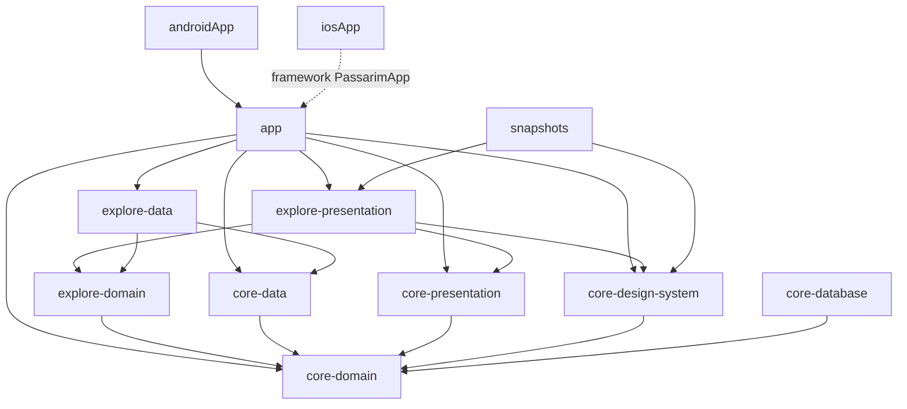

# Passarim — Etapa 5b: Explorar — Plano de Implementação

> **For agentic workers:** REQUIRED SUB-SKILL: Use superpowers:subagent-driven-development (recommended) or superpowers:executing-plans to implement this plan task-by-task. Steps use checkbox (`- [ ]`) syntax for tracking.

**Goal:** A aba **Explorar** do app: grade de aves em 2 colunas (1 com fonte grande), busca por nome com debounce, filtros de bioma e estado num sheet, paginação infinita por cursor, favoritar no card e os estados de carregamento, vazio e erro, tudo contra o BFF local, em Android e iOS.

**Architecture:** Três módulos novos de feature (`feature:explore:domain`, `:data`, `:presentation`) sobre a fundação da 5a. O domínio compartilhado ganha `SpeciesSummary` e `FavoritesRepository`; o `core:presentation` ganha `ScreenError`; o design system ganha os componentes genéricos dos mockups. A tela segue o MVI da 5a (`ExploreRoot` com Koin + `ExploreScreen` stateless) e o `app` liga tudo: aba, detalhe provisório, favoritos em memória e o Coil com um `HttpClient` só para mídia.

**Tech Stack:** o da 5a (Gradle 9.8.1 · AGP 9.4.1 · Kotlin 2.4.21 · Compose Multiplatform 1.12.1 · Ktor 3.6.0 · Koin 4.2.2 · Paparazzi 2.0.0-alpha05 · JDK 21) **+ Coil 3.6.3** (`coil-compose`, `coil-network-ktor3`) e `lifecycle-viewmodel-savedstate` 2.11.0.

**Spec:** `docs/superpowers/specs/2026-10-08-passarim-app-explorar-design.md` (a fonte única; `§N` abaixo refere-se a ela). Base: o plano da 5a (`docs/superpowers/plans/2026-10-10-passarim-app-5a-fundacao.md`) e o contrato `passarim-bff/openapi.yaml` (`GET /v1/species`, `GET /v1/filters`).

## Estado atual e como executar este plano

Como na 5a, um esqueleto **já validado** existe: a branch local `feat/5b-explorar` do `~/dev/passarim/passarim-app` (8 commits sobre `main` em `b014229`, **não publicada**). O código embutido abaixo é, arquivo por arquivo, o desses commits: cada tarefa corresponde a um commit, e o conteúdo de cada arquivo é o do fim daquela tarefa (o plano foi gerado lendo os commits, e a reconstrução a partir do plano foi comparada com a branch). Duas formas de executar, a escolher pelo dono:

- **(a) Reconstruir** numa branch nova a partir da `main`, tarefa por tarefa, e no fim comparar com `feat/5b-explorar` (`git diff feat/5b-explorar --stat` deve listar só PNGs, se algum renderizar diferente). Prova que o plano é reproduzível.
- **(b) Adotar** a branch `feat/5b-explorar` e executar só as verificações de cada tarefa e a Task 9 (inclusive a publicação, que exige confirmação).

Todos os comandos rodam em `~/dev/passarim/passarim-app` (chamado `APP`), salvo indicação, com `export JAVA_HOME="$(/usr/libexec/java_home -v 21)"`. Arquivos marcados "substitui o arquivo inteiro" já existem e devem ser sobrescritos com o conteúdo mostrado.

## Global Constraints

- Tudo da 5a continua valendo (JDK 21, `compileSdk` 37, versões só no catálogo, plugins só por convention plugin, `kotlin.test` + Turbine + AssertK em `commonTest` nas duas plataformas, nome de teste sem vírgula, comentários em português para estudante e identificadores em inglês, strings de interface em `composeResources`).
- Commits `<tipo>: mensagem` em português, **um por tarefa**, `git add` com caminhos explícitos, autor `velosobr <linoc.veloso@gmail.com>` (conferir `git config user.email` antes do primeiro commit).
- Dependências: `presentation → domain ← data`; features não dependem entre si; só o `app` conecta; **o `FiltersSheet` é da feature**, não do design system (§5).
- `GET /v1/species`: `limit` fixo em **20**; `q`, `biome`, `state` e `cursor` vazios ou nulos ficam **fora** da URL; `q` limpo por `sanitizeQuery` (sem caracteres de controle, aparado, ≤ 100). Nunca expor DTO ao domínio; o `MediaUrlRewriter` é aplicado no mapper (§3).
- Debounce de **400 ms** na busca; próxima página a **6** itens do fim; um único `Job` de carregamento por vez; ids repetidos descartados (§4).
- Erros (§4): `NoConnection`/`Timeout` → "Sem conexão" + "Tentar novamente" + "Ver favoritos"; `ServiceUnavailable`/`Internal` → "Serviço indisponível"; `RateLimited(n)` → "Tentar novamente" só depois de `n` s; o resto → mensagem genérica. Erro na página seguinte é uma linha no fim da grade, sem perder os itens.
- Filtros: seleção única por grupo, contagens de `GET /v1/filters`, estados por contagem com "Ver todos os estados", aplicar só em "Mostrar aves", carregados uma vez por sessão (em memória, só o sucesso).
- Busca e filtros sobrevivem à morte do processo (`SavedStateHandle`); favoritos ficam **em memória** até a 5d.
- Layout: 2 colunas e **1 coluna com `fontScale` ≥ 1.5**; nomes quebram linha, nunca cortam; favorito com alvo de 48dp e `contentDescription` "Favoritar X"/"Desfavoritar X" (§5).
- Snapshots: cada tela/componente em claro e escuro × 1.0×/1.3×/2.0× (§6).
- Mídia por um `HttpClient` próprio (sem `defaultRequest`, timeouts maiores), usado pelo Coil (§3).

## Review Focus

Condições que a spec implica e que um usuário encontra antes de qualquer teste; cada uma tem a verificação na tarefa indicada:

1. **Digitar rápido e trocar o filtro enquanto uma página ainda carrega.** Esperado: só a resposta da busca atual aparece; uma resposta atrasada (primeira página ou página seguinte) nunca sobrescreve a lista. (Task 4: "uma busca nova cancela a anterior…" e "mudar o filtro com uma pagina seguinte em curso descarta essa pagina".)
2. **O BFF devolve um id que já está na grade** (cursor instável entre páginas). Esperado: o item aparece uma vez e a `LazyVerticalGrid` não cai por `key` repetida. (Task 4: "ids repetidos entre paginas sao descartados".)
3. **Texto colado com quebra de linha, tabulação ou mais de 100 caracteres.** Esperado: o campo aceita, mas o BFF recebe o texto limpo (nunca um 400 `INVALID_PARAMETER`). (Task 1: `SearchQueryTest`; Task 4: "caracteres de controle…" e "o campo guarda no maximo 100 caracteres".)
4. **Réplicas do BFF paradas.** O Traefik responde sem `problem+json` — um `404 text/plain` (visto na 5a) ou um `503` (visto na validação desta fatia). Esperado: "Serviço indisponível", nunca "não encontrada". (Classificação testada no `SafeCallTest` da 5a; verificação real na Task 9, Step 3.)
5. **Fonte do sistema em 2.0× e o app morto em segundo plano.** Esperado: a grade em 1 coluna sem texto cortado; ao voltar, a mesma busca e os mesmos filtros. (Task 6: `ExploreLayoutTest` e os snapshots 2.0×; Task 4: "busca e filtros sobrevivem a morte do processo"; Task 9, Step 2.)

## Diferenças em relação à spec (decididas na validação do esqueleto)

| Spec | Implementação | Por quê |
|---|---|---|
| `biome: BiomeCode?`, `state: StateCode?` (§3) | `String?` com os códigos do contrato | `BiomeFilter.code`/`StateFilter.code` da 5a já são `String`; um tipo novo não protegeria nada que o BFF não valide |
| `FiltersRepository` na feature (§3) | `Filters` e `FiltersRepository` continuam em `core:domain` (onde a 5a os pôs); só a implementação vai para `feature:explore:data` | Mover a interface obrigaria o `core:data` da 5a a depender da feature durante a transição; o domínio continua sem DTO |
| `filtersSheetOpen` (§4) | `sheet: FiltersSheetState?` (nulo = fechado) | O sheet precisa guardar as escolhas ainda não aplicadas; um só campo representa "aberto com estas escolhas" |
| `collectLatest` (§4) | um único `loadJob` cancelado a cada consulta nova | Mesmo efeito, e cobre também a página seguinte em curso (que o `collectLatest` não cancelaria) |
| Evento "mostrar mensagem pontual" (§4) | não existe | Nenhum caso na 5b precisa dele (o erro da página seguinte é uma linha na grade); entra quando houver uso |
| Mockups de carregamento e erro sem busca e chips | busca e chips sempre visíveis | Trocar o campo por um skeleton no meio da digitação interromperia o usuário |
| Texto do vazio "…para “arara” no Pampa" | "…para “arara”. Tente outro nome ou remova algum filtro." | A preposição muda por bioma ("no Cerrado", "na Caatinga"); o chip selecionado já mostra o bioma |
| — | `ScreenError` em `core:presentation` | A classificação dos erros em telas é a mesma no Detalhe (5c) |
| — | Coil no `core:design-system` | O `SpeciesCard` mostra a foto (`AsyncImage`); o `ImageLoader` com o cliente de mídia é configurado no `app` |

**Pendência encontrada fora do escopo:** a 2.0× o rótulo "Configurações" da barra inferior (5a) quebra no meio da palavra ("Configura/ções"). Não corta texto, mas fica feio; tratar na 5e (fechamento/acessibilidade).

---

### Task 0: Pré-requisitos e branch

Nada novo na máquina além do que a 5a pediu (JDK 21, SDK 37, Xcode, XcodeGen, Docker, osv-scanner).

- [ ] **Step 1: Partir da `main` atualizada**

```bash
git checkout main && git pull --ff-only
git log --oneline -1
git config user.email
git checkout -b feat/5b-explorar
```

Expected: `main` em `b014229` ou depois (com a 5a publicada e o CI verde); `linoc.veloso@gmail.com`. Na opção (a), use outro nome de branch (por exemplo `feat/5b-explorar-plano`) para comparar com o esqueleto no fim.

- [ ] **Step 2: Conferir a base**

```bash
export JAVA_HOME="$(/usr/libexec/java_home -v 21)" && ./gradlew allTests --console=plain 2>&1 | grep BUILD
```

Expected: `BUILD SUCCESSFUL` (a 5a verde antes de começar).

### Task 1: `feature:explore:domain` e os modelos compartilhados

**Files:**
- Create: `core/domain/src/commonMain/kotlin/com/velosobr/passarim/core/domain/FavoritesRepository.kt`, `core/domain/src/commonMain/kotlin/com/velosobr/passarim/core/domain/SpeciesSummary.kt`, `feature/explore/domain/build.gradle.kts`, `feature/explore/domain/src/commonMain/kotlin/com/velosobr/passarim/feature/explore/domain/ExploreRepository.kt`, `feature/explore/domain/src/commonMain/kotlin/com/velosobr/passarim/feature/explore/domain/SearchQuery.kt`
- Modify: `settings.gradle.kts`
- Test: `feature/explore/domain/src/commonTest/kotlin/com/velosobr/passarim/feature/explore/domain/SearchQueryTest.kt`

**Interfaces:**
- Consumes: `Result`, `DataError.Network` (5a, `core:domain`).
- Produces: `SpeciesSummary(id, commonName, scientificName, thumbnailUrl: String?)` e `FavoritesRepository` (`observeIds(): Flow<Set<String>>`, `suspend toggle(summary)`) em `core:domain`; em `feature:explore:domain`: `ExploreRepository.list(query, biome: String?, state: String?, cursor: String?, limit: Int = PAGE_SIZE): Result<SpeciesPage, DataError.Network>`, `SpeciesPage(items, nextCursor)`, `PAGE_SIZE = 20`, `MAX_QUERY_LENGTH = 100` e `sanitizeQuery(raw): String`.

O módulo novo é incluído no `settings.gradle.kts` só nesta tarefa: o Gradle 9 recusa incluir um diretório que ainda não existe, então cada módulo de feature entra na tarefa que o cria.

- [ ] **Step 1: Escrever os testes que falham** (e a configuração de build que eles exigem)

`feature/explore/domain/build.gradle.kts`

```kotlin
plugins {
    id("passarim.kmp-library")
}

kotlin {
    sourceSets {
        commonMain.dependencies {
            api(projects.core.domain)
        }
        commonTest.dependencies {
            implementation(libs.assertk)
        }
    }
}
```

`feature/explore/domain/src/commonTest/kotlin/com/velosobr/passarim/feature/explore/domain/SearchQueryTest.kt`

```kotlin
package com.velosobr.passarim.feature.explore.domain

import assertk.assertThat
import assertk.assertions.hasLength
import assertk.assertions.isEqualTo
import kotlin.test.Test

class SearchQueryTest {
    @Test
    fun `apara os espacos das pontas`() {
        assertThat(sanitizeQuery("  bem-te-vi  ")).isEqualTo("bem-te-vi")
    }

    @Test
    fun `caracteres de controle viram espaco`() {
        assertThat(sanitizeQuery("arara\nazul\t")).isEqualTo("arara azul")
    }

    @Test
    fun `limita a 100 caracteres`() {
        assertThat(sanitizeQuery("a".repeat(150))).hasLength(MAX_QUERY_LENGTH)
    }

    @Test
    fun `so espacos vira texto vazio`() {
        assertThat(sanitizeQuery(" \n ")).isEqualTo("")
    }

    @Test
    fun `acentos e hifens passam intactos`() {
        assertThat(sanitizeQuery("Sabiá-laranjeira")).isEqualTo("Sabiá-laranjeira")
    }
}
```

`settings.gradle.kts` — substitui o arquivo inteiro

```kotlin
pluginManagement {
    includeBuild("build-logic")
    repositories {
        google()
        mavenCentral()
        gradlePluginPortal()
    }
}

dependencyResolutionManagement {
    repositories {
        google()
        mavenCentral()
    }
}

rootProject.name = "passarim-app"

enableFeaturePreview("TYPESAFE_PROJECT_ACCESSORS")

include(":androidApp")
include(":app")
include(":core:domain")
include(":core:data")
include(":core:presentation")
include(":core:design-system")
include(":core:database")
include(":feature:explore:domain")
include(":snapshots")
```

- [ ] **Step 2: Rodar e ver falhar**

```bash
export JAVA_HOME="$(/usr/libexec/java_home -v 21)" && ./gradlew :feature:explore:domain:testAndroidHostTest --console=plain 2>&1 | grep -E "^e:|BUILD" | head -3
```

Expected: `BUILD FAILED` com `Unresolved reference 'sanitizeQuery'`.

- [ ] **Step 3: Implementar**

`core/domain/src/commonMain/kotlin/com/velosobr/passarim/core/domain/FavoritesRepository.kt`

```kotlin
package com.velosobr.passarim.core.domain

import kotlinx.coroutines.flow.Flow

/**
 * Favoritos do usuário, usados por Explorar, Detalhe e Favoritos. Na 5b o `app` registra uma
 * implementação em memória; a 5d a troca por uma com Room, sem mudar as features.
 */
interface FavoritesRepository {
    /** Ids favoritados; emite de novo a cada mudança. */
    fun observeIds(): Flow<Set<String>>

    /** Favorita a espécie se ela não for favorita; senão, desfavorita. */
    suspend fun toggle(summary: SpeciesSummary)
}
```

`core/domain/src/commonMain/kotlin/com/velosobr/passarim/core/domain/SpeciesSummary.kt`

```kotlin
package com.velosobr.passarim.core.domain

/**
 * Resumo de uma espécie, como aparece nos cards de Explorar e na lista de Favoritos.
 * [thumbnailUrl] é nulo quando a espécie ainda não tem foto (o card mostra o placeholder).
 */
data class SpeciesSummary(
    val id: String,
    val commonName: String,
    val scientificName: String,
    val thumbnailUrl: String?,
)
```

`feature/explore/domain/src/commonMain/kotlin/com/velosobr/passarim/feature/explore/domain/ExploreRepository.kt`

```kotlin
package com.velosobr.passarim.feature.explore.domain

import com.velosobr.passarim.core.domain.DataError
import com.velosobr.passarim.core.domain.Result
import com.velosobr.passarim.core.domain.SpeciesSummary

/** Tamanho fixo da página pedida ao BFF. */
const val PAGE_SIZE = 20

/** Uma página da lista. [nextCursor] nulo quer dizer que não há mais páginas. */
data class SpeciesPage(
    val items: List<SpeciesSummary>,
    val nextCursor: String?,
)

/** `GET /v1/species`: busca por nome e filtros de bioma e estado, paginada por cursor. */
interface ExploreRepository {
    suspend fun list(
        query: String,
        biome: String?,
        state: String?,
        cursor: String?,
        limit: Int = PAGE_SIZE,
    ): Result<SpeciesPage, DataError.Network>
}
```

`feature/explore/domain/src/commonMain/kotlin/com/velosobr/passarim/feature/explore/domain/SearchQuery.kt`

```kotlin
package com.velosobr.passarim.feature.explore.domain

/** O BFF recusa `q` com mais de 100 caracteres (400 INVALID_PARAMETER). */
const val MAX_QUERY_LENGTH = 100

/**
 * Limpa o texto digitado antes de virar o parâmetro `q`: caracteres de controle (um `\n` colado,
 * por exemplo) viram espaço, as pontas são aparadas e o resultado tem no máximo [MAX_QUERY_LENGTH].
 */
fun sanitizeQuery(raw: String): String =
    raw
        .map { if (it.isISOControl()) ' ' else it }
        .joinToString("")
        .trim()
        .take(MAX_QUERY_LENGTH)
        .trimEnd()
```

- [ ] **Step 4: Rodar e ver passar**

```bash
export JAVA_HOME="$(/usr/libexec/java_home -v 21)" && ./gradlew :feature:explore:domain:allTests :core:domain:allTests --console=plain 2>&1 | grep BUILD
scripts/test-summary.sh feature/explore/domain
```

Expected: `BUILD SUCCESSFUL`; `SearchQueryTest` com 5 testes em cada plataforma (`TOTAL: 10 testes, 0 falhas`).

- [ ] **Commit**

```bash
git add settings.gradle.kts core/domain feature/explore/domain
git commit -m "feat: domínio de Explorar (SpeciesSummary, favoritos, lista paginada e busca limpa)"
```

### Task 2: `feature:explore:data` — `GET /v1/species` e filtros em memória

**Files:**
- Create: `feature/explore/data/build.gradle.kts`, `feature/explore/data/src/commonMain/kotlin/com/velosobr/passarim/feature/explore/data/ExploreDataModule.kt`, `feature/explore/data/src/commonMain/kotlin/com/velosobr/passarim/feature/explore/data/RemoteExploreRepository.kt`
- Modify: `app/build.gradle.kts`, `app/src/commonMain/kotlin/com/velosobr/passarim/app/di/AppModule.kt`, `core/data/src/commonMain/kotlin/com/velosobr/passarim/core/data/CoreDataModule.kt`, `settings.gradle.kts`
- Move: `core/data/src/commonMain/kotlin/com/velosobr/passarim/core/data/RemoteFiltersRepository.kt → feature/explore/data/src/commonMain/kotlin/com/velosobr/passarim/feature/explore/data/RemoteFiltersRepository.kt`, `core/data/src/commonTest/kotlin/com/velosobr/passarim/core/data/RemoteFiltersRepositoryTest.kt → feature/explore/data/src/commonTest/kotlin/com/velosobr/passarim/feature/explore/data/RemoteFiltersRepositoryTest.kt`
- Test: `feature/explore/data/src/commonTest/kotlin/com/velosobr/passarim/feature/explore/data/RemoteExploreRepositoryTest.kt`

**Interfaces:**
- Consumes: `ExploreRepository`, `SpeciesPage`, `PAGE_SIZE` (Task 1); `safeCall`, `createHttpClient`, `MediaUrlRewriter` (5a, `core:data`); `Filters`, `FiltersRepository` (5a, `core:domain`).
- Produces: `RemoteExploreRepository(client, rewriter)` (parâmetros vazios/nulos ficam fora da URL; `MediaUrlRewriter` aplicado ao `thumbnailUrl`); `RemoteFiltersRepository(client)` **movido** do `core:data`, agora guardando o primeiro sucesso em memória; `exploreDataModule` (Koin) com os dois. O `coreDataModule` deixa de registrar o `FiltersRepository`, e o `initKoin` do `app` passa a carregar o `exploreDataModule` (a tela de depuração da 5a continua funcionando até a Task 7).

O `RemoteFiltersRepository` e o seu teste saem do `core:data` (`core:data` fica só com rede genérica) e passam para a feature com `git mv`, para o histórico acompanhar o arquivo.

- [ ] **Step 1: Escrever os testes que falham** (e a configuração de build que eles exigem)

Primeiro, mover os arquivos que mudam de módulo:

```bash
mkdir -p feature/explore/data/src/commonMain/kotlin/com/velosobr/passarim/feature/explore/data feature/explore/data/src/commonTest/kotlin/com/velosobr/passarim/feature/explore/data
git mv core/data/src/commonMain/kotlin/com/velosobr/passarim/core/data/RemoteFiltersRepository.kt \
  feature/explore/data/src/commonMain/kotlin/com/velosobr/passarim/feature/explore/data/RemoteFiltersRepository.kt
git mv core/data/src/commonTest/kotlin/com/velosobr/passarim/core/data/RemoteFiltersRepositoryTest.kt \
  feature/explore/data/src/commonTest/kotlin/com/velosobr/passarim/feature/explore/data/RemoteFiltersRepositoryTest.kt
```

`app/build.gradle.kts` — substitui o arquivo inteiro

```kotlin
plugins {
    id("passarim.kmp-compose")
    id("passarim.serialization")
    id("passarim.ios-framework")
}

kotlin {
    sourceSets {
        commonMain.dependencies {
            implementation(projects.core.domain)
            implementation(projects.core.data)
            implementation(projects.core.presentation)
            implementation(projects.core.designSystem)
            implementation(projects.feature.explore.data)
            implementation(libs.compose.resources)
            implementation(libs.navigation.compose)
            implementation(libs.koin.core)
            implementation(libs.koin.compose)
            implementation(libs.koin.compose.viewmodel)
            implementation(libs.kotlinx.serialization.json)
        }
        commonTest.dependencies {
            implementation(libs.assertk)
            implementation(libs.turbine)
            implementation(libs.kotlinx.coroutines.test)
        }
    }
}
```

`feature/explore/data/build.gradle.kts`

```kotlin
plugins {
    id("passarim.kmp-library")
    id("passarim.serialization")
}

kotlin {
    sourceSets {
        commonMain.dependencies {
            api(projects.feature.explore.domain)
            implementation(projects.core.data)
            implementation(libs.ktor.client.core)
            implementation(libs.kotlinx.serialization.json)
            implementation(libs.koin.core)
        }
        commonTest.dependencies {
            implementation(libs.ktor.client.mock)
            implementation(libs.kotlinx.coroutines.test)
            implementation(libs.assertk)
        }
    }
}
```

`feature/explore/data/src/commonTest/kotlin/com/velosobr/passarim/feature/explore/data/RemoteExploreRepositoryTest.kt`

```kotlin
package com.velosobr.passarim.feature.explore.data

import assertk.assertThat
import assertk.assertions.isEqualTo
import assertk.assertions.isNull
import com.velosobr.passarim.core.data.MediaUrlRewriter
import com.velosobr.passarim.core.data.createHttpClient
import com.velosobr.passarim.core.domain.AppConfig
import com.velosobr.passarim.core.domain.DataError
import com.velosobr.passarim.core.domain.Result
import com.velosobr.passarim.core.domain.SpeciesSummary
import com.velosobr.passarim.feature.explore.domain.SpeciesPage
import io.ktor.client.engine.mock.MockEngine
import io.ktor.client.engine.mock.respond
import io.ktor.http.HttpHeaders
import io.ktor.http.HttpStatusCode
import io.ktor.http.Url
import io.ktor.http.headersOf
import kotlinx.coroutines.test.runTest
import kotlin.test.Test

class RemoteExploreRepositoryTest {
    private val page =
        """
        {"items":[
          {"id":"bem-te-vi","commonName":"Bem-te-vi","scientificName":"Pitangus sulphuratus",
           "thumbnailUrl":"http://localhost:8888/buckets/passarim-media/bem-te-vi/thumb.jpg","conservationStatus":"LC"},
          {"id":"ararinha-azul","commonName":"Ararinha-azul","scientificName":"Cyanopsitta spixii",
           "thumbnailUrl":null,"conservationStatus":"EW"}
        ],"nextCursor":"c2"}
        """.trimIndent()

    private fun repo(
        mediaHostOverride: String? = null,
        onRequest: (Url) -> Unit = {},
    ): RemoteExploreRepository {
        val config = AppConfig(isDebug = false, baseUrl = "http://localhost:8080", mediaHostOverride = mediaHostOverride)
        val engine =
            MockEngine { request ->
                onRequest(request.url)
                respond(page, HttpStatusCode.OK, headersOf(HttpHeaders.ContentType, "application/json"))
            }
        return RemoteExploreRepository(createHttpClient(engine, config), MediaUrlRewriter(config))
    }

    @Test
    fun `manda busca filtros cursor e limite como query`() =
        runTest {
            var url: Url? = null
            repo { url = it }.list(query = "azul", biome = "cerrado", state = "SP", cursor = "c1")

            val params = url!!.parameters
            assertThat(url!!.encodedPath).isEqualTo("/v1/species")
            assertThat(params["q"]).isEqualTo("azul")
            assertThat(params["biome"]).isEqualTo("cerrado")
            assertThat(params["state"]).isEqualTo("SP")
            assertThat(params["cursor"]).isEqualTo("c1")
            assertThat(params["limit"]).isEqualTo("20")
        }

    @Test
    fun `busca vazia e filtros nulos nao vao na URL`() =
        runTest {
            var url: Url? = null
            repo { url = it }.list(query = "", biome = null, state = null, cursor = null)
            assertThat(url.toString()).isEqualTo("http://localhost:8080/v1/species?limit=20")
        }

    @Test
    fun `mapeia a pagina com thumbnail nulo e o proximo cursor`() =
        runTest {
            val result = repo().list(query = "", biome = null, state = null, cursor = null)
            assertThat(result).isEqualTo(
                Result.Success(
                    SpeciesPage(
                        items =
                            listOf(
                                SpeciesSummary(
                                    "bem-te-vi",
                                    "Bem-te-vi",
                                    "Pitangus sulphuratus",
                                    "http://localhost:8888/buckets/passarim-media/bem-te-vi/thumb.jpg",
                                ),
                                SpeciesSummary("ararinha-azul", "Ararinha-azul", "Cyanopsitta spixii", null),
                            ),
                        nextCursor = "c2",
                    ),
                ),
            )
        }

    @Test
    fun `o MediaUrlRewriter e aplicado ao thumbnail`() =
        runTest {
            val result = repo(mediaHostOverride = "10.0.2.2").list(query = "", biome = null, state = null, cursor = null)
            val items = (result as Result.Success).data.items
            assertThat(items[0].thumbnailUrl).isEqualTo("http://10.0.2.2:8888/buckets/passarim-media/bem-te-vi/thumb.jpg")
            assertThat(items[1].thumbnailUrl).isNull()
        }

    @Test
    fun `propaga o erro do safeCall`() =
        runTest {
            val config = AppConfig(isDebug = false, baseUrl = "http://localhost:8080", mediaHostOverride = null)
            val engine =
                MockEngine { respond("404 page not found", HttpStatusCode.NotFound, headersOf(HttpHeaders.ContentType, "text/plain")) }
            val result = RemoteExploreRepository(createHttpClient(engine, config), MediaUrlRewriter(config)).list("", null, null, null)
            assertThat(result).isEqualTo(Result.Failure(DataError.Network.ServiceUnavailable))
        }
}
```

`feature/explore/data/src/commonTest/kotlin/com/velosobr/passarim/feature/explore/data/RemoteFiltersRepositoryTest.kt`

```kotlin
package com.velosobr.passarim.feature.explore.data

import assertk.assertThat
import assertk.assertions.isEqualTo
import com.velosobr.passarim.core.data.createHttpClient
import com.velosobr.passarim.core.domain.AppConfig
import com.velosobr.passarim.core.domain.BiomeFilter
import com.velosobr.passarim.core.domain.DataError
import com.velosobr.passarim.core.domain.Filters
import com.velosobr.passarim.core.domain.Result
import com.velosobr.passarim.core.domain.StateFilter
import io.ktor.client.engine.mock.MockEngine
import io.ktor.client.engine.mock.MockRequestHandleScope
import io.ktor.client.engine.mock.respond
import io.ktor.http.HttpHeaders
import io.ktor.http.HttpMethod
import io.ktor.http.HttpStatusCode
import io.ktor.http.headersOf
import kotlinx.coroutines.test.runTest
import kotlin.test.Test

class RemoteFiltersRepositoryTest {
    private val config = AppConfig(isDebug = false, baseUrl = "http://localhost:8080", mediaHostOverride = null)

    private val body =
        """
        {"biomes":[{"code":"cerrado","label":"Cerrado","speciesCount":26}],
         "states":[{"code":"SP","speciesCount":29}]}
        """.trimIndent()

    private fun MockRequestHandleScope.ok() = respond(body, HttpStatusCode.OK, headersOf(HttpHeaders.ContentType, "application/json"))

    private fun MockRequestHandleScope.down() =
        respond("", HttpStatusCode.ServiceUnavailable, headersOf(HttpHeaders.ContentType, "text/plain"))

    private val expected = Filters(listOf(BiomeFilter("cerrado", "Cerrado", 26)), listOf(StateFilter("SP", 29)))

    @Test
    fun `busca GET v1 filters na base configurada e mapeia para o dominio`() =
        runTest {
            var seenUrl = ""
            var seenMethod: HttpMethod? = null
            val engine =
                MockEngine { request ->
                    seenUrl = request.url.toString()
                    seenMethod = request.method
                    ok()
                }
            val result = RemoteFiltersRepository(createHttpClient(engine, config)).get()

            assertThat(seenUrl).isEqualTo("http://localhost:8080/v1/filters")
            assertThat(seenMethod).isEqualTo(HttpMethod.Get)
            assertThat(result).isEqualTo(Result.Success(expected))
        }

    @Test
    fun `propaga o erro de servidor`() =
        runTest {
            val result = RemoteFiltersRepository(createHttpClient(MockEngine { down() }, config)).get()
            assertThat(result).isEqualTo(Result.Failure(DataError.Network.ServiceUnavailable))
        }

    @Test
    fun `o sucesso fica em memoria e a segunda chamada nao vai a rede`() =
        runTest {
            var calls = 0
            val repo =
                RemoteFiltersRepository(
                    createHttpClient(
                        MockEngine {
                            calls++
                            ok()
                        },
                        config,
                    ),
                )

            repo.get()
            val second = repo.get()

            assertThat(calls).isEqualTo(1)
            assertThat(second).isEqualTo(Result.Success(expected))
        }

    @Test
    fun `a falha nao fica em memoria e a proxima chamada tenta de novo`() =
        runTest {
            var calls = 0
            val repo = RemoteFiltersRepository(createHttpClient(MockEngine { if (calls++ == 0) down() else ok() }, config))

            repo.get()
            val second = repo.get()

            assertThat(calls).isEqualTo(2)
            assertThat(second).isEqualTo(Result.Success(expected))
        }
}
```

`settings.gradle.kts` — substitui o arquivo inteiro

```kotlin
pluginManagement {
    includeBuild("build-logic")
    repositories {
        google()
        mavenCentral()
        gradlePluginPortal()
    }
}

dependencyResolutionManagement {
    repositories {
        google()
        mavenCentral()
    }
}

rootProject.name = "passarim-app"

enableFeaturePreview("TYPESAFE_PROJECT_ACCESSORS")

include(":androidApp")
include(":app")
include(":core:domain")
include(":core:data")
include(":core:presentation")
include(":core:design-system")
include(":core:database")
include(":feature:explore:domain")
include(":feature:explore:data")
include(":snapshots")
```

- [ ] **Step 2: Rodar e ver falhar**

```bash
export JAVA_HOME="$(/usr/libexec/java_home -v 21)" && ./gradlew :feature:explore:data:testAndroidHostTest --console=plain 2>&1 | grep -E "^e:|BUILD" | head -3
```

Expected: `BUILD FAILED` já no `core:data`: `CoreDataModule.kt` com `Unresolved reference 'RemoteFiltersRepository'` (a classe saiu do módulo). Depois do Step 3, o teste novo falharia com `Unresolved reference 'RemoteExploreRepository'`.

- [ ] **Step 3: Implementar**

`app/src/commonMain/kotlin/com/velosobr/passarim/app/di/AppModule.kt` — substitui o arquivo inteiro

```kotlin
package com.velosobr.passarim.app.di

import com.velosobr.passarim.app.debug.DebugViewModel
import com.velosobr.passarim.core.data.coreDataModule
import com.velosobr.passarim.core.domain.AppConfig
import com.velosobr.passarim.feature.explore.data.exploreDataModule
import org.koin.core.KoinApplication
import org.koin.core.context.startKoin
import org.koin.core.module.dsl.viewModelOf
import org.koin.dsl.module

private val debugModule =
    module {
        viewModelOf(::DebugViewModel)
    }

/**
 * Inicia o Koin. No Android é chamado pelo `Application`; no iOS, por `MainViewController`.
 * [platform] permite à plataforma acrescentar o que é só dela (`androidContext`, por exemplo).
 */
fun initKoin(
    config: AppConfig,
    platform: KoinApplication.() -> Unit = {},
) {
    startKoin {
        platform()
        modules(module { single { config } }, coreDataModule, exploreDataModule, debugModule)
    }
}
```

`core/data/src/commonMain/kotlin/com/velosobr/passarim/core/data/CoreDataModule.kt` — substitui o arquivo inteiro

```kotlin
package com.velosobr.passarim.core.data

import org.koin.dsl.module

/** Módulo Koin da camada de rede. O `AppConfig` vem do módulo do `app`. */
val coreDataModule =
    module {
        single { createHttpClient(platformHttpEngine(), get()) }
        single { MediaUrlRewriter(get()) }
    }
```

`feature/explore/data/src/commonMain/kotlin/com/velosobr/passarim/feature/explore/data/ExploreDataModule.kt`

```kotlin
package com.velosobr.passarim.feature.explore.data

import com.velosobr.passarim.core.domain.FiltersRepository
import com.velosobr.passarim.feature.explore.domain.ExploreRepository
import org.koin.dsl.module

/** Repositórios de Explorar. O `HttpClient` e o `MediaUrlRewriter` vêm do `coreDataModule`. */
val exploreDataModule =
    module {
        single<ExploreRepository> { RemoteExploreRepository(get(), get()) }
        single<FiltersRepository> { RemoteFiltersRepository(get()) }
    }
```

`feature/explore/data/src/commonMain/kotlin/com/velosobr/passarim/feature/explore/data/RemoteExploreRepository.kt`

```kotlin
package com.velosobr.passarim.feature.explore.data

import com.velosobr.passarim.core.data.MediaUrlRewriter
import com.velosobr.passarim.core.data.safeCall
import com.velosobr.passarim.core.domain.DataError
import com.velosobr.passarim.core.domain.Result
import com.velosobr.passarim.core.domain.SpeciesSummary
import com.velosobr.passarim.core.domain.map
import com.velosobr.passarim.feature.explore.domain.ExploreRepository
import com.velosobr.passarim.feature.explore.domain.SpeciesPage
import io.ktor.client.HttpClient
import io.ktor.client.request.get
import io.ktor.client.request.parameter
import kotlinx.serialization.Serializable

/** O contrato também traz `conservationStatus`; os cards não o mostram, então o DTO o ignora. */
@Serializable
internal data class SpeciesSummaryDto(
    val id: String,
    val commonName: String,
    val scientificName: String,
    val thumbnailUrl: String? = null,
)

@Serializable
internal data class SpeciesPageDto(
    val items: List<SpeciesSummaryDto>,
    val nextCursor: String? = null,
)

internal fun SpeciesPageDto.toDomain(rewriter: MediaUrlRewriter) =
    SpeciesPage(
        items = items.map { SpeciesSummary(it.id, it.commonName, it.scientificName, rewriter.rewrite(it.thumbnailUrl)) },
        nextCursor = nextCursor,
    )

/** `GET /v1/species`. Parâmetros vazios ou nulos ficam fora da URL (o BFF recusa `biome=` vazio). */
class RemoteExploreRepository(
    private val client: HttpClient,
    private val rewriter: MediaUrlRewriter,
) : ExploreRepository {
    override suspend fun list(
        query: String,
        biome: String?,
        state: String?,
        cursor: String?,
        limit: Int,
    ): Result<SpeciesPage, DataError.Network> =
        safeCall<SpeciesPageDto> {
            client.get("/v1/species") {
                if (query.isNotBlank()) parameter("q", query)
                parameter("biome", biome)
                parameter("state", state)
                parameter("cursor", cursor)
                parameter("limit", limit)
            }
        }.map { it.toDomain(rewriter) }
}
```

`feature/explore/data/src/commonMain/kotlin/com/velosobr/passarim/feature/explore/data/RemoteFiltersRepository.kt` — substitui o arquivo inteiro

```kotlin
package com.velosobr.passarim.feature.explore.data

import com.velosobr.passarim.core.data.safeCall
import com.velosobr.passarim.core.domain.BiomeFilter
import com.velosobr.passarim.core.domain.DataError
import com.velosobr.passarim.core.domain.Filters
import com.velosobr.passarim.core.domain.FiltersRepository
import com.velosobr.passarim.core.domain.Result
import com.velosobr.passarim.core.domain.StateFilter
import com.velosobr.passarim.core.domain.map
import com.velosobr.passarim.core.domain.onSuccess
import io.ktor.client.HttpClient
import io.ktor.client.request.get
import kotlinx.coroutines.sync.Mutex
import kotlinx.coroutines.sync.withLock
import kotlinx.serialization.Serializable

@Serializable
internal data class FiltersDto(
    val biomes: List<BiomeDto>,
    val states: List<StateDto>,
)

@Serializable
internal data class BiomeDto(
    val code: String,
    val label: String,
    val speciesCount: Int,
)

@Serializable
internal data class StateDto(
    val code: String,
    val speciesCount: Int,
)

internal fun FiltersDto.toDomain() =
    Filters(
        biomes = biomes.map { BiomeFilter(it.code, it.label, it.speciesCount) },
        states = states.map { StateFilter(it.code, it.speciesCount) },
    )

/**
 * `GET /v1/filters`: biomas e estados com a contagem de espécies. As contagens mudam pouco, então o
 * primeiro sucesso fica em memória até o processo morrer; uma falha não fica, e a próxima chamada tenta de novo.
 */
class RemoteFiltersRepository(
    private val client: HttpClient,
) : FiltersRepository {
    private val mutex = Mutex()
    private var cached: Filters? = null

    override suspend fun get(): Result<Filters, DataError.Network> =
        mutex.withLock {
            cached?.let { return@withLock Result.Success(it) }
            safeCall<FiltersDto> { client.get("/v1/filters") }
                .map { it.toDomain() }
                .onSuccess { cached = it }
        }
}
```

- [ ] **Step 4: Rodar e ver passar**

```bash
export JAVA_HOME="$(/usr/libexec/java_home -v 21)" && ./gradlew :feature:explore:data:allTests :core:data:allTests :app:allTests :androidApp:assembleDebug --console=plain 2>&1 | grep BUILD
scripts/test-summary.sh feature/explore/data
```

Expected: `BUILD SUCCESSFUL`; `RemoteExploreRepositoryTest` 5 e `RemoteFiltersRepositoryTest` 4 em cada plataforma (`TOTAL: 18 testes, 0 falhas`).

- [ ] **Commit**

```bash
git add settings.gradle.kts app core/data feature/explore/data
git commit -m "feat: repositórios de Explorar (GET /v1/species e filtros em memória por sessão)"
```

### Task 3: `ScreenError` em `core:presentation`

**Files:**
- Create: `core/presentation/src/commonMain/kotlin/com/velosobr/passarim/core/presentation/ScreenError.kt`
- Test: `core/presentation/src/commonTest/kotlin/com/velosobr/passarim/core/presentation/ScreenErrorTest.kt`

**Interfaces:**
- Consumes: `DataError.Network` (5a).
- Produces: `sealed interface ScreenError { NoConnection; ServiceUnavailable; RateLimited(retryAfterSeconds: Int?); Generic }` e `DataError.Network.toScreenError()`. Explorar (e, na 5c, o Detalhe) escolhem o texto de cada tela; a classificação é uma só: `NoConnection`/`Timeout` → `NoConnection`; `ServiceUnavailable`/`Internal` → `ServiceUnavailable`; `RateLimited` → `RateLimited`; `InvalidParameter`/`NotFound`/`Unknown` → `Generic`.

- [ ] **Step 1: Escrever os testes que falham** (e a configuração de build que eles exigem)

`core/presentation/src/commonTest/kotlin/com/velosobr/passarim/core/presentation/ScreenErrorTest.kt`

```kotlin
package com.velosobr.passarim.core.presentation

import assertk.assertThat
import assertk.assertions.isEqualTo
import com.velosobr.passarim.core.domain.DataError
import kotlin.test.Test

class ScreenErrorTest {
    @Test
    fun `sem rede e timeout viram NoConnection`() {
        assertThat(DataError.Network.NoConnection.toScreenError()).isEqualTo(ScreenError.NoConnection)
        assertThat(DataError.Network.Timeout.toScreenError()).isEqualTo(ScreenError.NoConnection)
    }

    @Test
    fun `servidor fora e erro interno viram ServiceUnavailable`() {
        assertThat(DataError.Network.ServiceUnavailable.toScreenError()).isEqualTo(ScreenError.ServiceUnavailable)
        assertThat(DataError.Network.Internal.toScreenError()).isEqualTo(ScreenError.ServiceUnavailable)
    }

    @Test
    fun `limite de requisicoes carrega o Retry-After`() {
        assertThat(DataError.Network.RateLimited(30).toScreenError()).isEqualTo(ScreenError.RateLimited(30))
        assertThat(DataError.Network.RateLimited(null).toScreenError()).isEqualTo(ScreenError.RateLimited(null))
    }

    @Test
    fun `parametro invalido nao encontrado e desconhecido viram Generic`() {
        listOf(DataError.Network.InvalidParameter, DataError.Network.NotFound, DataError.Network.Unknown).forEach {
            assertThat(it.toScreenError()).isEqualTo(ScreenError.Generic)
        }
    }
}
```

- [ ] **Step 2: Rodar e ver falhar**

```bash
export JAVA_HOME="$(/usr/libexec/java_home -v 21)" && ./gradlew :core:presentation:testAndroidHostTest --console=plain 2>&1 | grep -E "^e:|BUILD" | head -3
```

Expected: `BUILD FAILED` com `Unresolved reference 'toScreenError'`.

- [ ] **Step 3: Implementar**

`core/presentation/src/commonMain/kotlin/com/velosobr/passarim/core/presentation/ScreenError.kt`

```kotlin
package com.velosobr.passarim.core.presentation

import com.velosobr.passarim.core.domain.DataError

/**
 * Qual tela de erro mostrar quando o conteúdo principal não carregou. Cada feature escolhe o texto
 * (o que "não carregou" muda de tela para tela); a classificação é a mesma em todas.
 */
sealed interface ScreenError {
    /** "Sem conexão", com "Tentar novamente" (e um atalho para os favoritos, que funcionam offline). */
    data object NoConnection : ScreenError

    /** "Serviço indisponível": o BFF está fora ou falhou. */
    data object ServiceUnavailable : ScreenError

    /** Muitas requisições: "Tentar novamente" só volta a valer depois de [retryAfterSeconds]. */
    data class RateLimited(
        val retryAfterSeconds: Int?,
    ) : ScreenError

    /** Erros que a UI não deveria provocar (parâmetro inválido, por exemplo): mensagem genérica. */
    data object Generic : ScreenError
}

fun DataError.Network.toScreenError(): ScreenError =
    when (this) {
        DataError.Network.NoConnection, DataError.Network.Timeout -> ScreenError.NoConnection
        DataError.Network.ServiceUnavailable, DataError.Network.Internal -> ScreenError.ServiceUnavailable
        is DataError.Network.RateLimited -> ScreenError.RateLimited(retryAfterSeconds)
        DataError.Network.InvalidParameter, DataError.Network.NotFound, DataError.Network.Unknown -> ScreenError.Generic
    }
```

- [ ] **Step 4: Rodar e ver passar**

```bash
export JAVA_HOME="$(/usr/libexec/java_home -v 21)" && ./gradlew :core:presentation:allTests --console=plain 2>&1 | grep BUILD
scripts/test-summary.sh core/presentation
```

Expected: `BUILD SUCCESSFUL`; `ScreenErrorTest` com 4 testes em cada plataforma (`core:presentation`: 10 por plataforma, `TOTAL: 20 testes, 0 falhas`).

- [ ] **Commit**

```bash
git add core/presentation
git commit -m "feat: ScreenError, a classificação dos erros de rede em telas de erro"
```

### Task 4: `ExploreViewModel` — busca, filtros, paginação, erros e favoritos

**Files:**
- Create: `feature/explore/presentation/build.gradle.kts`, `feature/explore/presentation/src/commonMain/kotlin/com/velosobr/passarim/feature/explore/presentation/ExploreAction.kt`, `feature/explore/presentation/src/commonMain/kotlin/com/velosobr/passarim/feature/explore/presentation/ExploreState.kt`, `feature/explore/presentation/src/commonMain/kotlin/com/velosobr/passarim/feature/explore/presentation/ExploreViewModel.kt`
- Modify: `gradle/libs.versions.toml`, `settings.gradle.kts`
- Test: `feature/explore/presentation/src/commonTest/kotlin/com/velosobr/passarim/feature/explore/presentation/ExploreFakes.kt`, `feature/explore/presentation/src/commonTest/kotlin/com/velosobr/passarim/feature/explore/presentation/ExploreViewModelTest.kt`

**Interfaces:**
- Consumes: `ExploreRepository`, `SpeciesPage`, `MAX_QUERY_LENGTH`, `sanitizeQuery` (Task 1); `FiltersRepository`, `Filters`, `FavoritesRepository`, `SpeciesSummary` (`core:domain`); `ScreenError`, `toScreenError` (Task 3).
- Produces: `ExploreViewModel(explore, filtersRepository, favorites, savedState: SavedStateHandle)` com `state: StateFlow<ExploreState>`, `events: Flow<ExploreEvent>` e `onAction(ExploreAction)`; `ExploreState` (`query`, `biome`, `state`, `items`, `nextCursor`, `phase: ExplorePhase`, `isLoadingMore`, `loadMoreError: ScreenError?`, `retryEnabled`, `filters: FiltersPhase`, `sheet: FiltersSheetState?`, `favoriteIds`, e os derivados `biomeLabel`/`hasFilters`); `ExplorePhase` (`Loading`, `Content`, `Empty`, `Error(error)`); `FiltersPhase` (`Loading`, `Loaded(filters)`, `Error`); `FiltersSheetState(biome, state, showAllStates)`; as 19 `ExploreAction`; `ExploreEvent.NavigateToDetail(id)`/`NavigateToFavorites`; as funções puras `shouldLoadMore(lastVisibleIndex, itemCount)` e `visibleStates(states, showAll)`; as constantes `SEARCH_DEBOUNCE_MILLIS = 400`, `PREFETCH_DISTANCE = 6`, `VISIBLE_STATES = 12` e as chaves `KEY_QUERY`/`KEY_BIOME`/`KEY_STATE` do `SavedStateHandle`.

Regras que os testes fixam (spec §4): debounce de 400 ms só para o texto (a primeira carga não espera); **um único `loadJob`** por vez — uma busca nova cancela a anterior e a página seguinte em curso, então uma resposta antiga nunca sobrescreve a atual; a próxima página só é pedida com a grade na tela, sem requisição em curso e sem erro pendente (o erro espera o botão da linha); ids repetidos são descartados ao juntar páginas; `RateLimited(n)` desabilita "Tentar novamente" por `n` segundos; as escolhas do sheet só valem em "Mostrar aves".

O Main de teste é um `UnconfinedTestDispatcher`: o `runTest` usa o mesmo relógio virtual, então `advanceTimeBy` controla o debounce e o `Retry-After`. Os repositórios falsos ficam em `ExploreFakes.kt`; `gates` seguram uma resposta (pelo índice da chamada) para observar estados intermediários e corridas.

- [ ] **Step 1: Escrever os testes que falham** (e a configuração de build que eles exigem)

`feature/explore/presentation/build.gradle.kts`

```kotlin
plugins {
    id("passarim.kmp-compose")
}

kotlin {
    sourceSets {
        commonMain.dependencies {
            api(projects.feature.explore.domain)
            implementation(projects.core.presentation)
            implementation(projects.core.designSystem)
            implementation(libs.compose.resources)
            implementation(libs.lifecycle.viewmodel.savedstate)
            implementation(libs.koin.core)
            implementation(libs.koin.compose.viewmodel)
        }
        commonTest.dependencies {
            implementation(libs.assertk)
            implementation(libs.turbine)
            implementation(libs.kotlinx.coroutines.test)
        }
    }
}
```

`feature/explore/presentation/src/commonTest/kotlin/com/velosobr/passarim/feature/explore/presentation/ExploreFakes.kt`

```kotlin
package com.velosobr.passarim.feature.explore.presentation

import com.velosobr.passarim.core.domain.BiomeFilter
import com.velosobr.passarim.core.domain.DataError
import com.velosobr.passarim.core.domain.FavoritesRepository
import com.velosobr.passarim.core.domain.Filters
import com.velosobr.passarim.core.domain.FiltersRepository
import com.velosobr.passarim.core.domain.Result
import com.velosobr.passarim.core.domain.SpeciesSummary
import com.velosobr.passarim.core.domain.StateFilter
import com.velosobr.passarim.feature.explore.domain.ExploreRepository
import com.velosobr.passarim.feature.explore.domain.SpeciesPage
import kotlinx.coroutines.CompletableDeferred
import kotlinx.coroutines.flow.Flow
import kotlinx.coroutines.flow.MutableStateFlow

fun bird(id: String) = SpeciesSummary(id, "Ave $id", "Avis $id", thumbnailUrl = null)

/** Página com os ids `from..<to` (por exemplo `page(0, 20, "c1")`). */
fun page(
    from: Int,
    to: Int,
    next: String?,
) = SpeciesPage((from until to).map { bird("ave-$it") }, next)

data class ListCall(
    val query: String,
    val biome: String?,
    val state: String?,
    val cursor: String?,
)

/**
 * Repositório falso: responde por cursor (`pages[null]` é a primeira página) e guarda cada chamada.
 * [gates] seguram a resposta de uma chamada (pelo índice) para observar estados intermediários.
 */
class FakeExploreRepository : ExploreRepository {
    val calls = mutableListOf<ListCall>()
    val pages = mutableMapOf<String?, Result<SpeciesPage, DataError.Network>>(null to Result.Success(page(0, 20, "c1")))
    val gates = mutableMapOf<Int, CompletableDeferred<Unit>>()

    override suspend fun list(
        query: String,
        biome: String?,
        state: String?,
        cursor: String?,
        limit: Int,
    ): Result<SpeciesPage, DataError.Network> {
        val index = calls.size
        calls += ListCall(query, biome, state, cursor)
        gates[index]?.await()
        return pages.getValue(cursor)
    }
}

val sampleFilters =
    Filters(
        biomes = listOf(BiomeFilter("cerrado", "Cerrado", 26), BiomeFilter("pampa", "Pampa", 15)),
        states = listOf(StateFilter("RJ", 23), StateFilter("SP", 29), StateFilter("AC", 3)),
    )

class FakeFiltersRepository(
    var next: Result<Filters, DataError.Network> = Result.Success(sampleFilters),
) : FiltersRepository {
    var calls = 0

    override suspend fun get(): Result<Filters, DataError.Network> {
        calls++
        return next
    }
}

class FakeFavoritesRepository : FavoritesRepository {
    val ids = MutableStateFlow<Set<String>>(emptySet())

    override fun observeIds(): Flow<Set<String>> = ids

    override suspend fun toggle(summary: SpeciesSummary) {
        ids.value = if (summary.id in ids.value) ids.value - summary.id else ids.value + summary.id
    }
}
```

`feature/explore/presentation/src/commonTest/kotlin/com/velosobr/passarim/feature/explore/presentation/ExploreViewModelTest.kt`

```kotlin
package com.velosobr.passarim.feature.explore.presentation

import androidx.lifecycle.SavedStateHandle
import app.cash.turbine.test
import assertk.assertThat
import assertk.assertions.containsExactly
import assertk.assertions.hasLength
import assertk.assertions.hasSize
import assertk.assertions.isEmpty
import assertk.assertions.isEqualTo
import assertk.assertions.isFalse
import assertk.assertions.isNull
import assertk.assertions.isTrue
import com.velosobr.passarim.core.domain.DataError
import com.velosobr.passarim.core.domain.Result
import com.velosobr.passarim.core.domain.StateFilter
import com.velosobr.passarim.core.presentation.ScreenError
import com.velosobr.passarim.feature.explore.domain.SpeciesPage
import kotlinx.coroutines.CompletableDeferred
import kotlinx.coroutines.Dispatchers
import kotlinx.coroutines.ExperimentalCoroutinesApi
import kotlinx.coroutines.test.TestScope
import kotlinx.coroutines.test.UnconfinedTestDispatcher
import kotlinx.coroutines.test.advanceTimeBy
import kotlinx.coroutines.test.advanceUntilIdle
import kotlinx.coroutines.test.resetMain
import kotlinx.coroutines.test.runTest
import kotlinx.coroutines.test.setMain
import kotlin.test.AfterTest
import kotlin.test.BeforeTest
import kotlin.test.Test

/**
 * O `Main` de teste é um `UnconfinedTestDispatcher`: o `viewModelScope` roda na hora, e o `runTest`
 * usa o mesmo relógio virtual, então `advanceTimeBy` controla o debounce e o `Retry-After`.
 */
@OptIn(ExperimentalCoroutinesApi::class)
class ExploreViewModelTest {
    private val repo = FakeExploreRepository()
    private val filters = FakeFiltersRepository()
    private val favorites = FakeFavoritesRepository()

    private fun viewModel(saved: SavedStateHandle = SavedStateHandle()) = ExploreViewModel(repo, filters, favorites, saved)

    @BeforeTest
    fun setUp() = Dispatchers.setMain(UnconfinedTestDispatcher())

    @AfterTest
    fun tearDown() = Dispatchers.resetMain()

    /** Passa o debounce da busca. */
    private fun TestScope.typed() = advanceTimeBy(SEARCH_DEBOUNCE_MILLIS + 1)

    // --- Primeira página e busca ---

    @Test
    fun `ao abrir carrega a primeira pagina sem busca nem filtros`() =
        runTest {
            val vm = viewModel()
            assertThat(repo.calls).containsExactly(ListCall("", null, null, null))
            val s = vm.state.value
            assertThat(s.phase).isEqualTo(ExplorePhase.Content)
            assertThat(s.items).hasSize(20)
            assertThat(s.nextCursor).isEqualTo("c1")
        }

    @Test
    fun `a busca espera 400 ms sem digitar antes de pedir`() =
        runTest {
            val vm = viewModel()
            vm.onAction(ExploreAction.QueryChange("a"))
            advanceTimeBy(200)
            vm.onAction(ExploreAction.QueryChange("az"))
            advanceTimeBy(SEARCH_DEBOUNCE_MILLIS - 1)
            assertThat(repo.calls).hasSize(1)

            advanceTimeBy(2)
            assertThat(repo.calls).containsExactly(ListCall("", null, null, null), ListCall("az", null, null, null))
            assertThat(vm.state.value.query).isEqualTo("az")
        }

    @Test
    fun `uma busca nova cancela a anterior que ainda nao respondeu`() =
        runTest {
            repo.gates[1] = CompletableDeferred()
            val vm = viewModel()
            vm.onAction(ExploreAction.QueryChange("arara"))
            typed()
            repo.pages[null] = Result.Success(SpeciesPage(listOf(bird("gralha-azul")), null))
            vm.onAction(ExploreAction.QueryChange("azul"))
            typed()

            repo.gates.getValue(1).complete(Unit)
            advanceUntilIdle()

            assertThat(repo.calls.map { it.query }).containsExactly("", "arara", "azul")
            assertThat(
                vm.state.value.items
                    .map { it.id },
            ).containsExactly("gralha-azul")
        }

    @Test
    fun `caracteres de controle e espacos das pontas nao vao para o BFF`() =
        runTest {
            val vm = viewModel()
            vm.onAction(ExploreAction.QueryChange("  arara\nazul "))
            typed()
            assertThat(repo.calls.last().query).isEqualTo("arara azul")
        }

    @Test
    fun `o campo guarda no maximo 100 caracteres`() =
        runTest {
            val vm = viewModel()
            vm.onAction(ExploreAction.QueryChange("a".repeat(150)))
            assertThat(vm.state.value.query).hasLength(100)
        }

    @Test
    fun `enquanto a primeira pagina nao chega a fase e Loading`() =
        runTest {
            repo.gates[0] = CompletableDeferred()
            val vm = viewModel()
            vm.state.test {
                assertThat(awaitItem().phase).isEqualTo(ExplorePhase.Loading)
                repo.gates.getValue(0).complete(Unit)
                assertThat(awaitItem().phase).isEqualTo(ExplorePhase.Content)
            }
        }

    @Test
    fun `pagina vazia vira Empty`() =
        runTest {
            repo.pages[null] = Result.Success(SpeciesPage(emptyList(), null))
            val vm = viewModel()
            assertThat(vm.state.value.phase).isEqualTo(ExplorePhase.Empty)
        }

    // --- Paginação ---

    @Test
    fun `pagina ate o fim e para quando nextCursor e nulo`() =
        runTest {
            repo.pages["c1"] = Result.Success(page(20, 40, "c2"))
            repo.pages["c2"] = Result.Success(page(40, 45, null))
            val vm = viewModel()

            vm.onAction(ExploreAction.LoadMore)
            vm.onAction(ExploreAction.LoadMore)
            vm.onAction(ExploreAction.LoadMore)

            assertThat(repo.calls.map { it.cursor }).containsExactly(null, "c1", "c2")
            assertThat(vm.state.value.items).hasSize(45)
            assertThat(vm.state.value.nextCursor).isNull()
        }

    @Test
    fun `ids repetidos entre paginas sao descartados`() =
        runTest {
            // A página 2 repete "ave-19" (da página 1) e traz "ave-20" duas vezes.
            repo.pages["c1"] = Result.Success(SpeciesPage(listOf(bird("ave-19"), bird("ave-20"), bird("ave-20")), null))
            val vm = viewModel()
            vm.onAction(ExploreAction.LoadMore)

            val ids =
                vm.state.value.items
                    .map { it.id }
            assertThat(ids).hasSize(21)
            assertThat(ids.toSet()).hasSize(21)
        }

    @Test
    fun `pedir a proxima pagina com uma requisicao em curso e ignorado`() =
        runTest {
            repo.pages["c1"] = Result.Success(page(20, 40, null))
            repo.gates[1] = CompletableDeferred()
            val vm = viewModel()

            vm.onAction(ExploreAction.LoadMore)
            assertThat(vm.state.value.isLoadingMore).isTrue()
            vm.onAction(ExploreAction.LoadMore)
            repo.gates.getValue(1).complete(Unit)

            assertThat(repo.calls).hasSize(2)
            assertThat(vm.state.value.isLoadingMore).isFalse()
        }

    @Test
    fun `erro na pagina seguinte preserva os itens e tentar de novo continua`() =
        runTest {
            repo.pages["c1"] = Result.Failure(DataError.Network.Timeout)
            val vm = viewModel()

            vm.onAction(ExploreAction.LoadMore)
            assertThat(vm.state.value.items).hasSize(20)
            assertThat(vm.state.value.phase).isEqualTo(ExplorePhase.Content)
            assertThat(vm.state.value.loadMoreError).isEqualTo(ScreenError.NoConnection)

            // Rolar de novo não repete o pedido sozinho: só o botão da linha de erro.
            vm.onAction(ExploreAction.LoadMore)
            assertThat(repo.calls).hasSize(2)

            repo.pages["c1"] = Result.Success(page(20, 30, null))
            vm.onAction(ExploreAction.RetryLoadMore)
            assertThat(vm.state.value.items).hasSize(30)
            assertThat(vm.state.value.loadMoreError).isNull()
        }

    @Test
    fun `mudar o filtro zera a lista e o cursor e pede a primeira pagina`() =
        runTest {
            repo.pages["c1"] = Result.Success(page(20, 40, "c2"))
            val vm = viewModel()
            vm.onAction(ExploreAction.LoadMore)
            repo.gates[2] = CompletableDeferred()

            vm.onAction(ExploreAction.OpenFilters)
            vm.onAction(ExploreAction.SheetBiome("cerrado"))
            vm.onAction(ExploreAction.ApplyFilters)

            val s = vm.state.value
            assertThat(s.phase).isEqualTo(ExplorePhase.Loading)
            assertThat(s.items).isEmpty()
            assertThat(s.nextCursor).isNull()
            assertThat(repo.calls.last()).isEqualTo(ListCall("", "cerrado", null, null))
        }

    @Test
    fun `mudar o filtro com uma pagina seguinte em curso descarta essa pagina`() =
        runTest {
            repo.pages["c1"] = Result.Success(page(20, 40, "c2"))
            repo.gates[1] = CompletableDeferred()
            val vm = viewModel()
            vm.onAction(ExploreAction.LoadMore)

            vm.onAction(ExploreAction.OpenFilters)
            vm.onAction(ExploreAction.SheetState("SP"))
            vm.onAction(ExploreAction.ApplyFilters)
            repo.gates.getValue(1).complete(Unit)
            advanceUntilIdle()

            assertThat(vm.state.value.items).hasSize(20)
            assertThat(vm.state.value.nextCursor).isEqualTo("c1")
            assertThat(repo.calls.last()).isEqualTo(ListCall("", null, "SP", null))
        }

    @Test
    fun `shouldLoadMore pede a proxima pagina a 6 itens do fim`() {
        assertThat(shouldLoadMore(lastVisibleIndex = 13, itemCount = 20)).isFalse()
        assertThat(shouldLoadMore(lastVisibleIndex = 14, itemCount = 20)).isTrue()
        assertThat(shouldLoadMore(lastVisibleIndex = -1, itemCount = 0)).isFalse()
    }

    // --- Erros ---

    @Test
    fun `cada erro de rede vira a tela de erro certa`() =
        runTest {
            val table =
                mapOf(
                    DataError.Network.NoConnection to ScreenError.NoConnection,
                    DataError.Network.Timeout to ScreenError.NoConnection,
                    DataError.Network.ServiceUnavailable to ScreenError.ServiceUnavailable,
                    DataError.Network.Internal to ScreenError.ServiceUnavailable,
                    DataError.Network.RateLimited(null) to ScreenError.RateLimited(null),
                    DataError.Network.InvalidParameter to ScreenError.Generic,
                    DataError.Network.NotFound to ScreenError.Generic,
                    DataError.Network.Unknown to ScreenError.Generic,
                )
            for ((error, expected) in table) {
                repo.pages[null] = Result.Failure(error)
                assertThat(viewModel().state.value.phase).isEqualTo(ExplorePhase.Error(expected))
            }
        }

    @Test
    fun `tentar de novo recarrega a primeira pagina`() =
        runTest {
            repo.pages[null] = Result.Failure(DataError.Network.ServiceUnavailable)
            val vm = viewModel()
            repo.pages[null] = Result.Success(page(0, 3, null))

            vm.onAction(ExploreAction.Retry)

            assertThat(vm.state.value.phase).isEqualTo(ExplorePhase.Content)
            assertThat(vm.state.value.items).hasSize(3)
        }

    @Test
    fun `RateLimited so libera tentar de novo depois do Retry-After`() =
        runTest {
            repo.pages[null] = Result.Failure(DataError.Network.RateLimited(30))
            val vm = viewModel()
            assertThat(vm.state.value.retryEnabled).isFalse()

            vm.onAction(ExploreAction.Retry)
            assertThat(repo.calls).hasSize(1)

            advanceTimeBy(30_001)
            assertThat(vm.state.value.retryEnabled).isTrue()
            vm.onAction(ExploreAction.Retry)
            assertThat(repo.calls).hasSize(2)
        }

    // --- Filtros ---

    @Test
    fun `os filtros carregam ao abrir a tela`() =
        runTest {
            val vm = viewModel()
            assertThat(vm.state.value.filters).isEqualTo(FiltersPhase.Loaded(sampleFilters))
        }

    @Test
    fun `o sheet so aplica ao tocar em Mostrar aves`() =
        runTest {
            val vm = viewModel()
            vm.onAction(ExploreAction.OpenFilters)
            vm.onAction(ExploreAction.SheetBiome("pampa"))
            assertThat(vm.state.value.sheet).isEqualTo(FiltersSheetState(biome = "pampa", state = null))
            assertThat(vm.state.value.biome).isNull()

            vm.onAction(ExploreAction.DismissFilters)
            assertThat(vm.state.value.sheet).isNull()
            assertThat(vm.state.value.biome).isNull()
            assertThat(repo.calls).hasSize(1)
        }

    @Test
    fun `selecao unica por grupo e tocar de novo desmarca`() =
        runTest {
            val vm = viewModel()
            vm.onAction(ExploreAction.OpenFilters)
            vm.onAction(ExploreAction.SheetBiome("pampa"))
            vm.onAction(ExploreAction.SheetBiome("cerrado"))
            vm.onAction(ExploreAction.SheetState("SP"))
            assertThat(vm.state.value.sheet).isEqualTo(FiltersSheetState(biome = "cerrado", state = "SP"))

            vm.onAction(ExploreAction.SheetBiome("cerrado"))
            assertThat(
                vm.state.value.sheet
                    ?.biome,
            ).isNull()
        }

    @Test
    fun `Limpar no sheet desmarca tudo mas so vale ao aplicar`() =
        runTest {
            val vm = viewModel(SavedStateHandle(mapOf(KEY_BIOME to "pampa", KEY_STATE to "RS")))
            vm.onAction(ExploreAction.OpenFilters)
            assertThat(vm.state.value.sheet).isEqualTo(FiltersSheetState(biome = "pampa", state = "RS"))

            vm.onAction(ExploreAction.ClearSheet)
            assertThat(vm.state.value.biome).isEqualTo("pampa")

            vm.onAction(ExploreAction.ApplyFilters)
            assertThat(vm.state.value.biome).isNull()
            assertThat(vm.state.value.state).isNull()
            assertThat(repo.calls.last()).isEqualTo(ListCall("", null, null, null))
        }

    @Test
    fun `Limpar filtros do estado vazio mantem a busca`() =
        runTest {
            repo.pages[null] = Result.Success(SpeciesPage(emptyList(), null))
            val vm = viewModel(SavedStateHandle(mapOf(KEY_QUERY to "arara", KEY_BIOME to "pampa")))
            assertThat(vm.state.value.phase).isEqualTo(ExplorePhase.Empty)

            vm.onAction(ExploreAction.ClearFilters)

            assertThat(repo.calls.last()).isEqualTo(ListCall("arara", null, null, null))
            assertThat(vm.state.value.query).isEqualTo("arara")
        }

    @Test
    fun `o X do chip remove so aquele filtro`() =
        runTest {
            val vm = viewModel(SavedStateHandle(mapOf(KEY_BIOME to "pampa", KEY_STATE to "RS")))
            vm.onAction(ExploreAction.ClearBiome)
            assertThat(repo.calls.last()).isEqualTo(ListCall("", null, "RS", null))
            vm.onAction(ExploreAction.ClearState)
            assertThat(repo.calls.last()).isEqualTo(ListCall("", null, null, null))
        }

    @Test
    fun `falha nos filtros mostra erro e abrir o sheet tenta de novo`() =
        runTest {
            filters.next = Result.Failure(DataError.Network.NoConnection)
            val vm = viewModel()
            assertThat(vm.state.value.filters).isEqualTo(FiltersPhase.Error)

            filters.next = Result.Success(sampleFilters)
            vm.onAction(ExploreAction.OpenFilters)

            assertThat(filters.calls).isEqualTo(2)
            assertThat(vm.state.value.filters).isEqualTo(FiltersPhase.Loaded(sampleFilters))
        }

    @Test
    fun `estados ordenados por contagem e os 12 primeiros ate ver todos`() {
        val many = (1..20).map { StateFilter("U$it", it) }
        assertThat(visibleStates(sampleFilters.states, showAll = false).map { it.code }).containsExactly("SP", "RJ", "AC")
        assertThat(visibleStates(many, showAll = false)).hasSize(VISIBLE_STATES)
        assertThat(visibleStates(many, showAll = false).first().code).isEqualTo("U20")
        assertThat(visibleStates(many, showAll = true)).hasSize(20)
    }

    // --- Favoritos, eventos e morte do processo ---

    @Test
    fun `favoritar no card alterna e o estado acompanha`() =
        runTest {
            val vm = viewModel()
            val first =
                vm.state.value.items
                    .first()

            vm.onAction(ExploreAction.ToggleFavorite(first))
            assertThat(vm.state.value.favoriteIds).isEqualTo(setOf(first.id))

            vm.onAction(ExploreAction.ToggleFavorite(first))
            assertThat(vm.state.value.favoriteIds).isEmpty()
        }

    @Test
    fun `tocar no card e em Ver favoritos emite os eventos de navegacao`() =
        runTest {
            val vm = viewModel()
            vm.events.test {
                vm.onAction(ExploreAction.OpenDetail("bem-te-vi"))
                assertThat(awaitItem()).isEqualTo(ExploreEvent.NavigateToDetail("bem-te-vi"))
                vm.onAction(ExploreAction.OpenFavorites)
                assertThat(awaitItem()).isEqualTo(ExploreEvent.NavigateToFavorites)
            }
        }

    @Test
    fun `busca e filtros sobrevivem a morte do processo`() =
        runTest {
            val saved = SavedStateHandle(mapOf(KEY_QUERY to "azul", KEY_BIOME to "cerrado"))
            val vm = viewModel(saved)
            assertThat(repo.calls).containsExactly(ListCall("azul", "cerrado", null, null))

            vm.onAction(ExploreAction.QueryChange("gralha"))
            vm.onAction(ExploreAction.OpenFilters)
            vm.onAction(ExploreAction.SheetState("PR"))
            vm.onAction(ExploreAction.ApplyFilters)

            assertThat(saved.get<String>(KEY_QUERY)).isEqualTo("gralha")
            assertThat(saved.get<String>(KEY_BIOME)).isEqualTo("cerrado")
            assertThat(saved.get<String>(KEY_STATE)).isEqualTo("PR")
        }
}
```

`gradle/libs.versions.toml` — substitui o arquivo inteiro

```toml
[versions]
agp = "9.4.1"
kotlin = "2.4.21"
compose = "1.12.1"
composeMaterial3 = "1.9.0"
ksp = "2.3.12"
room = "2.8.5"
sqlite = "2.6.2"
paparazzi = "2.0.0-alpha05.1"
ktor = "3.6.0"
koin = "4.2.2"
serialization = "1.11.0"
coroutines = "1.11.0"
turbine = "1.2.1"
assertk = "0.28.1"
lifecycle = "2.11.0"
navigation = "2.9.2"
splashscreen = "1.2.0"
activityCompose = "1.13.0"
ktlint = "14.2.0"
detekt = "2.0.0-alpha.6"
junit4 = "4.13.2"

[libraries]
# plugins usados pelo build-logic
android-gradlePlugin = { module = "com.android.tools.build:gradle", version.ref = "agp" }
kotlin-gradlePlugin = { module = "org.jetbrains.kotlin:kotlin-gradle-plugin", version.ref = "kotlin" }
kotlin-serialization-gradlePlugin = { module = "org.jetbrains.kotlin:kotlin-serialization", version.ref = "kotlin" }
compose-compiler-gradlePlugin = { module = "org.jetbrains.kotlin:compose-compiler-gradle-plugin", version.ref = "kotlin" }
compose-gradlePlugin = { module = "org.jetbrains.compose:compose-gradle-plugin", version.ref = "compose" }
ksp-gradlePlugin = { module = "com.google.devtools.ksp:symbol-processing-gradle-plugin", version.ref = "ksp" }
room-gradlePlugin = { module = "androidx.room:room-gradle-plugin", version.ref = "room" }
paparazzi-gradlePlugin = { module = "app.cash.paparazzi:paparazzi-gradle-plugin", version.ref = "paparazzi" }
ktlint-gradlePlugin = { module = "org.jlleitschuh.gradle:ktlint-gradle", version.ref = "ktlint" }
detekt-gradlePlugin = { module = "dev.detekt:detekt-gradle-plugin", version.ref = "detekt" }

# Compose Multiplatform
compose-runtime = { module = "org.jetbrains.compose.runtime:runtime", version.ref = "compose" }
compose-foundation = { module = "org.jetbrains.compose.foundation:foundation", version.ref = "compose" }
compose-material3 = { module = "org.jetbrains.compose.material3:material3", version.ref = "composeMaterial3" }
compose-ui = { module = "org.jetbrains.compose.ui:ui", version.ref = "compose" }
compose-resources = { module = "org.jetbrains.compose.components:components-resources", version.ref = "compose" }
compose-uiToolingPreview = { module = "org.jetbrains.compose.ui:ui-tooling-preview", version.ref = "compose" }
lifecycle-viewmodel-compose = { module = "org.jetbrains.androidx.lifecycle:lifecycle-viewmodel-compose", version.ref = "lifecycle" }
lifecycle-viewmodel-savedstate = { module = "org.jetbrains.androidx.lifecycle:lifecycle-viewmodel-savedstate", version.ref = "lifecycle" }
lifecycle-runtime-compose = { module = "org.jetbrains.androidx.lifecycle:lifecycle-runtime-compose", version.ref = "lifecycle" }
navigation-compose = { module = "org.jetbrains.androidx.navigation:navigation-compose", version.ref = "navigation" }
androidx-activity-compose = { module = "androidx.activity:activity-compose", version.ref = "activityCompose" }
androidx-core-splashscreen = { module = "androidx.core:core-splashscreen", version.ref = "splashscreen" }

# Rede e serialização
ktor-client-core = { module = "io.ktor:ktor-client-core", version.ref = "ktor" }
ktor-client-contentNegotiation = { module = "io.ktor:ktor-client-content-negotiation", version.ref = "ktor" }
ktor-client-logging = { module = "io.ktor:ktor-client-logging", version.ref = "ktor" }
ktor-client-okhttp = { module = "io.ktor:ktor-client-okhttp", version.ref = "ktor" }
ktor-client-darwin = { module = "io.ktor:ktor-client-darwin", version.ref = "ktor" }
ktor-client-mock = { module = "io.ktor:ktor-client-mock", version.ref = "ktor" }
ktor-serialization-kotlinxJson = { module = "io.ktor:ktor-serialization-kotlinx-json", version.ref = "ktor" }
kotlinx-serialization-json = { module = "org.jetbrains.kotlinx:kotlinx-serialization-json", version.ref = "serialization" }
kotlinx-coroutines-core = { module = "org.jetbrains.kotlinx:kotlinx-coroutines-core", version.ref = "coroutines" }
kotlinx-coroutines-test = { module = "org.jetbrains.kotlinx:kotlinx-coroutines-test", version.ref = "coroutines" }

# DI
koin-core = { module = "io.insert-koin:koin-core", version.ref = "koin" }
koin-compose = { module = "io.insert-koin:koin-compose", version.ref = "koin" }
koin-compose-viewmodel = { module = "io.insert-koin:koin-compose-viewmodel", version.ref = "koin" }
koin-android = { module = "io.insert-koin:koin-android", version.ref = "koin" }

# Testes
turbine = { module = "app.cash.turbine:turbine", version.ref = "turbine" }
assertk = { module = "com.willowtreeapps.assertk:assertk", version.ref = "assertk" }
junit4 = { module = "junit:junit", version.ref = "junit4" }
```

`settings.gradle.kts` — substitui o arquivo inteiro

```kotlin
pluginManagement {
    includeBuild("build-logic")
    repositories {
        google()
        mavenCentral()
        gradlePluginPortal()
    }
}

dependencyResolutionManagement {
    repositories {
        google()
        mavenCentral()
    }
}

rootProject.name = "passarim-app"

enableFeaturePreview("TYPESAFE_PROJECT_ACCESSORS")

include(":androidApp")
include(":app")
include(":core:domain")
include(":core:data")
include(":core:presentation")
include(":core:design-system")
include(":core:database")
include(":feature:explore:domain")
include(":feature:explore:data")
include(":feature:explore:presentation")
include(":snapshots")
```

- [ ] **Step 2: Rodar e ver falhar**

```bash
export JAVA_HOME="$(/usr/libexec/java_home -v 21)" && ./gradlew :feature:explore:presentation:testAndroidHostTest --console=plain 2>&1 | grep -E "^e:|BUILD" | head -3
```

Expected: `BUILD FAILED` com `Unresolved reference 'ExploreViewModel'`.

- [ ] **Step 3: Implementar**

`feature/explore/presentation/src/commonMain/kotlin/com/velosobr/passarim/feature/explore/presentation/ExploreAction.kt`

```kotlin
package com.velosobr.passarim.feature.explore.presentation

import com.velosobr.passarim.core.domain.SpeciesSummary

sealed interface ExploreAction {
    data class QueryChange(
        val text: String,
    ) : ExploreAction

    /** Chegou perto do fim da grade (veja [shouldLoadMore]). */
    data object LoadMore : ExploreAction

    data object RetryLoadMore : ExploreAction

    data object Retry : ExploreAction

    /** "Limpar filtros" do estado vazio: tira bioma e estado, mantém a busca. */
    data object ClearFilters : ExploreAction

    /** O X do chip selecionado. */
    data object ClearBiome : ExploreAction

    data object ClearState : ExploreAction

    data object OpenFilters : ExploreAction

    data object DismissFilters : ExploreAction

    /** Seleciona o bioma no sheet; tocar no já selecionado desmarca. */
    data class SheetBiome(
        val code: String,
    ) : ExploreAction

    data class SheetState(
        val code: String,
    ) : ExploreAction

    data object ShowAllStates : ExploreAction

    /** "Limpar" do sheet: desmarca tudo no sheet. */
    data object ClearSheet : ExploreAction

    /** "Mostrar aves". */
    data object ApplyFilters : ExploreAction

    data object RetryFilters : ExploreAction

    data class ToggleFavorite(
        val summary: SpeciesSummary,
    ) : ExploreAction

    data class OpenDetail(
        val id: String,
    ) : ExploreAction

    data object OpenFavorites : ExploreAction
}

sealed interface ExploreEvent {
    data class NavigateToDetail(
        val id: String,
    ) : ExploreEvent

    data object NavigateToFavorites : ExploreEvent
}
```

`feature/explore/presentation/src/commonMain/kotlin/com/velosobr/passarim/feature/explore/presentation/ExploreState.kt`

```kotlin
package com.velosobr.passarim.feature.explore.presentation

import com.velosobr.passarim.core.domain.Filters
import com.velosobr.passarim.core.domain.SpeciesSummary
import com.velosobr.passarim.core.domain.StateFilter
import com.velosobr.passarim.core.presentation.ScreenError

/** Quantos estados o sheet mostra antes de "Ver todos os estados". */
const val VISIBLE_STATES = 12

/** Estado da tela Explorar. Os critérios (`query`, `biome`, `state`) definem a lista; o resto deriva deles. */
data class ExploreState(
    /** Texto do campo, como o usuário digitou (a busca usa a versão limpa por `sanitizeQuery`). */
    val query: String = "",
    val biome: String? = null,
    val state: String? = null,
    val items: List<SpeciesSummary> = emptyList(),
    val nextCursor: String? = null,
    val phase: ExplorePhase = ExplorePhase.Loading,
    val isLoadingMore: Boolean = false,
    /** Erro da página seguinte: uma linha no fim da grade, sem perder os itens. */
    val loadMoreError: ScreenError? = null,
    /** Falso enquanto corre o `Retry-After` de um `RateLimited`. */
    val retryEnabled: Boolean = true,
    val filters: FiltersPhase = FiltersPhase.Loading,
    /** Sheet de filtros aberto (com as escolhas ainda não aplicadas) ou nulo, se fechado. */
    val sheet: FiltersSheetState? = null,
    val favoriteIds: Set<String> = emptySet(),
) {
    /** Nome do bioma selecionado para o chip ("Pampa"); o código, se os filtros ainda não chegaram. */
    val biomeLabel: String?
        get() =
            biome?.let { code ->
                (filters as? FiltersPhase.Loaded)
                    ?.filters
                    ?.biomes
                    ?.find { it.code == code }
                    ?.label ?: code
            }

    val hasFilters: Boolean get() = biome != null || state != null
}

sealed interface ExplorePhase {
    data object Loading : ExplorePhase

    data object Content : ExplorePhase

    data object Empty : ExplorePhase

    data class Error(
        val error: ScreenError,
    ) : ExplorePhase
}

/** Os filtros têm carregamento próprio: a grade funciona mesmo se `GET /v1/filters` falhar. */
sealed interface FiltersPhase {
    data object Loading : FiltersPhase

    data class Loaded(
        val filters: Filters,
    ) : FiltersPhase

    data object Error : FiltersPhase
}

/** Escolhas no sheet; só viram filtro ao tocar em "Mostrar aves". */
data class FiltersSheetState(
    val biome: String?,
    val state: String?,
    val showAllStates: Boolean = false,
)

/** Estados por contagem (maior primeiro); só os [VISIBLE_STATES] primeiros até "Ver todos". */
fun visibleStates(
    states: List<StateFilter>,
    showAll: Boolean,
): List<StateFilter> = states.sortedByDescending { it.speciesCount }.let { if (showAll) it else it.take(VISIBLE_STATES) }
```

`feature/explore/presentation/src/commonMain/kotlin/com/velosobr/passarim/feature/explore/presentation/ExploreViewModel.kt`

```kotlin
package com.velosobr.passarim.feature.explore.presentation

import androidx.lifecycle.SavedStateHandle
import androidx.lifecycle.ViewModel
import androidx.lifecycle.viewModelScope
import com.velosobr.passarim.core.domain.FavoritesRepository
import com.velosobr.passarim.core.domain.FiltersRepository
import com.velosobr.passarim.core.domain.onFailure
import com.velosobr.passarim.core.domain.onSuccess
import com.velosobr.passarim.core.presentation.ScreenError
import com.velosobr.passarim.core.presentation.toScreenError
import com.velosobr.passarim.feature.explore.domain.ExploreRepository
import com.velosobr.passarim.feature.explore.domain.MAX_QUERY_LENGTH
import com.velosobr.passarim.feature.explore.domain.sanitizeQuery
import kotlinx.coroutines.FlowPreview
import kotlinx.coroutines.Job
import kotlinx.coroutines.channels.Channel
import kotlinx.coroutines.delay
import kotlinx.coroutines.flow.Flow
import kotlinx.coroutines.flow.MutableStateFlow
import kotlinx.coroutines.flow.StateFlow
import kotlinx.coroutines.flow.asStateFlow
import kotlinx.coroutines.flow.combine
import kotlinx.coroutines.flow.debounce
import kotlinx.coroutines.flow.distinctUntilChanged
import kotlinx.coroutines.flow.drop
import kotlinx.coroutines.flow.launchIn
import kotlinx.coroutines.flow.map
import kotlinx.coroutines.flow.onEach
import kotlinx.coroutines.flow.onStart
import kotlinx.coroutines.flow.receiveAsFlow
import kotlinx.coroutines.flow.update
import kotlinx.coroutines.launch

/** Espera sem digitar antes de buscar. */
const val SEARCH_DEBOUNCE_MILLIS = 400L

/** A próxima página é pedida quando o último item visível está a esta distância do fim. */
const val PREFETCH_DISTANCE = 6

// Chaves do SavedStateHandle: busca e filtros sobrevivem à morte do processo.
const val KEY_QUERY = "explore.query"
const val KEY_BIOME = "explore.biome"
const val KEY_STATE = "explore.state"

/** Regra da paginação, separada da UI para ser testada. */
fun shouldLoadMore(
    lastVisibleIndex: Int,
    itemCount: Int,
): Boolean = itemCount > 0 && lastVisibleIndex >= itemCount - PREFETCH_DISTANCE

/** O que define a lista: mudou, a lista recomeça do zero. */
private data class Criteria(
    val query: String,
    val biome: String?,
    val state: String?,
)

/**
 * Explorar: busca com debounce, filtros, paginação por cursor e favoritos.
 *
 * Há **um só** [loadJob] por vez (primeira página ou página seguinte): uma busca nova o cancela, então a
 * resposta de uma busca antiga nunca sobrescreve a atual, e a paginação não corre em paralelo com ela.
 */
@OptIn(FlowPreview::class)
class ExploreViewModel(
    private val explore: ExploreRepository,
    private val filtersRepository: FiltersRepository,
    private val favorites: FavoritesRepository,
    private val savedState: SavedStateHandle,
) : ViewModel() {
    private val _state =
        MutableStateFlow(
            ExploreState(query = savedState[KEY_QUERY] ?: "", biome = savedState[KEY_BIOME], state = savedState[KEY_STATE]),
        )
    val state: StateFlow<ExploreState> = _state.asStateFlow()

    private val eventChannel = Channel<ExploreEvent>(Channel.BUFFERED)
    val events: Flow<ExploreEvent> = eventChannel.receiveAsFlow()

    /** O texto cru do campo; o debounce é aplicado sobre ele (a primeira emissão não espera). */
    private val queryText = MutableStateFlow(_state.value.query)
    private var criteria = Criteria("", null, null)
    private var loadJob: Job? = null
    private var retryJob: Job? = null

    init {
        val query =
            queryText
                .drop(1)
                .debounce(SEARCH_DEBOUNCE_MILLIS)
                .onStart { emit(queryText.value) }
                .map(::sanitizeQuery)
        val biome = _state.map { it.biome }.distinctUntilChanged()
        val uf = _state.map { it.state }.distinctUntilChanged()
        combine(query, biome, uf, ::Criteria)
            .distinctUntilChanged()
            .onEach(::loadFirstPage)
            .launchIn(viewModelScope)
        favorites
            .observeIds()
            .onEach { ids -> _state.update { it.copy(favoriteIds = ids) } }
            .launchIn(viewModelScope)
        loadFilters()
    }

    @Suppress("CyclomaticComplexMethod")
    fun onAction(action: ExploreAction) {
        when (action) {
            is ExploreAction.QueryChange -> setQuery(action.text)
            ExploreAction.LoadMore -> loadMore()
            ExploreAction.RetryLoadMore -> {
                _state.update { it.copy(loadMoreError = null) }
                loadMore()
            }
            ExploreAction.Retry -> if (_state.value.retryEnabled) loadFirstPage(criteria)
            ExploreAction.ClearFilters -> setFilters(biome = null, state = null)
            ExploreAction.ClearBiome -> setFilters(biome = null, state = _state.value.state)
            ExploreAction.ClearState -> setFilters(biome = _state.value.biome, state = null)
            ExploreAction.OpenFilters -> openSheet()
            ExploreAction.DismissFilters -> _state.update { it.copy(sheet = null) }
            is ExploreAction.SheetBiome -> updateSheet { it.copy(biome = action.code.takeIf { code -> code != it.biome }) }
            is ExploreAction.SheetState -> updateSheet { it.copy(state = action.code.takeIf { code -> code != it.state }) }
            ExploreAction.ShowAllStates -> updateSheet { it.copy(showAllStates = true) }
            ExploreAction.ClearSheet -> updateSheet { it.copy(biome = null, state = null) }
            ExploreAction.ApplyFilters -> applySheet()
            ExploreAction.RetryFilters -> loadFilters()
            is ExploreAction.ToggleFavorite -> viewModelScope.launch { favorites.toggle(action.summary) }
            is ExploreAction.OpenDetail -> eventChannel.trySend(ExploreEvent.NavigateToDetail(action.id))
            ExploreAction.OpenFavorites -> eventChannel.trySend(ExploreEvent.NavigateToFavorites)
        }
    }

    private fun setQuery(text: String) {
        val limited = text.take(MAX_QUERY_LENGTH)
        savedState[KEY_QUERY] = limited
        _state.update { it.copy(query = limited) }
        queryText.value = limited
    }

    /** Mudar bioma ou estado dispara a recarga pelo `combine` do `init`. */
    private fun setFilters(
        biome: String?,
        state: String?,
    ) {
        savedState[KEY_BIOME] = biome
        savedState[KEY_STATE] = state
        _state.update { it.copy(biome = biome, state = state, sheet = null) }
    }

    private fun openSheet() {
        _state.update { it.copy(sheet = FiltersSheetState(biome = it.biome, state = it.state)) }
        if (_state.value.filters == FiltersPhase.Error) loadFilters()
    }

    private fun updateSheet(change: (FiltersSheetState) -> FiltersSheetState) {
        _state.update { s -> s.copy(sheet = s.sheet?.let(change)) }
    }

    private fun applySheet() {
        val sheet = _state.value.sheet ?: return
        setFilters(sheet.biome, sheet.state)
    }

    private fun loadFirstPage(next: Criteria) {
        criteria = next
        loadJob?.cancel()
        retryJob?.cancel()
        _state.update {
            it.copy(
                items = emptyList(),
                nextCursor = null,
                phase = ExplorePhase.Loading,
                isLoadingMore = false,
                loadMoreError = null,
                retryEnabled = true,
            )
        }
        loadJob =
            viewModelScope.launch {
                explore
                    .list(next.query, next.biome, next.state, cursor = null)
                    .onSuccess { page ->
                        _state.update {
                            it.copy(
                                items = page.items.distinctBy { item -> item.id },
                                nextCursor = page.nextCursor,
                                phase = if (page.items.isEmpty()) ExplorePhase.Empty else ExplorePhase.Content,
                            )
                        }
                    }.onFailure { showError(it.toScreenError()) }
            }
    }

    private fun loadMore() {
        val s = _state.value
        val cursor = s.nextCursor
        // Só pede com a grade na tela, sem outra requisição em curso e sem erro pendente (esse espera o botão).
        val idle = loadJob?.isActive != true && s.loadMoreError == null
        if (!idle || cursor == null || s.phase != ExplorePhase.Content) return
        _state.update { it.copy(isLoadingMore = true) }
        loadJob =
            viewModelScope.launch {
                explore
                    .list(criteria.query, criteria.biome, criteria.state, cursor = cursor)
                    .onSuccess { page ->
                        _state.update {
                            // Um `key = id` repetido derruba a LazyVerticalGrid: ids já vistos são descartados.
                            val seen = it.items.mapTo(HashSet()) { item -> item.id }
                            it.copy(
                                items = it.items + page.items.filter { item -> seen.add(item.id) },
                                nextCursor = page.nextCursor,
                                isLoadingMore = false,
                            )
                        }
                    }.onFailure { error ->
                        _state.update { it.copy(isLoadingMore = false, loadMoreError = error.toScreenError()) }
                    }
            }
    }

    private fun showError(error: ScreenError) {
        val wait = (error as? ScreenError.RateLimited)?.retryAfterSeconds
        _state.update { it.copy(phase = ExplorePhase.Error(error), retryEnabled = wait == null) }
        if (wait != null) {
            retryJob =
                viewModelScope.launch {
                    delay(wait * 1_000L)
                    _state.update { it.copy(retryEnabled = true) }
                }
        }
    }

    private fun loadFilters() {
        _state.update { it.copy(filters = FiltersPhase.Loading) }
        viewModelScope.launch {
            filtersRepository
                .get()
                .onSuccess { f -> _state.update { it.copy(filters = FiltersPhase.Loaded(f)) } }
                .onFailure { _state.update { it.copy(filters = FiltersPhase.Error) } }
        }
    }
}
```

- [ ] **Step 4: Rodar e ver passar**

```bash
export JAVA_HOME="$(/usr/libexec/java_home -v 21)" && ./gradlew :feature:explore:presentation:allTests ktlintCheck detekt --console=plain 2>&1 | grep BUILD
scripts/test-summary.sh feature/explore/presentation
```

Expected: `BUILD SUCCESSFUL`; `ExploreViewModelTest` com 28 testes em cada plataforma (`TOTAL: 56 testes, 0 falhas`). Prova extra de que os testes mordem: apagar a linha `loadJob?.cancel()` de `loadFirstPage` ou trocar `seen.add(item.id)` por `true` faz falhar, respectivamente, "mudar o filtro com uma pagina seguinte em curso descarta essa pagina" e "ids repetidos entre paginas sao descartados" (desfaça depois).

- [ ] **Commit**

```bash
git add gradle/libs.versions.toml settings.gradle.kts feature/explore/presentation
git commit -m "feat: ExploreViewModel com busca, filtros, paginação, erros e favoritos"
```

### Task 5: Componentes do design system: `SpeciesCard`, `SearchField`, `FilterChip`, `StateScreen`, `SkeletonBox`

**Files:**
- Create: `core/design-system/src/commonMain/composeResources/drawable/ic_bird.xml`, `core/design-system/src/commonMain/composeResources/drawable/ic_check.xml`, `core/design-system/src/commonMain/composeResources/drawable/ic_close.xml`, `core/design-system/src/commonMain/composeResources/drawable/ic_cloud_off.xml`, `core/design-system/src/commonMain/composeResources/drawable/ic_expand_more.xml`, `core/design-system/src/commonMain/composeResources/drawable/ic_favorite_filled.xml`, `core/design-system/src/commonMain/composeResources/drawable/ic_search.xml`, `core/design-system/src/commonMain/composeResources/drawable/ic_wifi_off.xml`, `core/design-system/src/commonMain/kotlin/com/velosobr/passarim/core/designsystem/components/FilterChip.kt`, `core/design-system/src/commonMain/kotlin/com/velosobr/passarim/core/designsystem/components/SearchField.kt`, `core/design-system/src/commonMain/kotlin/com/velosobr/passarim/core/designsystem/components/SkeletonBox.kt`, `core/design-system/src/commonMain/kotlin/com/velosobr/passarim/core/designsystem/components/SpeciesCard.kt`, `core/design-system/src/commonMain/kotlin/com/velosobr/passarim/core/designsystem/components/StateScreen.kt`, `core/design-system/src/commonMain/kotlin/com/velosobr/passarim/core/designsystem/components/StateTone.kt`
- Modify: `androidApp/gradle.lockfile`, `app/gradle.lockfile`, `core/design-system/build.gradle.kts`, `core/design-system/src/commonMain/composeResources/values/strings.xml`, `gradle/libs.versions.toml`
- Test: `snapshots/src/test/kotlin/com/velosobr/passarim/snapshots/ComponentsSnapshotTest.kt`, `snapshots/src/test/kotlin/com/velosobr/passarim/snapshots/ThemedSnapshotTest.kt`

**Interfaces:**
- Consumes: `PassarimTheme`, `PassarimDimens` (5a).
- Produces (em `com.velosobr.passarim.core.designsystem.components`): `SpeciesCard(name, scientificName, imageUrl: String?, isFavorite, onToggleFavorite, onClick, modifier)` (foto 4:5 com Coil sobre o placeholder "foto ilustrativa"; favorito com alvo de 48dp e `contentDescription` "Favoritar X"/"Desfavoritar X"); `SearchField(value, onValueChange, placeholder, modifier)`; `FilterChip(label, selected, onClick, modifier, showDropdown = false, onClear: (() -> Unit)? = null)`; `StateScreen(icon: Painter, title, body, modifier, tone: StateTone = Neutral, actions: @Composable ColumnScope.() -> Unit)`; `StateTone { Neutral, Error }`; `SkeletonBox(modifier, shape)`. Ícones novos: `ic_search`, `ic_close`, `ic_expand_more`, `ic_check`, `ic_favorite_filled`, `ic_wifi_off`, `ic_cloud_off` e `ic_bird` (a ave em traço dos mockups). Nos snapshots: a base `ThemedSnapshotTest(dark, fontScalePercent)` com `snap(name) { }`, que roda cada teste em claro/escuro × 100/130/200%.

Os caminhos dos ícones vêm dos SVGs dos mockups (`passarim-docs/docs/design/mockups/*.html`). O Coil entra no catálogo aqui (o `SpeciesCard` usa `AsyncImage`), então as travas de dependência são regeneradas nesta tarefa.

- [ ] **Step 1: Escrever os testes que falham** (e a configuração de build que eles exigem)

`core/design-system/build.gradle.kts` — substitui o arquivo inteiro

```kotlin
plugins {
    id("passarim.kmp-compose")
}

kotlin {
    sourceSets {
        commonMain.dependencies {
            api(projects.core.domain)
            api(libs.compose.runtime)
            api(libs.compose.foundation)
            api(libs.compose.material3)
            api(libs.compose.ui)
            api(libs.compose.resources)
            implementation(libs.coil.compose)
        }
        commonTest.dependencies {
            implementation(libs.assertk)
        }
    }
}
```

`gradle/libs.versions.toml` — substitui o arquivo inteiro

```toml
[versions]
agp = "9.4.1"
kotlin = "2.4.21"
compose = "1.12.1"
composeMaterial3 = "1.9.0"
ksp = "2.3.12"
room = "2.8.5"
sqlite = "2.6.2"
paparazzi = "2.0.0-alpha05.1"
ktor = "3.6.0"
koin = "4.2.2"
serialization = "1.11.0"
coroutines = "1.11.0"
turbine = "1.2.1"
assertk = "0.28.1"
lifecycle = "2.11.0"
navigation = "2.9.2"
splashscreen = "1.2.0"
activityCompose = "1.13.0"
coil = "3.6.3"
ktlint = "14.2.0"
detekt = "2.0.0-alpha.6"
junit4 = "4.13.2"

[libraries]
# plugins usados pelo build-logic
android-gradlePlugin = { module = "com.android.tools.build:gradle", version.ref = "agp" }
kotlin-gradlePlugin = { module = "org.jetbrains.kotlin:kotlin-gradle-plugin", version.ref = "kotlin" }
kotlin-serialization-gradlePlugin = { module = "org.jetbrains.kotlin:kotlin-serialization", version.ref = "kotlin" }
compose-compiler-gradlePlugin = { module = "org.jetbrains.kotlin:compose-compiler-gradle-plugin", version.ref = "kotlin" }
compose-gradlePlugin = { module = "org.jetbrains.compose:compose-gradle-plugin", version.ref = "compose" }
ksp-gradlePlugin = { module = "com.google.devtools.ksp:symbol-processing-gradle-plugin", version.ref = "ksp" }
room-gradlePlugin = { module = "androidx.room:room-gradle-plugin", version.ref = "room" }
paparazzi-gradlePlugin = { module = "app.cash.paparazzi:paparazzi-gradle-plugin", version.ref = "paparazzi" }
ktlint-gradlePlugin = { module = "org.jlleitschuh.gradle:ktlint-gradle", version.ref = "ktlint" }
detekt-gradlePlugin = { module = "dev.detekt:detekt-gradle-plugin", version.ref = "detekt" }

# Compose Multiplatform
compose-runtime = { module = "org.jetbrains.compose.runtime:runtime", version.ref = "compose" }
compose-foundation = { module = "org.jetbrains.compose.foundation:foundation", version.ref = "compose" }
compose-material3 = { module = "org.jetbrains.compose.material3:material3", version.ref = "composeMaterial3" }
compose-ui = { module = "org.jetbrains.compose.ui:ui", version.ref = "compose" }
compose-resources = { module = "org.jetbrains.compose.components:components-resources", version.ref = "compose" }
compose-uiToolingPreview = { module = "org.jetbrains.compose.ui:ui-tooling-preview", version.ref = "compose" }
lifecycle-viewmodel-compose = { module = "org.jetbrains.androidx.lifecycle:lifecycle-viewmodel-compose", version.ref = "lifecycle" }
lifecycle-viewmodel-savedstate = { module = "org.jetbrains.androidx.lifecycle:lifecycle-viewmodel-savedstate", version.ref = "lifecycle" }
lifecycle-runtime-compose = { module = "org.jetbrains.androidx.lifecycle:lifecycle-runtime-compose", version.ref = "lifecycle" }
navigation-compose = { module = "org.jetbrains.androidx.navigation:navigation-compose", version.ref = "navigation" }
androidx-activity-compose = { module = "androidx.activity:activity-compose", version.ref = "activityCompose" }
androidx-core-splashscreen = { module = "androidx.core:core-splashscreen", version.ref = "splashscreen" }

# Rede e serialização
ktor-client-core = { module = "io.ktor:ktor-client-core", version.ref = "ktor" }
ktor-client-contentNegotiation = { module = "io.ktor:ktor-client-content-negotiation", version.ref = "ktor" }
ktor-client-logging = { module = "io.ktor:ktor-client-logging", version.ref = "ktor" }
ktor-client-okhttp = { module = "io.ktor:ktor-client-okhttp", version.ref = "ktor" }
ktor-client-darwin = { module = "io.ktor:ktor-client-darwin", version.ref = "ktor" }
ktor-client-mock = { module = "io.ktor:ktor-client-mock", version.ref = "ktor" }
ktor-serialization-kotlinxJson = { module = "io.ktor:ktor-serialization-kotlinx-json", version.ref = "ktor" }
kotlinx-serialization-json = { module = "org.jetbrains.kotlinx:kotlinx-serialization-json", version.ref = "serialization" }
kotlinx-coroutines-core = { module = "org.jetbrains.kotlinx:kotlinx-coroutines-core", version.ref = "coroutines" }
kotlinx-coroutines-test = { module = "org.jetbrains.kotlinx:kotlinx-coroutines-test", version.ref = "coroutines" }

# Imagens
coil-compose = { module = "io.coil-kt.coil3:coil-compose", version.ref = "coil" }
coil-network-ktor3 = { module = "io.coil-kt.coil3:coil-network-ktor3", version.ref = "coil" }

# DI
koin-core = { module = "io.insert-koin:koin-core", version.ref = "koin" }
koin-compose = { module = "io.insert-koin:koin-compose", version.ref = "koin" }
koin-compose-viewmodel = { module = "io.insert-koin:koin-compose-viewmodel", version.ref = "koin" }
koin-android = { module = "io.insert-koin:koin-android", version.ref = "koin" }

# Testes
turbine = { module = "app.cash.turbine:turbine", version.ref = "turbine" }
assertk = { module = "com.willowtreeapps.assertk:assertk", version.ref = "assertk" }
junit4 = { module = "junit:junit", version.ref = "junit4" }
```

`snapshots/src/test/kotlin/com/velosobr/passarim/snapshots/ComponentsSnapshotTest.kt`

```kotlin
package com.velosobr.passarim.snapshots

import androidx.compose.foundation.layout.Arrangement
import androidx.compose.foundation.layout.Column
import androidx.compose.foundation.layout.Row
import androidx.compose.foundation.layout.fillMaxWidth
import androidx.compose.foundation.layout.height
import androidx.compose.foundation.layout.padding
import androidx.compose.foundation.layout.width
import androidx.compose.material3.Button
import androidx.compose.material3.Text
import androidx.compose.ui.Modifier
import androidx.compose.ui.unit.dp
import com.velosobr.passarim.core.designsystem.components.FilterChip
import com.velosobr.passarim.core.designsystem.components.SearchField
import com.velosobr.passarim.core.designsystem.components.SkeletonBox
import com.velosobr.passarim.core.designsystem.components.SpeciesCard
import com.velosobr.passarim.core.designsystem.components.StateScreen
import com.velosobr.passarim.core.designsystem.components.StateTone
import com.velosobr.passarim.core.designsystem.resources.Res
import com.velosobr.passarim.core.designsystem.resources.ic_wifi_off
import org.jetbrains.compose.resources.painterResource
import org.junit.Test

/** Os componentes genéricos novos da 5b, isolados (as telas de Explorar ficam em `ExploreSnapshotTest`). */
class ComponentsSnapshotTest(
    dark: Boolean,
    fontScalePercent: Int,
) : ThemedSnapshotTest(dark, fontScalePercent) {
    @Test
    fun speciesCards() =
        snap("species-cards") {
            Row(Modifier.padding(16.dp), horizontalArrangement = Arrangement.spacedBy(12.dp)) {
                SpeciesCard(
                    name = "Arara-azul-grande",
                    scientificName = "Anodorhynchus hyacinthinus",
                    imageUrl = null,
                    isFavorite = true,
                    onToggleFavorite = {},
                    onClick = {},
                    modifier = Modifier.weight(1f),
                )
                SpeciesCard(
                    name = "Bem-te-vi",
                    scientificName = "Pitangus sulphuratus",
                    imageUrl = null,
                    isFavorite = false,
                    onToggleFavorite = {},
                    onClick = {},
                    modifier = Modifier.weight(1f),
                )
            }
        }

    @Test
    fun searchAndChips() =
        snap("search-and-chips") {
            Column(Modifier.padding(16.dp), verticalArrangement = Arrangement.spacedBy(12.dp)) {
                SearchField(value = "", onValueChange = {}, placeholder = "Buscar aves", modifier = Modifier.fillMaxWidth())
                SearchField(value = "azul", onValueChange = {}, placeholder = "Buscar aves", modifier = Modifier.fillMaxWidth())
                Row(horizontalArrangement = Arrangement.spacedBy(8.dp)) {
                    FilterChip(label = "Bioma", selected = false, onClick = {}, showDropdown = true)
                    FilterChip(label = "Pampa", selected = true, onClick = {}, onClear = {})
                }
                Row(horizontalArrangement = Arrangement.spacedBy(8.dp)) {
                    FilterChip(label = "Cerrado · 26", selected = true, onClick = {})
                    FilterChip(label = "Mata Atlântica · 29", selected = false, onClick = {})
                }
            }
        }

    @Test
    fun stateScreenAndSkeleton() =
        snap("state-and-skeleton") {
            Column(Modifier.padding(16.dp), verticalArrangement = Arrangement.spacedBy(16.dp)) {
                StateScreen(
                    icon = painterResource(Res.drawable.ic_wifi_off),
                    title = "Sem conexão",
                    body = "Verifique sua internet e tente de novo.",
                    tone = StateTone.Error,
                ) {
                    Button(onClick = {}) { Text("Tentar novamente") }
                }
                SkeletonBox(Modifier.width(160.dp).height(14.dp))
            }
        }
}
```

`snapshots/src/test/kotlin/com/velosobr/passarim/snapshots/ThemedSnapshotTest.kt`

```kotlin
package com.velosobr.passarim.snapshots

import androidx.compose.material3.MaterialTheme
import androidx.compose.material3.Surface
import androidx.compose.runtime.Composable
import app.cash.paparazzi.DeviceConfig
import app.cash.paparazzi.Paparazzi
import com.android.resources.NightMode
import com.velosobr.passarim.core.designsystem.theme.PassarimTheme
import org.jetbrains.compose.resources.ExperimentalResourceApi
import org.jetbrains.compose.resources.setResourceReaderAndroidContext
import org.junit.Before
import org.junit.Rule
import org.junit.runner.RunWith
import org.junit.runners.Parameterized

/**
 * Base dos snapshots de tela: cada teste roda em claro e escuro × fonte 1.0×, 1.3× e 2.0× (seis
 * referências por chamada de [snap]). O JUnit acha o `@Parameters` herdado desta classe.
 */
@OptIn(ExperimentalResourceApi::class)
@RunWith(Parameterized::class)
abstract class ThemedSnapshotTest(
    private val dark: Boolean,
    private val fontScalePercent: Int,
    device: DeviceConfig = DeviceConfig.PIXEL_5,
) {
    @get:Rule
    val paparazzi =
        Paparazzi(
            deviceConfig =
                device.copy(
                    nightMode = if (dark) NightMode.NIGHT else NightMode.NOTNIGHT,
                    fontScale = fontScalePercent / 100f,
                ),
        )

    @Before
    fun setUpResources() {
        // O Compose Multiplatform lê strings e fontes pelo contexto Android; no Paparazzi ninguém o inicializa.
        setResourceReaderAndroidContext(paparazzi.context)
    }

    /** Fotografa [content] dentro do tema, com o nome `<nome>-<claro|escuro>-<escala>x`. */
    fun snap(
        name: String,
        content: @Composable () -> Unit,
    ) {
        paparazzi.snapshot("$name-${if (dark) "dark" else "light"}-${fontScalePercent / 100f}x") {
            PassarimTheme(darkTheme = dark) {
                Surface(color = MaterialTheme.colorScheme.background, content = content)
            }
        }
    }

    companion object {
        @JvmStatic
        // Percentuais inteiros: um Float no nome do teste viraria "1,3" ou "1.3" conforme o locale da máquina.
        @Parameterized.Parameters(name = "dark={0}, fontScale={1}%")
        fun params(): List<Array<Any>> = listOf(false, true).flatMap { dark -> listOf(100, 130, 200).map { arrayOf<Any>(dark, it) } }
    }
}
```

- [ ] **Step 2: Rodar e ver falhar**

```bash
export JAVA_HOME="$(/usr/libexec/java_home -v 21)" && ./gradlew :snapshots:compileDebugUnitTestKotlin --console=plain 2>&1 | grep -E "^e:|BUILD" | head -3
```

Expected: `BUILD FAILED` com `Unresolved reference 'FilterChip'` (e `SearchField`, `SkeletonBox`, `SpeciesCard`).

- [ ] **Step 3: Implementar**

`core/design-system/src/commonMain/composeResources/drawable/ic_bird.xml`

```xml
<!-- Ave em traço do design (mockups: viewBox 24 24 60 60); o grupo desloca a origem para 0 0. -->
<vector xmlns:android="http://schemas.android.com/apk/res/android"
    android:width="48dp"
    android:height="48dp"
    android:viewportWidth="60"
    android:viewportHeight="60">
    <group
        android:translateX="-24"
        android:translateY="-24">
        <path
            android:pathData="M64.6 37.9 L75.7 43 L64.6 46.4"
            android:strokeColor="#FF000000"
            android:strokeWidth="3.2"
            android:strokeLineCap="round"
            android:strokeLineJoin="round" />
        <path
            android:pathData="M64.6 37.9 C62.9 31.1 52.7 29.4 47.6 35.4 C42.5 40.5 40.8 49 39.1 55.8 C37.4 62.6 34.9 67.7 32.3 72.8 L41.7 69.4"
            android:strokeColor="#FF000000"
            android:strokeWidth="3.2"
            android:strokeLineCap="round"
            android:strokeLineJoin="round" />
        <path
            android:pathData="M64.6 46.4 C64.6 52.4 62.9 60.9 56.1 66 C51 69.4 45.9 69.4 41.7 69.4"
            android:strokeColor="#FF000000"
            android:strokeWidth="3.2"
            android:strokeLineCap="round"
            android:strokeLineJoin="round" />
        <path
            android:pathData="M45.9 47.3 C51 45.6 56.1 50.7 54.4 59.2"
            android:strokeColor="#FF000000"
            android:strokeWidth="3.2"
            android:strokeLineCap="round"
            android:strokeLineJoin="round" />
        <path
            android:pathData="M45.9 47.3 C44.2 54.1 45.9 60.9 49.3 64.3"
            android:strokeColor="#FF000000"
            android:strokeWidth="3.2"
            android:strokeLineCap="round"
            android:strokeLineJoin="round" />
        <path
            android:pathData="M57.8 38.8 h.01"
            android:strokeColor="#FF000000"
            android:strokeWidth="3.2"
            android:strokeLineCap="round"
            android:strokeLineJoin="round" />
        <path
            android:pathData="M53.6 35 L61.2 35.8"
            android:strokeColor="#FF000000"
            android:strokeWidth="3.2"
            android:strokeLineCap="round"
            android:strokeLineJoin="round" />
        <path
            android:pathData="M51 69.4 L51 76.2 M56.1 68.5 L56.1 76.2 M40.8 76.2 L68 76.2"
            android:strokeColor="#FF000000"
            android:strokeWidth="3.2"
            android:strokeLineCap="round"
            android:strokeLineJoin="round" />
    </group>
</vector>
```

`core/design-system/src/commonMain/composeResources/drawable/ic_check.xml`

```xml
<vector xmlns:android="http://schemas.android.com/apk/res/android"
    android:width="24dp"
    android:height="24dp"
    android:viewportWidth="24"
    android:viewportHeight="24">
    <path
        android:fillColor="#FF000000"
        android:pathData="M9 16.17L4.83 12l-1.42 1.41L9 19 21 7l-1.41-1.41z" />
</vector>
```

`core/design-system/src/commonMain/composeResources/drawable/ic_close.xml`

```xml
<vector xmlns:android="http://schemas.android.com/apk/res/android"
    android:width="24dp"
    android:height="24dp"
    android:viewportWidth="24"
    android:viewportHeight="24">
    <path
        android:fillColor="#FF000000"
        android:pathData="M19 6.41L17.59 5 12 10.59 6.41 5 5 6.41 10.59 12 5 17.59 6.41 19 12 13.41 17.59 19 19 17.59 13.41 12z" />
</vector>
```

`core/design-system/src/commonMain/composeResources/drawable/ic_cloud_off.xml`

```xml
<vector xmlns:android="http://schemas.android.com/apk/res/android"
    android:width="24dp"
    android:height="24dp"
    android:viewportWidth="24"
    android:viewportHeight="24">
    <path
        android:fillColor="#FF000000"
        android:pathData="M19.35 10.04C18.67 6.59 15.64 4 12 4c-1.48 0-2.85.43-4.01 1.17l1.46 1.46C10.21 6.23 11.08 6 12 6c3.04 0 5.5 2.46 5.5 5.5v.5H19c1.66 0 3 1.34 3 3 0 1.13-.64 2.11-1.56 2.62l1.45 1.45C23.16 18.16 24 16.68 24 15c0-2.64-2.05-4.78-4.65-4.96zM3 5.27l2.75 2.74C2.56 8.15 0 10.77 0 14c0 3.31 2.69 6 6 6h11.73l2 2L21 20.73 4.27 4 3 5.27zM7.73 10l8 8H6c-2.21 0-4-1.79-4-4s1.79-4 4-4h1.73z" />
</vector>
```

`core/design-system/src/commonMain/composeResources/drawable/ic_expand_more.xml`

```xml
<vector xmlns:android="http://schemas.android.com/apk/res/android"
    android:width="24dp"
    android:height="24dp"
    android:viewportWidth="24"
    android:viewportHeight="24">
    <path
        android:fillColor="#FF000000"
        android:pathData="M16.59 8.59L12 13.17 7.41 8.59 6 10l6 6 6-6z" />
</vector>
```

`core/design-system/src/commonMain/composeResources/drawable/ic_favorite_filled.xml`

```xml
<vector xmlns:android="http://schemas.android.com/apk/res/android"
    android:width="24dp"
    android:height="24dp"
    android:viewportWidth="24"
    android:viewportHeight="24">
    <path
        android:fillColor="#FF000000"
        android:pathData="M12 21.35l-1.45-1.32C5.4 15.36 2 12.28 2 8.5 2 5.42 4.42 3 7.5 3c1.74 0 3.41.81 4.5 2.09C13.09 3.81 14.76 3 16.5 3 19.58 3 22 5.42 22 8.5c0 3.78-3.4 6.86-8.55 11.54L12 21.35z" />
</vector>
```

`core/design-system/src/commonMain/composeResources/drawable/ic_search.xml`

```xml
<vector xmlns:android="http://schemas.android.com/apk/res/android"
    android:width="24dp"
    android:height="24dp"
    android:viewportWidth="24"
    android:viewportHeight="24">
    <path
        android:fillColor="#FF000000"
        android:pathData="M15.5 14h-.79l-.28-.27A6.471 6.471 0 0 0 16 9.5 6.5 6.5 0 1 0 9.5 16c1.61 0 3.09-.59 4.23-1.57l.27.28v.79l5 4.99L20.49 19l-4.99-5zm-6 0C7.01 14 5 11.99 5 9.5S7.01 5 9.5 5 14 7.01 14 9.5 11.99 14 9.5 14z" />
</vector>
```

`core/design-system/src/commonMain/composeResources/drawable/ic_wifi_off.xml`

```xml
<vector xmlns:android="http://schemas.android.com/apk/res/android"
    android:width="24dp"
    android:height="24dp"
    android:viewportWidth="24"
    android:viewportHeight="24">
    <path
        android:fillColor="#FF000000"
        android:pathData="M23.64 7c-.45-.34-4.93-4-11.64-4-1.5 0-2.89.19-4.15.48L18.18 13.8 23.64 7zm-6.6 8.22L3.27 1.44 2 2.72l2.05 2.06C1.91 5.76.59 6.82.36 7l11.63 14.49.01.01.01-.01 3.9-4.86 3.32 3.32 1.27-1.27-3.46-3.46z" />
</vector>
```

`core/design-system/src/commonMain/composeResources/values/strings.xml` — substitui o arquivo inteiro

```xml
<resources>
    <string name="conservation_lc">Pouco preocupante</string>
    <string name="conservation_nt">Quase ameaçada</string>
    <string name="conservation_vu">Vulnerável</string>
    <string name="conservation_en">Em perigo</string>
    <string name="conservation_cr">Criticamente em perigo</string>
    <string name="conservation_ew">Extinta na natureza</string>
    <string name="photo_placeholder">foto ilustrativa</string>
    <string name="favorite_add">Favoritar %1$s</string>
    <string name="favorite_remove">Desfavoritar %1$s</string>
    <string name="search_clear">Limpar busca</string>
    <string name="filter_remove">Remover filtro %1$s</string>
</resources>
```

`core/design-system/src/commonMain/kotlin/com/velosobr/passarim/core/designsystem/components/FilterChip.kt`

```kotlin
package com.velosobr.passarim.core.designsystem.components

import androidx.compose.foundation.clickable
import androidx.compose.foundation.layout.heightIn
import androidx.compose.foundation.layout.size
import androidx.compose.material3.FilterChipDefaults
import androidx.compose.material3.Icon
import androidx.compose.material3.MaterialTheme
import androidx.compose.material3.Text
import androidx.compose.runtime.Composable
import androidx.compose.ui.Modifier
import androidx.compose.ui.graphics.Color
import androidx.compose.ui.unit.dp
import com.velosobr.passarim.core.designsystem.resources.Res
import com.velosobr.passarim.core.designsystem.resources.filter_remove
import com.velosobr.passarim.core.designsystem.resources.ic_check
import com.velosobr.passarim.core.designsystem.resources.ic_close
import com.velosobr.passarim.core.designsystem.resources.ic_expand_more
import org.jetbrains.compose.resources.stringResource
import org.jetbrains.compose.resources.vectorResource
import androidx.compose.material3.FilterChip as MaterialFilterChip

/**
 * Chip de filtro em pílula. Selecionado: fundo `secondaryContainer` e um ✓ à esquerda. À direita, uma
 * seta ([showDropdown], abre o seletor) ou um X ([onClear], remove o filtro).
 */
@Composable
fun FilterChip(
    label: String,
    selected: Boolean,
    onClick: () -> Unit,
    modifier: Modifier = Modifier,
    showDropdown: Boolean = false,
    onClear: (() -> Unit)? = null,
) {
    val colors = MaterialTheme.colorScheme
    MaterialFilterChip(
        selected = selected,
        onClick = onClick,
        label = { Text(label, style = MaterialTheme.typography.labelLarge) },
        modifier = modifier.heightIn(min = 36.dp),
        leadingIcon =
            if (selected) {
                { Icon(vectorResource(Res.drawable.ic_check), contentDescription = null, modifier = Modifier.size(18.dp)) }
            } else {
                null
            },
        trailingIcon =
            when {
                onClear != null -> {
                    {
                        Icon(
                            vectorResource(Res.drawable.ic_close),
                            contentDescription = stringResource(Res.string.filter_remove, label),
                            modifier = Modifier.size(18.dp).clickable(onClick = onClear),
                        )
                    }
                }
                showDropdown -> {
                    { Icon(vectorResource(Res.drawable.ic_expand_more), contentDescription = null, modifier = Modifier.size(18.dp)) }
                }
                else -> null
            },
        shape = MaterialTheme.shapes.large,
        colors =
            FilterChipDefaults.filterChipColors(
                labelColor = colors.onSurfaceVariant,
                iconColor = colors.onSurfaceVariant,
                selectedContainerColor = colors.secondaryContainer,
                selectedLabelColor = colors.onSecondaryContainer,
                selectedLeadingIconColor = colors.onSecondaryContainer,
                selectedTrailingIconColor = colors.onSecondaryContainer,
            ),
        border =
            FilterChipDefaults.filterChipBorder(
                enabled = true,
                selected = selected,
                borderColor = colors.outlineVariant,
                selectedBorderColor = Color.Transparent,
            ),
    )
}
```

`core/design-system/src/commonMain/kotlin/com/velosobr/passarim/core/designsystem/components/SearchField.kt`

```kotlin
package com.velosobr.passarim.core.designsystem.components

import androidx.compose.foundation.layout.heightIn
import androidx.compose.foundation.text.KeyboardOptions
import androidx.compose.material3.Icon
import androidx.compose.material3.IconButton
import androidx.compose.material3.MaterialTheme
import androidx.compose.material3.Text
import androidx.compose.material3.TextField
import androidx.compose.material3.TextFieldDefaults
import androidx.compose.runtime.Composable
import androidx.compose.ui.Modifier
import androidx.compose.ui.graphics.Color
import androidx.compose.ui.text.input.ImeAction
import androidx.compose.ui.unit.dp
import com.velosobr.passarim.core.designsystem.resources.Res
import com.velosobr.passarim.core.designsystem.resources.ic_close
import com.velosobr.passarim.core.designsystem.resources.ic_search
import com.velosobr.passarim.core.designsystem.resources.search_clear
import org.jetbrains.compose.resources.stringResource
import org.jetbrains.compose.resources.vectorResource

/** Campo de busca em pílula: lupa à esquerda e, com texto, um X que limpa. Uma linha só. */
@Composable
fun SearchField(
    value: String,
    onValueChange: (String) -> Unit,
    placeholder: String,
    modifier: Modifier = Modifier,
) {
    val colors = MaterialTheme.colorScheme
    TextField(
        value = value,
        onValueChange = onValueChange,
        modifier = modifier.heightIn(min = 56.dp),
        singleLine = true,
        textStyle = MaterialTheme.typography.bodyLarge,
        placeholder = { Text(placeholder, style = MaterialTheme.typography.bodyLarge) },
        leadingIcon = { Icon(vectorResource(Res.drawable.ic_search), contentDescription = null) },
        trailingIcon =
            if (value.isNotEmpty()) {
                {
                    IconButton(onClick = { onValueChange("") }) {
                        Icon(vectorResource(Res.drawable.ic_close), contentDescription = stringResource(Res.string.search_clear))
                    }
                }
            } else {
                null
            },
        keyboardOptions = KeyboardOptions(imeAction = ImeAction.Search),
        shape = MaterialTheme.shapes.large,
        colors =
            TextFieldDefaults.colors(
                focusedContainerColor = colors.surfaceContainer,
                unfocusedContainerColor = colors.surfaceContainer,
                focusedIndicatorColor = Color.Transparent,
                unfocusedIndicatorColor = Color.Transparent,
                focusedLeadingIconColor = colors.onSurfaceVariant,
                unfocusedLeadingIconColor = colors.onSurfaceVariant,
                focusedPlaceholderColor = colors.onSurfaceVariant,
                unfocusedPlaceholderColor = colors.onSurfaceVariant,
            ),
    )
}
```

`core/design-system/src/commonMain/kotlin/com/velosobr/passarim/core/designsystem/components/SkeletonBox.kt`

```kotlin
package com.velosobr.passarim.core.designsystem.components

import androidx.compose.foundation.background
import androidx.compose.foundation.layout.Box
import androidx.compose.foundation.shape.RoundedCornerShape
import androidx.compose.material3.MaterialTheme
import androidx.compose.runtime.Composable
import androidx.compose.ui.Modifier
import androidx.compose.ui.graphics.Shape
import androidx.compose.ui.unit.dp

/** Bloco cinza do carregamento (skeleton). O tamanho vem do [modifier]. */
@Composable
fun SkeletonBox(
    modifier: Modifier = Modifier,
    shape: Shape = RoundedCornerShape(8.dp),
) {
    Box(modifier.background(MaterialTheme.colorScheme.surfaceVariant.copy(alpha = 0.7f), shape))
}
```

`core/design-system/src/commonMain/kotlin/com/velosobr/passarim/core/designsystem/components/SpeciesCard.kt`

```kotlin
package com.velosobr.passarim.core.designsystem.components

import androidx.compose.foundation.background
import androidx.compose.foundation.clickable
import androidx.compose.foundation.layout.Arrangement
import androidx.compose.foundation.layout.Box
import androidx.compose.foundation.layout.Column
import androidx.compose.foundation.layout.aspectRatio
import androidx.compose.foundation.layout.fillMaxSize
import androidx.compose.foundation.layout.fillMaxWidth
import androidx.compose.foundation.layout.padding
import androidx.compose.foundation.layout.size
import androidx.compose.foundation.shape.CircleShape
import androidx.compose.material3.Icon
import androidx.compose.material3.IconToggleButton
import androidx.compose.material3.MaterialTheme
import androidx.compose.material3.Text
import androidx.compose.runtime.Composable
import androidx.compose.ui.Alignment
import androidx.compose.ui.Modifier
import androidx.compose.ui.draw.alpha
import androidx.compose.ui.draw.clip
import androidx.compose.ui.graphics.Brush
import androidx.compose.ui.layout.ContentScale
import androidx.compose.ui.text.font.FontStyle
import androidx.compose.ui.unit.dp
import coil3.compose.AsyncImage
import com.velosobr.passarim.core.designsystem.resources.Res
import com.velosobr.passarim.core.designsystem.resources.favorite_add
import com.velosobr.passarim.core.designsystem.resources.favorite_remove
import com.velosobr.passarim.core.designsystem.resources.ic_bird
import com.velosobr.passarim.core.designsystem.resources.ic_favorite_filled
import com.velosobr.passarim.core.designsystem.resources.ic_favorites
import com.velosobr.passarim.core.designsystem.resources.photo_placeholder
import com.velosobr.passarim.core.designsystem.theme.PassarimDimens
import org.jetbrains.compose.resources.stringResource
import org.jetbrains.compose.resources.vectorResource

/**
 * Card de espécie da grade: foto 4:5 (ou o placeholder "foto ilustrativa"), botão de favorito de 48dp
 * no canto, nome popular e nome científico em itálico. Os nomes quebram linha; nunca são cortados.
 */
@Composable
fun SpeciesCard(
    name: String,
    scientificName: String,
    imageUrl: String?,
    isFavorite: Boolean,
    onToggleFavorite: () -> Unit,
    onClick: () -> Unit,
    modifier: Modifier = Modifier,
) {
    Column(
        modifier
            .clip(MaterialTheme.shapes.small)
            .background(MaterialTheme.colorScheme.surfaceContainer)
            .clickable(onClick = onClick),
    ) {
        Box(Modifier.fillMaxWidth().aspectRatio(4f / 5f)) {
            PhotoPlaceholder()
            if (imageUrl != null) {
                // Sem foto ainda (carregando ou com erro), o placeholder de baixo continua visível.
                AsyncImage(model = imageUrl, contentDescription = null, contentScale = ContentScale.Crop, modifier = Modifier.fillMaxSize())
            }
            FavoriteButton(name, isFavorite, onToggleFavorite, Modifier.align(Alignment.TopEnd))
        }
        Column(
            Modifier.padding(start = 12.dp, top = 10.dp, end = 12.dp, bottom = 12.dp),
            verticalArrangement = Arrangement.spacedBy(2.dp),
        ) {
            Text(name, style = MaterialTheme.typography.titleSmall, color = MaterialTheme.colorScheme.onSurface)
            Text(
                scientificName,
                style = MaterialTheme.typography.bodySmall,
                fontStyle = FontStyle.Italic,
                color = MaterialTheme.colorScheme.onSurfaceVariant,
            )
        }
    }
}

@Composable
private fun PhotoPlaceholder() {
    val colors = MaterialTheme.colorScheme
    Box(
        Modifier
            .fillMaxSize()
            .background(Brush.linearGradient(listOf(colors.primaryContainer, colors.surfaceVariant))),
        contentAlignment = Alignment.Center,
    ) {
        Icon(
            vectorResource(Res.drawable.ic_bird),
            contentDescription = null,
            tint = colors.onPrimaryContainer,
            modifier = Modifier.alpha(0.45f),
        )
        Text(
            stringResource(Res.string.photo_placeholder),
            style = MaterialTheme.typography.labelSmall,
            color = colors.onSurfaceVariant,
            modifier = Modifier.align(Alignment.BottomStart).padding(start = 8.dp, bottom = 6.dp),
        )
    }
}

@Composable
private fun FavoriteButton(
    name: String,
    isFavorite: Boolean,
    onToggle: () -> Unit,
    modifier: Modifier,
) {
    val description = stringResource(if (isFavorite) Res.string.favorite_remove else Res.string.favorite_add, name)
    IconToggleButton(checked = isFavorite, onCheckedChange = { onToggle() }, modifier = modifier.size(PassarimDimens.touchTarget)) {
        Box(
            Modifier.size(32.dp).background(MaterialTheme.colorScheme.surface.copy(alpha = 0.85f), CircleShape),
            contentAlignment = Alignment.Center,
        ) {
            Icon(
                vectorResource(if (isFavorite) Res.drawable.ic_favorite_filled else Res.drawable.ic_favorites),
                contentDescription = description,
                tint = if (isFavorite) MaterialTheme.colorScheme.primary else MaterialTheme.colorScheme.onSurface,
                modifier = Modifier.size(18.dp),
            )
        }
    }
}
```

`core/design-system/src/commonMain/kotlin/com/velosobr/passarim/core/designsystem/components/StateScreen.kt`

```kotlin
package com.velosobr.passarim.core.designsystem.components

import androidx.compose.foundation.background
import androidx.compose.foundation.layout.Arrangement
import androidx.compose.foundation.layout.Box
import androidx.compose.foundation.layout.Column
import androidx.compose.foundation.layout.ColumnScope
import androidx.compose.foundation.layout.Spacer
import androidx.compose.foundation.layout.height
import androidx.compose.foundation.layout.padding
import androidx.compose.foundation.layout.size
import androidx.compose.foundation.shape.CircleShape
import androidx.compose.material3.Icon
import androidx.compose.material3.MaterialTheme
import androidx.compose.material3.Text
import androidx.compose.runtime.Composable
import androidx.compose.ui.Alignment
import androidx.compose.ui.Modifier
import androidx.compose.ui.graphics.painter.Painter
import androidx.compose.ui.text.style.TextAlign
import androidx.compose.ui.unit.dp

/**
 * Tela de estado (vazio ou erro): ícone num círculo de 120dp, título, texto e as ações. As ações são
 * um slot: cada tela escolhe os botões (por exemplo "Tentar novamente" e "Ver favoritos").
 */
@Composable
fun StateScreen(
    icon: Painter,
    title: String,
    body: String,
    modifier: Modifier = Modifier,
    tone: StateTone = StateTone.Neutral,
    actions: @Composable ColumnScope.() -> Unit = {},
) {
    val colors = MaterialTheme.colorScheme
    val (artBackground, artContent) =
        when (tone) {
            StateTone.Neutral -> colors.primaryContainer to colors.onPrimaryContainer
            StateTone.Error -> colors.surfaceVariant to colors.error
        }
    Column(
        modifier.padding(horizontal = 32.dp),
        horizontalAlignment = Alignment.CenterHorizontally,
        verticalArrangement = Arrangement.spacedBy(12.dp, Alignment.CenterVertically),
    ) {
        Box(Modifier.size(120.dp).background(artBackground, CircleShape), contentAlignment = Alignment.Center) {
            Icon(icon, contentDescription = null, tint = artContent, modifier = Modifier.size(56.dp))
        }
        Spacer(Modifier.height(8.dp))
        Text(title, style = MaterialTheme.typography.titleLarge, color = colors.onSurface, textAlign = TextAlign.Center)
        Text(body, style = MaterialTheme.typography.bodyMedium, color = colors.onSurfaceVariant, textAlign = TextAlign.Center)
        actions()
    }
}
```

`core/design-system/src/commonMain/kotlin/com/velosobr/passarim/core/designsystem/components/StateTone.kt`

```kotlin
package com.velosobr.passarim.core.designsystem.components

/** Tom da ilustração do [StateScreen]: neutro (estado vazio) ou de erro. */
enum class StateTone { Neutral, Error }
```

- [ ] **Step 4: Regenerar as travas de dependência**

Dependência nova dentro do app: sem regenerar, o alvo `iosArm64` do `app` não resolve o que entrou (`KMP Dependencies Resolution Failure` em `appleMain`) e o job `security` do CI falha.

```bash
export JAVA_HOME="$(/usr/libexec/java_home -v 21)" && ./gradlew resolveAndLockShipped --write-locks --console=plain 2>&1 | grep BUILD
git diff --stat -- '*.lockfile'
```

Expected: `BUILD SUCCESSFUL`; `androidApp/gradle.lockfile` ganha `coil`, `coil-core`, `coil-compose` e `coil-compose-core` 3.6.3 (e as variantes `-android`), `androidx.exifinterface` 1.4.2, `accompanist-drawablepainter` 0.37.3 e o `profileinstaller` sobe para 1.4.1 (`releaseRuntimeClasspath`); `app/gradle.lockfile` ganha os mesmos `coil*` em `-iosarm64` e o `okio` 3.18.1 (`iosArm64CompileKlibraries`).

- [ ] **Step 5: Gravar as referências e conferir a olho**

```bash
export JAVA_HOME="$(/usr/libexec/java_home -v 21)" && ./gradlew :snapshots:recordPaparazziDebug --console=plain 2>&1 | grep BUILD
ls snapshots/src/test/snapshots/images | wc -l
```

Expected: `BUILD SUCCESSFUL` e **18** PNGs novos `ComponentsSnapshotTest_*` (24 no total). Abra `speciesCards[dark=false,_fontScale=100%]`, `searchAndChips[dark=true,_fontScale=200%]` e `stateScreenAndSkeleton[dark=false,_fontScale=100%]`: card com gradiente, ave e "foto ilustrativa", coração cheio (verde) e vazio; nome científico em itálico quebrando linha; busca em pílula com X quando há texto; chips com ✓ e X; "Mata Atlântica · 29" quebra linha a 2.0× sem cortar; estado de erro com o ícone de wi-fi cortado em vermelho num círculo.

- [ ] **Step 6: Rodar e ver passar**

```bash
export JAVA_HOME="$(/usr/libexec/java_home -v 21)" && ./gradlew :snapshots:verifyPaparazziDebug :core:design-system:allTests ktlintCheck detekt --console=plain 2>&1 | grep BUILD
```

Expected: `BUILD SUCCESSFUL`.

- [ ] **Commit**

```bash
git add gradle/libs.versions.toml core/design-system snapshots androidApp/gradle.lockfile app/gradle.lockfile
git commit -m "feat: SpeciesCard, SearchField, FilterChip, StateScreen e SkeletonBox no design system"
```

### Task 6: Tela Explorar: grade adaptável à fonte, sheet de filtros e estados

**Files:**
- Create: `feature/explore/presentation/src/commonMain/composeResources/values/strings.xml`, `feature/explore/presentation/src/commonMain/kotlin/com/velosobr/passarim/feature/explore/presentation/ExplorePresentationModule.kt`, `feature/explore/presentation/src/commonMain/kotlin/com/velosobr/passarim/feature/explore/presentation/ExploreRoot.kt`, `feature/explore/presentation/src/commonMain/kotlin/com/velosobr/passarim/feature/explore/presentation/ExploreScreen.kt`, `feature/explore/presentation/src/commonMain/kotlin/com/velosobr/passarim/feature/explore/presentation/FiltersSheet.kt`
- Modify: `feature/explore/presentation/build.gradle.kts`, `snapshots/build.gradle.kts`
- Test: `feature/explore/presentation/src/commonTest/kotlin/com/velosobr/passarim/feature/explore/presentation/ExploreLayoutTest.kt`, `snapshots/src/test/kotlin/com/velosobr/passarim/snapshots/ExploreSnapshotTest.kt`

**Interfaces:**
- Consumes: tudo da Task 4 (`ExploreState`, `ExploreAction`, `ExploreViewModel`, `shouldLoadMore`, `visibleStates`, `VISIBLE_STATES`); os componentes e ícones da Task 5; `ObserveAsEvents` (5a).
- Produces: `ExploreScreen(state, onAction, modifier)` (stateless); `FiltersSheet(sheet, filters, onAction, modifier)` (só o conteúdo; o `ModalBottomSheet` fica na `ExploreScreen`); `ExploreRoot(onOpenDetail: (String) -> Unit, onOpenFavorites: () -> Unit, viewModel = koinViewModel())`; `explorePresentationModule` (Koin, `viewModelOf(::ExploreViewModel)` — o `SavedStateHandle` vem do `NavBackStackEntry`); `exploreGridColumns(fontScale)` e `SINGLE_COLUMN_FONT_SCALE = 1.5`.

Decisões de layout: a busca e os chips ficam visíveis em **todas** as fases (os mockups de carregamento e de erro os escondem, mas trocar a busca por um skeleton enquanto o usuário digita interromperia a digitação); os chips ficam num `FlowRow` (a 2.0× o de Estado desce de linha); a grade usa `key = id` e `contentType` fixo; a paginação observa o último item visível com `snapshotFlow` e a regra `shouldLoadMore`. O `core:presentation` passa a `api` no módulo, porque `ExploreState` expõe `ScreenError`.

O sheet é fotografado sem o `ModalBottomSheet`: o Paparazzi não desenha janelas (popups/diálogos).

- [ ] **Step 1: Escrever os testes que falham** (e a configuração de build que eles exigem)

`feature/explore/presentation/build.gradle.kts` — substitui o arquivo inteiro

```kotlin
plugins {
    id("passarim.kmp-compose")
}

kotlin {
    sourceSets {
        commonMain.dependencies {
            api(projects.feature.explore.domain)
            api(projects.core.presentation) // ExploreState expõe ScreenError
            implementation(projects.core.designSystem)
            implementation(libs.compose.resources)
            implementation(libs.lifecycle.viewmodel.savedstate)
            implementation(libs.koin.core)
            implementation(libs.koin.compose.viewmodel)
        }
        commonTest.dependencies {
            implementation(libs.assertk)
            implementation(libs.turbine)
            implementation(libs.kotlinx.coroutines.test)
        }
    }
}
```

`feature/explore/presentation/src/commonTest/kotlin/com/velosobr/passarim/feature/explore/presentation/ExploreLayoutTest.kt`

```kotlin
package com.velosobr.passarim.feature.explore.presentation

import assertk.assertThat
import assertk.assertions.isEqualTo
import kotlin.test.Test

class ExploreLayoutTest {
    @Test
    fun `duas colunas ate fonte 1_3 e uma coluna a partir de 1_5`() {
        assertThat(exploreGridColumns(1.0f)).isEqualTo(2)
        assertThat(exploreGridColumns(1.3f)).isEqualTo(2)
        assertThat(exploreGridColumns(1.5f)).isEqualTo(1)
        assertThat(exploreGridColumns(2.0f)).isEqualTo(1)
    }
}
```

`snapshots/build.gradle.kts` — substitui o arquivo inteiro

```kotlin
plugins {
    id("passarim.paparazzi")
}

android {
    namespace = "com.velosobr.passarim.snapshots"
}

dependencies {
    // Cada feature/*/presentation entra aqui, com `implementation` (os recursos precisam virar assets).
    implementation(projects.core.designSystem)
    implementation(projects.feature.explore.presentation)
    testImplementation(libs.junit4)
}
```

`snapshots/src/test/kotlin/com/velosobr/passarim/snapshots/ExploreSnapshotTest.kt`

```kotlin
package com.velosobr.passarim.snapshots

import com.velosobr.passarim.core.domain.BiomeFilter
import com.velosobr.passarim.core.domain.Filters
import com.velosobr.passarim.core.domain.SpeciesSummary
import com.velosobr.passarim.core.domain.StateFilter
import com.velosobr.passarim.core.presentation.ScreenError
import com.velosobr.passarim.feature.explore.presentation.ExplorePhase
import com.velosobr.passarim.feature.explore.presentation.ExploreScreen
import com.velosobr.passarim.feature.explore.presentation.ExploreState
import com.velosobr.passarim.feature.explore.presentation.FiltersPhase
import com.velosobr.passarim.feature.explore.presentation.FiltersSheet
import com.velosobr.passarim.feature.explore.presentation.FiltersSheetState
import org.junit.Test

/**
 * As telas de Explorar dos mockups: grade, carregando, vazio, erros e o sheet de filtros. A 2.0× a grade
 * fica em 1 coluna. O sheet é fotografado sem o `ModalBottomSheet` (o Paparazzi não desenha janelas).
 */
class ExploreSnapshotTest(
    dark: Boolean,
    fontScalePercent: Int,
) : ThemedSnapshotTest(dark, fontScalePercent) {
    private val birds =
        listOf(
            SpeciesSummary("arara-azul-grande", "Arara-azul-grande", "Anodorhynchus hyacinthinus", null),
            SpeciesSummary("bem-te-vi", "Bem-te-vi", "Pitangus sulphuratus", null),
            SpeciesSummary("sabia-laranjeira", "Sabiá-laranjeira", "Turdus rufiventris", null),
            SpeciesSummary("tucano-toco", "Tucano-toco", "Ramphastos toco", null),
        )

    private val filters =
        Filters(
            biomes =
                listOf(
                    BiomeFilter("cerrado", "Cerrado", 26),
                    BiomeFilter("mata_atlantica", "Mata Atlântica", 29),
                    BiomeFilter("amazonia", "Amazônia", 24),
                    BiomeFilter("caatinga", "Caatinga", 19),
                    BiomeFilter("pantanal", "Pantanal", 19),
                    BiomeFilter("pampa", "Pampa", 15),
                ),
            states =
                listOf("SP" to 29, "PR" to 24, "RS" to 24, "RJ" to 23, "GO" to 22, "BA" to 21, "AM" to 19, "PA" to 19)
                    .plus(listOf("MT" to 19, "MG" to 19, "MS" to 16, "SC" to 15, "AC" to 3))
                    .map { (code, count) -> StateFilter(code, count) },
        )

    private fun screen(
        name: String,
        state: ExploreState,
    ) = snap(name) { ExploreScreen(state = state, onAction = {}) }

    @Test
    fun grid() =
        screen(
            "grid",
            ExploreState(items = birds, phase = ExplorePhase.Content, favoriteIds = setOf("arara-azul-grande", "tucano-toco")),
        )

    @Test
    fun loading() = screen("loading", ExploreState(phase = ExplorePhase.Loading))

    @Test
    fun empty() =
        screen(
            "empty",
            ExploreState(query = "arara", biome = "pampa", phase = ExplorePhase.Empty, filters = FiltersPhase.Loaded(filters)),
        )

    @Test
    fun errorNoConnection() = screen("error-no-connection", ExploreState(phase = ExplorePhase.Error(ScreenError.NoConnection)))

    @Test
    fun errorServer() = screen("error-server", ExploreState(phase = ExplorePhase.Error(ScreenError.ServiceUnavailable)))

    @Test
    fun filtersSheet() =
        snap("filters-sheet") {
            FiltersSheet(sheet = FiltersSheetState(biome = "cerrado", state = "RJ"), filters = FiltersPhase.Loaded(filters), onAction = {})
        }
}
```

- [ ] **Step 2: Rodar e ver falhar**

```bash
export JAVA_HOME="$(/usr/libexec/java_home -v 21)" && ./gradlew :snapshots:compileDebugUnitTestKotlin :feature:explore:presentation:testAndroidHostTest --console=plain 2>&1 | grep -E "^e:|BUILD" | head -3
```

Expected: `BUILD FAILED` com `Unresolved reference 'ExploreScreen'` (e `exploreGridColumns` no teste de layout).

- [ ] **Step 3: Implementar**

`feature/explore/presentation/src/commonMain/composeResources/values/strings.xml`

```xml
<resources>
    <string name="search_placeholder">Buscar aves</string>
    <string name="filter_biome">Bioma</string>
    <string name="filter_state">Estado</string>
    <string name="filter_count">%1$s · %2$d</string>
    <string name="empty_title">Nenhuma ave encontrada</string>
    <string name="empty_body_query">Não achamos aves para “%1$s”. Tente outro nome ou remova algum filtro.</string>
    <string name="empty_body_filters">Não achamos aves com esses filtros. Tente remover algum filtro.</string>
    <string name="clear_filters">Limpar filtros</string>
    <string name="error_no_connection_title">Sem conexão</string>
    <string name="error_no_connection_body">Verifique sua internet e tente de novo. Seus favoritos continuam disponíveis.</string>
    <string name="error_server_title">Serviço indisponível</string>
    <string name="error_server_body">Não conseguimos carregar as aves agora. Tente novamente em alguns instantes.</string>
    <string name="error_rate_limited_title">Muitas buscas seguidas</string>
    <string name="error_rate_limited_body">Aguarde alguns segundos e tente de novo.</string>
    <string name="error_generic_title">Algo deu errado</string>
    <string name="error_generic_body">Não conseguimos carregar as aves. Tente de novo.</string>
    <string name="retry">Tentar novamente</string>
    <string name="see_favorites">Ver favoritos</string>
    <string name="load_more_error">Não foi possível carregar mais aves.</string>
    <string name="sheet_title">Filtrar aves</string>
    <string name="sheet_clear">Limpar</string>
    <string name="sheet_show_all_states">Ver todos os estados</string>
    <string name="sheet_apply">Mostrar aves</string>
    <string name="sheet_error">Não foi possível carregar os filtros.</string>
</resources>
```

`feature/explore/presentation/src/commonMain/kotlin/com/velosobr/passarim/feature/explore/presentation/ExplorePresentationModule.kt`

```kotlin
package com.velosobr.passarim.feature.explore.presentation

import org.koin.core.module.dsl.viewModelOf
import org.koin.dsl.module

/** O `SavedStateHandle` do ViewModel é fornecido pelo Koin a partir do `NavBackStackEntry`. */
val explorePresentationModule =
    module {
        viewModelOf(::ExploreViewModel)
    }
```

`feature/explore/presentation/src/commonMain/kotlin/com/velosobr/passarim/feature/explore/presentation/ExploreRoot.kt`

```kotlin
package com.velosobr.passarim.feature.explore.presentation

import androidx.compose.runtime.Composable
import androidx.compose.runtime.getValue
import androidx.lifecycle.compose.collectAsStateWithLifecycle
import com.velosobr.passarim.core.presentation.ObserveAsEvents
import org.koin.compose.viewmodel.koinViewModel

/** Liga a tela ao ViewModel (Koin) e transforma os eventos em navegação, que fica a cargo do `app`. */
@Composable
fun ExploreRoot(
    onOpenDetail: (String) -> Unit,
    onOpenFavorites: () -> Unit,
    viewModel: ExploreViewModel = koinViewModel(),
) {
    val state by viewModel.state.collectAsStateWithLifecycle()
    ObserveAsEvents(viewModel.events) { event ->
        when (event) {
            is ExploreEvent.NavigateToDetail -> onOpenDetail(event.id)
            ExploreEvent.NavigateToFavorites -> onOpenFavorites()
        }
    }
    ExploreScreen(state = state, onAction = viewModel::onAction)
}
```

`feature/explore/presentation/src/commonMain/kotlin/com/velosobr/passarim/feature/explore/presentation/ExploreScreen.kt`

```kotlin
package com.velosobr.passarim.feature.explore.presentation

import androidx.compose.foundation.layout.Arrangement
import androidx.compose.foundation.layout.Box
import androidx.compose.foundation.layout.Column
import androidx.compose.foundation.layout.ExperimentalLayoutApi
import androidx.compose.foundation.layout.FlowRow
import androidx.compose.foundation.layout.PaddingValues
import androidx.compose.foundation.layout.aspectRatio
import androidx.compose.foundation.layout.fillMaxSize
import androidx.compose.foundation.layout.fillMaxWidth
import androidx.compose.foundation.layout.height
import androidx.compose.foundation.layout.padding
import androidx.compose.foundation.lazy.grid.GridCells
import androidx.compose.foundation.lazy.grid.GridItemSpan
import androidx.compose.foundation.lazy.grid.LazyGridState
import androidx.compose.foundation.lazy.grid.LazyVerticalGrid
import androidx.compose.foundation.lazy.grid.items
import androidx.compose.foundation.lazy.grid.rememberLazyGridState
import androidx.compose.foundation.rememberScrollState
import androidx.compose.foundation.verticalScroll
import androidx.compose.material3.Button
import androidx.compose.material3.CircularProgressIndicator
import androidx.compose.material3.ExperimentalMaterial3Api
import androidx.compose.material3.FilledTonalButton
import androidx.compose.material3.MaterialTheme
import androidx.compose.material3.ModalBottomSheet
import androidx.compose.material3.Text
import androidx.compose.material3.TextButton
import androidx.compose.material3.rememberModalBottomSheetState
import androidx.compose.runtime.Composable
import androidx.compose.runtime.LaunchedEffect
import androidx.compose.runtime.getValue
import androidx.compose.runtime.rememberUpdatedState
import androidx.compose.runtime.snapshotFlow
import androidx.compose.ui.Alignment
import androidx.compose.ui.Modifier
import androidx.compose.ui.platform.LocalDensity
import androidx.compose.ui.text.style.TextAlign
import androidx.compose.ui.unit.dp
import com.velosobr.passarim.core.designsystem.components.FilterChip
import com.velosobr.passarim.core.designsystem.components.SearchField
import com.velosobr.passarim.core.designsystem.components.SkeletonBox
import com.velosobr.passarim.core.designsystem.components.SpeciesCard
import com.velosobr.passarim.core.designsystem.components.StateScreen
import com.velosobr.passarim.core.designsystem.components.StateTone
import com.velosobr.passarim.core.designsystem.resources.ic_cloud_off
import com.velosobr.passarim.core.designsystem.resources.ic_search
import com.velosobr.passarim.core.designsystem.resources.ic_wifi_off
import com.velosobr.passarim.core.designsystem.theme.PassarimDimens
import com.velosobr.passarim.core.presentation.ScreenError
import com.velosobr.passarim.feature.explore.presentation.resources.Res
import com.velosobr.passarim.feature.explore.presentation.resources.clear_filters
import com.velosobr.passarim.feature.explore.presentation.resources.empty_body_filters
import com.velosobr.passarim.feature.explore.presentation.resources.empty_body_query
import com.velosobr.passarim.feature.explore.presentation.resources.empty_title
import com.velosobr.passarim.feature.explore.presentation.resources.error_generic_body
import com.velosobr.passarim.feature.explore.presentation.resources.error_generic_title
import com.velosobr.passarim.feature.explore.presentation.resources.error_no_connection_body
import com.velosobr.passarim.feature.explore.presentation.resources.error_no_connection_title
import com.velosobr.passarim.feature.explore.presentation.resources.error_rate_limited_body
import com.velosobr.passarim.feature.explore.presentation.resources.error_rate_limited_title
import com.velosobr.passarim.feature.explore.presentation.resources.error_server_body
import com.velosobr.passarim.feature.explore.presentation.resources.error_server_title
import com.velosobr.passarim.feature.explore.presentation.resources.filter_biome
import com.velosobr.passarim.feature.explore.presentation.resources.filter_state
import com.velosobr.passarim.feature.explore.presentation.resources.load_more_error
import com.velosobr.passarim.feature.explore.presentation.resources.retry
import com.velosobr.passarim.feature.explore.presentation.resources.search_placeholder
import com.velosobr.passarim.feature.explore.presentation.resources.see_favorites
import kotlinx.coroutines.flow.distinctUntilChanged
import org.jetbrains.compose.resources.DrawableResource
import org.jetbrains.compose.resources.StringResource
import org.jetbrains.compose.resources.painterResource
import org.jetbrains.compose.resources.stringResource
import com.velosobr.passarim.core.designsystem.resources.Res as DesignRes

/** A partir desta escala de fonte, a grade passa a 1 coluna: empilhar, nunca cortar o texto. */
const val SINGLE_COLUMN_FONT_SCALE = 1.5f

fun exploreGridColumns(fontScale: Float): Int = if (fontScale >= SINGLE_COLUMN_FONT_SCALE) 1 else 2

/**
 * Explorar, sem estado próprio: tudo vem de [state] e cada interação vira uma [ExploreAction].
 * A busca e os chips ficam visíveis em todas as fases, para que digitar nunca seja interrompido.
 */
@OptIn(ExperimentalMaterial3Api::class)
@Composable
fun ExploreScreen(
    state: ExploreState,
    onAction: (ExploreAction) -> Unit,
    modifier: Modifier = Modifier,
) {
    val columns = exploreGridColumns(LocalDensity.current.fontScale)
    Column(modifier.fillMaxSize()) {
        SearchField(
            value = state.query,
            onValueChange = { onAction(ExploreAction.QueryChange(it)) },
            placeholder = stringResource(Res.string.search_placeholder),
            modifier = Modifier.fillMaxWidth().padding(start = 16.dp, top = 8.dp, end = 16.dp),
        )
        FilterChips(state, onAction)
        when (val phase = state.phase) {
            ExplorePhase.Loading -> SkeletonGrid(columns)
            ExplorePhase.Content -> SpeciesGrid(state, columns, onAction)
            ExplorePhase.Empty -> EmptyState(state, onAction)
            is ExplorePhase.Error -> ErrorState(phase.error, state.retryEnabled, onAction)
        }
    }
    if (state.sheet != null) {
        ModalBottomSheet(
            onDismissRequest = { onAction(ExploreAction.DismissFilters) },
            sheetState = rememberModalBottomSheetState(skipPartiallyExpanded = true),
            containerColor = MaterialTheme.colorScheme.surfaceContainer,
        ) {
            FiltersSheet(sheet = state.sheet, filters = state.filters, onAction = onAction)
        }
    }
}

@OptIn(ExperimentalLayoutApi::class)
@Composable
private fun FilterChips(
    state: ExploreState,
    onAction: (ExploreAction) -> Unit,
) {
    // FlowRow: com fonte grande, o chip de Estado desce de linha em vez de ser cortado.
    FlowRow(
        modifier = Modifier.fillMaxWidth().padding(horizontal = 16.dp, vertical = 12.dp),
        horizontalArrangement = Arrangement.spacedBy(8.dp),
    ) {
        val open = { onAction(ExploreAction.OpenFilters) }
        val biome = state.biomeLabel
        if (biome == null) {
            FilterChip(stringResource(Res.string.filter_biome), selected = false, onClick = open, showDropdown = true)
        } else {
            FilterChip(biome, selected = true, onClick = open, onClear = { onAction(ExploreAction.ClearBiome) })
        }
        val uf = state.state
        if (uf == null) {
            FilterChip(stringResource(Res.string.filter_state), selected = false, onClick = open, showDropdown = true)
        } else {
            FilterChip(uf, selected = true, onClick = open, onClear = { onAction(ExploreAction.ClearState) })
        }
    }
}

@Composable
private fun SpeciesGrid(
    state: ExploreState,
    columns: Int,
    onAction: (ExploreAction) -> Unit,
    gridState: LazyGridState = rememberLazyGridState(),
) {
    // Pede a próxima página quando o último item visível chega perto do fim (a regra está em shouldLoadMore;
    // o ViewModel ignora pedidos repetidos, então emitir a mais é inofensivo).
    val itemCount by rememberUpdatedState(state.items.size)
    LaunchedEffect(gridState) {
        snapshotFlow {
            (
                gridState.layoutInfo.visibleItemsInfo
                    .lastOrNull()
                    ?.index ?: -1
            ) to itemCount
        }.distinctUntilChanged()
            .collect { (last, count) -> if (shouldLoadMore(last, count)) onAction(ExploreAction.LoadMore) }
    }
    LazyVerticalGrid(
        columns = GridCells.Fixed(columns),
        state = gridState,
        modifier = Modifier.fillMaxSize(),
        contentPadding = PaddingValues(start = 16.dp, end = 16.dp, bottom = 16.dp),
        horizontalArrangement = Arrangement.spacedBy(12.dp),
        verticalArrangement = Arrangement.spacedBy(12.dp),
    ) {
        items(state.items, key = { it.id }, contentType = { "species" }) { bird ->
            SpeciesCard(
                name = bird.commonName,
                scientificName = bird.scientificName,
                imageUrl = bird.thumbnailUrl,
                isFavorite = bird.id in state.favoriteIds,
                onToggleFavorite = { onAction(ExploreAction.ToggleFavorite(bird)) },
                onClick = { onAction(ExploreAction.OpenDetail(bird.id)) },
            )
        }
        if (state.isLoadingMore || state.loadMoreError != null) {
            item(key = "footer", span = { GridItemSpan(maxLineSpan) }, contentType = "footer") {
                LoadMoreFooter(isLoading = state.isLoadingMore, onRetry = { onAction(ExploreAction.RetryLoadMore) })
            }
        }
    }
}

/** Fim da grade: carregando a próxima página, ou a linha de erro com "Tentar novamente". */
@Composable
private fun LoadMoreFooter(
    isLoading: Boolean,
    onRetry: () -> Unit,
) {
    Column(Modifier.fillMaxWidth().padding(vertical = 8.dp), horizontalAlignment = Alignment.CenterHorizontally) {
        if (isLoading) {
            CircularProgressIndicator()
        } else {
            Text(
                stringResource(Res.string.load_more_error),
                style = MaterialTheme.typography.bodyMedium,
                color = MaterialTheme.colorScheme.onSurfaceVariant,
                textAlign = TextAlign.Center,
            )
            TextButton(onClick = onRetry) { Text(stringResource(Res.string.retry)) }
        }
    }
}

@Composable
private fun SkeletonGrid(columns: Int) {
    LazyVerticalGrid(
        columns = GridCells.Fixed(columns),
        modifier = Modifier.fillMaxSize(),
        contentPadding = PaddingValues(horizontal = 16.dp),
        horizontalArrangement = Arrangement.spacedBy(12.dp),
        verticalArrangement = Arrangement.spacedBy(12.dp),
        userScrollEnabled = false,
    ) {
        items(4) { index ->
            Column {
                SkeletonBox(Modifier.fillMaxWidth().aspectRatio(4f / 5f), shape = MaterialTheme.shapes.small)
                SkeletonBox(Modifier.padding(top = 10.dp).fillMaxWidth(0.7f - index * 0.05f).height(14.dp))
                SkeletonBox(Modifier.padding(top = 6.dp).fillMaxWidth(0.5f - index * 0.03f).height(12.dp))
            }
        }
    }
}

@Composable
private fun EmptyState(
    state: ExploreState,
    onAction: (ExploreAction) -> Unit,
) {
    val query = state.query.trim()
    CenteredState {
        StateScreen(
            icon = painterResource(DesignRes.drawable.ic_search),
            title = stringResource(Res.string.empty_title),
            body =
                if (query.isNotEmpty()) {
                    stringResource(Res.string.empty_body_query, query)
                } else {
                    stringResource(Res.string.empty_body_filters)
                },
        ) {
            if (state.hasFilters) {
                FilledTonalButton(
                    onClick = { onAction(ExploreAction.ClearFilters) },
                    modifier = Modifier.height(PassarimDimens.touchTarget),
                ) {
                    Text(stringResource(Res.string.clear_filters))
                }
            }
        }
    }
}

private class ErrorCopy(
    val icon: DrawableResource,
    val title: StringResource,
    val body: StringResource,
)

private fun ScreenError.copy(): ErrorCopy =
    when (this) {
        ScreenError.NoConnection ->
            ErrorCopy(DesignRes.drawable.ic_wifi_off, Res.string.error_no_connection_title, Res.string.error_no_connection_body)
        ScreenError.ServiceUnavailable ->
            ErrorCopy(DesignRes.drawable.ic_cloud_off, Res.string.error_server_title, Res.string.error_server_body)
        is ScreenError.RateLimited ->
            ErrorCopy(DesignRes.drawable.ic_cloud_off, Res.string.error_rate_limited_title, Res.string.error_rate_limited_body)
        ScreenError.Generic ->
            ErrorCopy(DesignRes.drawable.ic_cloud_off, Res.string.error_generic_title, Res.string.error_generic_body)
    }

@Composable
private fun ErrorState(
    error: ScreenError,
    retryEnabled: Boolean,
    onAction: (ExploreAction) -> Unit,
) {
    val copy = error.copy()
    CenteredState {
        StateScreen(
            icon = painterResource(copy.icon),
            title = stringResource(copy.title),
            body = stringResource(copy.body),
            tone = StateTone.Error,
        ) {
            Button(
                onClick = { onAction(ExploreAction.Retry) },
                enabled = retryEnabled,
                modifier = Modifier.height(PassarimDimens.touchTarget),
            ) { Text(stringResource(Res.string.retry)) }
            if (error == ScreenError.NoConnection) {
                TextButton(onClick = { onAction(ExploreAction.OpenFavorites) }, modifier = Modifier.height(PassarimDimens.touchTarget)) {
                    Text(stringResource(Res.string.see_favorites))
                }
            }
        }
    }
}

/** Centraliza o estado no espaço que sobra e rola se a fonte grande não couber na tela. */
@Composable
private fun CenteredState(content: @Composable () -> Unit) {
    Box(Modifier.fillMaxSize(), contentAlignment = Alignment.Center) {
        Box(Modifier.verticalScroll(rememberScrollState()).padding(vertical = 24.dp)) { content() }
    }
}
```

`feature/explore/presentation/src/commonMain/kotlin/com/velosobr/passarim/feature/explore/presentation/FiltersSheet.kt`

```kotlin
package com.velosobr.passarim.feature.explore.presentation

import androidx.compose.foundation.layout.Arrangement
import androidx.compose.foundation.layout.Column
import androidx.compose.foundation.layout.ExperimentalLayoutApi
import androidx.compose.foundation.layout.FlowRow
import androidx.compose.foundation.layout.Row
import androidx.compose.foundation.layout.fillMaxWidth
import androidx.compose.foundation.layout.heightIn
import androidx.compose.foundation.layout.padding
import androidx.compose.foundation.rememberScrollState
import androidx.compose.foundation.verticalScroll
import androidx.compose.material3.Button
import androidx.compose.material3.CircularProgressIndicator
import androidx.compose.material3.MaterialTheme
import androidx.compose.material3.Text
import androidx.compose.material3.TextButton
import androidx.compose.runtime.Composable
import androidx.compose.ui.Alignment
import androidx.compose.ui.Modifier
import androidx.compose.ui.unit.dp
import com.velosobr.passarim.core.designsystem.components.FilterChip
import com.velosobr.passarim.core.designsystem.theme.PassarimDimens
import com.velosobr.passarim.feature.explore.presentation.resources.Res
import com.velosobr.passarim.feature.explore.presentation.resources.filter_biome
import com.velosobr.passarim.feature.explore.presentation.resources.filter_count
import com.velosobr.passarim.feature.explore.presentation.resources.filter_state
import com.velosobr.passarim.feature.explore.presentation.resources.retry
import com.velosobr.passarim.feature.explore.presentation.resources.sheet_apply
import com.velosobr.passarim.feature.explore.presentation.resources.sheet_clear
import com.velosobr.passarim.feature.explore.presentation.resources.sheet_error
import com.velosobr.passarim.feature.explore.presentation.resources.sheet_show_all_states
import com.velosobr.passarim.feature.explore.presentation.resources.sheet_title
import org.jetbrains.compose.resources.stringResource

/**
 * Conteúdo do sheet de filtros: um bioma e um estado no máximo (a API aceita um de cada), com a
 * contagem de espécies. As escolhas ficam no [sheet] e só valem em "Mostrar aves". É um componente
 * da feature, não do design system. O `ModalBottomSheet` em volta fica em `ExploreScreen`.
 */
@OptIn(ExperimentalLayoutApi::class)
@Composable
fun FiltersSheet(
    sheet: FiltersSheetState,
    filters: FiltersPhase,
    onAction: (ExploreAction) -> Unit,
    modifier: Modifier = Modifier,
) {
    Column(
        modifier.fillMaxWidth().verticalScroll(rememberScrollState()).padding(start = 16.dp, end = 16.dp, bottom = 32.dp),
        verticalArrangement = Arrangement.spacedBy(16.dp),
    ) {
        Row(Modifier.fillMaxWidth(), verticalAlignment = Alignment.CenterVertically) {
            Text(stringResource(Res.string.sheet_title), style = MaterialTheme.typography.titleLarge, modifier = Modifier.weight(1f))
            TextButton(onClick = { onAction(ExploreAction.ClearSheet) }) { Text(stringResource(Res.string.sheet_clear)) }
        }
        when (filters) {
            FiltersPhase.Loading ->
                CircularProgressIndicator(Modifier.align(Alignment.CenterHorizontally))
            FiltersPhase.Error -> {
                Text(stringResource(Res.string.sheet_error), color = MaterialTheme.colorScheme.onSurfaceVariant)
                TextButton(onClick = { onAction(ExploreAction.RetryFilters) }) { Text(stringResource(Res.string.retry)) }
            }
            is FiltersPhase.Loaded -> {
                Group(stringResource(Res.string.filter_biome)) {
                    filters.filters.biomes.forEach { biome ->
                        FilterChip(
                            label = stringResource(Res.string.filter_count, biome.label, biome.speciesCount),
                            selected = biome.code == sheet.biome,
                            onClick = { onAction(ExploreAction.SheetBiome(biome.code)) },
                        )
                    }
                }
                Group(stringResource(Res.string.filter_state)) {
                    visibleStates(filters.filters.states, sheet.showAllStates).forEach { uf ->
                        FilterChip(
                            label = stringResource(Res.string.filter_count, uf.code, uf.speciesCount),
                            selected = uf.code == sheet.state,
                            onClick = { onAction(ExploreAction.SheetState(uf.code)) },
                        )
                    }
                }
                if (!sheet.showAllStates && filters.filters.states.size > VISIBLE_STATES) {
                    TextButton(onClick = { onAction(ExploreAction.ShowAllStates) }) {
                        Text(stringResource(Res.string.sheet_show_all_states))
                    }
                }
            }
        }
        Button(
            onClick = { onAction(ExploreAction.ApplyFilters) },
            modifier = Modifier.fillMaxWidth().heightIn(min = 56.dp),
        ) { Text(stringResource(Res.string.sheet_apply)) }
    }
}

@OptIn(ExperimentalLayoutApi::class)
@Composable
private fun Group(
    title: String,
    chips: @Composable () -> Unit,
) {
    Column(verticalArrangement = Arrangement.spacedBy(8.dp)) {
        Text(title, style = MaterialTheme.typography.labelLarge, color = MaterialTheme.colorScheme.onSurfaceVariant)
        FlowRow(horizontalArrangement = Arrangement.spacedBy(8.dp), verticalArrangement = Arrangement.spacedBy(PassarimDimens.unit)) {
            chips()
        }
    }
}
```

- [ ] **Step 4: Gravar as referências e conferir a olho**

```bash
export JAVA_HOME="$(/usr/libexec/java_home -v 21)" && ./gradlew :snapshots:recordPaparazziDebug --console=plain 2>&1 | grep BUILD
ls snapshots/src/test/snapshots/images | wc -l
```

Expected: `BUILD SUCCESSFUL` e **36** PNGs novos `ExploreSnapshotTest_*` (60 no total). Compare com `passarim-docs/docs/design/mockups/png/`: `grid` com `explorar`, `loading` com `loading-explorar`, `empty` com `explorar-vazio` ("Pampa ×" selecionado, "Limpar filtros"), `errorNoConnection` com `erro-sem-internet` ("Ver favoritos"), `errorServer` com `erro-servidor`, `filtersSheet` com `filtros` (Cerrado e RJ marcados, 12 estados por contagem, "Ver todos os estados"). A 2.0× a grade tem **1 coluna** e nenhum texto é cortado.

- [ ] **Step 5: Rodar e ver passar**

```bash
export JAVA_HOME="$(/usr/libexec/java_home -v 21)" && ./gradlew :snapshots:verifyPaparazziDebug :feature:explore:presentation:allTests ktlintCheck detekt --console=plain 2>&1 | grep BUILD
scripts/test-summary.sh feature/explore/presentation
```

Expected: `BUILD SUCCESSFUL`; `ExploreViewModelTest` 28 e `ExploreLayoutTest` 1 em cada plataforma (`TOTAL: 58 testes, 0 falhas`).

- [ ] **Commit**

```bash
git add feature/explore/presentation snapshots
git commit -m "feat: tela Explorar com grade adaptável à fonte, sheet de filtros e estados de carregamento, vazio e erro"
```

### Task 7: `app`: Explorar na aba, Coil com cliente de mídia, favoritos em memória e detalhe provisório

**Files:**
- Create: `app/src/commonMain/kotlin/com/velosobr/passarim/app/detail/DetailPlaceholder.kt`, `app/src/commonMain/kotlin/com/velosobr/passarim/app/favorites/InMemoryFavoritesRepository.kt`, `app/src/commonMain/kotlin/com/velosobr/passarim/app/images/ImageLoader.kt`, `core/data/src/commonMain/kotlin/com/velosobr/passarim/core/data/MediaHttpClient.kt`
- Modify: `androidApp/gradle.lockfile`, `androidApp/src/main/kotlin/com/velosobr/passarim/MainActivity.kt`, `app/build.gradle.kts`, `app/gradle.lockfile`, `app/src/commonMain/composeResources/values/strings.xml`, `app/src/commonMain/kotlin/com/velosobr/passarim/app/App.kt`, `app/src/commonMain/kotlin/com/velosobr/passarim/app/di/AppModule.kt`, `app/src/commonMain/kotlin/com/velosobr/passarim/app/navigation/Routes.kt`, `app/src/commonMain/kotlin/com/velosobr/passarim/app/tabs/TabsScreen.kt`, `app/src/iosMain/kotlin/com/velosobr/passarim/app/MainViewController.kt`, `core/data/src/commonMain/kotlin/com/velosobr/passarim/core/data/CoreDataModule.kt`
- Delete: `app/src/commonMain/kotlin/com/velosobr/passarim/app/debug/DebugScreen.kt`, `app/src/commonMain/kotlin/com/velosobr/passarim/app/debug/DebugViewModel.kt`, `app/src/commonTest/kotlin/com/velosobr/passarim/app/debug/DebugViewModelTest.kt`
- Test: `app/src/commonTest/kotlin/com/velosobr/passarim/app/favorites/InMemoryFavoritesRepositoryTest.kt`, `core/data/src/commonTest/kotlin/com/velosobr/passarim/core/data/MediaHttpClientTest.kt`

**Interfaces:**
- Consumes: `exploreDataModule` (Task 2); `ExploreRoot`, `explorePresentationModule` (Task 6); `FavoritesRepository`, `SpeciesSummary` (Task 1).
- Produces: `createMediaHttpClient(engine): HttpClient` (sem `defaultRequest`, timeouts de 10 s/30 s), `MEDIA_REQUEST_TIMEOUT_MILLIS` e `MediaHttpClientQualifier` em `core:data` (registrado no `coreDataModule`); `InMemoryFavoritesRepository` (a 5d o troca por Room no `appModule`); `passarimImageLoader(context, mediaClient)` (Coil + `KtorNetworkFetcherFactory`); `DetailRoute(id: String)` no `NavHost` raiz, com o `DetailPlaceholder` até a 5c; `App()` **sem parâmetro** (a `AppConfig` só serve ao Koin); `TabsScreen(onOpenDetail)`. A tela de depuração da 5a (`DebugRoute`, `DebugScreen`, `DebugViewModel`, o botão em Configurações e as strings) é removida: a própria aba Explorar prova a conexão (spec §2).

- [ ] **Step 1: Escrever os testes que falham** (e a configuração de build que eles exigem)

`app/build.gradle.kts` — substitui o arquivo inteiro

```kotlin
plugins {
    id("passarim.kmp-compose")
    id("passarim.serialization")
    id("passarim.ios-framework")
}

kotlin {
    sourceSets {
        commonMain.dependencies {
            implementation(projects.core.domain)
            implementation(projects.core.data)
            implementation(projects.core.presentation)
            implementation(projects.core.designSystem)
            implementation(projects.feature.explore.data)
            implementation(projects.feature.explore.presentation)
            implementation(libs.compose.resources)
            implementation(libs.navigation.compose)
            implementation(libs.koin.core)
            implementation(libs.koin.compose)
            implementation(libs.koin.compose.viewmodel)
            implementation(libs.kotlinx.serialization.json)
            implementation(libs.ktor.client.core)
            implementation(libs.coil.compose)
            implementation(libs.coil.network.ktor3)
        }
        commonTest.dependencies {
            implementation(libs.assertk)
            implementation(libs.turbine)
            implementation(libs.kotlinx.coroutines.test)
        }
    }
}
```

`app/src/commonTest/kotlin/com/velosobr/passarim/app/favorites/InMemoryFavoritesRepositoryTest.kt`

```kotlin
package com.velosobr.passarim.app.favorites

import app.cash.turbine.test
import assertk.assertThat
import assertk.assertions.isEmpty
import assertk.assertions.isEqualTo
import com.velosobr.passarim.core.domain.SpeciesSummary
import kotlinx.coroutines.test.runTest
import kotlin.test.Test

class InMemoryFavoritesRepositoryTest {
    private val bemTeVi = SpeciesSummary("bem-te-vi", "Bem-te-vi", "Pitangus sulphuratus", null)
    private val sabia = SpeciesSummary("sabia-laranjeira", "Sabiá-laranjeira", "Turdus rufiventris", null)

    @Test
    fun `comeca vazio e cada toggle emite o conjunto novo`() =
        runTest {
            val repo = InMemoryFavoritesRepository()
            repo.observeIds().test {
                assertThat(awaitItem()).isEmpty()
                repo.toggle(bemTeVi)
                assertThat(awaitItem()).isEqualTo(setOf("bem-te-vi"))
                repo.toggle(sabia)
                assertThat(awaitItem()).isEqualTo(setOf("bem-te-vi", "sabia-laranjeira"))
                repo.toggle(bemTeVi)
                assertThat(awaitItem()).isEqualTo(setOf("sabia-laranjeira"))
            }
        }
}
```

`core/data/src/commonTest/kotlin/com/velosobr/passarim/core/data/MediaHttpClientTest.kt`

```kotlin
package com.velosobr.passarim.core.data

import assertk.assertThat
import assertk.assertions.isEqualTo
import io.ktor.client.engine.mock.MockEngine
import io.ktor.client.engine.mock.respond
import io.ktor.client.plugins.HttpTimeoutCapability
import io.ktor.client.plugins.HttpTimeoutConfig
import io.ktor.client.request.get
import io.ktor.http.HttpStatusCode
import kotlinx.coroutines.test.runTest
import kotlin.test.Test

class MediaHttpClientTest {
    @Test
    fun `nao herda a URL base do BFF`() =
        runTest {
            var seen = ""
            val client =
                createMediaHttpClient(
                    MockEngine { request ->
                        seen = request.url.toString()
                        respond("", HttpStatusCode.OK)
                    },
                )
            client.get("http://10.0.2.2:8888/buckets/passarim-media/a.jpg")
            assertThat(seen).isEqualTo("http://10.0.2.2:8888/buckets/passarim-media/a.jpg")
        }

    @Test
    fun `usa timeouts maiores que os da API`() =
        runTest {
            var timeout: HttpTimeoutConfig? = null
            val client =
                createMediaHttpClient(
                    MockEngine { request ->
                        timeout = request.getCapabilityOrNull(HttpTimeoutCapability)
                        respond("", HttpStatusCode.OK)
                    },
                )
            client.get("http://x/a.jpg")
            assertThat(timeout?.requestTimeoutMillis).isEqualTo(MEDIA_REQUEST_TIMEOUT_MILLIS)
        }
}
```

- [ ] **Step 2: Rodar e ver falhar**

```bash
export JAVA_HOME="$(/usr/libexec/java_home -v 21)" && ./gradlew :core:data:testAndroidHostTest :app:testAndroidHostTest --console=plain 2>&1 | grep -E "^e: file|BUILD" | head -3
```

Expected: `BUILD FAILED` com `Unresolved reference 'createMediaHttpClient'` no `MediaHttpClientTest` (e `InMemoryFavoritesRepository` no teste do `app`). Antes, o Gradle avisa `KMP Dependencies Resolution Failure` para o `coil-network-ktor3`: a trava do `iosArm64` ainda não o conhece (o Step 4 resolve).

- [ ] **Step 3: Implementar**

Remover a tela de depuração da 5a:

```bash
git rm app/src/commonMain/kotlin/com/velosobr/passarim/app/debug/DebugScreen.kt \
  app/src/commonMain/kotlin/com/velosobr/passarim/app/debug/DebugViewModel.kt \
  app/src/commonTest/kotlin/com/velosobr/passarim/app/debug/DebugViewModelTest.kt
```

`androidApp/src/main/kotlin/com/velosobr/passarim/MainActivity.kt` — substitui o arquivo inteiro

```kotlin
package com.velosobr.passarim

import android.os.Bundle
import androidx.activity.ComponentActivity
import androidx.activity.compose.setContent
import androidx.activity.enableEdgeToEdge
import androidx.core.splashscreen.SplashScreen.Companion.installSplashScreen
import com.velosobr.passarim.app.App

class MainActivity : ComponentActivity() {
    override fun onCreate(savedInstanceState: Bundle?) {
        installSplashScreen()
        super.onCreate(savedInstanceState)
        enableEdgeToEdge()
        setContent { App() }
    }
}
```

`app/src/commonMain/composeResources/values/strings.xml` — substitui o arquivo inteiro

```xml
<resources>
    <string name="app_name">Passarim</string>
    <string name="tab_explore">Explorar</string>
    <string name="tab_favorites">Favoritos</string>
    <string name="tab_settings">Configurações</string>
    <string name="placeholder_in_progress">Em construção</string>
    <string name="back">Voltar</string>
</resources>
```

`app/src/commonMain/kotlin/com/velosobr/passarim/app/App.kt` — substitui o arquivo inteiro

```kotlin
package com.velosobr.passarim.app

import androidx.compose.foundation.layout.fillMaxSize
import androidx.compose.material3.MaterialTheme
import androidx.compose.material3.Surface
import androidx.compose.runtime.Composable
import androidx.compose.ui.Modifier
import androidx.navigation.compose.NavHost
import androidx.navigation.compose.composable
import androidx.navigation.compose.rememberNavController
import androidx.navigation.toRoute
import coil3.compose.setSingletonImageLoaderFactory
import com.velosobr.passarim.app.detail.DetailPlaceholder
import com.velosobr.passarim.app.images.passarimImageLoader
import com.velosobr.passarim.app.navigation.DetailRoute
import com.velosobr.passarim.app.navigation.TabsRoute
import com.velosobr.passarim.app.tabs.TabsScreen
import com.velosobr.passarim.core.data.MediaHttpClientQualifier
import com.velosobr.passarim.core.designsystem.theme.PassarimTheme
import io.ktor.client.HttpClient
import org.koin.compose.koinInject

/**
 * Raiz do app. O `NavHost` raiz tem as abas (`TabsRoute`) e, por cima delas, as telas cheias, como o
 * detalhe (`DetailRoute`). O Coil é configurado aqui uma vez, com o `HttpClient` de mídia.
 */
@Composable
fun App() {
    val mediaClient = koinInject<HttpClient>(MediaHttpClientQualifier)
    setSingletonImageLoaderFactory { context -> passarimImageLoader(context, mediaClient) }
    PassarimTheme {
        Surface(Modifier.fillMaxSize(), color = MaterialTheme.colorScheme.background) {
            val rootNav = rememberNavController()
            NavHost(rootNav, startDestination = TabsRoute) {
                composable<TabsRoute> {
                    TabsScreen(onOpenDetail = { id -> rootNav.navigate(DetailRoute(id)) })
                }
                composable<DetailRoute> { entry ->
                    DetailPlaceholder(id = entry.toRoute<DetailRoute>().id, onBack = { rootNav.popBackStack() })
                }
            }
        }
    }
}
```

`app/src/commonMain/kotlin/com/velosobr/passarim/app/detail/DetailPlaceholder.kt`

```kotlin
package com.velosobr.passarim.app.detail

import androidx.compose.foundation.layout.Arrangement
import androidx.compose.foundation.layout.Column
import androidx.compose.foundation.layout.fillMaxSize
import androidx.compose.foundation.layout.padding
import androidx.compose.foundation.layout.safeDrawingPadding
import androidx.compose.material3.MaterialTheme
import androidx.compose.material3.Text
import androidx.compose.material3.TextButton
import androidx.compose.runtime.Composable
import androidx.compose.ui.Alignment
import androidx.compose.ui.Modifier
import com.velosobr.passarim.app.resources.Res
import com.velosobr.passarim.app.resources.back
import com.velosobr.passarim.app.resources.placeholder_in_progress
import com.velosobr.passarim.core.designsystem.theme.PassarimDimens
import org.jetbrains.compose.resources.stringResource

/** Detalhe provisório: mostra o id recebido. A tela real chega na 5c. */
@Composable
fun DetailPlaceholder(
    id: String,
    onBack: () -> Unit,
) {
    Column(
        Modifier.fillMaxSize().safeDrawingPadding().padding(PassarimDimens.screenMargin),
        verticalArrangement = Arrangement.spacedBy(PassarimDimens.screenMargin, Alignment.CenterVertically),
        horizontalAlignment = Alignment.CenterHorizontally,
    ) {
        Text(id, style = MaterialTheme.typography.titleLarge)
        Text(stringResource(Res.string.placeholder_in_progress))
        TextButton(onClick = onBack) { Text(stringResource(Res.string.back)) }
    }
}
```

`app/src/commonMain/kotlin/com/velosobr/passarim/app/di/AppModule.kt` — substitui o arquivo inteiro

```kotlin
package com.velosobr.passarim.app.di

import com.velosobr.passarim.app.favorites.InMemoryFavoritesRepository
import com.velosobr.passarim.core.data.coreDataModule
import com.velosobr.passarim.core.domain.AppConfig
import com.velosobr.passarim.core.domain.FavoritesRepository
import com.velosobr.passarim.feature.explore.data.exploreDataModule
import com.velosobr.passarim.feature.explore.presentation.explorePresentationModule
import org.koin.core.KoinApplication
import org.koin.core.context.startKoin
import org.koin.dsl.module

/** O que só o `app` decide: os favoritos ficam em memória até a 5d trazer o Room. */
private val appModule =
    module {
        single<FavoritesRepository> { InMemoryFavoritesRepository() }
    }

/**
 * Inicia o Koin. No Android é chamado pelo `Application`; no iOS, por `MainViewController`.
 * [platform] permite à plataforma acrescentar o que é só dela (`androidContext`, por exemplo).
 */
fun initKoin(
    config: AppConfig,
    platform: KoinApplication.() -> Unit = {},
) {
    startKoin {
        platform()
        modules(module { single { config } }, coreDataModule, appModule, exploreDataModule, explorePresentationModule)
    }
}
```

`app/src/commonMain/kotlin/com/velosobr/passarim/app/favorites/InMemoryFavoritesRepository.kt`

```kotlin
package com.velosobr.passarim.app.favorites

import com.velosobr.passarim.core.domain.FavoritesRepository
import com.velosobr.passarim.core.domain.SpeciesSummary
import kotlinx.coroutines.flow.Flow
import kotlinx.coroutines.flow.MutableStateFlow
import kotlinx.coroutines.flow.asStateFlow
import kotlinx.coroutines.flow.update

/**
 * Favoritos em memória (somem ao fechar o app). Provisório: a 5d troca esta classe por uma com Room
 * no módulo Koin do `app`, e as features continuam vendo só a interface [FavoritesRepository].
 */
class InMemoryFavoritesRepository : FavoritesRepository {
    private val ids = MutableStateFlow<Set<String>>(emptySet())

    override fun observeIds(): Flow<Set<String>> = ids.asStateFlow()

    override suspend fun toggle(summary: SpeciesSummary) {
        ids.update { if (summary.id in it) it - summary.id else it + summary.id }
    }
}
```

`app/src/commonMain/kotlin/com/velosobr/passarim/app/images/ImageLoader.kt`

```kotlin
package com.velosobr.passarim.app.images

import coil3.ImageLoader
import coil3.PlatformContext
import coil3.network.ktor3.KtorNetworkFetcherFactory
import coil3.request.crossfade
import io.ktor.client.HttpClient

/** O `ImageLoader` do Coil, baixando as fotos pelo `HttpClient` de mídia (não pelo da API). */
fun passarimImageLoader(
    context: PlatformContext,
    mediaClient: HttpClient,
): ImageLoader =
    ImageLoader
        .Builder(context)
        .components { add(KtorNetworkFetcherFactory(httpClient = mediaClient)) }
        .crossfade(true)
        .build()
```

`app/src/commonMain/kotlin/com/velosobr/passarim/app/navigation/Routes.kt` — substitui o arquivo inteiro

```kotlin
package com.velosobr.passarim.app.navigation

import kotlinx.serialization.Serializable

/** Camada 1 (raiz): o scaffold com a barra inferior. */
@Serializable
data object TabsRoute

/** Camada 2 (dentro do scaffold): um grafo por aba, cada um com a sua pilha. */
@Serializable
data object ExploreRoute

@Serializable
data object FavoritesRoute

@Serializable
data object SettingsRoute

/** Tela cheia, empilhada sobre as abas (sem a barra inferior). A tela real chega na 5c. */
@Serializable
data class DetailRoute(
    val id: String,
)
```

`app/src/commonMain/kotlin/com/velosobr/passarim/app/tabs/TabsScreen.kt` — substitui o arquivo inteiro

```kotlin
package com.velosobr.passarim.app.tabs

import androidx.compose.foundation.layout.Box
import androidx.compose.foundation.layout.Column
import androidx.compose.foundation.layout.fillMaxSize
import androidx.compose.foundation.layout.padding
import androidx.compose.material3.Icon
import androidx.compose.material3.NavigationBar
import androidx.compose.material3.NavigationBarItem
import androidx.compose.material3.Scaffold
import androidx.compose.material3.Text
import androidx.compose.runtime.Composable
import androidx.compose.runtime.getValue
import androidx.compose.ui.Alignment
import androidx.compose.ui.Modifier
import androidx.navigation.NavDestination.Companion.hasRoute
import androidx.navigation.NavGraph.Companion.findStartDestination
import androidx.navigation.NavHostController
import androidx.navigation.compose.NavHost
import androidx.navigation.compose.composable
import androidx.navigation.compose.currentBackStackEntryAsState
import androidx.navigation.compose.rememberNavController
import com.velosobr.passarim.app.navigation.ExploreRoute
import com.velosobr.passarim.app.navigation.FavoritesRoute
import com.velosobr.passarim.app.navigation.SettingsRoute
import com.velosobr.passarim.app.resources.Res
import com.velosobr.passarim.app.resources.placeholder_in_progress
import com.velosobr.passarim.feature.explore.presentation.ExploreRoot
import org.jetbrains.compose.resources.stringResource
import org.jetbrains.compose.resources.vectorResource

/**
 * Scaffold com a barra inferior e um `NavHost` interno: cada aba tem a sua pilha, e trocar de aba
 * guarda e restaura o estado (`saveState`/`restoreState`).
 */
@Composable
fun TabsScreen(onOpenDetail: (String) -> Unit) {
    val navController = rememberNavController()
    val backStack by navController.currentBackStackEntryAsState()
    Scaffold(
        bottomBar = {
            NavigationBar {
                Tab.entries.forEach { tab ->
                    NavigationBarItem(
                        selected = backStack?.destination?.hasRoute(tab.route::class) == true,
                        onClick = { navController.navigateToTab(tab) },
                        icon = { Icon(vectorResource(tab.icon), contentDescription = null) },
                        label = { Text(stringResource(tab.label)) },
                    )
                }
            }
        },
    ) { padding ->
        NavHost(navController, startDestination = ExploreRoute, modifier = Modifier.padding(padding)) {
            composable<ExploreRoute> {
                ExploreRoot(onOpenDetail = onOpenDetail, onOpenFavorites = { navController.navigateToTab(Tab.Favorites) })
            }
            composable<FavoritesRoute> { TabPlaceholder(Tab.Favorites) }
            composable<SettingsRoute> { TabPlaceholder(Tab.Settings) }
        }
    }
}

/** Troca de aba como a barra inferior faz: uma instância por aba, guardando o estado da que sai. */
private fun NavHostController.navigateToTab(tab: Tab) {
    navigate(tab.route) {
        popUpTo(graph.findStartDestination().id) { saveState = true }
        launchSingleTop = true
        restoreState = true
    }
}

/** Conteúdo vazio das abas; a fatia 5d troca isto pelas telas reais. */
@Composable
private fun TabPlaceholder(tab: Tab) {
    Box(Modifier.fillMaxSize(), contentAlignment = Alignment.Center) {
        Column(horizontalAlignment = Alignment.CenterHorizontally) {
            Text(stringResource(tab.label))
            Text(stringResource(Res.string.placeholder_in_progress))
        }
    }
}
```

`app/src/iosMain/kotlin/com/velosobr/passarim/app/MainViewController.kt` — substitui o arquivo inteiro

```kotlin
package com.velosobr.passarim.app

import androidx.compose.ui.window.ComposeUIViewController
import com.velosobr.passarim.app.di.initKoin
import com.velosobr.passarim.core.domain.AppConfig
import platform.UIKit.UIViewController

private var koinStarted = false

/** Ponto de entrada do iOS: o Swift passa a configuração lida do xcconfig/Info.plist. */
@Suppress("ktlint:standard:function-naming", "FunctionNaming")
fun MainViewController(
    baseUrl: String,
    isDebug: Boolean,
    mediaHostOverride: String?,
): UIViewController {
    val config = AppConfig(isDebug = isDebug, baseUrl = baseUrl, mediaHostOverride = mediaHostOverride)
    if (!koinStarted) {
        initKoin(config)
        koinStarted = true
    }
    return ComposeUIViewController { App() }
}
```

`core/data/src/commonMain/kotlin/com/velosobr/passarim/core/data/CoreDataModule.kt` — substitui o arquivo inteiro

```kotlin
package com.velosobr.passarim.core.data

import org.koin.dsl.module

/** Módulo Koin da camada de rede. O `AppConfig` vem do módulo do `app`. */
val coreDataModule =
    module {
        single { createHttpClient(platformHttpEngine(), get()) }
        single(MediaHttpClientQualifier) { createMediaHttpClient(platformHttpEngine()) }
        single { MediaUrlRewriter(get()) }
    }
```

`core/data/src/commonMain/kotlin/com/velosobr/passarim/core/data/MediaHttpClient.kt`

```kotlin
package com.velosobr.passarim.core.data

import io.ktor.client.HttpClient
import io.ktor.client.engine.HttpClientEngine
import io.ktor.client.plugins.HttpTimeout
import org.koin.core.qualifier.named

/** Fotos são maiores que as respostas da API e podem vir por redes lentas: timeouts mais folgados. */
const val MEDIA_REQUEST_TIMEOUT_MILLIS = 30_000L

/** Nome do `HttpClient` de mídia no Koin (o cliente sem nome é o da API). */
val MediaHttpClientQualifier = named("media")

/**
 * Cliente HTTP só para mídia (o Coil o usa para baixar as fotos). Não tem o `defaultRequest` do BFF,
 * porque as URLs de mídia já são absolutas e apontam para outro host, nem o JSON e o log da API.
 */
fun createMediaHttpClient(engine: HttpClientEngine): HttpClient =
    HttpClient(engine) {
        install(HttpTimeout) {
            connectTimeoutMillis = 10_000
            requestTimeoutMillis = MEDIA_REQUEST_TIMEOUT_MILLIS
            socketTimeoutMillis = MEDIA_REQUEST_TIMEOUT_MILLIS
        }
    }
```

- [ ] **Step 4: Regenerar as travas de dependência**

Dependência nova dentro do app: sem regenerar, o alvo `iosArm64` do `app` não resolve o que entrou (`KMP Dependencies Resolution Failure` em `appleMain`) e o job `security` do CI falha.

```bash
export JAVA_HOME="$(/usr/libexec/java_home -v 21)" && ./gradlew resolveAndLockShipped --write-locks --console=plain 2>&1 | grep BUILD
git diff --stat -- '*.lockfile'
```

Expected: `BUILD SUCCESSFUL`; `androidApp/gradle.lockfile` ganha `coil-network-core` e `coil-network-ktor3` 3.6.3 (e as variantes `-android`); `app/gradle.lockfile` ganha os dois em `-iosarm64` e o `kotlinx-io-okio` 0.9.1.

- [ ] **Step 5: Rodar e ver passar**

```bash
export JAVA_HOME="$(/usr/libexec/java_home -v 21)" && ./gradlew :core:data:allTests :app:allTests :androidApp:assembleDebug :androidApp:assembleRelease :app:linkDebugFrameworkIosSimulatorArm64 ktlintCheck detekt --console=plain 2>&1 | grep -E "BUILD|KMP Dependencies"
scripts/test-summary.sh core/data app
```

Expected: `BUILD SUCCESSFUL`, sem nenhum `KMP Dependencies Resolution Failure`; `MediaHttpClientTest` 2 e `InMemoryFavoritesRepositoryTest` 1 em cada plataforma (`core:data` 19 e `app` 2 por plataforma, `TOTAL: 42 testes, 0 falhas`). O release com R8 compila (as regras de keep completas ficam para a 5e).

- [ ] **Commit**

```bash
git add app androidApp core/data
git commit -m "feat: Explorar na aba, Coil com cliente de mídia, favoritos em memória e detalhe provisório"
```

### Task 8: README da 5b

**Files:**
- Modify: `README.md`

**Interfaces:**
- Consumes: os módulos das Tasks 1–7.
- Produces: README com o estado da 5b, o diagrama Mermaid com os três módulos de Explorar, a tabela de módulos e a verificação pela própria aba Explorar (a seção da tela de depuração sai).

- [ ] **Step 1: Atualizar o README** (substitui o arquivo inteiro)

`README.md`

````markdown
# Passarim — app

Guia de aves do Brasil para Android e iOS, em **Kotlin Multiplatform** com **Compose Multiplatform**: todo o código de produto fica em `commonMain`; Android e iOS só têm uma casca fina. O app fala com o BFF do [`passarim-bff`](https://github.com/velosobr/passarim-bff), que roda localmente no `docker compose` do [`passarim-docs`](https://github.com/velosobr/passarim-docs).

> Estado: **etapa 5b (Explorar)**. O app abre com splash e as abas Explorar · Favoritos · Configurações. Explorar lista as aves do BFF em grade, com busca, filtros de bioma e estado, paginação e favoritos (em memória até a 5d). Detalhe, Favoritos e Configurações chegam nas fatias 5c a 5e (specs em `passarim-docs/docs/superpowers/specs/`).

## Requisitos

| Ferramenta | Versão |
|---|---|
| JDK | **21** (o Paparazzi 2.x gera bytecode Java 21) |
| Android SDK | plataforma 37 (`compileSdk` 37) e um emulador ou aparelho |
| Android Studio | **Quail 3 (2026.1.4) ou mais novo**. O AGP 9.4 não abre em versões anteriores: o Narwhal (2025.1) e o Otter recusam o sync com "The project is using an incompatible version (AGP 9.4.1) of the Android Gradle plugin". Em *Settings › Build Tools › Gradle*, use o **JDK 21** como Gradle JDK |
| Xcode | 16+ com um simulador iOS (só para o iOS) |
| XcodeGen | `brew install xcodegen` (gera o projeto Xcode) |
| Docker | para o backend local (`passarim-docs`) |

Use o `./gradlew` do repositório (Gradle 9.8.1); não é preciso instalar o Gradle. Se o `java` do seu terminal não for o 21, exporte `JAVA_HOME` antes de rodar.

## Módulos



| Módulo | Papel |
|---|---|
| `androidApp` | Casca Android: `Application`, `Activity`, splash, ícone adaptativo, `BuildConfig` |
| `iosApp` | Casca iOS: projeto Xcode gerado por XcodeGen, Info.plist, ícone e Launch Screen |
| `app` | `App()`, navegação (abas e telas empilhadas), Koin, Coil, favoritos em memória, ponto de entrada do iOS |
| `core:domain` | `Result`, `DataError`, `AppConfig`, modelos e interfaces de repositório |
| `core:data` | Ktor (`safeCall`), o cliente da API e o de mídia, `MediaUrlRewriter` |
| `core:presentation` | `UiText`, `ObserveAsEvents`, mensagens de erro, `ScreenError` |
| `core:design-system` | Tema (tokens, Manrope), componentes genéricos (card de espécie, busca, chip, estados, skeleton) |
| `feature:explore:domain` | `ExploreRepository`, `SpeciesPage`, limpeza da busca |
| `feature:explore:data` | `GET /v1/species` e `GET /v1/filters` (DTOs e mappers) |
| `feature:explore:presentation` | `ExploreViewModel` (MVI), tela, sheet de filtros |
| `core:database` | Reservado para o Room (etapa 5d); alvo `jvm()` só para testes |
| `snapshots` | Testes de snapshot com Paparazzi (módulo Android puro) |
| `build-logic` | *Convention plugins* do Gradle |

Regras: `presentation → domain ← data`; features nunca dependem entre si; só o `app` conecta tudo. Componentes de feature (mapa, player) não entram no design system.

## Rodando contra o backend local

1. No `passarim-docs`: `cp .env.example .env` e `docker compose up -d` (o Traefik publica o BFF em `localhost:8080`).
2. Escolha o caso:

| Caso | Como |
|---|---|
| **Emulador Android** | `./gradlew :androidApp:installDebug` e abra o app. O endereço padrão é `http://10.0.2.2:8080` (o emulador enxerga o computador por esse IP) |
| **Simulador iOS** | `cd iosApp && xcodegen generate`, abra `iosApp.xcodeproj` no Xcode e rode. O endereço é `http://localhost:8080` (`iosApp/Config/Debug.xcconfig`) |
| **Aparelho físico** | O aparelho precisa alcançar o computador pela rede: no `passarim-docs`, suba com `docker compose -f docker-compose.yml -f docker-compose.device.yml up -d`. Android: crie `local.properties` com `bff.baseUrl=http://<IP-do-computador>:8080`. iOS: crie `iosApp/Config/Local.xcconfig` com `BFF_BASE_URL = http:/$()/<IP>:8080` |

O texto puro (HTTP) só é permitido no **debug** (network security config no Android, exceção de ATS no iOS). O release exige HTTPS e aponta para um endereço reservado e inválido até a etapa 6 (deploy).

**Conferindo a conexão:** a aba Explorar já lista as aves do BFF. Com o backend parado, mostra "Sem conexão"; com o Traefik no ar e as réplicas do BFF paradas, "Serviço indisponível".

**Mídia:** o BFF monta URLs de mídia com `localhost`. No debug o `MediaUrlRewriter` troca só o host pelo do BFF (por exemplo `10.0.2.2`), mantendo a porta. O `compose` não muda. As fotos são baixadas pelo Coil 3 com um `HttpClient` próprio para mídia (sem a URL base da API e com timeouts maiores).

No simulador iOS listado por `xcrun simctl list devices`, prefira `-destination 'platform=iOS Simulator,id=<UDID>'` ao nome do aparelho se o `xcodebuild` não achar o destino.

## Testes e qualidade

```bash
./gradlew allTests                      # lógica: commonTest no Android (JVM do host) e no simulador iOS
./gradlew ktlintCheck detekt            # estilo e análise estática (ktlintFormat corrige o que dá)
./gradlew :snapshots:verifyPaparazziDebug   # compara os snapshots com as referências
./gradlew :snapshots:recordPaparazziDebug   # regrava as referências (revise o diff antes de commitar)
./gradlew :androidApp:assembleDebug :app:linkDebugFrameworkIosSimulatorArm64
scripts/osv-gate.sh                     # vulnerabilidades altas/críticas nas dependências do app
```

- A lógica usa `kotlin.test` + Turbine + AssertK em `commonTest`. Só os snapshots usam JUnit4 (a regra do Paparazzi).
- Os snapshots cobrem claro e escuro × fonte 1.0×, 1.3× e 2.0×. O Paparazzi usado é a **2.0.0-alpha05** (a 1.3.5 estável não funciona com o AGP 9 nem com o Gradle atual); o fallback é o Roborazzi.
- Depois de mudar dependências: `./gradlew resolveAndLockShipped --write-locks` e commite os `gradle.lockfile`. O CI confere se as travas estão em dia.

## Design

Cores, tipografia e formas vêm de `passarim-docs/docs/design/tokens/passarim-tokens.json`. **Mudanças de cor começam lá** (com a verificação de contraste) e depois são refletidas em `core/design-system/.../theme/Color.kt`. A fonte é a Manrope (variável, licença OFL em `LICENSES/Manrope-OFL.txt`). Os ícones vêm de `design/icon/` (cópia dos SVGs do `passarim-docs`); `scripts/render-ios-icons.sh` gera os PNGs do iOS (requer o Chrome).

## Segurança

HTTPS apenas fora do debug · nenhum segredo no app · R8 no release (regras de keep na 5e) · sem coleta de dados pessoais · sem *certificate pinning* no MVP (ADR-0008) · dependências verificadas no CI (`osv-scanner`, Dependabot, gitleaks).

## Convenções

Commits no formato `<tipo>: mensagem` em português, direto na `main`. Código comentado em português, para estudante; identificadores em inglês. Cada decisão técnica relevante vira um ADR no `passarim-docs`.
````

- [ ] **Commit**

```bash
git add README.md
git commit -m "docs: README da etapa 5b (módulos de Explorar, mídia e verificação)"
```

### Task 9: Verificação final, integração com o BFF e publicação

Mapeia os critérios de pronto da spec (§1) para evidências.

- [ ] **Step 1: Tudo de uma vez, de uma cópia limpa**

```bash
export JAVA_HOME="$(/usr/libexec/java_home -v 21)"
rm -rf /tmp/passarim-app-clean && git clone -q -b feat/5b-explorar . /tmp/passarim-app-clean && cd /tmp/passarim-app-clean
./gradlew ktlintCheck detekt allTests :snapshots:verifyPaparazziDebug :androidApp:assembleDebug :app:linkDebugFrameworkIosSimulatorArm64 --console=plain 2>&1 | grep -E "BUILD|What went wrong"
scripts/test-summary.sh | tail -1
./gradlew resolveAndLockShipped --write-locks -q && git diff --exit-code --stat -- '*.lockfile' && echo travas-ok
scripts/osv-gate.sh
cd - >/dev/null
```

Expected: `BUILD SUCCESSFUL`; `TOTAL: 226 testes, 0 falhas` (83 testes de lógica em cada plataforma + 60 snapshots); `travas-ok`; `osv-scanner: nenhuma vulnerabilidade com CVSS >= 7.0 nas dependências do app.` (Critério 7, exceto o CI do GitHub, que roda no Step 6.)

- [ ] **Step 2: Integração no emulador Android** (critérios 1, 2, 3, 5 e 6)

```bash
cd ../passarim-docs && cp .env.example .env && echo 'XENO_CANTO_API_KEY=x' >> .env && docker compose up -d --wait && cd ../passarim-app
curl -s "http://127.0.0.1:8080/v1/species?q=azul" | python3 -c "import json,sys; print([i['commonName'] for i in json.load(sys.stdin)['items']])"
./gradlew :androidApp:installDebug && adb shell am start -n com.velosobr.passarim/.MainActivity
```

Expected do `curl`: `['Arara-azul-grande', 'Ararinha-azul', 'Gralha-azul', 'Udu-de-coroa-azul']`. No app (o seed tem 41 aves, 3 páginas de 20):

| Ação | Esperado |
|---|---|
| Abrir | Grade com fotos reais (as aves sem foto mostram o placeholder "foto ilustrativa") |
| Rolar até o fim | A grade termina em **Urubu-de-cabeça-preta** (a última em ordem alfabética), sem itens repetidos |
| Digitar "azul" | As 4 aves acima, ~400 ms depois de parar de digitar |
| Tocar no coração da Arara-azul-grande | Fica cheio; o `contentDescription` vira "Desfavoritar Arara-azul-grande" |
| Bioma → Pampa → Mostrar aves | "Nenhuma ave encontrada" com "Limpar filtros"; o chip mostra "✓ Pampa ×" |
| Limpar filtros | Volta às 4 aves; a busca "azul" continua |
| Estado → SP → Mostrar aves; botão Início; `adb shell am kill com.velosobr.passarim`; reabrir | Volta com "azul" e "SP" (morte do processo); o favorito some (memória, até a 5d) |
| `adb shell settings put system font_scale 2.0` | Grade em **1 coluna**, nomes inteiros. Depois: `font_scale 1.0` |
| Tocar num card | O detalhe provisório com o id da ave e "Voltar" (a tela real chega na 5c) |

Para conferir a tela sem olhar o emulador: `adb exec-out uiautomator dump /dev/tty` lista os textos e `contentDescription` visíveis.

- [ ] **Step 3: Erros reais** (critério 4)

```bash
docker stop passarim-bff-1-1 passarim-bff-2-1
curl -si http://127.0.0.1:8080/v1/species | head -1
```

Expected: `404 Not Found` (`text/plain`) ou `503 Service Unavailable` — o Traefik sem réplicas saudáveis, nunca `problem+json`. No app, mude a busca ou um filtro: **"Serviço indisponível"** com "Tentar novamente". Depois:

```bash
cd ../passarim-docs && docker compose up -d --wait && cd ../passarim-app
adb shell svc wifi disable && adb shell svc data disable
```

No app, toque em "Tentar novamente": **"Sem conexão"** com "Tentar novamente" e "Ver favoritos"; "Ver favoritos" leva à aba Favoritos. Religue a rede (`svc wifi enable`, `svc data enable`) e "Tentar novamente" volta à grade.

- [ ] **Step 4: iOS no simulador**

O endereço padrão é `http://localhost:8080`. **Se `curl -s -o /dev/null -w "%{http_code}" http://localhost:8080/v1/filters` não der `200`** (no Mac de desenvolvimento um Node em IPv6 ocupa a 8080 de `localhost`), crie `iosApp/Config/Local.xcconfig` (fora do git) com `BFF_BASE_URL = http:/$()/127.0.0.1:8080`. Então:

```bash
cd iosApp && xcodegen generate
UDID=$(xcrun simctl list devices available | grep -m1 "iPhone 15 (" | grep -oE "[0-9A-F-]{36}")
xcrun simctl boot $UDID; open -a Simulator
xcodebuild -project iosApp.xcodeproj -scheme iosApp -configuration Debug -destination "platform=iOS Simulator,id=$UDID" -derivedDataPath build CODE_SIGNING_ALLOWED=NO build | tail -1
xcrun simctl install $UDID build/Build/Products/Debug-iphonesimulator/iosApp.app && xcrun simctl launch $UDID com.velosobr.passarim
cd ..
```

Expected: `** BUILD SUCCEEDED **`; a grade com as fotos reais (WebP) e os chips, como no Android; tocar num card abre o detalhe provisório.

- [ ] **Step 5: Desligar o ambiente**

```bash
cd ../passarim-docs && docker compose down && rm -f .env && cd ../passarim-app
rm -f iosApp/Config/Local.xcconfig
xcrun simctl shutdown all; adb emu kill
```

- [ ] **Step 6: Critérios de pronto — conferência**

| # | Critério da spec (§1) | Evidência |
|---|---|---|
| 1 | Lista as aves reais e pagina até o fim, sem repetidos | Task 4 (paginação e ids) + Step 2 (fim em Urubu-de-cabeça-preta) |
| 2 | "azul" → 4 aves; com um bioma sem resultado, vazio com "Limpar filtros" | Task 4 + Step 2 |
| 3 | Sheet com as contagens; aplicar e limpar; chips selecionados | Task 4 (sheet) + Task 6 (snapshot `filtersSheet`, `empty`) + Step 2 |
| 4 | Sem rede → "Sem conexão" + "Ver favoritos"; réplicas paradas → "Serviço indisponível" | Task 4 (tabela de erros) + Step 3 |
| 5 | Card → `DetailRoute(id)` | Task 7 + Step 2 e Step 4 |
| 6 | Fonte 2.0× → 1 coluna, nada cortado | Task 6 (`ExploreLayoutTest`, snapshots 2.0×) + Step 2 |
| 7 | Snapshots de grade, loading, vazio, erro e sheet × claro/escuro × 1.0/1.3/2.0; VM verde; CI verde | Tasks 4–6, Step 1 e Step 7 |

- [ ] **Step 7: Publicar — exige confirmação do dono**

Subir a branch e abrir o PR no `passarim-app` (público) é visível por terceiros: **pare e confirme com o dono**. Com a confirmação:

```bash
git push -u origin feat/5b-explorar
gh pr create --repo velosobr/passarim-app --base main --head feat/5b-explorar \
  --title "feat: etapa 5b — Explorar" --body "Implementa docs/superpowers/plans/2026-10-10-passarim-app-5b-explorar.md (passarim-docs)."
gh pr checks --watch
```

Expected: os jobs `android`, `security`, `secrets` e `ios` verdes. O dono faz o merge. Depois, marque a 5b como concluída e siga para o plano da 5c (Detalhe), que substitui o `DetailPlaceholder`.
