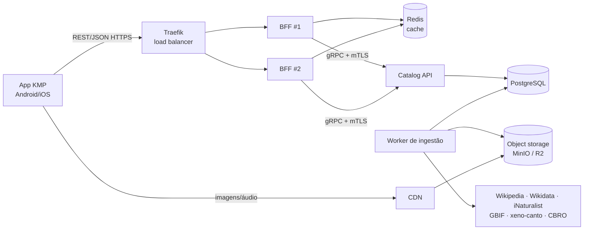

# Passarim — Especificação de Design (MVP)

- **Data:** 2026-10-01
- **Status:** aguardando revisão
- **Revisão do protótipo:** [`docs/design/revisao-design-v1.md`](../../design/revisao-design-v1.md)

---

## 1. Visão geral

**Passarim** é um app mobile gratuito (Android + iOS) para conhecer as aves do Brasil: foto, descrição, curiosidades, onde encontrar no país e o canto de cada espécie.

### Objetivos
1. **Estudo** — aprender Go, arquitetura limpa, BFF, gRPC, load balancing, observabilidade e segurança na prática. Todo o código é **comentado para um estudante**.
2. **Portfólio** — repositórios públicos que rodam com um comando, com README contendo **diagrama de system design**, ADRs e CI verde.
3. **Publicação futura** nas lojas, **gratuito e sem anúncios** (permite conteúdo CC "NC").

### Restrições
- Back-end e BFF em **Go**. App em **Kotlin Multiplatform + Compose Multiplatform**.
- Custo de infraestrutura **zero** (planos gratuitos).
- Repositórios separados.

### Fora do escopo do MVP (v2)
- Login/contas, Perfil e sincronização de favoritos.
- **Identificação de aves por câmera/IA** (arquitetura deve permitir adicionar depois).
- Notificações push.
- Idiomas além do português (strings já externalizadas).
- Modo offline completo (só favoritos funcionam sem internet).
- Atestação de app (Play Integrity / App Attest).

---

## 2. Repositórios

| Repositório | Conteúdo |
|---|---|
| `passarim-docs` | README com system design geral, ADRs, modelo de ameaças, revisão de design, `docker-compose.yml` que sobe tudo |
| `passarim-proto` | Contratos gRPC (`.proto`) + código gerado (Buf) |
| `passarim-catalog` | Catalog API (gRPC) + worker de ingestão + migrations PostgreSQL + conteúdo curado (YAML) |
| `passarim-bff` | BFF REST/JSON + cache Redis + config Traefik |
| `passarim-app` | App KMP + Compose Multiplatform |

O banco **não** tem repositório próprio: pertence ao `passarim-catalog` (um banco por serviço). Registrado em ADR.

**Cada README** contém um diagrama **Mermaid** de system design: o `passarim-docs` com a visão geral completa; cada serviço com o diagrama da sua parte.

---

## 3. Arquitetura



**Princípio central:** o worker **pré-ingere** os dados externos; Catalog API é a dona dos dados; o BFF **nunca chama APIs externas** — só agrega o que o catalog entrega, no formato de cada tela.

### Arquitetura limpa (catalog e BFF)

```
cmd/              pontos de entrada (api, worker) — só montam dependências
internal/
  domain/         entidades e regras puras (Species, Media, License) — zero dependências externas
  usecase/        casos de uso (ListSpecies, GetSpeciesDetail, IngestSpecies)
  adapter/
    grpc/ http/                 entrada
    postgres/ redis/ s3/        saída (infra)
    wikipedia/ xenocanto/ inaturalist/ gbif/ wikidata/   saída (fontes externas)
  config/
```
Regra: **dependências apontam só para dentro**. `usecase` define interfaces (ports); `adapter` as implementa.

### Stack Go
`net/http` (Go 1.22+ routing) · `grpc-go` · `pgx` + `sqlc` · `golang-migrate` · `go-redis` · `slog` · OpenTelemetry · `minio-go` (S3-compatível) · Testcontainers.

### Stack do app
KMP + Compose Multiplatform · módulos `core/` e `feature/` (explore, detail, favorites, settings) · MVI · Koin · Ktor · **Room 2.8.x (estável) com `BundledSQLiteDriver`** · Coil 3 · MapLibre Compose (tiles OpenFreeMap) · player de áudio nativo via `expect/actual`.

---

## 4. Modelo de dados (PostgreSQL)

| Tabela | Campos principais |
|---|---|
| `species` | `id`, `scientific_name` (único), `common_name_pt`, `family`, `size_cm`, `diet` (curado; nulo nas não curadas), `conservation_status` (IUCN), `description`, `description_source`, `is_curated` |
| `species_fact` | `species_id`, `text`, `source` |
| `species_biome` | `species_id`, `biome` (enum: amazonia, mata_atlantica, cerrado, caatinga, pantanal, pampa) |
| `species_state` | `species_id`, `uf` |
| `media` | `species_id`, `kind` (photo/audio), `storage_key`, `variant` (thumb/medium/large/aac), `width`, `height`, `duration_ms`, `author`, `license`, `source_url`, `source` |
| `occurrence_cluster` | `species_id`, `lat`, `lng`, `count`, `precision` (pontos pré-agrupados) |
| `ingestion_job` | `species_id`, `source`, `status`, `attempts`, `next_run_at`, `last_error` |

### Fontes de dados

| Dado | Fonte |
|---|---|
| Lista de espécies + nomes PT | CBRO (lista oficial) |
| Descrição/curiosidades — 30–50 aves curadas | Escritas à mão em YAML no repo (`is_curated = true`, worker não sobrescreve) |
| Descrição — demais | Wikipedia PT (fallback EN), CC-BY-SA |
| Status de conservação | Wikidata (IUCN) |
| Fotos | iNaturalist (somente licenças CC) |
| Ocorrências/estados | GBIF + iNaturalist (Brasil) |
| Canto | xeno-canto (gravações no Brasil, qualidade A/B) — **requer chave de API** |

### Mídia
O worker baixa o original **uma vez**, processa (fotos → WebP em 3 tamanhos; áudio → AAC, recortado) e salva em **object storage** (MinIO local / Cloudflare R2 em produção, servido por CDN). O banco guarda só `storage_key` + créditos. Estimativa: ~3,5 MB/ave (~175 MB no MVP; ~7 GB para as ~1.970 espécies — cabe nos 10 GB gratuitos do R2).

**Licenças:** aceitas CC0, CC-BY, CC-BY-SA, CC-BY-NC, CC-BY-NC-SA. **Licenças ND são descartadas** (não podemos redimensionar/recortar). O filtro de licenças é **configurável** (para um futuro app monetizado bastaria remover NC). Autor, licença e link original são exibidos no app.

---

## 5. API do BFF (REST/JSON, `/v1`)

| Endpoint | Tela | Resposta |
|---|---|---|
| `GET /v1/species?q=&biome=&state=&cursor=&limit=` | Explorar | Cards: `id`, `commonName`, `scientificName`, `thumbnailUrl`, `conservationStatus`; `nextCursor`. `limit` ≤ 50, `q` ≤ 100 chars |
| `GET /v1/filters` | Filtros | Biomas e estados com contagem |
| `GET /v1/species/{id}` | Detalhe | Hero, chips rotulados (bioma/dieta), conservação, tamanho, canto (`url`, `durationMs`, `credit`), galeria (com créditos), descrição, curiosidades, `whereToFind { states[], biomes[], clusters[] }` |
| `GET /healthz`, `GET /readyz` | — | Liveness/readiness para o Traefik |
| `GET /metrics` | — | Prometheus (rede interna apenas) |

Contrato publicado em **OpenAPI**. Erros em **`application/problem+json` (RFC 9457)** com `code` estável: `SPECIES_NOT_FOUND`, `INVALID_PARAMETER`, `RATE_LIMITED`, `SERVICE_UNAVAILABLE`, `INTERNAL`.

A comunicação BFF → catalog usa **gRPC** (contratos em `passarim-proto`).

---

## 6. App

### Navegação (3 abas)
**Explorar · Favoritos · Configurações** (resolve a inconsistência do protótipo).

### Telas do MVP
- **Splash** — SplashScreen API (Android 12+: só ícone) / Launch Screen (iOS).
- **Explorar** — grid de **2 colunas** (nome PT + científico em itálico), busca, chips de filtro (bioma/estado), paginação infinita, favoritar no card.
- **Detalhe** — hero com foto, nome PT + científico, selo de conservação, chips rotulados, player de canto (progresso, duração, crédito), galeria, descrição, curiosidades, **"Onde encontrar"** (mapa MapLibre com clusters + lista de estados), créditos, botão favoritar.
- **Favoritos** — lista local (Room: id, nome, miniatura), funciona offline, estado vazio.
- **Configurações** — Tema (Sistema/Claro/Escuro), Cores dinâmicas (Android 12+), "Tocar canto ao abrir ave", Dados e armazenamento (limpar cache), Sobre (versão, créditos, licenças, política de privacidade).
- **Estados de erro/vazio** — sem internet · servidor indisponível · ave não encontrada · lista vazia · favoritos vazio. Mapeados a partir do `code` do problem+json.
- **Loading** — skeletons.

### Design (pendências derivadas da revisão)
Unificar cor primária no verde da marca; fundo único; **desenhar tema claro**; ícone adaptativo flat; telas faltantes (Favoritos, busca/filtros, mapa, loading, vazios, Sobre/Créditos). Feito no Figma na etapa 5, **antes** do app, para que tokens de cor/tipografia (claro e escuro) existam quando os snapshots forem gravados.

---

## 7. Resiliência

- **Traefik** round-robin sobre 2 réplicas do BFF, health check em `/readyz`. Demonstração documentada: `docker stop` em uma réplica e o app continua funcionando.
- **BFF → catalog:** timeout 2 s; retry com backoff exponencial + jitter (máx. 2, só leituras); circuit breaker.
- **Cache Redis:** lista e detalhe, TTL 10 min, **stale-while-error** (serve dado expirado se o catalog falhar).
- **Worker:** jobs em `ingestion_job`, até 5 tentativas com backoff; falha de uma fonte não bloqueia as outras (ave sem canto aparece sem player); rate limit por fonte externa.
- **Graceful shutdown** em todos os serviços.

## 8. Observabilidade

- Logs JSON (`slog`) com `request_id` propagado BFF → catalog.
- Métricas Prometheus (`/metrics`), tracing OpenTelemetry → Jaeger, Grafana com 1 dashboard (latência, erros, cache hit ratio, métricas de segurança).
- Stack completa **só local**; em produção apenas logs.

---

## 9. Segurança

Documento de **modelo de ameaças (STRIDE)** em `passarim-docs`. Riscos principais do MVP: abuso de recursos e conteúdo malicioso vindo de APIs externas.

### OWASP API Security Top 10 (2023)

| Risco | Tratamento |
|---|---|
| API1 BOLA | N/A no MVP (catálogo público); registrar para v2 |
| API2 Broken Authentication | Catalog em rede privada; BFF ↔ catalog com **mTLS**; endpoints administrativos com chave |
| API3 Object Property Level Auth | DTOs explícitos no BFF; nunca serializar structs de banco/domínio |
| API4 Unrestricted Resource Consumption | Rate limit por IP; `limit` ≤ 50; `q` ≤ 100; limite de body; `ReadHeaderTimeout`/`ReadTimeout`/`WriteTimeout`/`IdleTimeout` |
| API5 Function Level Auth | gRPC administrativo não exposto publicamente |
| API6 Sensitive Business Flows | Ingestão disparada só pelo agendador/admin, nunca por requisição pública |
| API7 SSRF | Worker com allowlist de hosts, bloqueio de IPs privados/link-local, limite de tamanho e content-type |
| API8 Security Misconfiguration | Sem stack trace em respostas; headers de segurança; TLS; containers distroless, non-root, FS read-only |
| API9 Improper Inventory | Versionamento `/v1`; OpenAPI publicado |
| API10 Unsafe Consumption of APIs | Dados externos tratados como não confiáveis: sanitização de HTML (Wikipedia), validação de schema, limite de pixels em imagens (decompression bomb), timeouts |

### Outros controles
- **Injeção:** apenas queries parametrizadas (`sqlc`/`pgx`).
- **Supply chain no CI:** `govulncheck`, `gosec`, Trivy, gitleaks, Dependabot, SBOM. **Build falha em vulnerabilidade alta/crítica.**
- **Segredos:** `.env` fora do git; secrets do Fly.io/GitHub; chave do xeno-canto **só no servidor**.

### App (OWASP MASVS)
HTTPS only (cleartext bloqueado fora de debug); nenhum segredo no app; R8; nenhum dado pessoal coletado; política de privacidade. **Sem certificate pinning** no MVP (risco de bloquear o app em troca de certificado) — registrado em ADR.

### Métricas de segurança
Requisições 429 · taxa de 4xx/5xx · rejeições mTLS · downloads bloqueados pela allowlist SSRF · contagem de vulnerabilidades por severidade por build.

---

## 10. Testes

### Go
- **Unitários** de `domain`/`usecase` com fakes, escritos em **TDD**. Meta ≥ 80% de cobertura nessas camadas.
- **Integração** com **Testcontainers** (PostgreSQL, Redis, MinIO).
- **Contrato** BFF ↔ catalog pelos `.proto`; APIs externas simuladas com **golden files** (testes nunca chamam APIs reais).
- **E2E:** sobe o compose e chama o Traefik.

### App
- ViewModels: JUnit5 + Turbine + AssertK + fakes.
- Mappers e Room em `commonTest`.
- **Snapshot tests com Paparazzi** (`androidUnitTest`): todos os componentes do design system e todas as telas, nos temas **claro e escuro** e com **fonte ampliada**. Verificação no CI a cada PR.
  - Limitação: Paparazzi renderiza só Android; telas `commonMain` são cobertas via o alvo Android.
  - A compatibilidade com o plugin de biblioteca KMP do AGP será validada no início da etapa 6; fallback: Roborazzi.
- Alguns testes de UI com Compose UI Test.

## 11. CI/CD (GitHub Actions)

1. **PR:** lint (`golangci-lint` / `ktlint` + `detekt`), testes, verificações de segurança, Paparazzi verify.
2. **Merge na `main` (serviços):** build da imagem → Trivy → push para GHCR → **deploy no Fly.io**; migrations no **Neon**.
3. **App:** build do APK e do framework iOS (publicação nas lojas fora do escopo).

## 12. Ambientes

| | Local | Produção (gratuito) |
|---|---|---|
| Orquestração | Docker Compose (`passarim-docs`) | Fly.io |
| Banco | PostgreSQL container | Neon |
| Cache | Redis container | Upstash Redis |
| Mídia | MinIO | Cloudflare R2 + CDN |
| LB | Traefik (2 réplicas BFF) | Proxy do Fly.io |
| Observabilidade | Prometheus, Grafana, Jaeger | Logs (cache Redis via Upstash permanece ativo) |

Manifestos **Kubernetes** incluídos em `passarim-docs/k8s/` apenas como material de estudo (não implantados).

## 13. Ordem de construção

1. `passarim-proto` + `passarim-docs` (contratos, ADRs, modelo de ameaças, README com system design).
2. `passarim-catalog` (banco, Catalog API, worker, 30–50 aves curadas).
3. `passarim-bff` + Traefik → `docker compose up` completo.
4. Deploy (Fly.io, Neon, Upstash, R2).
5. Design no Figma: tokens, tema claro, ícone flat e telas faltantes.
6. `passarim-app`: Explorar, Detalhe, Favoritos, Configurações, Paparazzi.

## 14. Dependências do usuário

- **Instalar Go** (`brew install go`) antes da etapa 1.
- Criar **chave gratuita do xeno-canto** (etapa 2).
- Criar contas gratuitas: **GitHub** (repos), **Fly.io**, **Neon**, **Upstash**, **Cloudflare** (etapa 4).
- Lista CBRO: baixada automaticamente; se não for possível, o usuário será avisado.

## 15. ADRs previstos

001 Go no back-end · 002 BFF + catalog separados · 003 gRPC interno / REST externo · 004 Banco pertence ao catalog · 005 Pré-ingestão em vez de chamadas em tempo real · 006 Mídia em object storage · 007 Licenças aceitas · 008 Sem certificate pinning no MVP · 009 Room KMP para persistência local · 010 Paparazzi para snapshot tests · 011 IA de identificação adiada para v2.

## 16. Roadmap v2

Identificação por câmera (modelo AIY Birds on-device + endpoint de lookup + pedido de ingestão com dedup/limite) · login e sincronização de favoritos · notificações · quiz de cantos · i18n · atestação de app · catálogo completo (~1.970 espécies).
